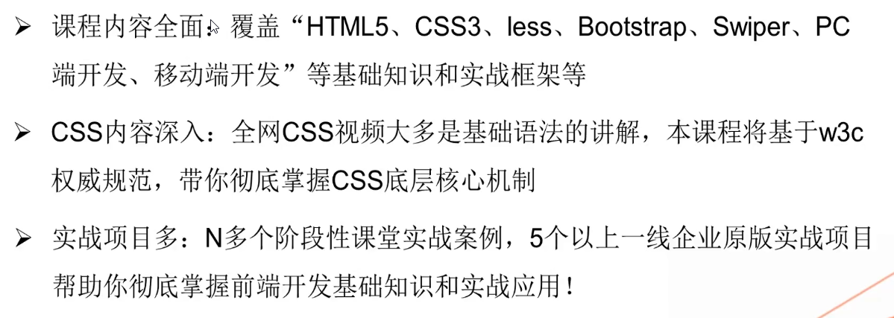
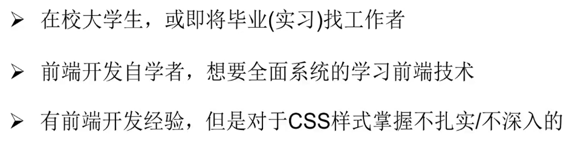
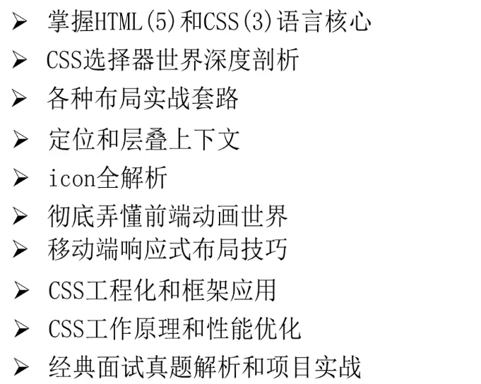
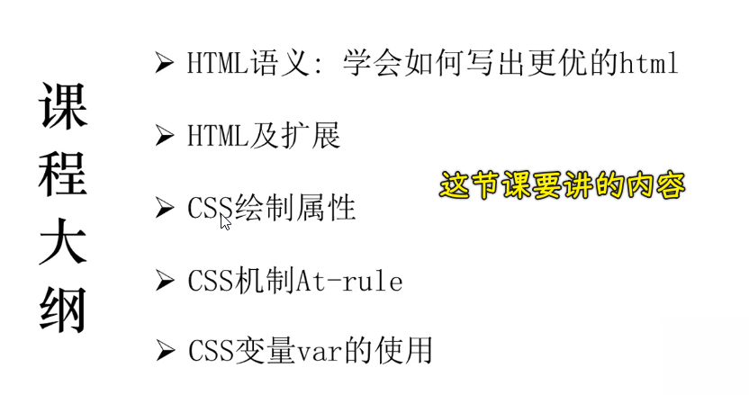

### ✍️ Tangxt ⏳ 2021-06-24 🏷️ css

# 01-CSS 高级进阶课程介绍、掌握 HTML5 和 CSS3 语言核心

## ★CSS 高级进阶课程介绍

### <mark>1）课程目标</mark>

- 深入研究 HTML5/CSS3 底层渲染机制
- 全面学会 CSS 核心基础知识
- 快速掌握前端实战开发技巧

### <mark>2）课程介绍</mark>

### <mark>3）适合人群</mark>

### <mark>4）课程内容</mark>

## ★掌握 HTML5 和 CSS3 语言核心

- 这一章的内容很简单，因为这都是一些可以死记硬背的属性 -> **这些属性能看到效果，因此调试起来比较方便**
- 如何用更优的 HTML 结构写出更优的 html 页面？
  - 写标签要注意的地方
  - 结构上有没有要优化的地方？
- 像`meta`等这样的扩展标签，很少人会留意
- 绘制属性 -> 面试经常会问 -> 重要的，项目常用的都会罗列出来
- `@` -> 都会讲到
- `var` -> 用过 Less、Sass，都知道变量写起 CSS 来非常的爽，而原生的 CSS 也提供了变量语法！ -> 知道它们之间写法的不同

> 大纲目录：
> - HTML 语义：学会如何写出更优的 html
> - HTML 及扩展：Doctype、Meta、Entity、DTD、XML、namespace、SVG、MathML
> - CSS 绘制：linear-gradient，radial-gradient、background、box-shadow，text-shadow、border-radius、Filter , clip-path，Counter 等
> - CSS 机制 at-rule: @charset、@import、@namespace、@document、@font-face、@keyframes、@media、@page、@supports
> - CSS 变量 var 的使用
