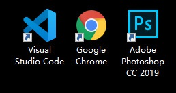
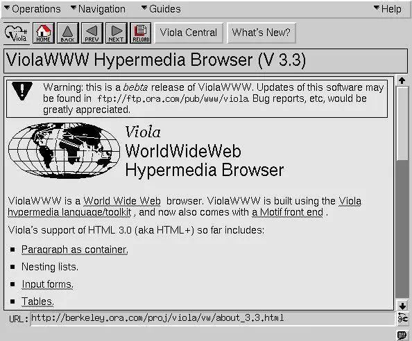
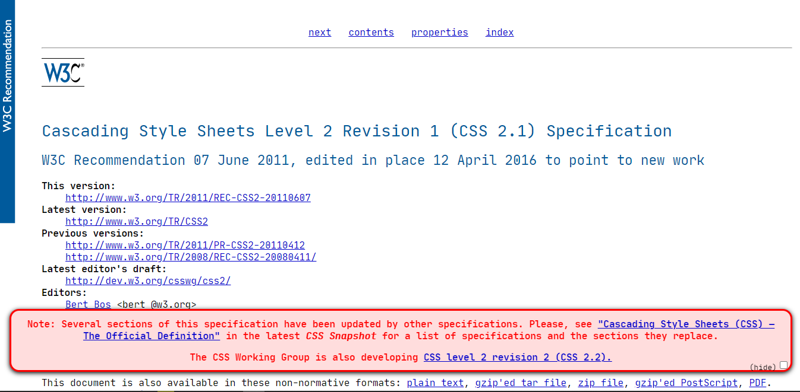
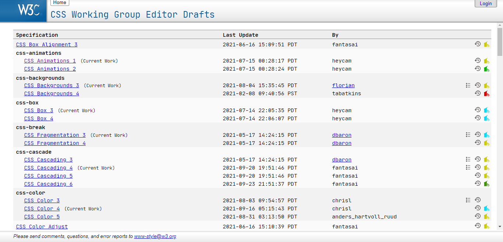

### ✍️ Tangxt ⏳ 2021-09-24 🏷️ CSS

# 02-软件安装 & CSS 发展史与 CSS 模块划分

## ★软件安装

课程使用软件：

1. VS Code 编辑器，可官方直接下载（下载最新版或更新到最新版），下载地址：<https://code.visualstudio.com/>
2. Chrome 浏览器，可官方直接下载（下载最新版或更新到最新版），下载地址：<https://www.google.cn/chrome/>
3. PhotoShop CC 2019 工具，可官网直接下载，下载地址：<https://www.adobe.com/products/photoshop.html>

## ★CSS 发展史与 CSS 模块划分

### <mark>1）HTML 的诞生</mark>

1991 年 8 月 6 日，诞生了人类有史以来的第一个网站（即：<http://info.cern.ch>），作者是万维网之父 [蒂姆·伯纳斯·李](https://baike.baidu.com/item/%E8%92%82%E5%A7%86%C2%B7%E4%BC%AF%E7%BA%B3%E6%96%AF%C2%B7%E6%9D%8E/8868412)。当然网站的形态跟现在完全不一样，因为它没有样式，简单地说，它只有文字和图像两种，并没有其他的信息元素。

早期的 HTML 网页：

### <mark>2）CSS 的诞生</mark>

在那个遥远的年代，人们也渴望 web 网页变得更漂亮，于是在 1994 年 [哈肯·维姆·莱](https://baike.baidu.com/item/%E5%93%88%E8%82%AF%C2%B7%E7%BB%B4%E5%A7%86%C2%B7%E8%8E%B1) 和 [伯特·波斯](https://baike.baidu.com/item/%E4%BC%AF%E7%89%B9%C2%B7%E6%B3%A2%E6%96%AF) 共同提出了层叠样式表（Cascading Style Sheets，即 CSS）的概念。CSS 从此成为了网页开发的标准之一，
对于网页排版印刷、美感以及亲和力有着深远的影响和意义。

在这两年之后，[W3C](https://baike.baidu.com/item/%E4%B8%87%E7%BB%B4%E7%BD%91%E8%81%94%E7%9B%9F/1458269?fromtitle=w3c&fromid=216888) 的 CSS 工作小组（即哈肯·维姆·莱团队）推出了 CSS1.0 规范，后来陆续发布了 CSS2.1 规范和 CSS3.0 规范草案及其他迭代版本。

W3C CSS2.1 [规范文档](https://www.w3.org/TR/2011/REC-CSS2-20110607/)：

> [层叠样式表 2 级修订版 1（CSS 2.1）规范中文翻译](http://www.ayqy.net/doc/css2-1/cover.html)

### <mark>3）CSS 的版本</mark>

CSS2.1 规范和 CSS3.0 规范草案指导 Web 开发者写了很多年的 CSS。直到后来，大概 2015 年左右，W3C 的 CSS 工作小组发现 CSS 发展的越来越快，有关于 CSS 方面的特性增加了不少，而且不同的特性推
进速度都有所不同。也就这个时候，W3C 的 CSS 工作小组为了能更好的维护和管理 CSS 的特性，该组织决定不在以 CSS 的版本号，比如我们熟悉的 CSS1.0、CSS2.1、CSS3.0 这样的方式来管理 CSS。而是将
每个 CSS 功能特性拆分成独立的功能模块，并且以 Level 1, Level 2，Level 3 等方式来管理 CSS 规范中的特性。

也就是说以后不会再出现 CSS4.0 的版本，而是具体指向某个模块的 Level 版本，例如：CSS 选择器模块已经发展到 Level 4 了。可以通过 W3C 官网查看到 CSS 模块的各种 Level 版本，或查看 <https://drafts.csswg.org/>

CSS 模块的划分：

### <mark>4）CSS 的研究方向</mark>

大体上 CSS 的学习可以朝着三个方向进行研究，分别是：**特效、工程化、布局**。比如说特效：可以学习动画、3D、渐变等；工程化：可以学习 sass、less、postcss 等；布局：可以学习 flex、grid、响应式等。

而本套课程主要就是围绕着布局方向进行展开学习。从精通到实战，让学习者全方位掌握 CSS 布局的所有相关技术。从而学以致用，完成工作中大部分的布局需求。

