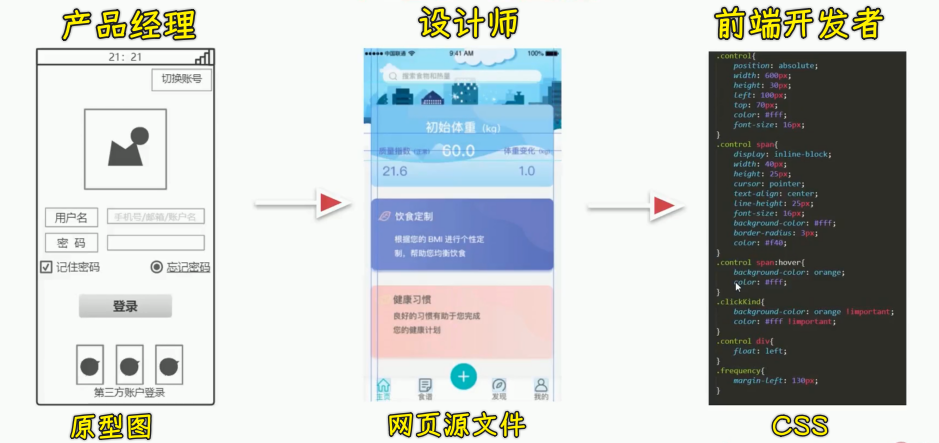
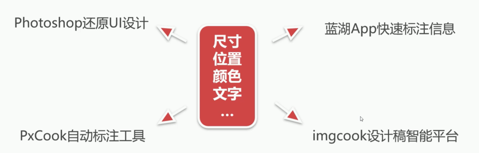
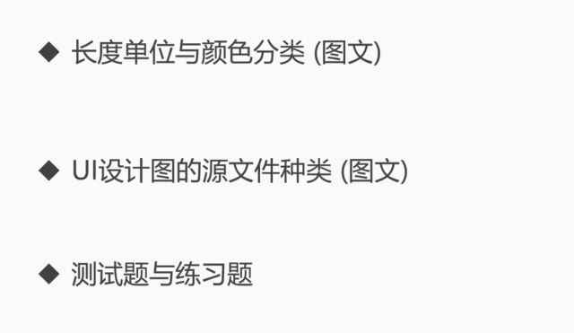

### ✍️ Tangxt ⏳ 2021-09-25 🏷️ CSS

# 03-章节简介

本章我们将学习 CSS 还原 UI 设计。

### <mark>1）本章学习目的</mark>

首先我们来看一下本章的一个学习目的，本章要学习的内容还是非常重要的，因为在真实的公司项目当中是需要做这样的操作，接下来我们来简单的了解一下这个流程。

我们在公司当中要想做一个真实的产品，首先是由产品经理做出对应的原型图，然后产品经理把原型图交给我们的 UI 设计师， UI 设计师根据原型图设计出对应的真实的网页源文件，然后把这个源文件要给我们的前端开发人员，前端开发人员要根据各种切图软件把这个相关的数据给它测量出来，然后对接成相关的 CSS 代码。

在这个过程当中，前端开发人员如何去测量我们的 UI 设计图当中的尺寸就显得非常重要。所以说本章主要是围绕着这些内容展开的，也就是如何利用一些软件来测量我们的**尺寸、位置、颜色、文字**，把这些相关的 CSS 数据给它测量出来。

### <mark>2）课程安排</mark>

而我们的课程会讲到这个 Photoshop 还原 UI 设计，蓝湖 App 快速标注信息，PxCook 自动标注工具，imgcook 设计稿智能平台。

除了这些内容以外，还给大家安排了一些扩展学习的内容，大家最好也要看一看，比如说长度单位与颜色分类、 UI 设计图的源文件种类，还有我们的测试题和练习题，希望同学们能够认真的进行学习。

