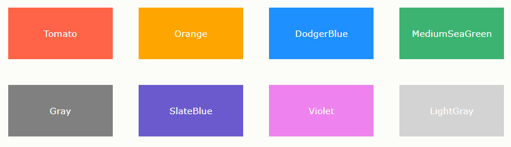

### ✍️ Tangxt ⏳ 2021-09-25 🏷️ CSS

# 04-长度单位与颜色分类 & UI 设计图的源文件种类

## ★长度单位与颜色分类

### <mark>1）长度</mark>

CSS 中使用的每个属性都允许拥有一个或一组值，例如：`color : red ` 代码中，其中`color`为属性，`red`为值。在 CSS 中有很多属性是用来控制位置和尺寸的，所以它们的值必须是一个表示长度的数值，而数值是需要添加单位的。

CSS 中有两种长度单位——**绝对长度单位**和**相对长度单位**。重要的是要知道它们之间的区别，以便理解它们控制的元素将变得有多大。

### <mark>2）绝对长度单位</mark>

以下都是绝对长度单位——它们与其他任何东西都没有关系，通常被认为总是相同的大小。

| 单位 | 名称 |
| ------ | ------ |
| cm | 厘米 |
| mm | 毫米 |
| in | 英寸 |
| pt | 点 |
| px | 像素 |

这些绝对长度单位中，除了 px 像素经常使用外，其他并不常用。

### <mark>3）相对长度单位</mark>

相对长度单位相对于其他一些东西，比如父元素的字体大小，或者视图端口的大小。使用相对单位的好处是，经过一些仔细的规划，您可以使文本或其他元素的大小与页面上的其他内容相对应。以下列出了常见相对单位。

| 单位 | 名称 |
| ------ | ------ |
| em | 在 font-size 中使用是相对于父元素的字体大小，在其他属性中使用是相对于自身的字体大小 |
| ex | 字符“x”的高度 |
| ch | 数字“0”的宽度 |
| rem | 根元素的字体大小 |
| lh | 元素的 line-height |
| vw | 视窗宽度的 1% |
| vh | 视窗高度的 1% |
| vmin | 视窗较小尺寸的 1% |
| vmax | 视图大尺寸的 1% |

像 `rem` 和 `vw` 单位会在移动端布局中所使用，本教程的第六章中将对 `rem` 和 `vw` 单位进行详细的讲解，这里就不再赘述了。

### <mark>4）颜色</mark>

在 CSS 中指定颜色的方法有很多，其中一些是最近才实现的。在 CSS 中，相同的颜色值可以在任何地方使用，无论您指定的是文本颜色、背景颜色还是其他颜色。

现代计算机的标准颜色系统是 24 位的，它允许通过不同的红、绿、蓝通道的组合显示大约 1670 万种不同的颜色，每个通道有 256 个不同的值 (256 x 256 x 256 = 16,777,216)。让我们来看看在 CSS 中指定颜色的一些方法。

### <mark>5）颜色关键词</mark>

可以直接在代码中使用颜色单词进行赋值，例如：`color : red `，这是一种指定颜色的简单易懂的方式。

部分颜色关键词：

### <mark>6）RGB 颜色</mark>

在 CSS 中，可以使用公式`rgb(red, green, blue)`将颜色指定为 RGB 值。每个参数 (red、green 以及 blue) 定义了 0 到 255 之间的颜色强度。

要显示黑色，请将所有颜色参数设置为 0，如下所示：`rgb(0, 0, 0)`；要显示白色，请将所有颜色参数设置为 255，如下所示：`rgb(255, 255, 255)`。

部分 RGB 颜色：

### <mark>7）HEX 颜色</mark>

在 CSS 中，可以使用`#rrggbb`格式的十六进制值指定颜色。其中 rr（红色）、gg（绿色）和 bb（蓝色）是介于 00 和 ff 之间的十六进制值（与十进制 0-255 相同）。

部分 HEX 颜色：

### <mark>8）HSL 颜色</mark>

在 CSS 中，可以使用色相、饱和度和明度（HSL）来指定颜色，格式如下：`hsla(hue, saturation, lightness)`。

色相（hue）是色轮上从 0 到 360 的度数。0 是红色，120 是绿色，240 是蓝色。饱和度（saturation）是一个百分比值，0％ 表示灰色阴影，而 100％ 是全色。亮度（lightness）也是百分比，0％ 是黑色，50％ 是既不明也不暗，100％是白色。

部分 HSL 颜色：

本章当中，将通过各种软件，测量出 UI 设计图中的尺寸长度及颜色取值。

## ★UI 设计图的源文件种类

### <mark>1）布局与 UI 设计图</mark>

开发一个网页，通常需要先有一套 UI 设计图，然后 web 前端开发人员会根据设计图进行元素尺寸、位置、颜色等信息的获取，从而根据这些信息来完成 CSS 布局。

### <mark>2）什么是设计图源文件</mark>

通常我们认知中的 JPG、PNG、GIF 等图片格式，属于设计图的效果展示类文件，并不属于真正的源文件。源文件是可以查看到图片的所有的图层，通道、参考线、注解和颜色模式等信息，开发人员通过操作源文件，可以更加方便的控制图片，并快速的获取到图片信息。

下面展示一下，PSD 源文件在 PhotoShop 软件中打开的样子：

### <mark>3）常见的源文件有哪些</mark>

1. `.psd`格式源文件，通过 [PhotoShop](https://www.adobe.com/products/photoshop.html) 工具制作。
2. `.sketch`格式源文件，通过 [Sketch](https://www.sketch.com/) 工具制作。
3. `.xd`格式源文件，通过 [Xd](https://www.adobe.com/products/xd.html) 工具制作。

通常在项目中，UI 设计师会提供给我们 UI 设计图的源文件，web 前端开发人员会根据源文件进行**切图处理和信息获取**。在下一小节中，将选择 PSD 源文件给大家演示是如何进行操作的，其他格式操作类似，就不再赘述。