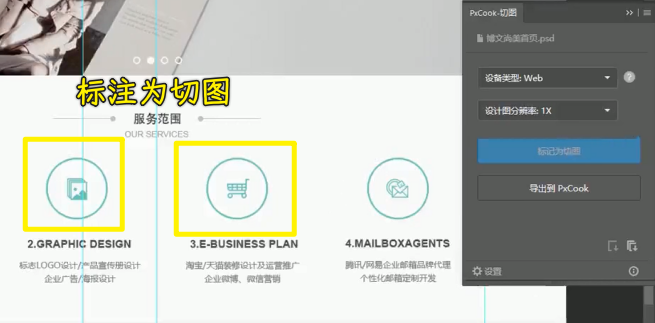

### ✍️ Tangxt ⏳ 2021-09-26 🏷️ CSS

# 05-Photoshop 还原 UI 设计、蓝湖 App 快速标注信息、PxCook 自动标注工具、 imgcook 设计稿智能平台

## ★Photoshop 还原 UI 设计

在前一个图文的小解当中，我们讲了设计师会给我们提供的是相关的图片源文件。常见的源文件类型有什么呢？有我们的这个 `sketch` 文件或者是我们的 `psd` 文件以及我们的 `xd` 文件。

我们这一小节就给大家演示其中一种操作，就是利用这个 Photoshop 还原我们的 `psd` 文件，来完成我们 CSS 相关代码的测量。

首先需要去安装一下我们的这个 Photoshop，这里我安装的是 Photoshop CC 2019。我这里建议大家，咱们最好都安 CC 以上的版本。当然了我不限定是 2020 还是 2021，那我们可以自行的去安装一下，包括我之前给大家提供了相关的 PS 工具网盘地址，大家也可以去安装。

接下来，就来看一下我们是如何进行尺寸、文字、颜色等信息的获取。

首先我给大家准备了一个相关的 psd 文件，大家可以看到这个 psd 文件：

### <mark>1）尺寸大小测量</mark>

用 PS 打开该文件，基本上我们要测量的就是**尺寸的大小**，我们先来看一下尺寸大小的测量。

尺寸大小的测量我们需要用到我们的第二个矩形选框工具，并且配合一个信息面板。这个信息面板是在我们窗口当中，我们可以把这边勾选上有个信息：

在这边选择一下它的一个面板选项，这里的单位给它调成像素，调好之后我们可以看到，现在我就可以测量这**两个圆之间的间距**了。通过第二个工具矩形选框工具就可以去测量出来，我们可以做一些微调，大家可以看到这边，就可以量出它的宽是 `164`，高度是 `92`。

话说，怎么能够对这个选框进行一个变大或者是缩小呢？

我们可以按住 Shift 键，可以看到矩形选框后面会多出一个加号，可以再去给它扩大选中范围。如果说按住 Alt 键，我们可以看到鼠标后面会多一个减号，我们可以对它进行减少，总之，我们是可以通过这样的方式来进行测量的。不过这种方式是比较慢的。

所以说我们还可以利用第一个工具，也就是选择我们的这个移动工具，按住我们的 Ctrl 键我们可以看到，这时候你就可以看到它们之间的一些数值啦。比如说我们先选中第一个图层，在这边有图层，我们可以先选中第一个图层。选中第一个图层之后我们再选一下可以看到你看这时候鼠标移到第二个图层上面就可以显示它们之间的间距为 163 像素。这个时候是可以随便的去测量一些相关的数值的。

**只要按住 Ctrl 键，再选择第一个工具**。

### <mark>2）颜色信息获取</mark>

除了尺寸测量以外，我们还可以去测量相关的颜色。颜色的话我们是可以通过吸管工具。这里我们可以找到吸管工具，把图片稍微放大一些。这个时候我们就可以在这里来吸取我们的颜色了。大家可以看到点开这个试色器就可以拿到相关的颜色。

我们可以看到这边有我们的 HEX 以及 RGB 以及我们的 HSB 相关的颜色的数值可以获取到，这是颜色的获取：

### <mark>3）文字信息获取</mark>

文字相关的获取我们也可以得到。比如说选择第一个我们的这个移动工具，然后选择可以看到这边可以选择相关的文字图层，点开字符，这里就可以看到相关的字体的相关信息。比如说有 `18` 个像素的文字大小，以及相关的像**行高**以及**是否加粗**以及**字体大小**等等这些都可以查看得到。所以说我们这个选择文字，再去查看它的字符，就可以看到相关的信息了。

### <mark>4）切图操作</mark>

除了这些以外，我们再来看一下 PS 当中经常可以做的就是进行切图操作。就是说把我们设计稿当中的图片给它切取下来，基本操作是这样的：

首先我们要启动这个生成器，勾选图像资源。那我们打开我们的 Photoshop 然后来选择编辑当中的首选项。然后在首选项目当中，我们选择这个增效工具。打开增效工具之后可以先把这个启动生成器先给它勾上，其他的我们就不用动了，勾好之后我们点开文件。在文件当中我们可以看到这边有个「生成」，我们把它的这个「图像资源」给它勾上，如果勾上成功的话，那「图像资源」会前面就会有个`✔️`对号，这样一来我们就可以选中这个图形。

在`psd`文件里边，随便选一个图形，我们紧接着就双击一下这个名字，把这个做一个重新命名。这里我们可以起个名字，比如叫 `icon1`。这个`icon1`我们要加上这个图片的一个格式，可以选择 `jpg` 或者是`png` ，这里面选择`png`常见的图片格式，点击回车。

点击之后我们可以看一下我们本地的文件夹（与该`psd`文件同级），在我们的文件夹下就自动生成了一个文件夹，这个文件夹会跟我们的 psd 文件在同一个目录下，然后它的命名会有一个`assets`这样一个标识。点进去之后大家可以看到里面我们刚才重命名之后的这个图片就给它切下来了，或者是获取到这个相关的图片资源。

接下来再给大家重新演示一个，比如说像我们这个购物车，我们点中它之后，同样我们去重新命名，比如说`icon2.png`，保存，然后可以看到这时候这个图片就给它取下来了。

在这个操作过程当中它还可以进行倍图的获取。比如说我们双击之后，在我们的前面加上一个`200%`，再来一个空格：

当我们回车之后，我们可以看到这张图就会变成一个倍数的图。我们双击打开可以看到这张图其实就变大了，比刚才这张第一张图要大了一倍。所以说我们这个大小也是可以进行简单调节的，这就是我们利用 Photoshop 来做一些相关信息的获取，这样的话我们就可以根据这些信息来进行我们的 CSS 相关的内容的这个样式的编写。

> 我们用 PS 这个工具干嘛？ -> 要对这个 `psd` 文件获取一些信息，以此来完成对 CSS 的编写 ！

## ★蓝湖 App 快速标注信息

在本小节当中，我们将学习蓝湖 App 快速标注信息。首先我们对这个软件做一个简单的了解。

### <mark>1）是什么？</mark>

蓝湖是一款设计图的共享平台，帮助互联网团队更好地管理设计图，自动生成设计图标注与团队共享设计图，展示页面之间的跳转关系。蓝湖支持从 Sketch、Ps、Xd 一键共享、在线讨论，蓝湖已经成为新一代的产品设计的工作方式。当然跟蓝湖类似的 App 也比较多，大家可以自行的去进行了解。这里我们就以蓝湖来给大家进行举例。

### <mark>2）使用它的好处</mark>

首先我们来说一下这一类的 App 到底比我们的 PS 进行 UI 还原，到底有什么样的一个好处。这些平台它最大特点就是**团队共享**。也就是说我们的设计师在开发好 UI 设计图之后，直接就可以上传到平台上。我们的开发人员就可以立即得到相关的资源，这个是非常方便的。而最重要的一点是这个平台它是可以支持各种源文件的。比如说我们的 `psd`，我们的 `sketch` 以及我们的 `xd` 文件，这就会带来什么好处呢？

如果说传统的我们用 Photoshop 去进行切图的话，我们只能处理 PSD 文件，要是其他源文件格式，我们还得去学习专门的这个相关的软件，所以说学习成本是会高一些的。如果说这些源文件都可以直接上传到我们的蓝湖上，我们就可以**只在蓝湖上学会一种操作模式，就可以轻松的应对各种不同类型的源文件了**。所以说这是非常好的一种方式。接下来我们就来了解一下这个蓝湖 App 究竟该如何去进行使用。

### <mark>3）如何使用它？</mark>

#### <mark>1、注册账号</mark>

首先我们去它的 [在线访问地址](https://lanhuapp.com/)，打开之后，咱们可以自行的去注册我们的账号，注册完账号登录进来之后，我们该怎么来使用呢？

#### <mark>2、下载相应插件</mark>

非常简单。首先我们去点开官网，在官网当中，大家可以先看一下它这边有下载。这个下载里面主要是**首先要下载你的设计稿源文件所对应的插件**。比如说我们是 Sketch 的一个源文件，那你就要下载 Sketch 插件。如果说我们是 PSD 的这个源文件，我们就下载 Photoshop 的插件。当然这里面还有 XD 的，其是也就是我们常用的几种插件。

那这里我们可以先去下载我们的 PS 插件，那我们就点击下载就行了。下载好后，大家可以自行的进行下一步下一步的安装。安装好我们打开 Photoshop 就可以在我们的这个窗口当中看到一个叫做「功能扩展」，在窗口的功能扩展当中，可以看到这里面就有插件，它就会自动集成到我们这个扩展功能当中。

#### <mark>3、在设计工具中登录你的蓝湖账号</mark>

接下来我们去点一下蓝湖，我们就可以登录一下我们的账号，并且把我们这个相关的设计稿上传到登录的这个蓝湖 App 账号中，接下来我给大家进行演示。

#### <mark>4、在网页版蓝湖应用里边创建一个项目</mark>

首先我在这边新建一个项目，新建之后我们起个名字，这个咱们就选择「博文尚美」。然后我们选择到底是网页项目还是手机项目，我们选择网页项目，然后点击确定。

#### <mark>5、设计师在设计工具中上传设计稿</mark>

这边准备好之后，再打开我们的 Photoshop， 这样的话设计师就可以非常轻松的去进行相关的上传了，登录一下我们的账号。

我们登录进来之后，大家可以看到就可以发现刚才我们创建好的这个博文尚美的项目了，接下来我们就可以往这个上面进行上传，我们可以等待一下，这个有点慢，我们现在点确定就可以了。确定之后我们现在就可以选择这个上传就可以了。我们上传成功后就可以去外部端进行查看。

#### <mark>6、前端开发者在网页版蓝湖应用里边得到了设计稿</mark>

当然，我们刷新一些刚刚创建项目的页面就好了，之后我们可以看到这张设计图就进来了，我们只要双击就可以看到，**在这个平台上我们就可以对它进行一些尺寸的测量以及相关的信息的获取**。比如说我们现在点一下这个图，大家可以看到这边就会显示它的大小，以及我们直接就可以在这看到它与其他元素之间的间距、位置等等这样的一些信息。并且它这个平台比较好的就是会把相关的代码也给你显现出来，可以作为我们的参考。

#### <mark>7、测量尺寸</mark>

#### <mark>8、获取文字信息</mark>

那我们来看一下文字相关的信息，这边也会有相关的文字，比如说我们的**字号以及我们的行高、字间距、对齐方式是否加粗以及字体大小**，这些也是非常容易轻松地获取到，我们可以看到非常的方便。

#### <mark>9、前端开发者用蓝湖来获取信息有啥好处？</mark>

并且这个平台还有一些比较好的点，跟我们的 Photoshop 去比的话，比如这边还可以选择我们的一个平台，它还可以去适配我们的 iOS、安卓，可以做一些自定义的，比如说在移动端，我们后面也会给大家讲，我们的测量的尺寸并不是 `px` 单位，而是我们的 `rem` 单位或者是 `vw` 单位。所以说这边它也可以选择换算成我们乘一个相关的 rem 单位。

比如说我现在选择这个地方，然后点击确定。接下来大家可以看到我现在测量出来的尺寸，就立即得到相关的 `rem` 单位。

这样的话，用这个软件去适配我们的移动端的页面是非常方便的，具体的 rem 怎么去用，包括移动端怎么开发，会在我们后面儿的章节当中给大家进行详细的讲解，只不过我们这个平台是非常方便的。

#### <mark>10、如何用蓝湖切图？需要设计师配合</mark>

接下来给大家演示一下如何能够把相关的图片给它获取到在这个平台上。要想获取到相关资源，首先我们设计师需要在我们的 Photoshop 或者是一些软件儿当中进行相关的处理。比如说点一下这个图，想把它做成图片的话，我们就要点一下切图，然后把它作为一个叫做标记。

做完标记之后，我们再去点另外一个图片，再给它点一下，这样的话也把它做成标记。

标记好后我们就可以再重新的去上传一下。等待它的一个同步完成之后，我们再回到我们的项目当中。

现在刷新一下，重新刷新之后，大家可以看到这边就多了一个历史版本，刚才上传的是第一个历史版本。下面是我们刚才上传的第二个历史版本。在第二个历史版本当中，我们可以看到这边就有两个虚线框，其实就是我们把它已经做成了图片资源：

我们点击图片资源，右侧就可以看到有下载当前切图，就可以把这张图下载下来了。

并且我们可以看到它还可以选择下载所有的切图，也就说一键下载所有的你标注好的这些切图，所以这是非常方便的。并且还可以选择不同的类型以及我们是一倍图还是二倍图。因为在移动端的时候这个其实是有「**倍图**」这样一个概念的，也是到我们去讲这个移动端的时候，再给大家详细的去分析。所以说我们先来看到这些在线的这个平台还是非常方便的，可以帮助我们快速的解决一些切图的难题，尤其是它最大特点就是统一了不同的我们的这个源文件的一个使用方式。那希望同学们可以自行的去练习一下。

## ★PxCook 自动标注工具

在本小节当中，我们将要介绍 PxCook 自动标注工具。

### <mark>1）是什么？</mark>

首先对这个工具做一个简单介绍。

PxCook 也叫像素大厨，是款适合设计师使用的一款免费交互流畅以及全平台支持的标注切图软件。功能多样化且非常实用，操作起来也非常简单。它能够支持对 PS 和 Sketch 设计元素的尺寸、元素位置、文本样式和颜色都进行智能标注，并且还支持智能的切图操作。

简单来说， PxCook 就跟我们上一节课讲的这个蓝湖 App 非常类似。只不过蓝湖 App 它是一款在线的软件，我们需要通过浏览器进行操作。而我们的 PxCook，它就像我们的 Photoshop 一样，我们只需要把它在电脑上进行安装就可以去使用它了，大家可以自行的去进行下载安装。前面我也会给大家提供这个 PxCook 软件和它的插件的一个网盘地址，大家也可以进行下载安装。

> 下载地址：[PxCook - 高效易用的自动标注工具，生成前端代码，设计研发协作利器](https://fancynode.com.cn/pxcook)

### <mark>2）使用它</mark>

那我们先把这个软件打开，要想使用这个软件其实也是一样的，我们可以去安装它相应的插件儿。比如说我们可以在这里看到一些相关的插件儿的下载：

下载完毕之后，我们就可以去简单的用一下了，看一下它的基本用法，首先还是得打开我们的这个 PS，因为你要是想做这个切图处理的话，还是得先通过 Photoshop 把它引入到我们的这个 PxCook 当中。所以说在这里我们先把这个 PS 打开，之后，我们把这个相关的 PSD 文件在 PS 当中打开。

#### <mark>1、如何切图？</mark>

然后我们去选择要做成切图的元素，放大图片之后，比如说选择这个位置的这个图片，然后我们对它进行标记为切图。当然了，我们首先还是要在这个扩展功能当中，把这个插件给它点开，点开这个 PxCook：

点开 PxCook 切图插件之后，你把这个图片标注成一个切图，标注好切图之后，我们再给下一个，咱们这个购物车也给它做成一个切图。

我们现在把标注成切图的这个图片做好之后，我们就可以在这个 PxCook 当中可以当图片进行下载了，我们选择这个「导出到 PxCook」当中。

注意，要保存一下`psd`文件，然后我们再点击导出，这时候我们就耐心等待一下，可以看到它已经导出完毕后，我们会到 PxCook 这个软件，这个时候它会提示我们要建一个项目，我们就起个名字，比如还是「博文尚美」，我们选择`Web`端，然后选择创建项目。

这样的话它就会自动导入进来。导入进来之后大家可以看到它跟我们这个蓝湖非常像，比如说点一下可以看到相关的这个图片的信息，你可以选择下载了，这边就可以选择下载相关的图片信息了，这也是做过标注的。如果说没有做过标注的，比如说像这张图，它就没有图片的这个下载的能力，我们必须得先给它做成标注。

#### <mark>2、获取元素信息</mark>

我们随便选择一个元素，可以看到都有非常智能的信息，大家可以看到，首先鼠标移上去，它会有各种相关的尺寸以及间距，也是非常方便的，跟我们这个蓝湖用法是类似的。当然我们点的时候它也会在右侧显示相关的代码，当然我们要选择开发。

#### <mark>3、居然有`vw`单位</mark>

除此之外，这个也是比较智能的，像这边它还可以选择这个单位是 `px` 以及 `rem` 单位。大家可以看到，当我选择 rem 单位之后，放大图片，随便找两个元素，它们两个元素之间的单位就被换算成 `rem` 了，而这是非常的方便。

然后这边还可以选择我们这个 `vw` 单位，**这个是蓝湖没有的**，它还可以提供这个移动端的 `vw` 单位，这些单位其实也是我们在后面讲移动端开发的时候给大家介绍的，直接在这个软件当中是可以量出来的，这比直接用 Photoshop 方便一些。

#### <mark>4、给的`750px`的图是物理像素，我们写 CSS 代码时，量取的是逻辑像素，也就是用`2x`模式来量</mark>

看看它还有什么比较有用的地方。其实它这个非常适合移动端的项目，因为它这边可以选择一个倍图，我们可以换一个移动端的页面给大家看一下。

在这边我们找到一个移动端的页面，然后我们直接用这个软件给它打开，打开之后我们现在双击它可以看到这个是一个移动端页面，在移动端页面当中其实后面我也会讲这个概念，就是说这个**在移动端是有一个叫做物理像素和一个逻辑像素的关系**，我们的物理像素可能要比这个逻辑像素要大很多。

所以说大家可以看到这张设计稿，它的这个宽是 750 个像素，我们可以看到是 750 个像素，这边写着 750 像素。

但实际上我们要测量的时候，不能按照 750 进行测量，我们可能要按照它的小一点的尺寸，比如说它的一半进行测量，这都要按照一半进行测量的时候，测量出来的这个结果其实是需要我们自己在口算一下的。

我们举个例子，比如说你看这个头像现在是 144：

我们要想真正的放到移动端，还得对这个 144 除以 2 来去设置像素值，而我们这个软件它是可以选择这个设计图一倍图和二倍图的。如果说假设我直接选择这个 `2x` 的话，那我们可以发现当你在点这个头像的时候，它会自动的帮你除 2：

所以说我们在量取的时候，就不用在那个口算了，我们直接就可以看到这个 72 像素，而这是非常方便的。

总之，这个做移动端，它是非常方便的，直接就能够量出后面我们讲的逻辑像素，因为咱们这个设计图一般会比较大，是一个物理像素（也就是`750 px`），我们在这个软件里边量出来的一般要量这个逻辑像素，简单知道一下，就说明它这边选择`1x`的是 144，而这个 `2x` 是 72。这样一个量取姿势，大家先知道一下。

我们还可以选择不同的单位，这样的话这两个常用的移动端单位（`rem、vw`）也是非常好的能够测量出来。

#### <mark>5、蓝湖量取的时候，也能有`2x`能力？需要配合 PS</mark>

那我们的蓝湖其实也有这个能力，我接下来给大家稍微看一眼，咱们蓝湖有这个能力。那这里我们打开 Photoshop，然后咱们把移动端的这个 750 的图片在 Photoshop 当中先打开。打开之后大家可以看到这边它的图像大小就是 750 个像素：

我们选择这个蓝湖我们把它同步上去，我们稍微耐心的等待一下。然后这边你看在你同步上去之前，它就会有一个选择。比如说我们这个就选择「博文尚美」，这是我们之前建的项目，然后在这儿我们选择这个 `1x` 其实就是正常尺寸大小， 而`2x`我们就会看到它会把这个 60 就会变成 30，而 30 就会变成 15。

这样的话蓝湖也是有这个能力，即做到缩小一倍的这样一个操作。

接下来我们点击确定，点击完确定之后我们点击上传，然后给大家看一下在上传之后的这个大小。

现在我们在这个 PS 当中量一下这个「头像」，它的大小只能说量出来的是 144 px，上传到蓝湖之后，我们再来刷新一下蓝湖应用页面看一下。

我们点进去，因为我们直接选的是 2x，所以说现在我点一下这个图，选这个 web 之后，大家可以看到它会自动的变成 `72 x 72`。

所以说做移动端切图操作的时候，选择蓝湖和我们这个 PxCook 都是非常方便的，大家也可以自行的去操作一下，感受一下这些软件给我们带来的方便。

## ★imgcook 设计稿智能平台

> [imgcook 由设计稿一键智能生成代码的大厨](https://www.imgcook.com/)

在本小节当中，我们将介绍一个比较前卫的东西，叫做 imgcook 设计搞智能平台。

### <mark>1）是什么？</mark>

首先我们来看一下它的基本介绍， imgcook 专注于 Sketch、PSD、静态图片等形式的设计稿作为输入，然后通过智能化的技术一键生成可维护的前端代码，包含视图代码、数据字段绑定、组件代码、部分业务逻辑等的实现。目前此产品是阿里巴巴前端委员会智能化小组服务化的一个内外落地产品。

简单来说，这个在线平台它是阿里巴巴提供的，它主要的目的就是把我们的设计稿能够一键智能的转成相关的代码。

当然了，这些代码其实也是需要做一些微调的。但是大部分情况下还是比较好提示我们代码的一个规范，包括代码应该作一些参考的话也是不错的一个选择。当然了，这东西也才开始开源，**还有很多问题存在**。

### <mark>2）怎么用？</mark>

#### <mark>1、登录</mark>

我们先来感受一下这样的一个平台，简单的来看一下。首先我们先去访问一下 [这个平台](https://www.imgcook.com/)。

我们打开这个平台之后，咱们可以先登录，登录进来之后，我们可以选择这个「立即开始」，选择它之后，来到了这个页面：

#### <mark>2、上传设计稿（最好上传`sketch`文件）</mark>

它让你选择这个相关的一个文件的上传，它支持的比较好的还是我们的 sketch 文件， PSD 文件我也试过，这个目前支持的还不是特别好，有一些 PS 文件在上传的时候它会出现一些报错。

在这里我选择了这个 sketch 文件给大家作为演示，为大家准备好了一个 sketch 文件：

然后我们把它通过鼠标的方式拖拽到网页的上传区域。接下来我们就耐心的等待一下，需要上传一下，我们可以耐心等待。

#### <mark>3、选择其中一个设计稿</mark>

上传好了，可以看到 sketch 里面包含这五个设计图，这里我们随便选一个就行了。比如说这个：

点击之后它就会把这张图上传到我们这个平台上，上传到平台之后，大家可以耐心的等待一下，这个稍微的需要等待。我们现在已经打开它了，打开它之后，大家可以看到它会在左侧这一块把我们整个设计稿自动的就进行了分类：

#### <mark>4、它的原理是怎样的？</mark>

它要想象首先要有一个什么样的最外层容器`Block`，然后容器里又包含什么内容？我们可以分别点击这些节点。当然我们选择完之后，也可以看到它的右侧专门针对我们这一块的一个基本设置，我们可以对它进行一些微调。比如说我们觉得这个颜色咱们现在不想选择这个颜色了，我们想换一个颜色，那我们就可以换一个。比如说现在我们选择这个填充颜色：

可以看到这个颜色就变了，当然你都可以进行一些调整。调整完之后，咱们主要这个在线平台它的特点就是会自动生成我们的代码。那接下来给大家演示是如何自动生成代码的。

这边还有操作它的相关的属性的修改，以及事件包括数据：

> 一个元素节点有样式、属性、事件、数据

#### <mark>5、导出代码的格式是多样的</mark>

话说为什么有这么多功能呢？因为它这个导出代码的时候是有很多种选择的，比如说它可以导出像这种跟 Vue 框架或者是 React 框架联系比较紧密的格式，也可以是我们简单的 HTML 5 的标准格式。

接下来我给大家演示，大家就明白了，我们选择完它之后，首先它要求我们**先点保存**，保存的时候我们可以把它起个名字，比如说这就是一个 `pay` 这样一个名字，随便起个名就好，然后它让我们选择这些都要选一下，我们随便选一下就行，点击创建：

创建好之后我们耐心的再等待一下，然后我们就可以看到这边有个代码，然后我们点击代码：

你可以看到这个 HTML 包括 CSS 它都会自动生成。

那为什么刚才说右侧这边有事件数据什么的，因为它还可以直接适配我们的像 Vue、React、Taro 等等这些这个框架。比如我点一下这个 Vue，你可以看到它直接就转成了 `.vue` 的文件，然后以及相关的一些代码：

#### <mark>6、选择标准的 H5 格式进行导出</mark>

这里咱们还是选择这个简单的标准的 H5，选择完之后，这时候我们还可以把这个代码下载下来，直接就拥有了这个设计图被编写好的程序，是不是很神奇？

我们点击这个导出，**导出的这个代码其实是可以辅助我们的，不是说完全依赖于它的，但是它这个代码已经做得很好了，可以对我们进行辅助开发，这样就会省很多的时间**。

我们把导出下载下来的压缩包`tgz`进行一个简单的解压。我们已经解压成功了：

我们双击打开这个`pay`文件，我们可以看到这个是相关的代码就下载下来了。并且它这是个移动端的页面，所以说它带有 `rem` 以及 `vw` 这样的一个样式，这是专门针对移动端开发时候所要用到的两个单位，我们在后面的这个移动端还是会给大家详细的来进行讲解，我们现在先不纠结，现在我们先双击打开，打开之后切换到移动端，然后我们刷新一下，刷新后大家可以看到这整个页面就开发完毕了：

而这个相关的代码也都帮咱们把 HTML 以及 CSS 写好了，它都是平台自动生成的，而这**些代码完全可以作为我们的一个参照**，我们可以看到这是非常的方便的。这就**给我们开发节省了很多时间成本**。

当然，这些概念我们先了解了，当我们把整个课程都学完之后，我们就会轻松地应对各种这个布局的方式，也会**利用这样的软件能够快速的帮我们去理解很多概念**。好啦，这个就是 imgcook 设计稿智能平台了，大家可以自行的去进行一个尝试。
