### ✍️ Tangxt ⏳ 2021-12-01 🏷️ 移动端布局

## ★移动端布局

### <mark>1）逻辑像素与物理像素</mark>

- 逻辑像素：也叫「设备独立像素」，于前端而言就是 CSS 中的像素 -> 打开 Chrome 开发者工具，切换到设备工具栏 -> `iPhone 6/7/8 375 × 667`、`iPhone 6/7/8 Plus 414 × 736`，这里的`375px`和`414px`都是逻辑像素
- 物理像素：该设备的屏幕实际所拥有的像素点，一个设备生产出来，它们的像素就已经确定了，如`iPhone 6`的分辨率是`750 x 1334`，`iPhone 6 Plus`的分辨率是`1242 × 2208` -> 设计稿一般就是按`iPhone 6`的`750px`出图
- 设备像素比：`设备像素比 (dpr) = 物理像素/设备独立像素` -> 根据这个`dpr`可以得出设计稿是`@1x or @2x or 3x`
- Scale Factor（缩放因子）：逻辑像素相对于设备像素的放大比例（`375 -> 750`，`375`放大两倍就是`750`），可通过 `window.devicePixelRatio` 获得，但二者并不完全等同 -> 这个设备的缩放因子越大，那么其显示的内容会越高清

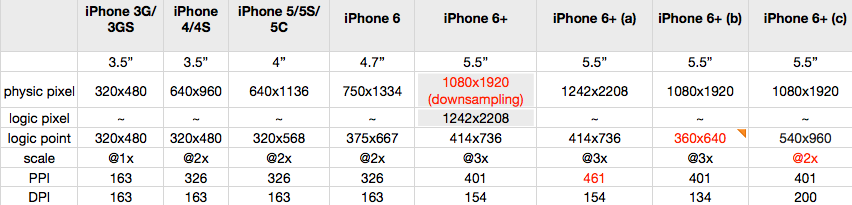

其它称呼：

Points（抽象单位，不是实际像素，最初的 iPhone，点与屏幕上的实际像素完全一致，但目前就不是这样了）：

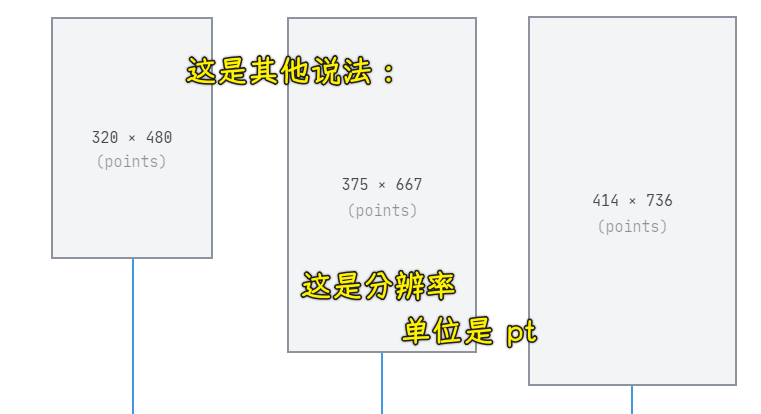

Rendered Pixels（光栅化、`1x 2x 3x`）：

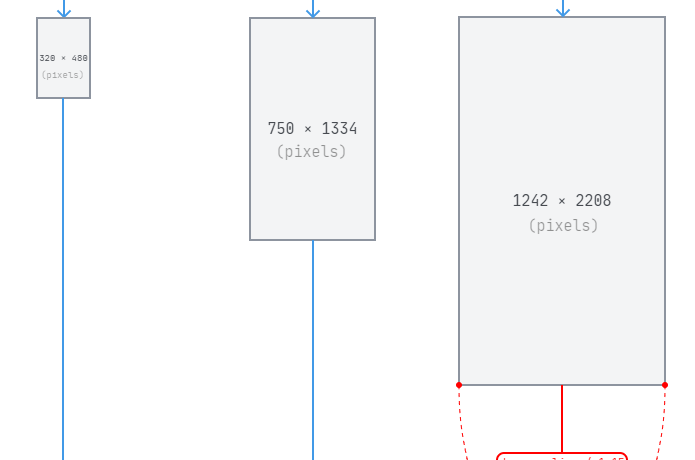

Physical Pixels（物理像素）：

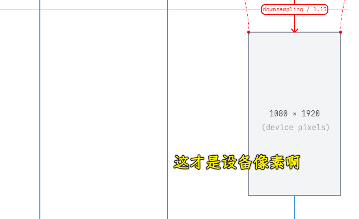

Physical Device（物理设备）：

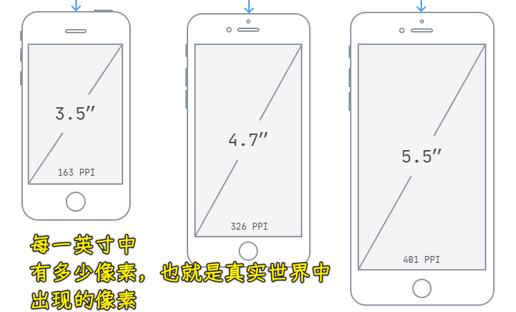

➹：[ iPhone 6 分辨率与适配 · sunnyxx 的技术博客](https://blog.sunnyxx.com/2014/09/10/iphone6-resolution/)

➹：[iPhone 6 Screens Demystified ](https://www.paintcodeapp.com/news/iphone-6-screens-demystified)

➹：[iPhone 6 Plus 的逻辑分辨率为什么是 414x736 ？ - 知乎](https://www.zhihu.com/question/25361043)

### <mark>2）`px` 是个绝对单位</mark>

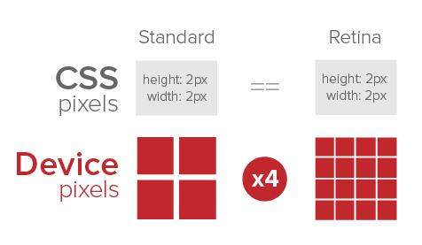

同样是写`2px`宽，但显示的宽度，同样是这么宽，只是蕴含的实际显示点不同罢了，也就是说`px`是浏览器所使用的抽象单位，何为抽象？一沙一世界

再比如：

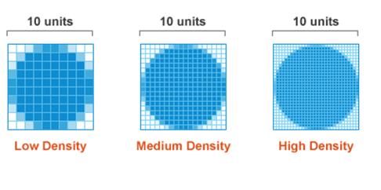

`10px`，在不同`dpr`下，长度都是一样的！

➹：[px 是相对单位长度还是绝对单位长度，为什么？ - 小和山的猫的回答 - 知乎](https://www.zhihu.com/question/48166345/answer/1631677955)

➹：[像素（px）到底绝对单位还是相对单位](https://blog.csdn.net/lianfengzhidie/article/details/86663715)

➹：[CSS: What's a CSS Pixel? What's Reference Pixel?](http://xahlee.info/js/web_design_screen_density.html)

### <mark>3）viewport 视口</mark>

iPhone 6 默认的虚拟布局视口的分辨率是`980px` -> 你在 PC 上看到一个宽为 `100px` 的元素，同样，你在该 iPhone6 设备上看这个元素，你会发现该元素很小

如何让这个元素正常显示为你在 PC 上所看到的那样？

``` html
<meta name="viewport" content="width=device-width, initial-scale=1.0">
```

- `width=device-width`表示视口宽度为设备的宽，也就是逻辑像素的大小
- `initial-scale=1.0`表示初始缩放比例为 1，即正常大小

viewport 的可选值有：

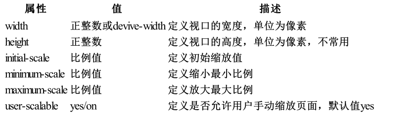

### <mark>4）750px 的设计稿</mark>

通常移动端 UI 设计稿会按照 iphone6 的物理像素尺寸大小进行设计，即 `750px`。当然也可以按照逻辑像素进行设计，即 `375px`，但是一般设计师不会这么干，主要为了设计稿更加清晰。

所以前端在量取尺寸的时候，需要`除以 2`，才能适配页面中的 CSS 逻辑像素值。好在现代 UI 工具如：蓝湖、PxCook 等都具备自动除以 2 的标注信息方式

### <mark>5）如何让唯一的一种设计稿尺寸，去适配不同设备的像素呢？让页面元素能够等比进行放大缩小呢？</mark>

可通过 `rem` 和 `vw` 这两种相对单位来进行实现

### <mark>6）小结</mark>

- 逻辑像素：逻辑像素：CSS 中的像素，绝对单位，保证不同设备下元素的尺寸是相同的
- 物理像素：设备屏幕实际拥有的像素点，相对单位，不同设备下物理像素大小不同
- 在移动端布局中，一定要提前设置好视口大小，即在移动端布局中，一定要提前设置好视口大小，即 VS Code 默认的添加形式，`<meta name="viewport" content="width=device-width, initial-scale=1.0">`，这样可以保证 CSS 逻辑像素不会受到缩放处理
- 移动端 UI 设计稿尺寸大小为 `750px`，即设备的物理像素，可使效果展示更加清晰。
- 移动端需要实现像素换算和设备适配，以及页面元素等比缩放布局等。

### <mark>7）各种单位</mark>

- `em`：给`font-size`设置？看继承过来的`font-size`值 -> 给`line-height`设置？看自己设置的`font-size` -> 实际都是自己的，你可以把继承过来的当作是一个默认值

➹：[Responsive layout of px, em, rem - Programmer All](https://www.programmerall.com/article/2970142462/)

➹：[px、rpx、em、rem 、vw/vh、百分比的区别？](https://www.cnblogs.com/CIBud/p/15011199.html)

➹：[Solved - Html  What does half a pixel mean in the fontsize CSS property? - Code Redirect](https://coderedirect.com/questions/395819/what-does-half-a-pixel-mean-in-the-font-size-css-property)

### <mark>8）移动端多屏适配方案？</mark>

强调一个页面在不同设备下等比例变化，比如：

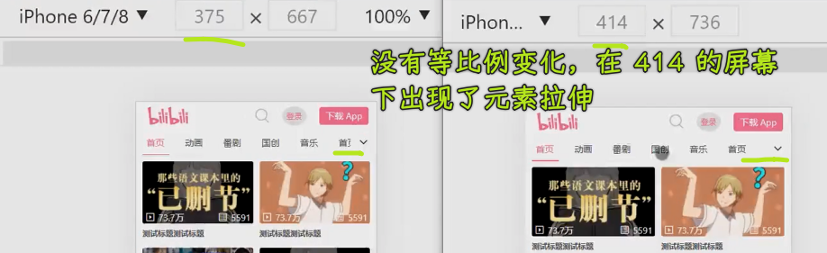


#### <mark>1、REM</mark>

REM 布局原理：

REM 布局的本质是**等比缩放**，一般是**基于宽度**

假设我们把屏幕宽度平均分成 `100` 份，每一份的宽度用`x`表示，`x = 屏幕宽度 / 100`，如果将`x`作为单位，那么`x`前面的数值就代表屏幕宽度的百分比，例如`p {width: 50x} /* 屏幕宽度的 50% */`

如果你想要页面元素随着屏幕宽度等比变化，那我们需要上面的 `x` 单位，但不幸的是 css 中并没有这样的单位，不过，在 css 中有 `rem`，通过 `rem` 这个桥梁，可以实现神奇的 `x`

我们知道子元素设置为 `rem` 单位，通过更改 html 元素的字体大小，就可以让子元素实际大小发生变化

``` css
html {font-size: 16px}
p {width: 2rem} /* 32px*/

html {font-size: 32px}
p {width: 2rem} /*64px*/
```

如果让 html 元素字体的大小，恒等于屏幕宽度的 `1/100`，那 `1rem` 和 `1x` 就等价了（也就是`1rem`就是屏幕宽度的`1/100`）

``` css
html {fons-size: width / 100}
p {width: 50rem} /* 50rem = 50x = 屏幕宽度的 50% */
```

如何让 html 字体大小一直等于屏幕宽度的百分之一呢？ 可以通过 js 来设置，一般需要在页面 dom ready、resize 和屏幕旋转中设置

``` js
document.documentElement.style.fontSize = document.documentElement.clientWidth / 100 + 'px';
```

例子：

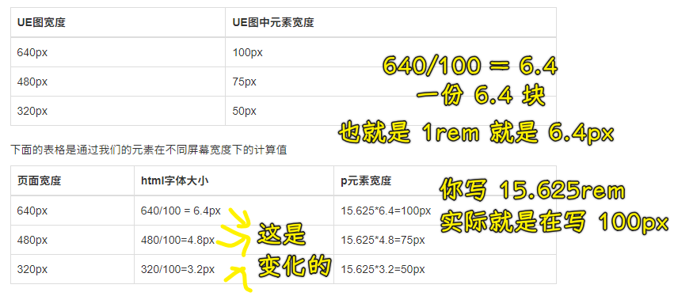

#### <mark>2、比 Rem 更好的方案</mark>

- `vw`：视口宽度的 `1/100`
- `vh`：视口高度的 `1/100`

这个`vw`，就是之前说到的`x`，即`1vw = 1x`

有了 `vw` 我们完全可以绕过 `rem` 这个中介 -> `vw` 比 `rem` 更简单 -> 毕竟 `rem` 是为了实现 `vw`

下面两种方案是等价的：

``` css
/* rem 方案 */
html {fons-size: width / 100}
p {width: 15.625rem}

/* vw 方案 */
p {width: 15.625vw}
```

`vw` 还可以和 `rem` 方案结合，这样计算 html 字体大小就不需要用 js 了

``` css
html {fons-size: 1vw} /* 1vw = width / 100 */
p {width: 15.625rem}
```

`vw`的缺点：

- vw 的兼容性不如 rem 好

---

由于浏览器支持最小字体大小是 `12px`，所以我们 一般划分成`10`份

➹：[Rem 布局的原理解析](https://yanhaijing.com/css/2017/09/29/principle-of-rem-layout/)

➹：[UI、UE 和 UX 三者之间的区别？ - 知乎](https://www.zhihu.com/question/27928975)

➹：[推荐一个新的移动端多屏适配方案（h5+小程序） - 掘金](https://juejin.cn/post/6844903733302673421)

➹：[探讨移动端布局解决方案 - 掘金](https://juejin.cn/post/6844904023166828551)

➹：[移动端 H5 多页开发拍门砖经验 - 掘金](https://juejin.cn/post/6844903608907989006)

➹：[移动端布局原理快速记忆 - 掘金](https://juejin.cn/post/6844904132726226958)

### <mark>9）总结</mark>

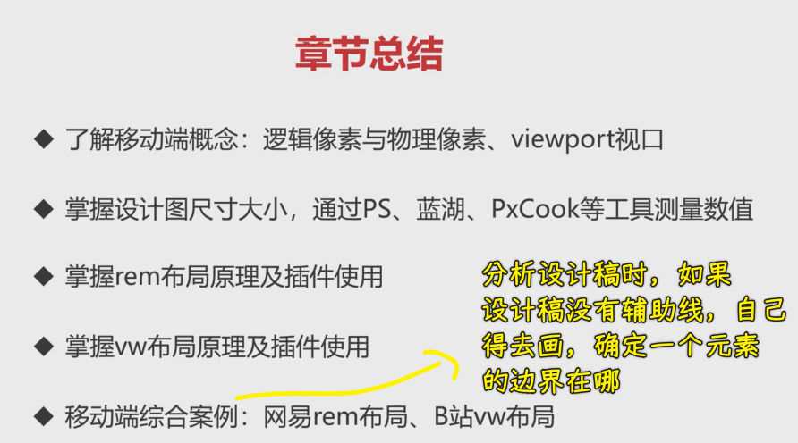

注意：布局是综合多种知识点，比如绝对定位，FLex、Grid 等