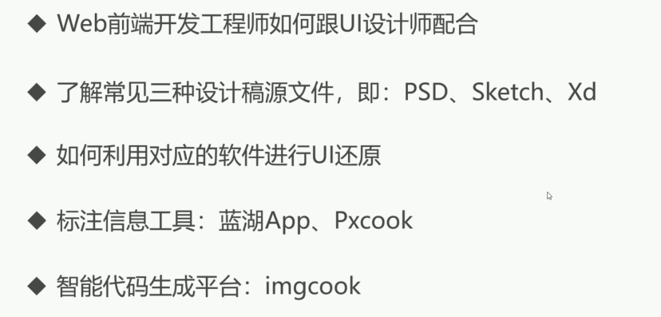

### ✍️ Tangxt ⏳ 2021-09-26 🏷️ CSS

# 06-章节总结

本章结束之后，我们来做一个章节总结。

在本章当中我们学习了 Web 前端开发师是如何跟 UI 设计师配合。

其实很简单，也就是说 UI 设计师要给我们**提供端设计图**，当然了，这是需要**提供源文件**的。开发人员根据这个源文件进行一个**更加精细的切图操作，包括尺寸的测量**。而在这个测量过程当中，我们可以**用一些软件**，这是我们本章给大家讲解的。

接下来我们看一下，刚才提到了这个源文件，其实我们常见的 UI 源文件主要有`PSD`、`Sketch`以及`Xd`，这就是我们公司常给的一些设计图源文件。我们只要知道**这些源文件是可以怎么样给它转换成这个相关的代码**的就可以了，**怎么样来测量设计稿当中的这个尺寸**就可以了。

下面我们再来看一下，我们还讲了如何利用这些软件进行 UI 还原。其实我们主要讲了这个 Photoshop 的这样一个软件进行还原。但是 PS 它的问题就在于它太专业了，它只是针对 PSD， 而且很多标注什么的都需要我们去测量，这不是那么方便。当然，这个切图也是稍微的有点繁琐，我们也可以去尝试去用。

当我们用得非常熟练之后，我们就可以去用更加方便的软件，也就是说**自动标注**的这样的软件。像这种自动标注的软件非常多。

我给大家介绍了这种在线的像蓝狐 App 以及我们的这个本地安装的 Pxcook，它们都有能力针对各种类型的源文件进行一个操作，并且会**智能的标注**出我们的这个尺寸大小是多少以及它这个尺寸是可以有选择的，有 `px` ，有 `rem`， 有 `vw` 这些不同的单位，还可以做**倍图**的操作。

也就是说我们可以做一个移动端的 750 的这样一个设计稿，在我们这些软件当中是可以量出它在我们手机上的一个具体的大小，其实是设计稿的 `1/2` 这样一个结果，所以说**这种标注图片在做移动端的时候是非常的给力的**，这个到时候移动端我也可以给大家单独的在一个小解当中讲解一下如何用标注软件来进行移动端的切图。

最后给大家介绍了这个智能平台生成代码的方式，就是 imgcook，这种智能平台它的优点就是我们不用再去一行一行的去编写我们的代码，我们直接把设计稿儿通过**智能的一键生成**，这就是一种类似于设计稿的人工智能方式，直接有了我们相关的代码，**大大的提升了一个开发的效率，当然，大家只是说用它来作为我们的辅助**。如果说有一些这个比较精细的需求的话，我们还是要做一些**微调**的。

当然了，这个平台也是未来的趋势，我们可以发现以后开发布局是很快的，像一些简单的页面儿，都是可以直接通过一键生成来完成的。在本章当中给大家介绍了一下我们的 CSS 如何对 UI 设计图进行还原，并且讲解了一下我们现代化开发流程当中是如何去做的。