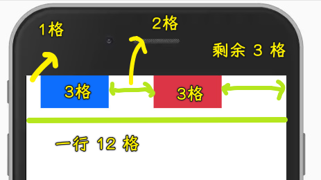
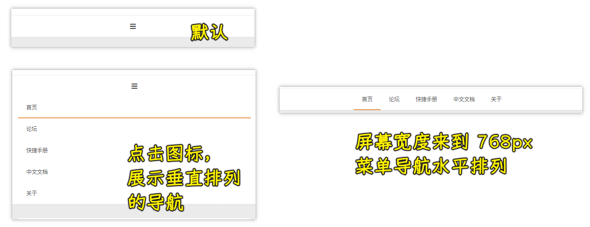

### ✍️ Tangxt ⏳ 2021-12-01 🏷️ 响应式布局

# 响应式布局

### <mark>1）概述</mark>


- 大型网站：准备两个站点 -> 两套代码
- 中小型网站：使用响应式布局 -> 一套代码


课程安排：


### <mark>2）媒体查询语法详解</mark>

搞响应式布局，主要就是用媒体查询来实现

#### <mark>1、媒体类型</mark>

媒体类型：满足某种设备类型才会触发相应样式生效


#### <mark>2、媒体特性</mark>


高度一般很少做响应式，一般都是搞宽度

#### <mark>3、逻辑操作符</mark>


- `and` -> 区间
- `not` -> 取反
- `only` -> 高级浏览器不需要加，旧版浏览器需要加 -> 没有太大的价值
- `逗号` -> 相当于是或操作，你写了多个条件，只要满足其中一个就会触发相应的样式

#### <mark>4、link 标签方式</mark>


#### <mark>5、代码</mark>

``` css
/* 媒体类型：print */
@media print {
  .box {
    font-size: 60px;
  }
}

/* 媒体特性 */
/* max-width: 1200px */
/* 屏幕大于等于 700px 时，样式就会生效，小于 700px 就不会生效 */
/* 你身上至少有 700 块 */
@media (min-width: 700px) {
  .box {
    width: 200px;
    height: 200px;
    background: pink;
  }
}

@media (orientation: portrait) {
  .box {
    width: 200px;
    height: 200px;
    background: pink;
  }
}

@media (orientation: landscape) {
  .box {
    width: 200px;
    height: 200px;
    background: skyblue;
  }
}

/* 逻辑操作符 */

/* 同时成立 */
@media screen and (min-width: 700px) and (max-width: 1200px) {
  .box {
    width: 200px;
    height: 200px;
    background: pink;
  }
}

/* 在 700 px 之下 */
@media not screen and (min-width: 700px) {
  .box {
    width: 200px;
    height: 200px;
    background: pink;
  }
}

/* 或操作，满足一个条件即可 */
@media screen,
print and (min-width: 700px) {
  .box {
    width: 200px;
    height: 200px;
    background: pink;
  }
}
```


### <mark>3）媒体查询的编写位置及顺序</mark>


第一点：


第二点：


第三点：


> 蓝色盒子：`(1000px, 正无穷大）` -> 粉色盒子：`(700px,1000px]` -> 绿色盒子：`[0px,700px]`

关于响应式布局，推荐移动端优先，也就是用`min-width`，当然，这不是绝对的，这一章后续的案例会用移动端优先，下一章的大案例会用 PC 端优先

### <mark>4）响应断点（阈值）的设定</mark>

响应断点设定，也叫阈值设定，说白了，就是设备的临界点 -> 它决定了`min-width`该取多少？`max-width`该取多少？

有很多种设备：


对于这些分辨率，我们一般会选择几个点作为断点 -> 选择啥值作为断点呢？没有标准答案，这里推荐以下这种（大家比较认可的设定）：


例子：

``` html
<div class="d-none">11111</div>
<div class="d-sm-none">22222</div>
<div class="d-md-none">33333</div>
<div class="d-lg-none">44444</div>
<div class="d-xl-none">55555</div>
<div class="d-xxl-none">66666</div>
```

``` css
.d-none {
  display: none;
}

@media (min-width: 576px) {
  .d-sm-none {
    display: none;
  }
}

@media (min-width: 768px) {
  .d-md-none {
    display: none;
  }
}

@media (min-width: 992px) {
  .d-lg-none {
    display: none;
  }
}

@media (min-width: 1200px) {
  .d-xl-none {
    display: none;
  }
}

@media (min-width: 1400px) {
  .d-xxl-none {
    display: none;
  }
}
```

> 通过加类似`lg、xxl`等这样前缀的方式，来让某个样式在某种屏幕尺寸下生效 -> 比如一些用于布局的样式

效果：


### <mark>5）响应式栅格系统</mark>

``` js
响应式栅格系统 = 栅格系统 + 响应式
```

代码：<https://jsbin.com/daguyoh/edit?html,output>

> 一般都是配合 SASS 来做的

在屏幕宽度小的情况下，每个元素是上下排列的，随着屏幕宽度的变化，来到某个断点，这会变成两列、三列、四列


### <mark>6）响应式交互实现</mark>


代码：<https://jsbin.com/socovon/1/edit?html,output>


### <mark>7）响应式框架 Bootstrap</mark>

Bootstrap 是最受欢迎的 HTML、CSS 和 JS 框架，用于开发**响应式布局**、**移动设备优先**的 WEB 项目

像什么响应断点、栅格系统、交互实现等内容，在 Bootstrap 框架中都已经提供好了，我们只需要引入框架文件即可使用。

#### <mark>1、如何使用？</mark>

下载（Currently v5.1.3）：[Bootstrap · The most popular HTML, CSS, and JS library in the world.](https://getbootstrap.com/)

这里强调一点，Bootstrap 框架是基于 jquery 库来设计的，所以除了在 html 文件中引入 Bootstrap 相关文件外，还需要引入 `jquery.js` 文件，并需要确保文件的引入顺序，具体引入方式如下：

``` html
<link rel="stylesheet" href="./bootstrap.css">
<script src="./jquery.js"></script>
<script src="./bootstrap.js"></script>
```

#### <mark>2、响应式断点的设定</mark>

Bootstrap 中的断点值设定跟前边所描述的是一样的


在 Bootstrap 框架中，能够具备响应式断点设定的样式非常多，如：float 浮动、display 显示框、container 容器、text 文本等。

``` html
<div class="float-sm-start d-lg-block container-md text-xl-start"></div>
```

#### <mark>3、响应式栅格系统</mark>

Bootstrap 中的栅格系统跟前面所写的例子也是一样的，不过功能更加的丰富，除了有 12 列响应式栅格系统外，还有栅格位置的控制和对行的栅格化控制等。

可通过 `offset-*-*` 模式对栅格进行偏移，代码如下：

```html
<div class="row">
  <div class="col-3 offset-1 bg-primary p-4"></div>
  <div class="col-3 offset-2 bg-danger p-4"></div>
</div>
```

> 相对于给元素添加一个`margin-left`



可通过 `row-*-*` 模式对行进行栅格化控制，代码如下：

``` html
<div class="row row-cols-3">
  <div class="col bg-primary p-4 border"></div>
  <div class="col bg-primary p-4 border"></div> 
  <div class="col bg-primary p-4 border"></div>
  <div class="col bg-primary p-4 border"></div> 
</div>
<div class="row row-cols-4">
  <div class="col bg-danger p-4 border"></div>
  <div class="col bg-danger p-4 border"></div> 
  <div class="col bg-danger p-4 border"></div>
  <div class="col bg-danger p-4 border"></div> 
</div>
```


#### <mark>4、常见 bootstrap 组件</mark>

在 Bootstrap 框架中提供了很多现成的组件，可直接进行使用并带有交互行为

如 Accordion（手风琴，即折叠列表）组件：

``` html
<div class="accordion" id="accordionExample">
  <div class="accordion-item">
    <h2 class="accordion-header" id="headingOne">
      <button class="accordion-button" type="button" data-bs-toggle="collapse" data-bs-target="#collapseOne"
        aria-expanded="true" aria-controls="collapseOne">
        第一项
      </button>
    </h2>
    <div id="collapseOne" class="accordion-collapse collapse show" aria-labelledby="headingOne"
      data-bs-parent="#accordionExample">
      <div class="accordion-body">
        第一项的内容
      </div>
    </div>
  </div>
  <div class="accordion-item">
    <h2 class="accordion-header" id="headingTwo">
      <button class="accordion-button collapsed" type="button" data-bs-toggle="collapse" data-bs-target="#collapseTwo"
        aria-expanded="false" aria-controls="collapseTwo">
        第二项
      </button>
    </h2>
    <div id="collapseTwo" class="accordion-collapse collapse" aria-labelledby="headingTwo"
      data-bs-parent="#accordionExample">
      <div class="accordion-body">
        第二项的内容
      </div>
    </div>
  </div>
</div>
```


Bootstrap 中的组件是通过，自定义属性 `data-*` 方式来控制交互行为的，例如在 Accordion 组件中通过 `data-bs-toggle="collapse" data-bs-target="#collapseOne"` 进行的

### <mark>8）响应式案例（Ghost 博客）</mark>

- [Ghost 开源博客平台 - Ghost 中文网](https://www.ghostchina.com/)
- [Ghost: Turn your audience into a business](https://ghost.org/)
- [如何搭建一个 Ghost 平台的博客？ - 知乎](https://www.zhihu.com/question/22755373/answers/updated)
- [Ghost Blog 部署指南 - 少数派](https://sspai.com/post/68855)

💡：导航按钮，点击按钮，导航菜单垂直展示 -> 不要按钮，导航菜单直接水平展示


💡：主内容区一栏变两栏


再继续增大屏幕宽度，这些元素的宽度也会增大


💡：底部一栏变三栏


也有宽度变大……

#### <mark>1、博客头部实现</mark>

> 移动端优先，先适配移动端，再慢慢适配到 PC 端

``` html
<div class="head">
  
</div>
```

``` css
body {
  background: #ebebeb;
}

a {
  color: #505050;
}

.head {
  height: 190px;
  background: white;
  display: flex;
  justify-content: center;
  align-items: center;
}

.head-logo {
  width: 200px;
}
```

效果：


#### <mark>2、博客导航实现</mark>

实现思路：

1. 分析设计稿
   1. 有边框
   2. 有图标
   3. 有元素
2. 写 HTML 结构
3. 写样式
   1. 按钮有高度
   2. 导航内容不是固定的，所以没有高度
   3. 要做响应式 -> 垂直排列和左右排列

代码：


``` css
.nav {
  border-top: 1px #ebebeb solid;
  border-bottom: 2px #e1e1e1 solid;
  background: white;
  padding: 0 15px;
}

.nav-bar {
  height: 56px;
  display: flex;
  justify-content: center;
  align-items: center;
}

.nav-bar i {
  cursor: pointer;
}

.nav-list {
  display: none;
}

.nav-list li {
  height: 56px;
  line-height: 56px;
  position: relative;
  padding: 0 21px;
}

.nav-list li.active::after {
  content: "";
  position: absolute;
  left: 0;
  bottom: 0;
  width: 100%;
  height: 2px;
  background: #e67e22;
}

.nav-toggle {
  display: none;
}

.nav-toggle:checked+.nav-list {
  display: block;
}
```

需要用到栅格系统，我们稍加修改原先写的响应式栅格系统：


效果：



#### <mark>3、博客文章列表实现</mark>

``` html
<div class="main row">
  <div class="col-lg-8">
    <div class="main-article">
      <h2>
        全新的 Ghost 文档上线
      </h2>
      <div>
        <span>作者：王赛</span> • <span>2018 年 11 月 20 日</span>
      </div>
      <p>
        我们的整个 Ghost 文档 已经全新改版了！并且添加了一些新的补充，包括使用教程和功能集成。 新文档的目标是帮助更多人有效地安装并管理他们发布的内容，并且最大限度地发挥 Ghost
        作为一个开源发布平台的灵活性。文档的设计和结构已经修订完毕，我们的改进包括 Ghost 安装和设
      </p>
      <button>阅读全文</button>
      <section>
        <i class="iconfont icon-wenjianjia"></i>
        <a href="#">Android</a>，
        <a href="#">客户端</a>
      </section>
    </div>
    <div class="main-article">
      <h2>
        全新的 Ghost 文档上线
      </h2>
      <div>
        <span>作者：王赛</span> • <span>2018 年 11 月 20 日</span>
      </div>
      <p>
        我们的整个 Ghost 文档 已经全新改版了！并且添加了一些新的补充，包括使用教程和功能集成。 新文档的目标是帮助更多人有效地安装并管理他们发布的内容，并且最大限度地发挥 Ghost
        作为一个开源发布平台的灵活性。文档的设计和结构已经修订完毕，我们的改进包括 Ghost 安装和设
      </p>
      <button>阅读全文</button>
      <section>
        <i class="iconfont icon-wenjianjia"></i>
        <a href="#">Android</a>，
        <a href="#">客户端</a>
      </section>
    </div>
    <div class="main-article">
      <h2>
        全新的 Ghost 文档上线
      </h2>
      <div>
        <span>作者：王赛</span> • <span>2018 年 11 月 20 日</span>
      </div>
      <p>
        我们的整个 Ghost 文档 已经全新改版了！并且添加了一些新的补充，包括使用教程和功能集成。 新文档的目标是帮助更多人有效地安装并管理他们发布的内容，并且最大限度地发挥 Ghost
        作为一个开源发布平台的灵活性。文档的设计和结构已经修订完毕，我们的改进包括 Ghost 安装和设
      </p>
      <button>阅读全文</button>
      <section>
        <i class="iconfont icon-wenjianjia"></i>
        <a href="#">Android</a>，
        <a href="#">客户端</a>
      </section>
    </div>
  </div>
</div>
```

``` css
:root {
  --container: 100%;
}
.main {
  padding: 0 15px;
  width: var(--container);
  margin: 0 auto;
  box-sizing: border-box;
}

.main-article {
  margin-top: 35px;
  background: white;
  padding: 35px;
  line-height: 1.5;
}

.main-article h2 {
  font-size: 35px;
  text-align: center;
  font-weight: 400;
}

.main-article div {
  text-align: center;
  color: #959595;
}

.main-article p {
  margin-top: 25px;
  font-size: 18px;
}

.main-article button {
  border: none;
  background: #e67e22;
  color: white;
  padding: 10px;
  cursor: pointer;
  margin: 30px 0;
}

.main-article section {
  border-top: 1px #ebebeb solid;
  padding-top: 20px;
}

.main-article section i {
  margin-right: 10px;
}
```


效果：


#### <mark>4、博客辅助列表实现</mark>


``` css
.main-aside {
  background: white;
  padding: 35px;
  margin-top: 35px;
}

.main-aside h3 {
  font-size: 20px;
  font-weight: 400;
  padding-bottom: 10px;
  border-bottom: 1px #cccccc solid;
  position: relative;
}

.main-aside h3::after {
  content: "";
  position: absolute;
  left: 0;
  bottom: -1px;
  width: 90px;
  height: 1px;
  background: #e67e22;

}

.main-aside p {
  margin-top: 30px;
}

.main-aside button {
  border: none;
  background: #e67e22;
  color: white;
  padding: 10px;
  cursor: pointer;
  margin-top: 30px;
  width: 100%;
}

.main-aside div {
  margin-top: 20px;
}

.main-aside div a {
  border: 1px #ebebeb solid;
  display: inline-block;
  margin: 11px 7px 0 0;
  padding: 5px 10px;
}
```

效果：

垂直排列（小屏显示）：


水平排列（大屏显示）：


#### <mark>5、博客尾部实现</mark>

有两部分：

- 页脚部分
- 版权部分


``` css
.foot {
  margin-top: 35px;
  padding-top: 35px;
  background: #202020;
  overflow: hidden;
}

.foot-wrapper {
  width: var(--container);
  margin: 0 auto;
}

.foot-item {
  padding: 0 30px;
  margin-bottom: 30px;
}

.foot-item h3 {
  color: white;
  font-size: 22px;
  font-weight: 400;
  padding-bottom: 10px;
  border-bottom: 1px #cccccc solid;
  position: relative;
}

.foot-item h3::after {
  content: "";
  position: absolute;
  left: 0;
  bottom: -1px;
  width: 90px;
  height: 1px;
  background: #e67e22;
}

.foot-item div {
  margin-top: 20px;
}

.foot-item div a {
  margin: 10px;
  display: inline-block;
  color: #959595;
}

.copyright {
  background: #111111;
  display: flex;
  justify-content: center;
  align-items: center;
  height: 80px;
  color: #555555;
}
```

效果：


注意：

都有一个最大版心：


---

如何搞响应式？ -> 媒体查询+栅格系统+响应式交互

### <mark>9）章节总结</mark>


➹：[css 笔记之版心和布局流程](https://www.cnblogs.com/zhangcheng94/p/12188515.html)

➹：[CSS 版心和布局 - 简书](https://www.jianshu.com/p/c246529b067f)

➹：[PC 端静态网页应用开发 - 知乎](https://zhuanlan.zhihu.com/p/376855729)

➹：[设计网页，常见的宽度是多少像素？ - 知乎](https://www.zhihu.com/question/21042513)

### <mark>10）测试与练习</mark>

💡：测试题

响应式布局中的移动优先原则是？ -> `min-width`值从小到大进行适配

💡：练习题

根据下面 HTML 结构，完成图示布局效果，编写对应 CSS 代码：

``` html
<style>
  /* 代码编写区域 */
</style>
<section class="head">
  <div>logo</div>
  <ul>
    <li>item1</li>
    <li>item2</li>
    <li>item3</li>
    <li>item4</li>
  </ul>
</section>
```


要求如下：

1. 断点值为 768px，小于 768px 时 -> head 区域高 100px。大于等于 768px 时 -> head 区域高 50px
2. div、ul 在小于 768px 时，垂直排列，内容上下左右居中
3. div、ul 在大于等于 768px 时，水平排列，内容上下居中，左右在两侧
4. item 列表项之间间距为 50px

参考答案：

``` css
* {
  margin: 0;
  padding: 0;
}
ul {
  list-style: none;
}
.head {
  height: 100px;
  background: skyblue;
  display: flex;
  flex-direction: column;
  align-items: center;
}
.head div {
  flex-grow: 1;
  display: flex;
  align-items: center;
}
.head ul {
  flex-grow: 1;
  display: flex;
  justify-content: space-between;
  align-items: center;
  column-gap: 50px;
}
@media (min-width: 768px) {
  .head {
    height: 50px;
    flex-direction: row;
  }
  .head ul {
    flex-grow: 0;
  }
}
```
