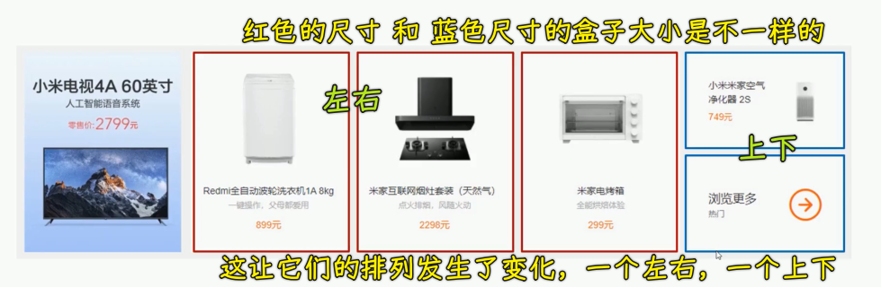
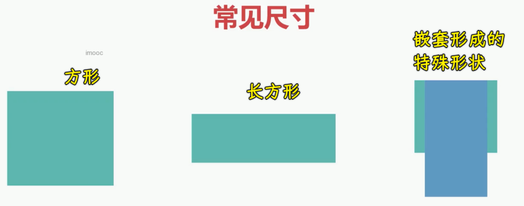
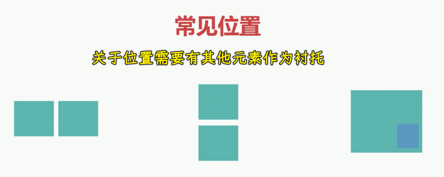
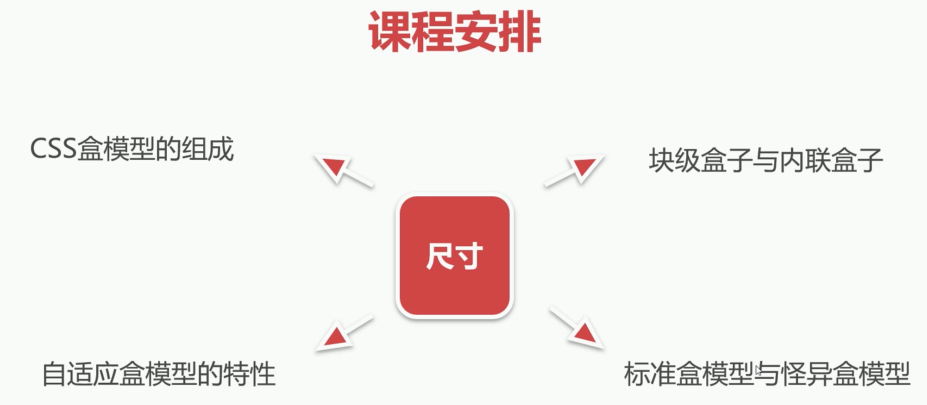
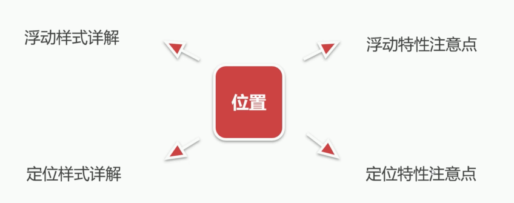
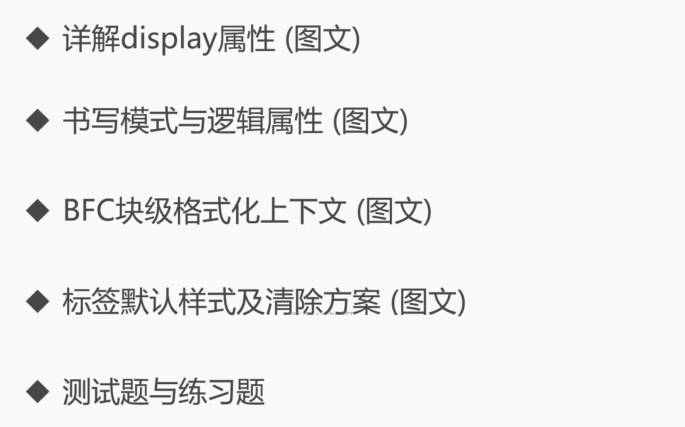

### ✍️ Tangxt ⏳ 2021-09-27 🏷️ CSS

# 07-章节介绍

本章我们将学习布局中的尺寸与位置。

### <mark>1）尺寸和位置</mark>

首先来看一下本章的一个学习目的。

尺寸和位置其实就决定了我们的一个网页排版方式，这对于 CSS 布局来说，那肯定是非常重要的，接下来我们通过一个图示给大家简单的说明一下。

在这张图当中，大家可以看到这个白色的区域，就是一个元素的尺寸。那我们需要想办法怎么样把它测量出来，并且能够形成这样的一个大小。

多个尺寸元素排列成一横行或者是一列的时候，其实就决定了它们之间的位置，这时候也是非常重要的。大家可以看到红色的这个尺寸的元素，它是左右排列的，而我们蓝色的这两个元素，它是上下排列的。所以说**尺寸和位置就决定了一个网页的排版方式，也就决定了 CSS 布局中的非常重要的一些概念。**

#### <mark>1、尺寸</mark>

接下来我们来看一下常见的尺寸有哪些。

比如说我们常见的有方形、长方形或者是两个结构是嵌套的，然后当里面的内容多了，或者是里面内容少了，这个时候我们的尺寸该如何进行适配呢？是让自己膨胀？还是往肚子里咽呢？

#### <mark>2、位置</mark>

再来看一下常见位置。

常见位置有我们的一行（横着的一排）或者是一列（竖着的一排）的排列，还有我们这种叠加在一起的，这都是比较常见的一个位置，还有什么呢？我们这个行和列组合的有行有列的方式，就像一个列表，这个也是很常见的。

### <mark>2）课程安排</mark>

接下来我们来看一下本章的一个课程安排。

#### <mark>1、涉及尺寸的相关概念</mark>

本章主要首先围绕着尺寸，要给大家讲解的有 CSS 盒模型的组成。第二个要讲的就是块级盒子与内联盒子，然后还有自适应盒模型的特性，以及我们标准盒模型和怪异盒模型。

#### <mark>2、涉及位置的一些操作</mark>

除了讲解尺寸相关的内容以外，我们还要了解一些常见的位置操作，比如说浮动样式的一个详解以及浮动特性的注意点。浮动操作是非常适合实现网页当中左右布局的一种方式。

我们还会讲到定位样式详解以及定位特性注意点。定位是网页当中实现这种叠加效果的非常重要的一种布局方式，也是控制我们位置的。

除了我们讲解浮动这种布局形式以及定位这种布局形式以外，还会给大家讲到它们的特点，在平时使用的时候需要注意哪些细节，这个在我们课程当中都可以给大家进行讲解。

### <mark>3）扩展内容学习</mark>

除了以上内容以外，还给大家安排了一些扩展内容的学习，大家一起来看一下。

像详解`display`属性，这个也是非常重要的，还有我们的书写模式以及逻辑属性，以及 BFC 块级格式化上下文，还有标签默认样式及清除方案。最后给大家准备了测试题与练习题。以上就是我们课程的一个简单的一个内容，希望同学们能够认真的学习本章内容，并且完成相关的测试与练习。我们下一节课见……
