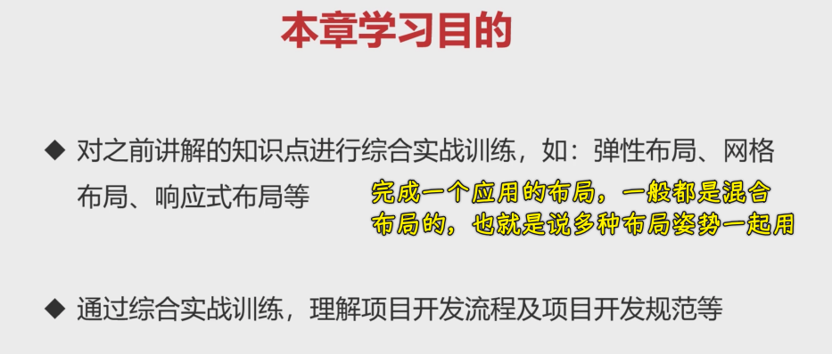
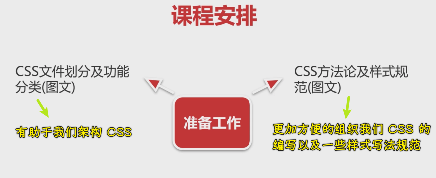
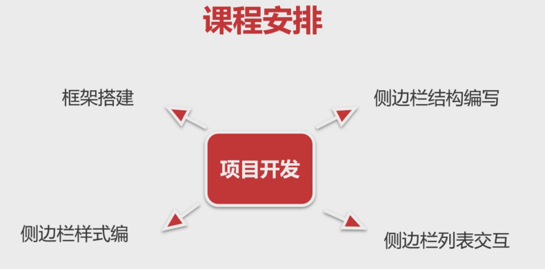
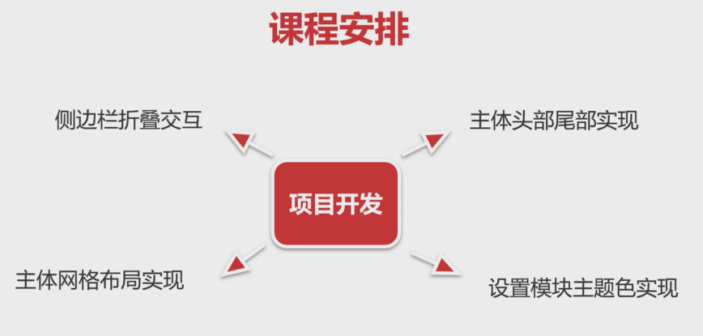
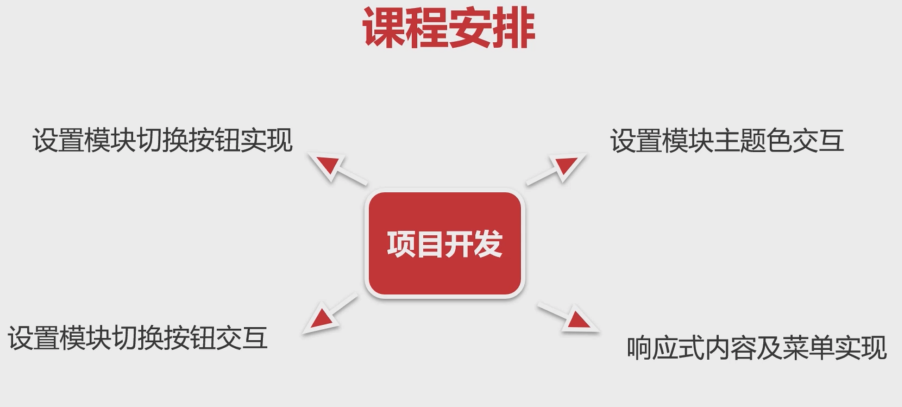
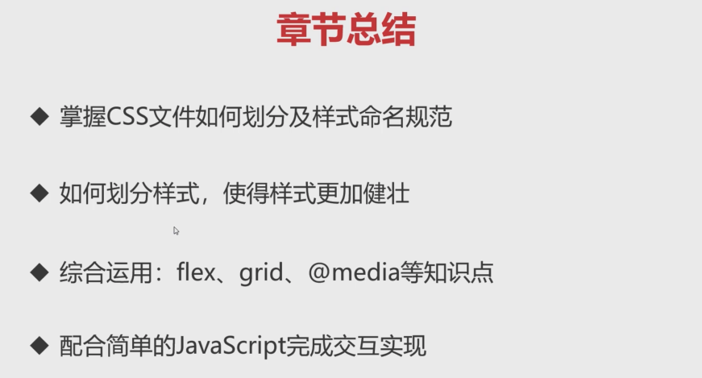

### ✍️ Tangxt ⏳ 2021-12-02 🏷️ CSS 案例

# 综合实战 Ant Design Pro 管理系统

### <mark>1）章节介绍</mark>

#### <mark>1、本章学习目的</mark>

#### <mark>2、课程安排</mark>

准备工作：

对于这个项目，我们要做什么：

#### <mark>3、最终效果</mark>

还有移动端的响应式适配：

完成这个案例，需要综合我们前边所学到的各种知识点

### <mark>2）CSS 文件划分及功能分类</mark>

### <mark>3）CSS 方法论及样式规范</mark>

### <mark>4）综合实战 Ant Design Pro 管理系统</mark>

#### <mark>1、框架搭建</mark>

- 固定状态控制
- 折叠状态控制

#### <mark>2、侧边栏结构编写</mark>

- 小图标 -> 固定定位+高度`100%`

#### <mark>3、侧边栏样式编写</mark>

#### <mark>4、侧边栏列表交互</mark>

- 只做一级菜单的折叠，展开后的那些菜单就不做交互了
- 展开的内容多时，要出现滚动条
- 默认滚动条很丑 -> 用自定义滚动条 -> 有兼容性 -> 针对某个模块需要加前缀，不然就是全局生效了
  - `.g-ant-sider__main::-webkit-scrollbar`
  - `.g-ant-sider__main::-webkit-scrollbar-thumb`
  - `.g-ant-sider__main::-webkit-scrollbar-track`

#### <mark>5、侧边栏折叠交互</mark>

- 那个折叠按钮 -> 扩展：`hover`图标有悬浮的菜单

#### <mark>6、主体头部尾部实现</mark>

- 上中下布局

#### <mark>7、主体网格布局实现</mark>

- 用图片模拟图表功能

#### <mark>8、设置模块主题色实现</mark>

- 用到了 CSS 变量

#### <mark>9、设置模块切换按钮实现</mark>

- 也是一个元件

#### <mark>10、设置模块主题色交互</mark>

#### <mark>11、设置模块切换按钮交互</mark>

- JS 钩子 -> 一个有`j-`前缀的类

#### <mark>12、响应式内容及菜单实现 </mark>

- CSS 写得好，你会发现这相应的 JS 写起来也是非常的舒服的！

### <mark>5）章节总结</mark>

> 元件是最小单元 -> 元件的组合形成模块 -> 模块的组合形成网页 -> 布局就是书架子，用来放模块的

