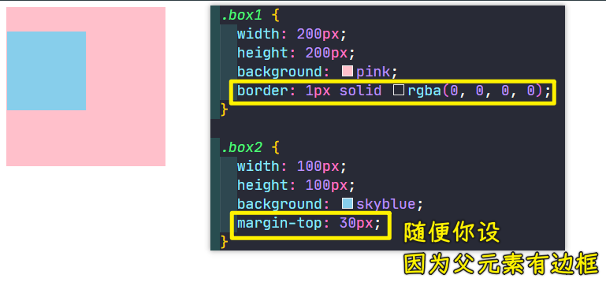

### ✍️ Tangxt ⏳ 2021-09-28 🏷️ CSS

# 08-CSS 盒模型的组成、块级盒子与内联盒子、自适应盒模型的特性、标准盒模型与怪异盒模

## ★CSS 盒模型的组成

我们一起来看一下 CSS 盒模型的组成。

### <mark>1）什么是 CSS 盒模型？</mark>

首先了解一下什么是 CSS 盒模型。

在 CSS 中所有的元素都被一个个的盒子，也就是我们的一个 box 包围着，理解这些盒子的基本原理，**是我们使用 CSS 实现精准布局处理元素排列的一个关键所在**。

### <mark>2）盒子模型的组成</mark>

我们一起来看一下盒子模型的组成。

盒子模型简单是由我们四部分组成的，第一部分就是我们的 `content` 内容部分，第二部分是`padding`，也就是内填充，第三部分就是我们的`border`边框，第四部分就是我们的 `margin` 外边距。

话说，这四部分在盒子当中的一个关系是怎样的呢？

可以看到它们其实是这种嵌套在一起的，最内层的其实就是我们的`content`内容区域，然后是我们的`padding`区域，`padding`之后则是咱们的`border`边框，边框的外面就是我们的外边距`margin`。

为了更好地理解它，我们举一个简单的例子：

我们可以把这个盒模型理解成一个快递的话，那`content`就是我们真正的里面快递的物品。而这个`padding`我们可以理解成是物品与盒子之间的这个填充物，那`border`就是盒子。而这个`margin`就是我们多个快递之间的间距，你可以这么去理解，比如说我们有多个盒子的话，通过`margin`可以让它们之间产生一个距离，可以把它们间隔开。

具体我们通过代码给大家简单的来演示一下。

1. 打开编辑器
2. 创建一个`1demo.html`
3. 在页面当中写我们的第一个盒子：`
我是一个盒子
`
4. 给它一点样式
5. 在浏览器打开它，可以看到它就是一个元素、一个盒子

这就是我们盒模型的所有组成的部分。好了，大家可以看到，我们对`padding`和`margin`设置了四个方向的值，因为我们只给了一个值，如果给两个值就是`上下`和`左右`，三个值不常用因为不方便，四个值就是一个顺时针的`上右下左`，我们还可以单独只设一边是填充的，一边的是边距的，这一点看盒模型那个图就行了，如`padding-left`和`margin-right`

我们了解了这个盒模型的基本组成之后，可以发现它们就形成了一个盒子所占据页面的一个大小，这个就是我们**最基本的布局当中的元素尺寸**。

**了解盒模型基本上你就知道了这个容器它所占据的尺寸大小是多大，方便我们做排版**。

### <mark>3）对于 CSS 盒模型，你要注意的点</mark>

我们再来看看这个盒子它到底有没有什么特别的特性，我们再来一个盒子`box2`：

那这个盒子模型它有没有什么需要注意的点或者是它的特性呢？接下来我们一起来看一下 CSS 盒模型的注意点。

#### <mark>1、`padding`不能为负，但`margin`可以为负</mark>

首先第一点就是这个内填充`padding`它是不能为负数的，因为这个内填充最少就是不填充，所以它不能说是出现负的，而我们的`margin`外边距是可以出现负值的。接下来我给大家进行演示：

比如说在这里，我们把`box1`的`margin`设置为`-20px`，这就说明原来设置 `0` 的时候，它可能上下两个是挨在一起的，但是你做成负数之后，你会发现这个时候底下的盒子会跑到上一个盒子的上边，因为它这个 `margin` 出现负数了，它就会出现这种叠加的这个效果

所以说间距这个东西是负的，其实是会叠在一起的，而`0`正好是挨在一起的，而正值会把它们向四周扩散这样一个特点，还有你可以看到这个粉色的盒子它是不是已经出去一部分了，上面也出去一部分，左边出去一部分以及跟下面也出现了重叠的效果。

注意：如果你把`margin`设置成`-100px`这样，那么`box2`也会跟着它去的

如果还有个`box3`，那么它会紧挨着`box2`：

这是平级现象，如果是嵌套，给`body`一个`10px`的边框：

那我们再来看一下它这个还有哪些特点。

#### <mark>2、`border`下也是有背景色的，只有`margin`是没有的</mark>

第二个特点就是背景色它会平铺到非`margin`的区域。

`margin`区域跟我们的背景色没啥关系，它始终是默认的白色，那边框这个区域到底有没有背景色呢？其实边框区域也是有颜色的，但是为什么我们看不见它呢？因为边框把背景色给盖住了，你可以调大边框，用虚线或者是实线半透明色的，你就可以看到，边框底下是有背景色的：

所以说我们可以发现背景色会平铺到非`margin`的区域，也就是说从边框开始就有背景色了，只不过边框是会把背景色给它盖上。

我们再来看一下第三点。

#### <mark>3、给儿子的`margin-top`，相当于是给父写的</mark>

第三点就是`margin-top`，其实它会有一种传递的现象，当然只是针对这个 `top` 的，如果说是左右还有下，其实是没有这个问题的。

那接下来我们来看一下这个问题：

1. 搞两个盒子，`box1`嵌套一个`box2`
2. 都给上宽高背景色
3. 给`box2`一个`margin-top`

这种问题其实对我们布局来说，肯定或多或少会造成一些影响。那我们怎样解决这个问题呢？有很多种方案。

首先最简单的方案就是我们不用这个`margin-top`来做这个事了，我们可以换成`padding`来做这个事儿，就是说我们用`padding-top`也可以做到类似的效果，只不过需要稍微处理一下罢了！

第二点，我们还可以通过加上这个边框也可以解决这个问题：

现在它就可以产生这个正常的现象了。

除了这些这个简单的操作以外，还有我们后边这个课程当中有的内容，就是 BFC 格式化上下文也能解决这个问题，希望大家可以认真的去阅读一下这个咱们那个图文当中给大家介绍的 BFC 格式化上下文是怎么回事？其实也是可以非常好的解决这个问题的。

> BFC 的原理就是让盒子形成一个独立的容器，无论里面的子元素如何折腾，都不影响到外面的元素。通俗一点来讲，可以把 BFC 理解为一个封闭的大箱子，箱子内部的元素无论如何翻江倒海，都不会影响到外部。

比如：

但不管怎样，大家会发现这个问题是存在的，解决手段也非常多，像什么用`padding`替代、加边框，边框可以做成一个透明的，这样就不会影响到我们这个视觉了。还有就是用 BFC 来解决这些问题。

这些方案其实都是可以解决的，但是其实并不是最好的方案，最好的方案其实还是选择用我们下一章或者是大下一章咱们要讲的内容，这些内容才是我们现代布局当中非常重要的一种布局手段，是完全可以避免这种传递现象的，那就是**弹性布局和网格布局**。

所以说现代布局其实就是把传统的我们这些问题给它解决掉。所以说在下一章以及大下一章当中是我们重中之重的内容，希望大家好好去学习。本章主要是学习一些最基本的概念，所以说咱们不会讲的那么的细了。

#### <mark>4、兄弟间的`margin-bottom`和`margin-top`，是可以叠加在一起的</mark>

接下来咱们来看一下这个第四个问题，这第四个问题也是`margin`出现的，在`margin`这个上下当中其实会出现一种叫做**叠加**的现象，我们一起来看一下什么叫叠加的现象。

1. 创建两个盒子 -> 是同级的，可不是嵌套的
2. 都加上宽高背景色
3. `box1`的`margin-bottom`为`40px`
4. `box2`的`margin-top`为`30px`

你预期这两个盒子之间的间距可能就会产生 `70` 个像素，但是实际上它们两个之间的间距真得有 `70` 像素吗？我们通过这个开发者检查工具可以明显的发现，这个间距其实是叠加在一起的，也是说它们两个之间都有`margin`，**获取它们之间比较大的那个值作为它们之间的间距**。所以此时它们的间距其实是 `40px`，也就是取它们中最大的，并不会把它俩进行累加，而是叠加这样的一个现象。

同样这个现象有时候也会影响到排版

所以我们怎么解决呢？

第一种解决方案其实就是把这个值只加给一个元素。比如说我们给这个 `box1` 加一个`margin-bottom:70px`。而下面这个`box2`盒子则不加，这就可以解决这个问题了，这是一种简单的处理方式。

其实我们在加的时候要注意这个细节，就**尽量给一个元素加`margin`，然后第二个跟它产生间距的元素，最好不要加**。

当然这个问题只出现在上下当中，如果我们的**布局是左右的话，是不存在这个问题的，左右的话，它是会很好的累加在一起的**。

我们还有一些解决方案，咱们也来说一下，比如说像刚才提到的这个 BFC 格式化上下文也可以解决这样的问题，可以让我们这个叠加的现象消失，而是正常的去进行累加，也就是 `70` 个像素。

> 把这两个盒子都套一个空盒子，让这两个空盒子 BFC 化就好了！这样它们都是独立的盒子了，只是`box1`和`box2`不同级罢了！

这些方案都可以用，但是实际上还是我刚才说的**最好的方式就是利用我们现代布局——flex 弹性布局和 grid 网格布局**，因为在它们这种布局当中，其实已经**把这些存在的已有的问题已经提前给解决掉了**，所以说在你进行后面章节的一个布局的时候，就不用再担心像什么`margin`叠加或者是`margin`传递这样的一些问题产生了。

当然，**我们了解这些也是非常重要的，因为很好的了解了 CSS 盒模型的这样的一些特性，才有助于我们更好的去学习后面的内容**。

---

这就是我们本小结所讲的一些内容了，大家可以去自己操作一下。

## ★块级盒子与内联盒子

在本小节当中，我们将了解一下什么是块级盒子和内联盒子。

### <mark>1）概念</mark>

首先我们先来看一下概念。

在 CSS 中我们广泛地使用两种「盒子」，一就是块级盒子，叫做「block box」，二就是我们的内联盒子，也就是「inline box」。这两种盒子会在页面中表现出不同的行为方式。

简单来说一下，我们的标签一般就可以做一些划分了。

比如说默认具备块级盒子特性的有哪些标签呢？

就是我们的 `div`、`p`、`h1` 等这样的一些标签。而具备内联盒子的特性的标签我们也有很多，比如说我们的 `span`、`a`或者是 `strong` 这样的标签。

接下来我们就来看一下这两大类标签或者是这两大类盒子它们有什么样的特性。

### <mark>2）块级盒子的特性</mark>

第一个先来看一下这个块级盒子的特性。

#### <mark>1、独占一行（上下排列）</mark>

块级盒子特性的第一个特性就是它是**独占一行**的。

接下来我们来演示一下：

在页面中，你会发现这两个盒子，默认就是上下排列的。为什么是上下排列呢？其实就是这个块级盒子默认就是独占一行的。也就是说这个盒子写完之后它自己就要占一行，而另外一个盒子就要排在它的下边，这就是我们块级盒子的特性。`div` 它就属于块级，所以说我们可以看到它不会独占一行。

可以看到，我们非常容易的用块就可以实现这种上下布局了。

#### <mark>2、样式通通支持，而且支持得很好</mark>

接下来我们再来看一下我们的第二个特性，第二个特性它就是支持所有样式，也就是说我们 CSS 当中的所有样式在块级盒子当中都是会生效的。比如说我们的宽高，我们的这个 `margin`， 我们的`padding`都是会生效的。这里大家记住这个特性就可以了。

#### <mark>3、不写宽度，那就撑满整个容器</mark>

我们来看一下我们的第三个需要注意的特性是什么呢？

就是当不写宽度的时候是会跟父容器的宽度相同。接下来我来给大家进行演示：

把`box1`的宽去掉，在不写宽的时候我们看一下会怎样。从页面中可以看到，我们的这个盒子的宽跟它父容器的宽是相同的，所以如果假设你就想让这个盒子跟父容器宽度相同，你是可以不用写宽就可以做到的。这就是块级盒子所具备的特性。

#### <mark>4、背景色始终是个矩形</mark>

那我们再来看一下我们的第四点。

第四点当中其实就是我们这个块所占据的区域其实是一个矩形，这个很好理解，就是说我们这一块占据的其实都是矩形，它是不能够出现特殊图形的，这些特性其实都是跟我们内联盒子做对比的。所以说一会我们看到内联盒子就能看出它们的特性是有很多不一样的点在里面的。

### <mark>3）内联盒子的特性</mark>

接下来我们就直接来看一下我们的内联的盒子。

#### <mark>1、不换行，除非一行挤不下了（左右排列）</mark>

在内联盒子当中的第一个特性就是盒子不会生成这个换行，也就是说不会产生换行。那这个含义就是说当我们写了两个内联的盒子：

可以看到这两个内联盒子它其实是不会换行的，也就是说它不会独占一行，而是它们是**左右排列**的，这是我们的第一个特性。

#### <mark>2、有些样式就是不支持，即便支持，也支持得不怎么好</mark>

接下来我们来看一下第二个特性。

第二个特性就是有一些样式它是不支持的，比如说这个宽高在我们的内联盒子当中其实是不支持的。接下来我给大家演示一下。

我们可以看到它其实并不会支持。比如说除了这个宽高它不支持以外，还有一些样式，它支持程度也不好，尤其是我们的这个盒模型当中的`margin`和`padding`。比如说内联盒子的上下`margin`是不会起作用的，或者是就算起作用，它的**位置也是会发生问题**的。所以说对于 `margin` 和`padding`的上下，它支持也不是特别好，大家可以自己尝试一下。

这就是我们第二个需要注意的特性了，即并不是所有样式都支持。

#### <mark>3、不支持宽高，由内容决定自己的宽度</mark>

第三个特性，就是不写宽度的时候，宽度由内容决定。也就是说既然它不支持宽高的话，那它的宽度由什么来决定呢？就是由内容决定。

比如说刚才我写了内容，假如说我不写内容的话，其实你写上宽高它不起作用，那这个时候你会发现你在页面当中你是看不见它的，因为它宽度不会跟父容器相同，这种内联元素它是跟内容走的。所以说我们把这个内容再加回来，你看它就能给它撑开一个容器大小。

> 我给`span`加`border`，把盒子改为`border-box`，结果没啥变化，内联盒子的大小真得就是由它自己的内容决定的！

#### <mark>4、有时候背景色是矩形，有时候则是不规则图形</mark>

接下来我们再来看一下第四点。

第四点就是所占的区域，它不一定是矩形。这什么意思呢？

比如说我们可以往这个`inline2`里边多添点内容，这样的话就比较明显能看出来了，我现在多添了一些内容之后，在一行还未占满的情况下，它还是一个矩形，那我现在打开开发者工具，让视口的宽变小：

你可以很明显的看到`inline2`这一块它已经不是一个矩形了，它占据了一个不规则区域，这个区域它就不是矩形，所以说内联盒子在自动折行时是不一定会还是一个矩形的。这跟我们的块是不一样，咱们的块永远都是个矩形，它是不存在这种特殊图形的这样一个情况的。

#### <mark>5、内联标签之间居然有空隙</mark>

接下来来看一下第 5 点。

第五点也是刚才大家仔细观察就能会发现的，内联这个标签之间其实会有空隙的：

我们第一个内联盒子跟第二个内联盒子之间其实是有个小空隙的，这个小空隙其实也是可以解决的。

比如说我们在写`span`标签时连成一行，就可以解决这个空隙。当然除了这种方案以外，还可以利用一些技巧，比如说网上有这种通过`font-size`等于`0`的方式来解决。

---

但是不管怎样，其实我们会发现内联盒子它的问题特别多。其实**这些盒子问题特别多，它主要是影响到布局**，所以说我们在做布局的时候，咱们一定要注意**不要选择内联盒子去做布局**。因为内联盒子做布局它的问题是非常多的，所以说我们做布局一定要选择块去做布局。而内联的元素其实一般都是作为修饰标签。比如说我们这个 `strong`标签，它是个修饰强调这样的标签，它也是可以做我们的文本修饰的，`a`标签链接，它也是一种文本修饰的。

### <mark>4）总结</mark>

所以咱们总结一下，大家要记住块标签，**它的主要特性决定了它是主力来做布局的**。而**内联标签咱们尽量不要让它去做布局，因为它存在很多问题，我们内联元素只是来做文本修饰的时候是比较好的**。

好了，这就是我们给大家介绍了一下这个块级盒子和内联盒子。当然了这里还有一个需要知道的一个小的知识点，就是这些块级盒子或者内联盒子它们是怎么样知道它是块还是内联的呢？

其实是可以通过一个样式可以知道的，那个样式就我们的`display`，`display`属性它就决定了它当前是一个什么样的盒子。其中如果说 `display`显示的是 `block`，那说明它就是一个块级盒子。如果说我们的 `span`的`display`显示的是`inline`，那就说明它是一个内联的盒子。

所以说`display`这个属性它特别强大，尤其是在我们下一章和大下一章当中，我们做这个现代化布局的时候，其实也要涉及到`display`的操作。

在本章当中，我们有一个小节是专门对 `display` 属性做一个详细讲解的，希望同学们一定要对`display`详解那个章节做一个非常认真的阅读，来了解 `display` 属性的具体含义以及它所包含的内容，这非常有助于我们对后续的章节当中进行这个学习，总之，搞清楚`display`这个属性，这对我们理解现代化布局是非常有帮助的！

## ★了解更多

➹：[CSS 块元素、内联元素、内联块元素 - 云+社区 - 腾讯云](https://cloud.tencent.com/developer/article/1440362)

➹：[内联元素，取消间隙和默认效果 - 编程猎人](https://www.programminghunter.com/article/4628327571/)