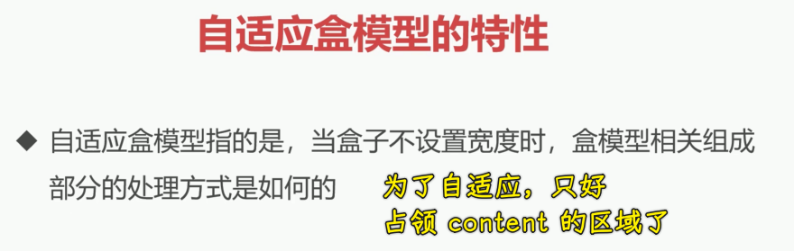

### ✍️ Tangxt ⏳ 2021-09-29 🏷️ CSS

# 09-自适应盒模型的特性、标准盒模型与怪异盒模

## ★自适应盒模型的特性

在本小节当中，我们来了解一下自适应盒模型的特性。

### <mark>1）概念</mark>

先来看一下我们的概念：

> 自适应盒模型指的是当盒子不设置宽度时，盒模型相关组成部分的处理方式是如何的

### <mark>2）案例</mark>

下面我们直接通过案例来给大家进行讲解。

#### <mark>1、儿子溢出了</mark>

1. 搞两个盒子 -> 是嵌套的 -> `box1`嵌套一个`box2`
2. 都给上宽高背景色
   1. `box1 300 * 200`
   2. `box2 300 * 100`
3. 给`box2`追加`padding 10px` -> 盒子溢出了 -> 加`5px`的边框也会溢出 -> 加`margin`也会溢出

#### <mark>2、为啥会溢出呢？</mark>

因为当你把`box2`这个宽高已经固定的时候，它其实就已经固定死了我们这个`content`区域，然后我们在这个盒模型当中去添加填充物以及边框或者是外边距的时候，那它自然就会把整个盒子给它向四周扩散，于是，就会产生这样的效果了。

这个效果看到之后，我们再来看个作为对比的例子。

#### <mark>3、如何让儿子不溢出？</mark>

如果我们不给`box2`宽会怎样？那它的宽就会跟父容器一样。

所以当不写宽度的时候，它是默认自适应整个父容器的，我们加`padding`，`box2`不会溢出，只是`content`区域变小罢了，总之**整体这个容器的尺寸是不变的**，`padding`添加就会导致`content`的区域变小，同理，加`border`，它还是会往这个盒子里面进行收缩，`content`又会变小了，这个边框也会在整个`box1`容器的内部。然后我们再来看一下我们的 `margin` 区域，我们把 `margin` 也给它添加上，加上之后我们可以发现`margin` 它其实也会添加上，并且也会往里进行收缩。

所以我们可以发现这样的特性，这就是自适应盒模型的一个特性。

### <mark>3）总结</mark>

我们来总结一下，也就是说当我们不写宽度的时候，我们的盒子它再添加有关盒模型的这些值`padding、border、margin`的时候，其实**我们的这个`content`会进行重新计算**，并且会往里收缩这样的一个现象。

那这样的现象可以帮助我们做很多事情。比如说我们经常在布局的时候是需要做到这样的需求的，也就是容器得始终跟父容器相同，并且它的内容还要往里进行收缩，那这个时候咱们就不要再加宽度了，直接就可以完成这个需求。

要是不理解这个现象的同学，可能说我们的一般做法是怎么做呢？

很简单，就是自己计算呗，把`width`设为`250px`就好了，毕竟左右累计起来是`50px` -> 确定好最终收缩完成的`content`

计算完之后其实你也能得到这个一样的效果，但是实际上是没有必要的，因为如果你能理解这个现象的时候，我们完全是可以不用写宽，就能够做到这样的一个行为的。

这是我们非常重要的一个在利用盒模型来看到的一个自适应的现象 -> 理解这个现象，得多加练习！

## ★标准盒模型与怪异盒模

在本小节当中，我们将了解一下什么是标准盒模型以及什么是怪异盒模型。这里的怪异盒模型一般我们也叫做 **IE 盒模型**。所以我们首先来看一下概念。

### <mark>1）标准盒模型</mark>

第一个就是在标准模型中，如果你给盒子设置了宽度和高度的时候，实际设置的是`content box`。`padding`和 `border` ，再加上设置的宽高，一起决定了整个盒子的大小。也就是说我们前面看到的这张图：

它就是一个标准盒模型，这其中的宽高，它是决定了`content`这么一个区域的大小，这是我们标准盒模型的一个特点。

### <mark>2）怪异盒模型</mark>

那什么是怪异盒模型呢？接下来我们一起来看一下。

在怪异盒模型中**所有宽度都是可见宽度**，所以内容宽度是该宽度减去边框和填充部分的。

我们可以看一下这张图，看完后你就能轻而易举地理解什么是怪异盒模型了。

说白了，当我们在怪异盒模型这样一个环境下，设置的宽高，它其实是包含`border、padding、content`这三部分的。

当没有边框，没有`padding`的时候，这个宽高决定了`content`的大小，但是一旦加入了边框或者是`padding`的时候，你就会发现**整个宽高所占据的大小没变**，那这样的话，这就会把我们的这个 `content` 区域给它缩小了，也就是往里进行收缩这样的一个现象。

### <mark>3）代码</mark>

接下来我们一起来看一下这个代码，先来了解一下这个现象。

#### <mark>1、`content-box`</mark>

目前这个盒子所占据的一个容器的大小是`130`，它占据了一个`130`的尺寸。

#### <mark>2、`border-box`</mark>

现在我们教大家如何把它改成一个怪异盒模型。这个语法是`box-sizing: border-box;`，加上之后：

可以看到这个盒子它明显变小了，其实就是`content、padding、border`总共加起来会等于宽高这样一个组合。这就是我们这个怪异盒模型的特点了。

看到这个特点之后，我们就可以知道，原来我们这个`box-sizing`是可以做这个事的。

### <mark>4）`box-sizing`</mark>

接下来我们来了解一下`box-sizing`。

`box-sizing`这个属性默认的值其实就是`content-box`这个值，也就是我们的宽高只是用来决定 `content` 的一个大小的。而另外一个选择就是我们的`border-box`，这`border-box`其实就是我们的宽高，它是由这三部分（`content + padding + border`）组合而来的，所以说这三部分其实总共加在一起才是等于宽或者等于高这样一个尺寸的。

关于这个现象，大家应该看懂了吧？也就是什么是标准盒模型，什么是怪异横模型？

### <mark>5）怪异盒模型的应用</mark>

在这种怪异盒模型当中对我们做布局有什么样的一个好处或者有什么样的一个影响呢？接下来我们简单的来看一下。

我这里列举了两个比较简单的应用。

#### <mark>1、应用 1</mark>

先来看一下应用 1

应用 1 当中我们可以利用这样一个怪异盒模型的特点来尽量的去减少我们计算的这个成本。比如说我现在要计算的是这个区域的一个高度：

我们可以发现在它的高是`111px`。而在这个容器当中，如果假设我们这个高度已经写死了，就写成 `111` 的话，那么这会有什么问题呢？假设这个盒子有上下`padding`各`20`了，你会发现在标准盒模型下，它的最终的一个尺寸肯定是要高于 `111` 的。

所以我们要计算什么呢？要把 `111` 这个高度减去上下`padding`。那这时候你就要计算了，你需要自己去换算一下，然后换算完就可以去得到这样一个尺寸符合设计稿的容器了。

其实如果说我们理解了这个`box-sizing`的一个用法之后，我们可以直接就把它做成怪异盒模型，然后你就直接就得到这个效果了。其实这相当于是**你只要在这里面把这个 `111` 量出来，然后你就不用去计算了**，这就是一个小的应用了。

#### <mark>2、应用 2</mark>

接下来我们再来看，其实这第二个应用也是跟这个计算挺像的，就是**解决一些需要设置百分比和盒模型值**的时候，我们也可以利用这样一个`box-sizing`来去做。

这是什么意思呢？

比如说现在我有这样的需求，我有一个`input`，默认的情况下，它在页面只会占满这样一个容器：

现在我的需求是我想让这个`input`输入框跟它的父容器一样大，那我们就可以设置 `100%`：

但现在问题是我加入这个`100%`之后，我还希望它有一个`padding`，比如说`30px`，然后你会发现这视口底下明显就会出现滚动条，也就是溢出了：

为啥会这样呢？因为你宽度 `100%` 的时候，再加上`padding`，在标准盒模型下，它必然要比我们可视的容器要大，所以说就会产生滚动条：

我们既不想产生滚动条，又想让它能够加上`padding`，这时候我们就可以把`input`改成我们的怪异盒模型了。

这样就能非常好地解决这个问题了。

用之前那种姿势也可以解决这个问题，或许有些同学可能知道，我们 CSS 当中有一个叫做 `calc` 的一个计算，让它减去左右`padding`，就能计算出剩余的`content`该多大了，但是这还是得计算啊！

而现在我们用 `box-sizing`就显得可以不用计算了。

#### <mark>3、底部导航菜单应用</mark>

了解这两个应用之后，这样的应用在我们移动端其实很常见的，比如打开移动端的淘宝：

在移动端淘宝底下有一个这样的一个菜单，其实这个菜单它是一个固定定位的，这个在后面我也会给大家讲「什么是固定定位」，这个固定定位在这儿之后，如果说你要想让它跟父容器一样，这个它是做不到的，因为默认它**加了固定定位之后，它的这个宽度就是由内容决定**了。

后面我会讲定位的特性，所以你必须要给这个定位的元素加`100%`，当你加了 `100%` 的时候，我们如果说再想加`padding`的话，它必然会溢出。在这种固定定位，然后它必然设置了 `100%`，并且希望它有`padding`的情况下，我们就可以让这底部菜单栏这一块来设置成一个怪异盒模型，至此，这就能非常好的做到这个适配了。

当然，关于这个底部菜单栏的实现的方案有很多，要想做到这个效果，也可以用别的方式来做。只不过我们这个如果遇到了必须要给盒子加一个百分比的情况下，又要给它加`padding`或者边框的时候就有可能产生溢出，而如果说不想让它溢出的话，这时候用`box-sizing`改成怪异盒模型是非常容易解决这个没问题的。

---

### <mark>6）总结</mark>

好了，那我们基本上对于这个东西有了一定认知：

1. 一是它比较容易进行一些计算
2. 二就是处理这种百分比的情况下也是非常方便的

关于这个标准盒模型以及我们的怪异盒模型，我们就简单的介绍到这里，希望同学们还是要勤于思考，然后多加练习，加油！
