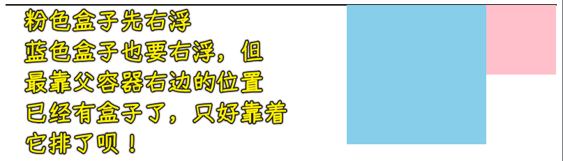
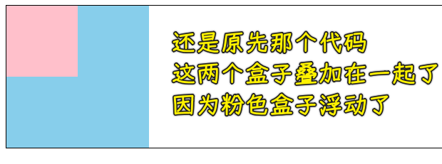

### ✍️ Tangxt ⏳ 2021-10-01 🏷️ CSS

# 10-浮动样式详解、浮动特性注意点

## ★浮动样式详解

在前面的小节当中，我们学习了盒子模型，从中可以知道**盒子模型就是控制元素的尺寸**。

那么我们接下来要讲的这个浮动就是非常常见的**一种控制元素位置的手段**。

### <mark>1）元素被浮动会发生什么？</mark>

首先我们来对浮动做一个简单的了解，当一个元素被浮动时，会脱离文档流，根据 float 的值向左或向右移动，直到它的外边界碰到父元素的内边界或另一个浮动元素的外边界为止，它是一种常见的左右布局的一种实现方式。

因为当一个元素它浮动之后，它会向左或者是向右进行排列，所以说可以把我们这个默认的上下排列的布局改成左右排列的布局，这就是浮动的作用。

这里大家可以发现，有一个词叫「脱离文档流」，所以说它左右排列就是利用这样一个特性来实现的。

### <mark>2）脱离文档流是啥？</mark>

那什么叫做脱离文档流呢？我们可以先了解一下文档流。

文档流是元素在 Web 页面上呈现的一种方式。其实就是按照这个元素排列的默认方式去排列，也就是我们正常的文档流。

那脱离文档流就可能不按照正常的排列了，可能就会出现其它的排列方式。所以说这个浮动就是利用了这一点。

接下来我们了解一下正常文档流以及脱离文档流元素会怎样。

#### <mark>1、正常文档流</mark>

我准备了一张图，大家可以看一下：

左边的这张图，其实就是我们正常的去排列两个块级盒子，大家可以看到，这时候它就是上下排列的，在前面我们讲过这个块级盒子的一个排列方式。

我们是以一种这个俯视的角度去看这两个盒子。其实这两个盒子我们现在是看不出它的一个层级关系的，我们现在把它放平，大家可以看到右边这张图，这是我们换另外一种角度去观察这两个盒子，可以发现这两个盒子的一个层级高度是相同的。

#### <mark>2、脱离文档流</mark>

那接下来我给这个块 2 加了一个 `float` 浮动。这时候大家再来看右边这张图：

你就会发现这个块 2 其实已经浮起来了，它现在已经跟块 1 不在同一个层级，只不过我们用户在看网页的时候是看不出来这种感觉的，因为我们看的都是左边的这张图的一个效果，就算块 2 浮起来了，我们也感知不出来。

实际上，大家可以想象一下，真正浮动之后，其实它是类似于我们右边这张图的这样一个形式，这就是浮动的特性，浮起来之后，它跟正常在下面那一层的一个排列是不一样的。

### <mark>3）代码演示</mark>

接下来我们通过代码的方式来给大家详细的演示一下。

#### <mark>1、正常文档流</mark>

这两个盒子默认就是在正常文档流下，然后就是上下排列的，从页面效果可以看到，他们把`body`给撑开了，因为属于他们都属于`body`的内容，所以这会把`body`给自动撑开，你可以看到这个黑色的边框是它的`body`的边界

#### <mark>2、脱离文档流</mark>

💡：浮动影响了其它元素

那接下来我们给这个粉色的小盒子加一个左浮动，我们来看一下。

大家可以发现就会出现这样的效果，首先我们要知道的就是粉色的盒子和蓝色的盒子，现在他们不在同一个层级下面，也就是说粉色的盒子是高于蓝色盒子这个层级的。

那这个浮动的元素它浮起来之后会按照怎样的一个排列方式呢？我们选择是左浮动，就会按照父容器的最左边进行排列。如果说现在我们把它选择这个 `right` 右浮动的话，它就会沿着父容器靠最右边进行浮动。

大家可以看到这样的效果：

我们切换回「左浮」。**当这个浮动元素浮起来之后，其实已经脱离了正常文档流了**，而正常文档流现在只有什么呢？只有这个蓝色的小方块，所以说这个`body`里现在的内容就只包含这个蓝色小方块儿。那这样的话，我们的蓝色小方块儿把它撑开，就会显示这样一个高度，并且浮动元素浮起来了，它**已经不占正常文档流的一个位置**了，所以说蓝色小方块儿就会上去，让它形成这种叠加的效果。大家可以想象一下，他们现在已经不在同一个层级上了，这就是浮动的特性。

接下来我们再来看。

💡：两个盒子都浮动

我现在给我们的这个`box2`也来加一个浮动，也是选择左浮动：

可以看到这个蓝色的盒子，这时候就会排列到粉色盒子的右边。这是为什么呢？这就是浮动的特性。**当它浮动之后发现在它的同一层级上还有浮动元素的话，它就会挨着这个浮动元素进行排列**。

> 想象在你周围，突然有一个人飞起来了……第一个飞起的人会吸引第二个飞起的人

💡：正常文档流没有了内容

我们发现这两个盒子都已经浮起来了，那这说明是不是正常文档流下就没有内容了呢？

所以说正常文档流下没有内容，那我们的这个`body`自然也就闭合了，大家从图中可以看到，其实现在`body`就形成了一条线了，因为它里面没有内容，没有高度撑不开的，就产生这样的现象。

💡：高度塌陷

这种虽然实现了左右布局，但是实际上我们的父容器其实现在已经撑不开了，这属于一种俗称叫**高度塌陷**的问题。而这种高度塌陷的问题一般我们是需要解决的，通过**清浮动**的方式可以解决这个问题，所以说浮动还是会有很多这个影响的。

其实在现代布局当中，也就是我们下个大章节要讲的弹性布局是没有这个问题的。当**弹性布局当中实现左右布局的时候是不会出现这个高度塌陷的问题**。但是浮动会产生这个问题，因为它已经脱离了正常的文档流，这个大家可以先知道一下。

那接下来我们再来看，我们假如说把这两个都改成这个右浮动，我们想象一下，第一个盒子就会沿着父容器先靠右，然后第二个盒子也会沿着父容器靠右，但是它发现右边已经有一个盒子，它就会沿着这个右边的盒子排列，所以这就会形成这样的效果：

简单的，我们可以发现利用这样的一个浮动，我们就实现了这个左右布局。

💡：为什么要清理浮动？

还要注意的就是要清浮动。不清浮动的话，比如说我们在底下写点内容，大家可以发现这个内容，你会发现：

为啥会这样？因为现在`adadadad`所待的这个地方是正常文档流，而我们这两个盒子已经脱离文档流，这就会**造成一些布局的问题**。所以说清除浮动也是我们必须要掌握的一个方式，也就是说**你要使用浮动，那你就必须要掌握这个清楚浮动的方式**。

### <mark>4）清除浮动</mark>

接下来我们来看一下常见方式有哪些？

我们可以看到常见的清除这个浮动的方案有以下几种：

比如说我们可以用这个`clear`属性，用`clear`其实是清除我们这种上下关系的这个元素的。而我们下面几种方式是可以清除这个嵌套的。

#### <mark>1、两个元素是上下关系</mark>

我们先来看一下上下的。

我们怎么样才能不让它出现这种叠加，还是保持这个原来的位置（上下那种位置）呢？我们可以用这个属性 `clear` ，然后我们选择这个`left`这就表示清除左浮动`box1`有左浮动，那我底下这个盒子就是清楚左浮动`clear:left`，大家可以看到，这个蓝色它就下来了：

虽然说`box2`的位置不会受影响了，但是实际上这个粉色盒子还是在比较高的层级上，而这个蓝色的小盒子还是在底下这个层级上，只不过我们看的时候是看不出来，因为我们是俯视，大家一定要想一想我刚才 PPT 当中的那个截图，在那张图当中，你要想这个脱离文档流，其实它就是浮起来了这样一个感觉。

> 人群中我排着队，突然我前面那个人飞起起来了，于是我就自动向前走，占据了他底下的那个位置，但有人对我施法了，这人告诉我「不要让自己受到这人飞起来的影响」，于是我又退回来了！ -> 不要让浮动影响自己！

注意，如果说现在这`box1`第一个盒子选择的是右浮动，那我们对`box2`进行清左浮动可以做到吗？

可以发现这并不可以，也是说当前面这个盒子做了右浮动的时候，我清左浮动是没有任何意义的，我们应该对应的是去清理右浮动这样才行。

可以看到，蓝色盒子又下来了。

有时候我们不想让我们的这个清浮动这么麻烦的话（就是`box2`的清理要根据`box1`是左浮还是右浮来手动改变`clear`的值），所以我们可以在这选择一个`both`值。 `both`的意思不管你`box1`是左浮动还是右浮动，我都可以给它进行清理，也就是我们左右都清理这样的一个意思。这样一来的话，不管我们上面的这个`box1`是选择 `left` 还是选择 `right` 的，我都可以很好的让`box2`能够下来。

这是我们这种上下关系的这个节点或者是标签如何来清理浮动。

#### <mark>2、两个元素是嵌套关系</mark>

我们接下来再来看一下我们的嵌套，如果在嵌套当中，那我们又是如何来清浮动的呢？

我们现在把这个上下结构稍微改一下，比如说给它们做成一个嵌套的，`box1`嵌套了一个`box2`

我们给`box2`一个左浮动，加上左浮动之后你会发现这就跟刚才看到那个`body`的效果是一样的，也就是折叠起来了，因为里面没有内容了，内容已经浮起来了

所以这会影响到什么呢？

假如我们`box1`后面有内容，比如说这边写一堆内容的时候，那它肯定会跑到**不确定的位置**：

我们怎么能够让这个父容器能够撑开，也就是不出现这种高度塌陷的问题呢？

💡：BFC

这里我们的解决方案就是可以选择这个 BFC，当然，BFC 咱们后面会有专门的图文给大家介绍什么是 BFC ，利用 BFC 我们是可以去清除这个高度塌陷的问题的。在这里我们就先知道一下，咱们后面可以去了解一下。

💡：空标签

我们看一下第三种方案：空标签。

这个空标签其实是我们利用了刚才的那个特点，也就是假如我在`box1`这里面写了一个内容：

你会发现这个空标签就可以把`box1`给撑开了。

为什么会这样呢？

这个跟刚才是一样的，因为这个 `box2` 和这个`bbbbbb div`现在是同一个层级这样的上下关系，而我现在对这个`bbbbbb div`清除浮动，那就相当于是`bbbbbb div`是不会跑到`box2`下面的，而是会跑到正常的位置，那一旦它跑到正常位置的话，大家会发现这个`bbbbbb div`跟 `box1` 是什么关系呢？他们都属于正常文档流。所以一旦在正常文档流下，那必然会把`box1`的高度给它带出来，也就是给它撑开，`box1` 的高度是由我们这个跟它同一个层级（文档流一个层级）的这个`bbbbbb div`来决定的，所以说`bbbbbb div`在这下面，那自然能把`box1`撑开。

> 高度和位置……`bbbbbb div`没有那样的高度，但它所处的位置也是能撑开`box1`的，就像是告知`box1`「你里边有个不在同一层级的盒子，它的高度是`100px`，所以你的高度得撑开`100+`」

如果你不能理解，那就再想一想刚才那个把`body`撑开的例子，所以说我们这时候我们这个空标签的作用也是一样的。

那为什么说是「空标签」这个「空」呢？

因为我们只是要它把`box1`给撑开，至于内容无所谓，我们把它内容清空：

可以看到，这就是个空标签，它就可以做到把高度给它撑开的这样一个现象，我们就俗称「**空标签**」。

💡：使用伪类

当我们每次都去利用这个空标签去清除这种嵌套浮动的时候，这会有一个问题，那就是每次都要写一个多余的标签儿，这样的话，这体验是非常不好的。

所以说各大公司对于清浮动这一块儿，会选择更加灵活的叫`after`伪类的方式。

其实这个`after`伪类的这种写法是我们空标签儿的一种加强版的写法。它的原理其实也是利用了这样一个空标签去清。但是咱们不是自己去写标签，而是通过我们的`after`伪类的方式，往里去添一个类似于空标签的这样一个容器，然后利用它去清除浮动。

接下来给大家进行演示。

伪类可以帮我们往一个节点的标签的里面添加内容。

为啥清除浮动不起效果？因为咱们刚才写的这个空标签，它是一个块级盒子。而我们这个`after`类往里添的这个内容，它其实是个内联盒子。**`clear:both`这种清浮动，它只能针对块级盒子**，对于内联盒子，它是不起作用的。所以我们这里要想办法把这个内联的盒子给它转成一个块盒子，让`clear`生效。因此我们再添加一个`display:block`，`display:block`这句话的含义就是把一个当前的盒子给它变成一个块级盒子。

既然已经变成块级盒子之后，那我们这时候`clear:both`就会生效，那自然我们这个`box3`就会下来了：

还有这个`bbbbbb`内容是没有用的，所以我们一般就给`content`一个空字符串`''`就行了：

所以这也是通过这种伪类的方式创建了一个空标签儿在里面，只不过这个是通过 `class` 自动的去往里添的，我们就**不用手动去添个空标签**了，所以就完成了清理这种嵌套的浮动，即让父容器能够撑开而不出现这种高度塌陷的现象，这保证了什么呢？**保证了下面的布局是不受任何影响的**。

---

### <mark>5）总结</mark>

这基本上就是我们该如何进行浮动以及出现这种高度塌陷我们又是如何来清理浮动，这基本上就是这样的一些操作方式了。

当然，我们这里也不会给大家把这个东西讲得再细了，为什么呢？因为我们只是**对这个布局浮动有了一些大概的认知就可以**了。因为我们更重要的是要学会现代化布局当中的弹性布局和网格布局。因为**在弹性布局和网格布局当中，其实已经把咱们这种浮动所带的一些问题通通都已经给解决了**。像这个塌陷问题，在弹性的布局当中是不存在的。

所以我们侧重点还是我们的下一章和大下一章。这一章我们主要是对一些基本的传统的 CSS 的尺寸和位置，有一定的认知，了解了解就可以了。我们一会来看一下浮动的特性。

## ★浮动特性注意点

接下来我们来看一下浮动具备哪些特性？并且我们要如何注意它们呢？

### <mark>1）块级盒子浮动不能插队，内联盒子浮动看上去可以插队</mark>

先来看第一个。

第一个就是浮动的元素只会影响后面的元素，并不会影响到我们之前定义的元素，我们一起来看一下。

准备三个盒子，只对中间的这个盒子进行浮动：

大家可以看到，其实`box2`浮起来之后只会对后面的元素进行影响，后面的元素就会上来，因为`box2`不占空间了，但是`box2`并不会影响到之前的元素，也就是说之前的元素并不会受到任何影响。

这就是我们第一个要注意的点，即只会影响后面的，不会影响到之前元素的一个布局，也就是粉色盒子不会受到任何影响。

### <mark>2）文字不能无视浮动元素，因为浮动因图文混排而生，其设计就这样</mark>

那么接下来，我们来看第二点。

第二点当中就是**文本不会被浮动元素覆盖**，接下来也是一样，我们给大家演示：

给`box3`添加点文字内容，可以看到这个文字其实会跑到外边，并没有被我们浮动的盒子给挡住，透过这个现象，所以说我们这个盒子是可以有上下关系的，但是盒子里的文字其实并不会跑到我们的这个下边，而是跑到了它的侧边。

这是为什么呢？因为当初设计浮动这个属性的时候，其实主要就是用来实现这种图文混排的，而图文混排当中的特点就是我们的文字要围绕着图进行排列，所以说设计的时候就没有把文字做到底下，而是把文字给它显现在我们的侧边，这样的话是非常容易实现这种图文混排的效果。

比如说我们再加一些文字，大家就可以看到这些文字，就会在我们的浮动的元素的周围进行排列，排列出这样一个形状：

形成一种图文混排的效果。这个大家可以了解一下。

### <mark>3）不给块级盒子宽高，内容决定它的宽高，当然，你也可以设置宽高</mark>

接下来我们看一下第三点。

第三点就是**具备内联盒子特性，也就是宽度由内容决定**。

这是什么意思呢？我们来看一下。

回顾块级盒子的特性：不给盒子加宽，那它的宽就会默认跟父容器的宽相同

接下来对这个`box`盒子加上一个左浮动：

可以看到，这个浮动的元素它的宽度不写的话，其实它会跟内容走，即具备内联元素的特性。

### <mark>4）内联盒子宽高不起作用？让我用浮动大法</mark>

接下来我们来看下一个特点。

下一个特点就是具备块级盒子特性，就是支持所有样式。

这个我们也给大家演示一下，我们来看一下。

我们知道`span`是一个内联的元素，我们给它宽高，它是不支持的，这个前面咱们也讲过，那我们现在对这个盒子或者说这个内联元素进行一个浮动。

> 查看了这个内联盒子浮动的`display`属性，发现它是个`block`

可以看到，浮动后的内联盒子，它的宽高居然就支持了。

总之，当你把浮动加给一个内联盒子的时候，它其实是可以让这个盒子的样式生效的，即具备这个块的特性。而如果一个块加`float`之后，它可能会具备内联的特效，这些现象大家也可以去了解。

### <mark>5）虽然你浮动的盒子是块，但你还是不能独占浮动一行的，一行放不下，那就换行呗</mark>

接下来看一下还有什么样的一个要注意的点。

最后就是浮动的元素如果说太多的话，比如一行放不下，那它其实是会折行的这样一个特点。

> 为了能够看到它们盒子之间的大小间隔，咱们给它们加一个黄色的小边框。

为啥要加`border-box`？

可以看到利用浮动我们也是可以做这种列表的一个展示方式，就是有 X 轴、Y 轴的这种列表展示。

这种列表展示，其实用浮动可以做，当然，也可以用我们后面章节当中的网格来做，这更加方便一些。因为浮动做这种多行多列的话，尤其是当它出现间隔的时候就不太好做了。

比如说我们把`border-box`去了，这时候这个容器它已经放不下三个盒子了，它就会折下来，也就是说这个空隙什么的控制起来是非常不方便的。

后面我会给大家讲网格做这种多行多列的布局，其实会更加的简单一些。

这里咱们可以了解一下浮动是会折行的这样一个特性。

---

基本上大家就把这个浮动的几个比较重要的特性都给掌握了，而在布局的时候注意一下细节就可以了！