### ✍️ Tangxt ⏳ 2021-10-03 🏷️ CSS

# 11-定位样式详解、定位特性注意点

## ★定位样式详解

在本小节当中将给大家介绍另外一种控制元素位置的方式，就是我们的定位。

定位要比我们上一小节讲的浮动要更加的灵活，对于我们的位置控制更加的强大。接下来我们就来看一下定位是怎样来进行操作的……

### <mark>1）`position`属性是什么？</mark>

在 CSS 当中，`position`属性用来指定一个元素在文档中的一个定位方式，其中这个 `top` `right` `bottom` 和 `left` 属性则决定了该元素的最终位置。

### <mark>2）有哪些定位方式？</mark>

我们的定位方式，其实它的分类也是比较多的。我们可以看到主要有这样几个可选的值：

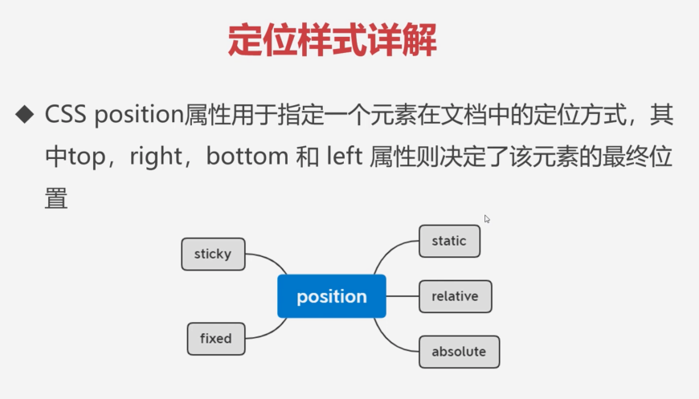

💡：`static`

其中我们的 `static` 它其实就是静态的，比如说我们的默认情况，当我们不给元素加任何定位方式的时候就是我们这种默认的 `static` 。

💡：`relative`、`absolute`、`sticky`、`fixed`

可用于定位的选项，主要有相对定位`relative`，`absolute`绝对定位以及我们的粘性定位`sticky`，还有我们的`fixed`固定定位这样几个选择。

接下来我们就分别来看一看这几种定位的方式是怎样的。

### <mark>3）相对定位及特性</mark>

#### <mark>1、概述？</mark>

先来看我们这个相对定位及它的相关特性。

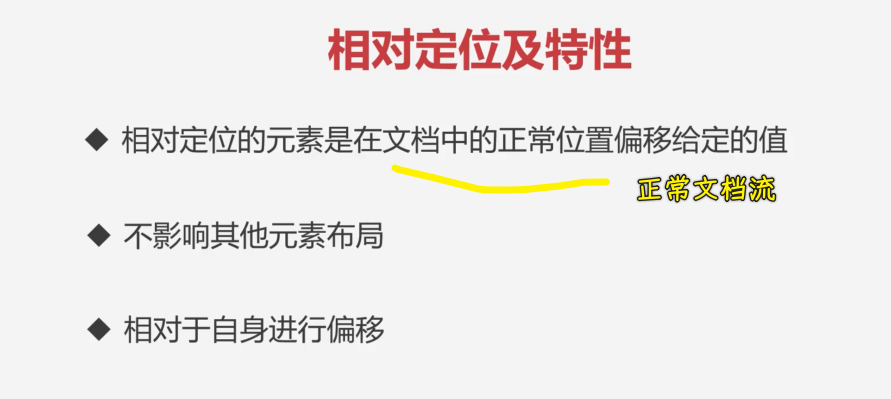

**相对定位元素是在文档中的正常位置偏移给定的值**，这就是相对定位的一个概念。

接下来我们主要来看一下相对定位具体是怎样的。

#### <mark>2、特性</mark>

💡：还在正常文档流，不会脱离文档流

首先大家可以看到这个概念它说了是**在文档中的正常位置偏移给定的值**，也就是说它在**正常文档流下**。所以我们这里先来给大家演示一下这个相对定位。

1. 创建三个盒子`div` -> `box1~3`
2. 给上宽高和背景色

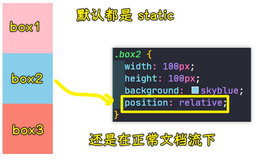

给中间的`box2`加一个相对定位。当我们给`box2`加上相对定位之后，你会发现它并不会影响到其它元素，因为它就在正常文档流下。这个大家得注意啊，它跟浮动不一样，相对定位它不会脱离文档流，它还是在正常文档流下。所以说**加上相对定位的元素，其实不会对其它元素造成任何的影响**。这是它的第一点。

接下来我们看一下第二点。

💡：不影响其它元素的位置

第二点就是不影响到其它元素布局，这里我们不影响到其它元素布局，在上个截图中可以看到，因为它在文当流下，所以说它不会影响到其它元素。

接下来我咱们再看。

💡：相对于自身四个角进行偏移

它是相对于自身进行偏移的，也就是说我们这个`00`点在哪呢？坐标 `00` 点是在方块的它的左上角。

我们给`box2`一个`left: 50px`，这其实就是相对于它自身向右移动了 50 个像素，再加`50px`，它又移动了。同理，这个 `top` 就是我们的向上的距离，如果也给 `100`，那就说明它要向下移动 `100` 个像素，所以它就移到了这个位置上了：

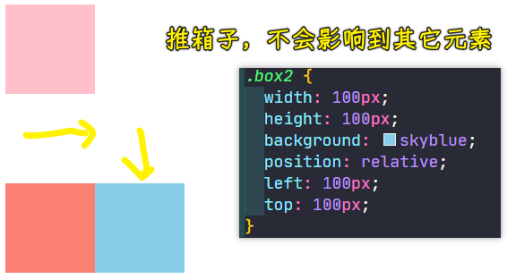

大家可以看到，这时候位置偏移之后，并没有对我们的其它元素造成任何的影响，这就是我们相对定位的特点。也就是说就算你加了偏移，也不会造成任何影响，这跟我们的外边距是不太一样的。

我们换成外边距给大家再演示一下：

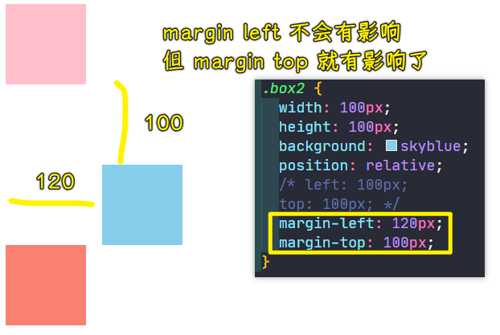

这就是我们相对定位的一个特点了，即不会影响到其它元素，关于相对定位，了解三点应该就可以了，咱们这个相对定位主要就是进行自身偏移，然后不影响其它元素展示特点。

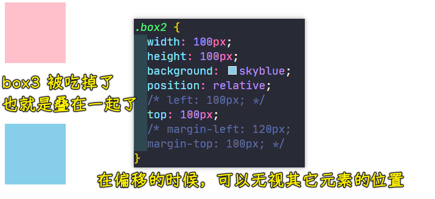

> 即便 `box3` 有内容还是如上图所示的这样被完全覆盖住

### <mark>4）绝对定位及特性</mark>

#### <mark>1、概述？</mark>

我们来看一下绝对定位及特性，这个绝对定位要比相对定位稍微复杂一点。

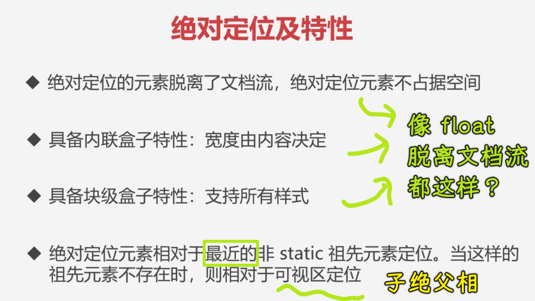

#### <mark>2、特性</mark>

💡：脱离文档流，不占空间

首先这个绝对定位的元素它是**脱离了文档流**，绝对定位的元素是**不占据空间**的。这一点我们先来看一下：

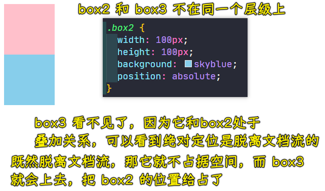

绝对定位是脱离文档流的，相当于是蓝色小方块已经跟我们的另外两个盒子不在同一个层级上了，所以说我们这个`box3`红色盒子就提上来了，也就是说它俩现在是一个叠加关系。

我们可以看到绝对定位的第一点，它是一个脱离文档流的这样一个特点。

接下来我们再来看第二点。

💡：具备内联盒子特性：宽度由内容决定

第二点就是绝对定位的盒子，它跟浮动很像，具备内联盒子特性。宽度由什么呢？由内容决定，我们来尝试一下这是在表示什么意思：

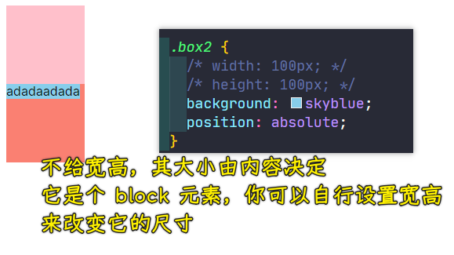

来看一下第三点。

💡：具备块级盒子特性：支持所有样式

它可以让内联盒子支持所有样式，这个跟浮动也是一样的特性，我们也可以来演示一下。

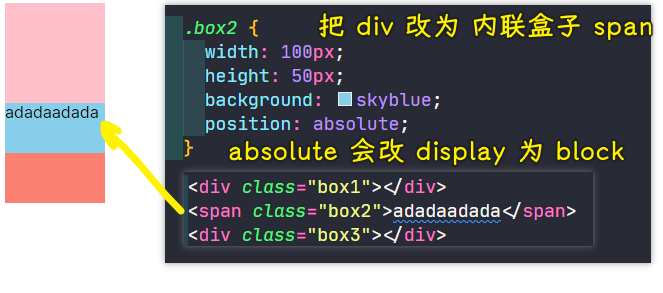

它跟浮动的特性是一样的，它也可以让我们的一个内联盒子，具备所有样式的支持。一旦当`box2`有了绝对定位，注意，这两个特性跟相对定位是没关系的，千万不要混了，这个只是说绝对定位它有这个能力，也就是说脱离文档流的元素，它们的现象是很像的。

💡：为什么会说「子绝父相」？

关于定位，还有一个比较重要的概念就在绝对定位当中：

> 绝对定位元素，它是相对于最近的非 `static` 祖先元素定位的，当这样的祖先元素不存在时，则相对于可视区进行定位。

**这一点是我们绝对定位当中非常重要的一个特性**。那这到底是什么意思呢？咱们来通过代码给大家进行演示。

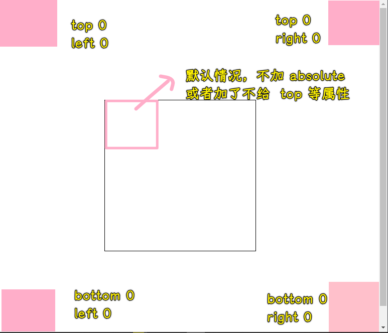

我们这个绝对定位跟相对定位是有很大区别的，就是相对定位它是相对于自身进行偏移的，也就是容器的左上角`00`点位置，而我们这个绝对定位的 `00` 点并不是在这个容器元素的左上角。

那它在哪儿呢？

你自己加上`top`和`left`就会知道了，它是会相对于我们当前可视区域作为`00`点的。

同理，如果说我们选择 `right` 和 `top` 的话，那就会以右上角作为这个起始位置，总之，它是相对于我们可视区域进行位置的控制的。

我们可以做这样一个实验，给`body`加上一个高度或者其它，加一个高度或者其它之后，页面就会出现一个滚动条，你会发现它依然在可视区的右下角，并不会在`body`的右下角。

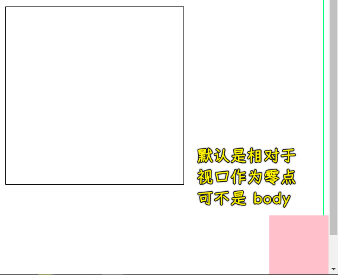

这个大家尤其需要注意一下，这就是我们的第一个特点，也就是说当`box2`它的祖先元素，比如说`box1、body`都属于它的祖先元素，它的祖先元素都没有定位模式的时候，也说非`static`的时候，它就会相对于可视区域进行定位。

接下来我们给这个`box1`加一个非`static`这样一个数值，我们给它加一个`position:relative`。加上这个相对定位之后，你会发现这时候的`00`点是这个`box1`的四个角之一：

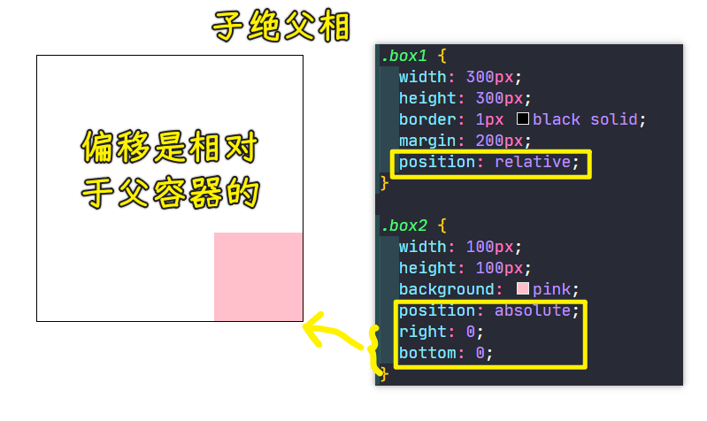

可以看到，`box2`就会相对于祖先元素进行位置的偏移，同理，`left 0 top 0`也是如此，总之，`box2`会相对于有定位模式的这个祖先元素进行偏移。

同理，我们给`body`这个祖先元素加：

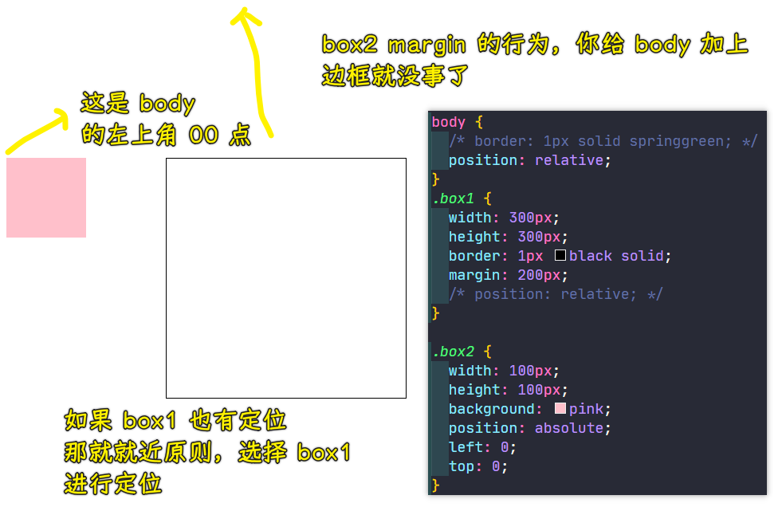

这个就是我们绝对定位的一个特点，有很多布局都是这样的一种方式，也就是说父容器我们一般加相对定位，而里面的子容器我们可以给它加个绝对定位，这样就可以针对这个当前容器进行的偏移来实现一些定位的方式，以此来**做一些叠加的效果**。

---

本节咱们就先把这个相对定位和绝对定位的特性做一个简单的了解。

## ★定位特性注意点

### <mark>1）固定定位及特性</mark>

接下来我们来看一下固定定位及它的特性。

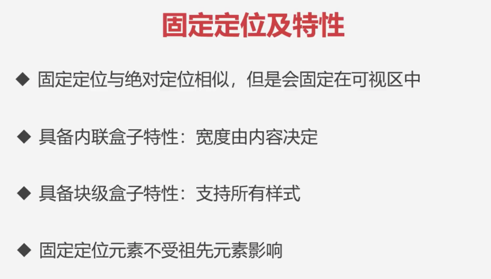

固定定位跟绝对定位非常的相似，但是会固定在可视区中，不会发生位置的变化。

接下来我们通过代码来给大家进行演示。

- 语法：`position:fixed`

我们来看一下固定定位的特点。

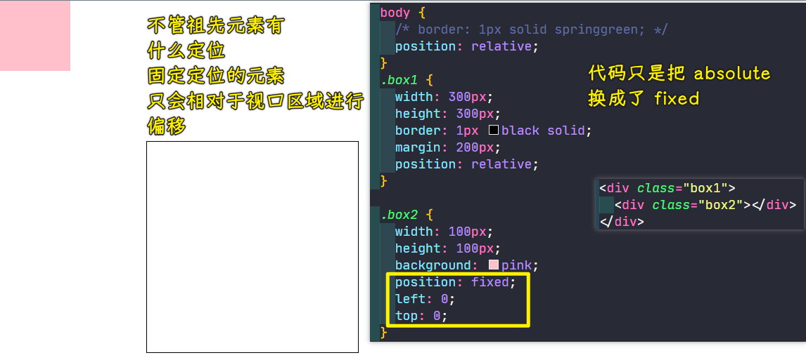

祖先元素有定位这个模式，这时候固定定位会不会受这个定位模式的影响呢？

测试发现它并不会受到定位模式的影响，也就是说固定定位的粉色小方块会以可视区域进行偏移，不管它的祖先元素到底有没有像相对定位、绝对定位或者是固定定位这种模式，它都会相对于可视区域进行偏移，这是固定定位的特点。

固定定位除了这个跟绝对定位不同以外，像其他的很多现象都跟我们的绝对定位很像。

比如说固定定位，它也是脱离文档流的，并且它也是具备可以让一个块的宽度能够自适应内容，并且内联的元素是可以支持所有样式的。

> 说白了，`display`都是`block`

这个跟绝对定位都是一样的，不同点就在于我们的这个固定定位它是不会受到祖先元素的影响，并且它是固定在我们的可视区当中的。

当我们滚动条进行拖拽的时候：

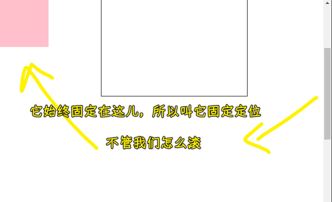

大家可以看到它依然是在我们这个视口左上角地方固定，所以说我们一般叫做固定定位，因为它就定在这儿不动了，它是相对于可视区进行偏移的，不会受到定位模式的影响。这个特点大家也可以去消化一下。

下面我们来看最后一个就是我们的粘性定位。

### <mark>2）粘性定位及特性</mark>

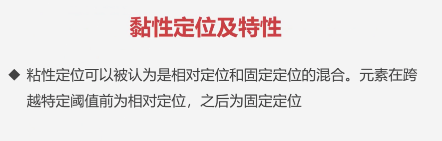

粘性定位可以被认为是和相对定位和固定定位的一个混合。元素在跨越特定阈值前就是一个相对定位，但是一旦跨过这个阈值的时候就会被改为固定定位。

>  `position:sticky`要想生效，`top` 属性或则 `left` 属性（看滚动方向）是必须要有明确的计算值的，否则 fixed 的表现不会出现。

接下来我们通过代码的方式来给大家演示一下我们这个粘性定位。

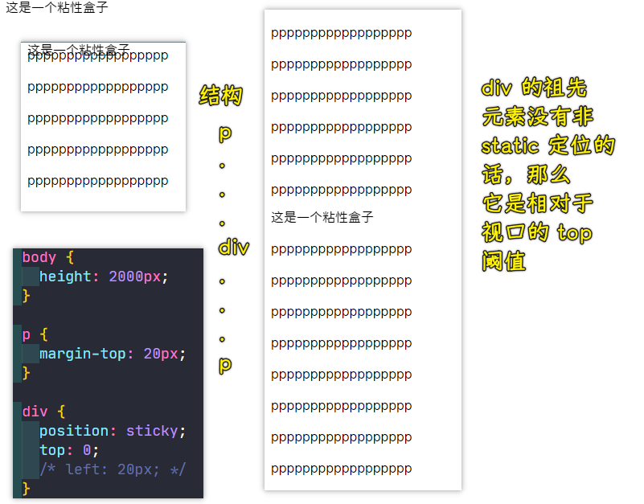

> 与视口的顶点`0`接触时，就会粘贴住

如果祖先元素有非`static`定位：

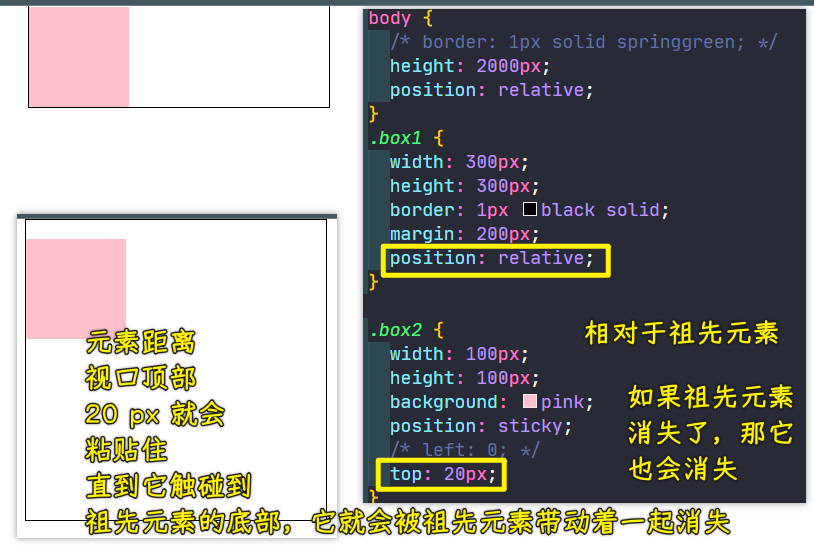

这种效果在网页当中非常常见，就像那种首行冻结，比如说在表格当中，我们的首行冻结的效果就是这样来做的。

如果我们接下来再往回走（滚回去），当它小于或者是没有经过这个阈值的时候，它就会又改回我们的相对定位。

总之，当跨过某个阈值的时候，就会变成固定灵位。但是没到这个阈值的时候，咱们就是一个相对定位，这就是我们这个粘性的一个用法。

关于粘性定位，目前我们也简单的介绍完了。

---

目前我们把这个相关的这些定位的方式都给大家介绍了。

### <mark>3）`z-index`</mark>

最后我们再来聊一个关于定位相关的一个属性，就是`z-index`。

💡：是什么？

`z-index`它其实是可以改变我们定位叠加元素的层级关系的。

💡：兄弟结构

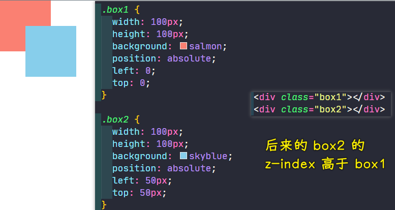

> 它们的`z-index`都是`auto`，但后来的层级始终高于先来的！

默认情况下后写的一个元素，它的一个层级肯定是要高于先写的，当然我们可以进行调整，通过`z-index`它是可以调整层级的。

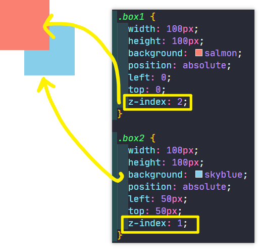

它们的`z-index`默认是`0`，谁的`z-index`数值越高，谁就会越在上边，一样的话，就看元素结构的先后书写顺序

这就是我们`z-index`的一个基本用法。

💡：嵌套结构

话说，如果出现这种嵌套结构的话，它们的层级关系又会是怎样的呢？

这个就稍微特殊一点，我们也可以作为了解。

父容器没有设置`z-index`：

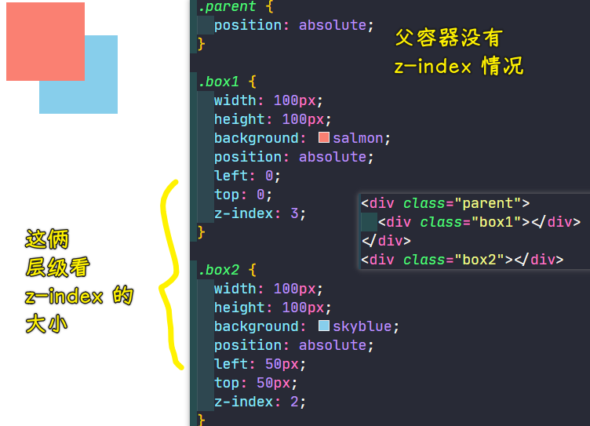

父容器设置了`z-index`为`1`：

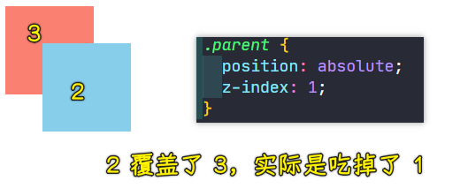

💡：总结

我们基本上来总结一下：

当我们父容器`parent`，如果说它有`z-index`的时候，`box2`要先跟父容器进行比较，`div.parent`的优先级要高于里面的子元素`box1`，所以我们要看的是这个`parent`和`box2`之间的`z-index`关系。

如果说我们的`parent`是没有`z-index`的话，这个时候我们的`box2`就可以跟`parent`里面的这个子元素的`z-index`进行比较了。

它们关系就是这样的！

所以说父容器有，那就先跟父容器进行比较，父容器没有的话，我们再跟子容器进行一个比较，这是我们`z-index`的一个特点。

当然了，这作为了解即可，一般很少这种嵌套的，基本上就是同层级的这种的经历比较多一点。

---

关于咱们的定位的内容都介绍到这里，希望同学们能够去实践一下，把我们的代码运行，然后去改一些数值，看一下他们的一个变化是怎样的。那我们这一小节就讲到这里。

## ★了解更多

➹：[杀了个回马枪，还是说说 position:sticky 吧 «  张鑫旭-鑫空间-鑫生活](https://www.zhangxinxu.com/wordpress/2018/12/css-position-sticky/)

➹：[深入理解 CSS 中的层叠上下文和层叠顺序 «  张鑫旭-鑫空间-鑫生活](https://www.zhangxinxu.com/wordpress/2016/01/understand-css-stacking-context-order-z-index/)