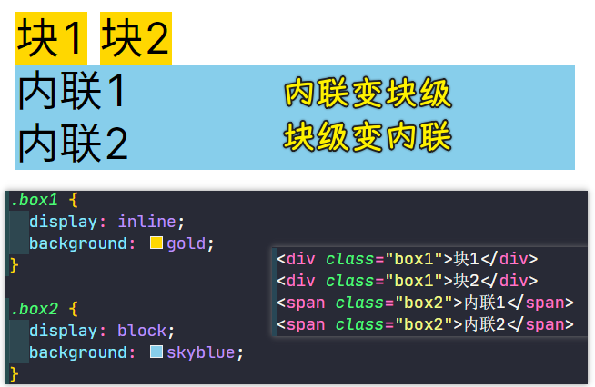

### ✍️ Tangxt ⏳ 2021-10-03 🏷️ CSS

# 12-详解 display 属性

## display 属性的作用

在 CSS 中 `display` 属性表示“显示框类型”，即不同的盒模型。简单来说，可以把块级盒子转成内联盒子，也可以把内联盒子转成块级盒子。

改变盒模型类型：

可以看到，`div` 具备了内联盒子的特性，而 `span` 则具备了块级盒子的特性。当然 `display` 远比这些复杂的多，像我们后面章节中讲到的弹性布局、网格布局等都是跟 `display` 有着紧密关系。

`display`属性大概可分为以下几类进行学习：

## display-outside（外部值）

外部值就是定义自身元素的外部表现，而不影响其内的子元素。
- `block`：表示块级盒子 像 `
`、`
`等默认就是块级盒子。
- `inline`：表示内联盒子 像 ``、`<i>`等默认就是内联盒子。
- `run-in`：实验性质的属性，浏览器支持不好。Chrome 从 32 版本开始就将这个属性给移除了

> 对外指的是兄弟盒子之间的关系是怎样的，如两个`div`兄弟，它们上下排列，独占一行，两个`span`兄弟，它们左右排列

## display-inside（内部值）

和外部值相反，内部值就是定义子元素布局的。像 flex、grid 这些设置都会影响到子元素的布局形式，后面章节将详细的对 flex 和 grid 进行讲解。

- `flow-root`：一个 BFC 的块级盒子（注：BFC 后面小节会讲解）。
- `table`：带有内部表格布局的块级盒子。
- `flex`：带有内部弹性布局的块级盒子。
- `grid`：带有内部网格布局的块级盒子。

## display-listitem（列表值）

`list-item`属性值是生成一个容纳内容和单独的列表行内元素盒的块级盒子，目的是为了用 div 去代替`<ul> <li>`标签之类的，`<li>`元素默认就是`list-item`;

## display-internal（属性值）

> 主要为`display: table-*`, `display: ruby-*`这些属性

一些和 table 布局、ruby 搭配一起控制页面布局的属性值，因为使用的比较少，这里不展开探讨。

## display-box（显示值）

- `contents`：只影响其内容的样式生效，比如：字体大小、文字颜色等；但是像背景色、边框是不会生效的。
- `none`：从盒子树中移除，包括其所有后代元素。 

## display-legacy（混合值）

- `inline-block`：对外表现成内联盒子，对内表现成块级盒子
- `inline-table`：对外表现成内联盒子，对子元素表现成表格盒子
- `inline-flex`：对外表现成内联盒子，对子元素表现成弹性盒子
- `inline-grid`：对外表现成内联盒子，对子元素表现成网格盒子

下面通过代码来演示一下`inline-block`的特性：

可以看到，盒子即具备了块级盒子的特性（支持宽高）又具备了内联盒子的特性（横向排列）。 关于`inline-flex`、`inline-grid`的特性会在相关章节中进行讲解。

## global（全局值）

- `inherit`：继承父元素的 display 属性
- `initial`：不管父元素怎么设定，恢复到浏览器最初始时的 display 属性
- `unset`：`unset` 混合了 `inherit` 和 `initial`。如果父元素设值了，就用父元素的设定，如果父元素没设值，就用浏览器的缺省设定。

## 了解更多

➹：[display-outside - CSS（层叠样式表） - MDN](https://developer.mozilla.org/zh-CN/docs/Web/CSS/display-outside)

➹：[CSS display 的多种写法 - SegmentFault 思否](https://segmentfault.com/a/1190000023746893)