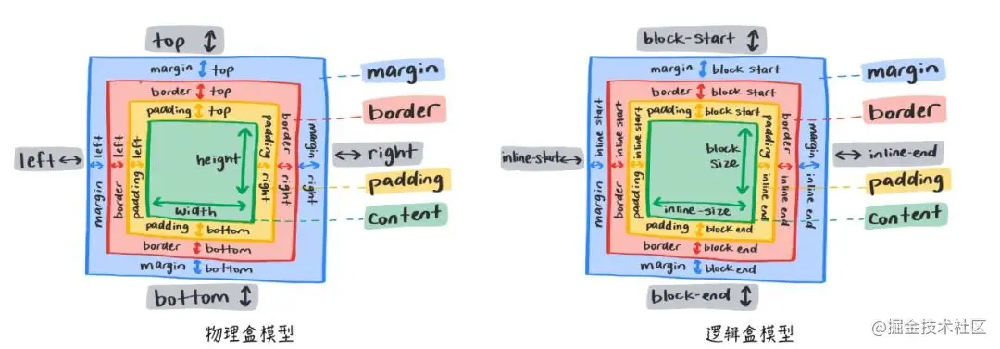

### ✍️ Tangxt ⏳ 2021-10-04 🏷️ CSS

# 13-书写模式与逻辑属性

## 书写模式

绝大多数国家的阅读方式都是从左到右进行的，但是也有一小部分国家的阅读方式，可能是从右向左或从上到下。比如阿拉伯国家就是从右向左进行阅读的，所以在网页排版的时候，就要考虑到这个情况，尤其是做国际站的同学们。

沙特阿拉伯政府截图：

书写模式即 `writing-mode` 属性，可以帮助以上下阅读的国家去展示网页内容。它定义了文本水平或垂直排布以及在块级元素中文本的行进方向。

可选值有：
- `horizontal-tb` 水平方向自上而下的书写方式
- `vertical-rl` 垂直方向自右而左的书写方式
- `vertical-lr` 垂直方向自左而右的书写方式
- `sideways-rl` 内容垂直方向从上到下排列
- `sideways-lr` 内容垂直方向从下到上排列

`writing-mode` 属性：

注：目前 `sideways-rl` 和 `sideways-lr` 的兼容性并不是很好。

## 逻辑属性

如果一套代码想实现国际化，处理不同国家的排版方式时，就会导致无法实现。代码如下：

> 这是从左到右阅读

接下来给 `body` 添加垂直方向自左而右的书写方式，可以发现布局出现了混乱，`height` 属性依然只针对高度，而 `margin-left` 属性也依然只针对左间距。

> 这是从上到下阅读

那么如何更好的处理不同的书写模式呢？就要配合逻辑属性了。逻辑属性是从逻辑角度控制布局，而不是从物理、方向或维度来控制。

简单来说，物理属性和值指的是 `width、height、left、top、right、bottom` 等值；而逻辑属性和值指的是 `start、end、inline-start、inline-end、block-start、block-end` 等值。其中 `block` 表示垂直方向，`inline` 表示水平方式，在不同的书写模式下，`block` 和 `inline` 所代表的方向是会发生变化的。理解逻辑属性对于后面章节中理解弹性布局和网格布局也有非常大的帮助。

> 把`text-align`、`margin-lefte`、`padding-left`等称为物理属性是因为它们与你看到的屏幕紧密相关，左永远是左，不管文本流动的方向如何

💡：物理盒模型和逻辑盒模型？

下面用逻辑属性和值修改一下之前代码中出现的问题。

> 这是正常的从上到下阅读

下面再举一个逻辑属性例子

注：`dir` 属性可以设置元素的显示方向，是从左往右 (`ltr`)，还是从右往左 (`rtl`)，当设置 `auto` 时会自动根据当前语言决定排列方向，`dir` 属性非常适合那些从右向左进行阅读的国家，例如：阿拉伯语，波斯语，希伯来语等。

## 了解更多

➹：[CSS grids, logical values, and writing modes - CSS: Cascading Style Sheets - MDN](https://developer.mozilla.org/en-US/docs/Web/CSS/CSS_Grid_Layout/CSS_Grid_Logical_Values_and_Writing_Modes)

➹：[理解 CSS 的逻辑属性和值](https://www.w3cplus.com/css/understanding-logical-properties-values.html)

➹：[Flexbox 布局中不为人知的细节 - 掘金](https://juejin.cn/post/6938292463605907492#heading-0)

➹：[CSS - 流程布局和写作模式 - 详细说明正常流的行为的 CSS 2.1 规范采用水平书写模式。布局属性在垂直书写模式下应以相同的方式工作。在本指南中，我们研究了在不同文档编写模式下使用流布局时的行 - 中文](https://runebook.dev/zh-CN/docs/css/css_flow_layout/flow_layout_and_writing_modes)

➹：[dir - HTML（超文本标记语言） - MDN](https://developer.mozilla.org/zh-CN/docs/Web/HTML/Global_attributes/dir)