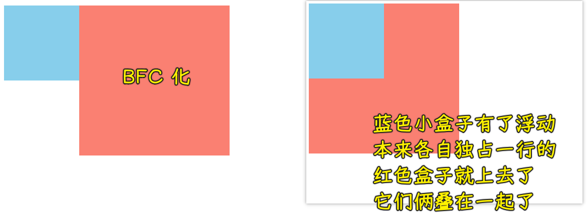

### ✍️ Tangxt ⏳ 2021-10-04 🏷️ CSS

# 14-BFC 块级格式化上下文

## 普通流


## 浮动


## 绝对定位


## FC

FC 的全称是：Formatting Contexts，是 W3C CSS2.1 规范中的一个概念。它是页面中的一块渲染区域，并且有一套渲染规则，它决定了其子元素将如何定位，以及和其他元素的关系和相互作用。

## BFC


我们可以把 BFC 看作是页面中的一块渲染区域，它有着自己的渲染规则，简单来说，BFC 可以看做元素的一种属性，当元素拥有了 BFC 这个属性的时候，这个元素就可以看作是隔离了的独立容器，容器里边的元素不会在布局上影响到外面的元素


💡：如何触发 BFC？也就是如何为元素添加 BFC 这个属性呢？


如果元素中有其中任意一个属性，那它将触发 BFC！

💡：BFC 究竟有什么特性以及有什么作用呢？

第一点：BFC 可以避免两个盒子上下外边距重叠 -> 单边距


> 重叠问题，这不是 CSS 的 bug，我们可以理解为一种规范，如果想要避免外边距的重叠，可以将其放在不同的 BFC 容器中

第二点：清除浮动


第三点：阻止元素被浮动元素覆盖




> 红色盒子还是独占一行的


> 两列自适应布局，左边的宽度固定，右边的内容自适应宽度

💡：一个利用了 BFC 的布局


---

以下为老师提供的资料

## BFC 概念

BFC 即 Block Formatting Contexts（块级格式化上下文，应该是块格式化上下文，而不是 Block Level），它是 W3C CSS2.1 规范中的一个概念。它是页面中的一块渲染区域，并且有一套渲染规则，它决定了其子元素将如何定位，以及和其他元素的关系和相互作用。

具有 BFC 特性的元素可以看作是隔离了的独立容器，容器里面的元素不会在布局上影响到外面的元素，并且 BFC 具有普通容器所没有的一些特性。

通俗一点来讲，可以把 BFC 理解为一个封闭的大箱子，箱子内部的元素无论如何翻江倒海，都不会影响到外部。

## BFC 触发条件

满足以下条件之一，即可触发 BFC：

- `float` 的值不是 `none`
- `position` 的值不是 `static` 或者 `relative`
- `display` 的值是 `inline-block、table-cell、flex、table-caption `或者 `inline-flex`
- `overflow` 的值不是 `visible`

下面的 box 盒子就是一个 BFC 独立容器：

``` css
.box {
  width: 100px;
  height: 100px;
  overflow: hidden;
  /* 触发了 BFC，形成独立盒子 */
}
```

## BFC 的应用

在前面介绍盒模型的 margin 时，出现了传递和叠加的问题，这里可以采用 BFC 规范来解决，原理就是让盒子形成一个独立的容器，无论里面的子元素如何折腾，都不影响到外面的元素。

💡：BFC 解决传递问题


💡：BFC 解决叠加问题


💡：BFC 解决浮动高度塌陷

BFC 还可以解决前面浮动遇到了父容器高度塌陷的问题，也就是不管里面子元素是否浮动，都不会因为脱离文档流对容器高度造成影响。


---

在现代布局 flex 和 grid 中，是默认自带 BFC 规范的，所以可以解决非 BFC 盒子的一些问题，这就是为什么 flex 和 grid 能成为更好的布局方式原因之一。

## 一些评论

1. float 为 `left/right` 是子元素本身触发了 BFC，使普通布局流变成了浮动流布局；父级元素因为浮动从而高度塌陷，所以需要 `overflow` 来触发父级元素的 BFC 来重新布局回到普通布局。
2. 理解 BFC 不能只是从字面上的原理去，还需要结合 CSS 属性本身，比如 `position:absolute/fixed` 这些优先级高于 BFC 规则。

💡：`position:absolute` 也会触发 BFC，那么 BFC 又怎么能算作普通流的一种呢？

我也觉得拿普通流来说 BFC 不严谨，浮动和 `position:absolute` 都能触发 BFC 是怎么定义 BFC 是普通流的呢？

💡：BFC 不是在清除浮动，而是在包住浮动元素（`.clearfix`才是清除浮动）

## 了解更多

➹：[带你用最简单的方式理解最全面的 BFC_哔哩哔哩 （゜-゜）つロ 干杯~-bilibili](https://www.bilibili.com/s/video/BV1aZ4y1M7gW)

➹：[10 分钟理解 BFC 原理 - 知乎](https://zhuanlan.zhihu.com/p/25321647)

➹：[经常问到的 CSS BFC 和 IFC 是什么？ - 起源地](https://www.qiyuandi.com/zhanzhang/zonghe/15378.html)

➹：[BFC、IFC、GFC、FFC - xingkongbj-寒松](https://www.xingkongbj.com/blog/css/fc.html)

➹：[为什么这么多人讲不清楚 BFC - 知乎](https://zhuanlan.zhihu.com/p/31857974)

---

➹：[CSS：BFC 块格式化上下文 - 知乎](https://zhuanlan.zhihu.com/p/131402341)