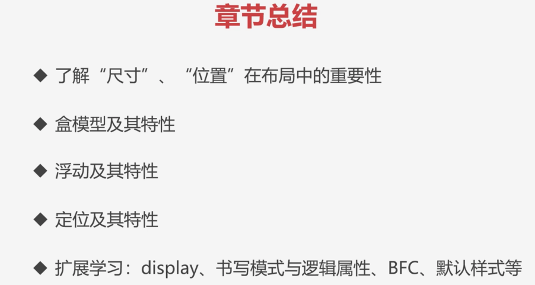

### ✍️ Tangxt ⏳ 2021-10-03 🏷️ CSS

# 16-章节总结

接下来我们对本章节做一个简单的总结。

在本章节当中，我们学习了尺寸、位置在布局中的一个重要性，知道了**我们的排版就是由尺寸位置来决定**的。

我们讲解了盒模型及其特性，也就是说盒模型是由我们的四部分组成的，分别是`content、padding、border`以及`margin`来组成我们的盒模型。

盒模型还分为正常的盒模型以及我们的怪异盒模型。

还有就是我们还对标签进行了分类，比如说有的标签是我们的块级盒子，而有的标签是我们的内联盒子，当然，盒子之间的一个特性是可以进行转换的，这通过`display`属性来搞。

接下来我们又讲了关于位置的一些操作，比如说浮动及其特性，浮动是利用了脱离文档流之后沿着父容器进行排列的方式来实现这个左右布局的，它是我们常见的一种左右布局的方式。不过对于浮动来说，它有一些很大的问题，就是会产生这个高度塌陷、脱离文档流的这样一个情况，造成下面页面的布局产生混乱。所以我们经常要`float`之后，就得清除我们的浮动。

在下一章节当中，我给大家讲的这个弹性布局，也就是更好的一种方式实现左右布局，它比浮动更加灵活，而且也不会有以上浮动所产生的问题。那下一节我们可以好好的去学习一下。

接下来我们再来看一下。

我们还讲解了定位及其特性，通过定位我们可以实现这种叠加效果。比如说两个元素叠在一起的这样的一个布局方式，这种手段在网页当中是非常常见的。而且定位的模式也比较多，还有那种固定定位以及粘性定位可以帮助我们实现一些特殊需求。

最后还给大家学习了一些扩展的内容，包括像 `display`、书写模式与逻辑属性、BFC 以及默认样式等。

其中了解**逻辑属性**对于我们后面学习弹性以及网格都是有帮助的，因为在那些比较重要的布局当中，也会涉及到我们的一个排列的方向，它也分为主轴以及交叉轴这样的概念。

到下一节课的时候，我们到时候再详细的进行学习。这里咱们就简单的先知道一下，**我们这些内容其实是我们作为 CSS 布局来说一个非常重要的基础内容，把这些基础内容打好之后，我们才能够学一些更高级的布局技巧**。那我们下一章节再见。拜拜。
