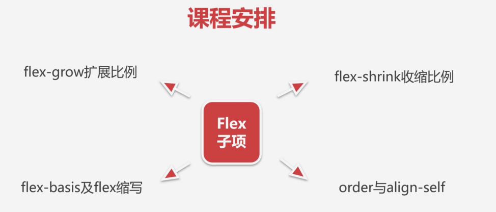

### ✍️ Tangxt ⏳ 2021-10-12 🏷️ CSS

# 17-章节介绍

在本章当中我们将学习 Flex 弹性布局。

这一章的内容**非常重要**，大家先来看一下弹性的一个概念。

### <mark>1）什么是「弹性」？</mark>

简单来说，弹性是一个盒子模型当中的一种新提供的方式，它是一种用于按行或按列布局元素的一维布局方法。元素可以膨胀以填充额外的空间，收缩以适当更小的空间。

简单来说，这个弹性盒子其实是**非常适合做一维布局**的。

所谓一维布局就是我们一行或者是一列的布局。

### <mark>2）一维布局</mark>

接着我们来看一下这种一行或者是一列，其实是在网页当中非常常见的布局方式：

那随着移动端的发展，我们这种一行它可能在不同的分辨率下要表现的不同，同样，这个列也是一样的，在不同的分辨率下，我们这个列也要做一些不同的这个适配。

比如说我们可以看到，像这样的一个行排列：

在比较宽的容器下，我们需要让它等间距的进行变化，那这个就非常适合用弹性布局来做了。

同样我们可以看到在一列当中它现在是等分，但是有的时候我们需求是让中间的一列可能说是需要更长一些，然后整个空间大小是不变的，但是它所占的区域就会更大，做成右侧这种效果。

所以说**这种做一维的一行一列的这种弹性适配，就非常适合用弹性布局来做**。

介绍完我们这种常见的弹性布局之后，我们来看一下我们的案例和课程安排。

### <mark>2）Flex 容器相关的语法和功能以及用它来实现的相关布局</mark>

首先我们学习 Flex 这个容器相关的语法和功能。我们会讲到像主轴与交叉轴的概念、换行与缩写、主轴对齐详解以及我们交叉轴对齐详解。

这些都是我们 Flex 容器的一个非常重要的概念。当这些概念我们通过视频学习完之后，我会给大家安排这个容器的一些常见布局，利用刚才学过的这些语法来实现像内联和块的上下左右居中布局，以及我们不定向的一个居中布局，还有均分列布局以及组合嵌套布局。

这些布局方案都是我们弹性当中常见的布局方案。

课程当中，除了给大家介绍这些用 Flex 实现的方式以外，还会用普通的浮动、定位来实现我们相关的这个布局方案，让大家对比着去学习，能感受出弹性的强大以及「弹性做这样的布局，它的一个优点是什么？」

### <mark>3）Flex 子项相关的功能和语法以及用它来实现的相关布局</mark>

接着课程还会给大家讲到这个 Flex 子项相关的功能语法。比如说我们会讲到这个`flex-grow`扩展比例，这是非常重要的，以及我们的`flex-shrink`收缩比例，还有我们的`flex-basis`以及`flex`缩写这些相关的概念，以及我们一些辅助的功能，像 `order`、`align-self`这样的一些语法，这都是我们子项所有的内容。

当我们把这些子项的这个语法学完之后，也是同样安排了子项的布局，让大家巩固这些子项的用法。比如说给大家讲一下什么是等高布局以及两列与三列布局，我们的这个粘性页脚的布局以及我们溢出项的布局。

对于这些，其实我们也是会给大家用咱们的 Flex 弹性来实现，除此以外，还会用我们的这个普通的 CSS 也会去简单的实现一下，让大家对比的去学习一下咱们为什么要学习弹性？学习弹性给我们带来的优势是什么？

### <mark>4）综合案例</mark>

整个课程还会有一些其它内容。

最后我们会安排这个综合性的案例，就是利用我们学过的这个弹性和我们真正产品当中要做的这个需求结合在一起来做一些综合性的案例。

比如说我们用 Flex 来实现像 swiper 轮播图，还有我们的像知乎导航，还有我们的给大家提供的相关的测试题和练习题，让大家来巩固我们这个章节所要学习的内容。

我们这个课程就给大家先介绍到这里，一会儿，就来跟着我的脚步一起来学习 Flex 弹性布局吧！
