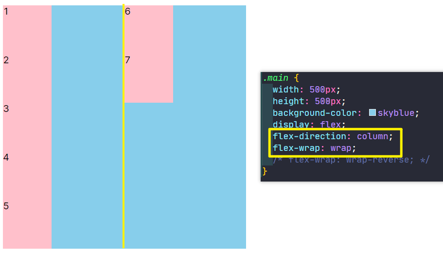

### ✍️ Tangxt ⏳ 2021-10-12 🏷️ CSS

# 18-主轴与交叉轴、换行与缩写

## ★主轴与交叉轴

本小节当中我们将学习主轴与交叉轴。

### <mark>1）主轴与交叉轴是怎样一个概念？</mark>

这个知识点在我们弹性布局当中非常的重要。我们在学习之前，先来看这样一张图：


> 图 1


这张图其实（事实上）很好地诠释了我们弹性布局的一个默认的情况是怎样的，大家可以看到，弹性布局其实它是需要一个容器的，也就是我们的 `flex container`（flex 容器），除了有这个容器以外，我们还需要 `flex item`，也就是它的一个 flex 子项。

大家可以发现，在弹性布局当中，这个子项它默认是水平排列的。大家可以看到这个水平排列，这其中有一根水平线，这条线默认情况下就是它的主轴，它叫做`main axis`。

图中我们可以看到在主轴的这个起点位置叫做`main start`，也就是**起点**，而在这个主轴的最右边就是我们的`main end`，也就是我们这个主轴的**结束位置**。所以说主轴它默认情况下是**水平的**，并且是**从左到右进行排列的**。

在这张图当中，大家可以看到我们的这个`cross axis`，它其实是我们的交叉轴。在这条交叉轴当中，它其实也有起始和结束。大家可以看到这个 `cross start` 就是我们的起始，而我们的 `cross start` 就是我们的结束位置，这个交叉轴它是**垂直的**，并且是**从上到下的这样一个顺序**。

> 单个 item 占据的主轴空间叫做`main size`，占据的交叉轴空间叫做`cross size`

所以大家要把这张图先看懂。

### <mark>2）弹性布局的默认情况</mark>

看懂这张图之后，接下来我来给大家进行一个简单的演示，看一下我们的这个弹性布局默认情况是怎样的。


怎么样让我们的这个容器变成弹性的盒子呢？`display:flex`就好了。顺便一提，`display`这个属性它是非常的重要，而且它这个值取值非常多，像我们的 `block` 这种，它就会把这个 `display` 的类型设置到当前的这个容器`main`身上。

而我们的 `flex` 其实它是针对里面的子元素的一个布局排列方式的。所以说前面咱们对于 `display` 详解的这个图文章节当中，也希望同学们能够认真的阅读一下，这样对 display 有一个认知。

现在我们的 `display:flex` 就是针对我们的这个子元素，它就会对他们进行一个排列组合。我们的 `flex` 加上之后，然后我们再给这个里面的子元素，给它加一些小样式。


子元素样式都加好之后我们可以看到代码运行的默认情况下是怎么样的。

我们可以看到子元素这个时候的排列水平排列的，就像我说的沿着主轴进行排列，然后从主轴的起始的位置向这个主轴的结束位置进行一个分布，这就是弹性布局的一个默认的形态。

### <mark>3）能否可以改变轴的方向？</mark>

我们再来想一个问题，就是说我们这张图（图 1）当中的这个主轴以及我们的这个交叉轴，它能不能改变方向呢？

其实是可以的，也就是说我们可以在水平的时候，让我们的这个右侧成为我们的一个轴的起点位置。然后左侧成为这个轴的结束位置，或者是干脆一点儿，我们就让这个垂直方向变成我们的主轴儿，而我们的这个水平方向变成交叉轴 -> 这也是可以的。

所以说**我们这个布局在弹性当中，它的主轴与交叉轴并不是确定的，它们有可能是水平的，也有可能是颠倒过来的**。但是不管怎样，**这个主轴与交叉轴其实是相交的，它们分别代表着一个方向**，这个咱们可以看一下这个默认的，默认的水平方向的就是主轴，而这个交叉轴就是我们的这个垂直方向的。一会儿我们可以用代码改变一下它的方向。

### <mark>4）如何改变轴的方向？</mark>

我们来看一下如何来改变这个主轴与交叉轴的方向？

#### <mark>1、flex 容器和 flex 子项都有哪些可设置的属性？</mark>

这时候我们可以先统筹地来了解一下 flex 容器与 flex 子项到底包含哪些可以设置的值？


大家可以看到，在这张图当中的左侧，这些属性都是给我们的容器添加的。所以说同学们，这些属性添加的时候，咱们不要添加到子项当中，它只会针对容器进行设置。而我们的子项当中也有对应的相关的属性，也不要把这些属性加给容器当中。所以说我们可以了解一下它们分别要添哪些样式，我们再分别的去进行学习就可以了。

#### <mark>2、flex-direction</mark>

接下来我们就来看一下我们第一个要学习的——改变轴方向，也就是我们的 `flex-direction` 这样一个属性。

用这个属性来改变轴方向，它有几个选项呢？


💡：默认是`row`

它有四个选项，默认是我们的`row`，也就是我们的主轴水平，并且从左到右。除了这个默认以外，接下来这个`row-reverse` ，它其实也是主轴为水平的，但是它的起点位置在最右边，而我们的终点位置在最左边。

所以我们现在就去尝试使用一下这个属性，看一下会怎样。

💡：`row-reverse`


可以看到，第一个元素会排到我们的最右边，因为这个时候最右边成为了我们的主轴的起始位置，然后开始向左进行一个排列，所以说得到结果就是 `123` 这样去排列了。

> 类似阿拉伯文的书写方向是从右向左

💡：`column`

大家看到这个效果之后，我们再来看一下把主轴变成垂直方向：


我们可以看到，这时候的排列变成为这个垂直方向排列了。因为现在的主轴已经变成垂直方向，而交叉轴现在变成了水平方向，它也是从上到下的，起点位置是我们的顶端，然后结束位置是在最底端，所以说就会排成这样一个效果。

💡：`column-reverse`

同样我们再把这个起点和终点的位置给它颠倒一下，颠倒完之后，大家可以看到：


这时候的`1`元素就会跑到我们的最下边，然后这样去排列。

大家可以看到这就是我们的这个改变轴方向的一个设置方式。我们本小节就简单的先介绍到这里。

## ★换行与缩写

在本小节当中，我们来讲一下换行与缩写。

在前一个小节当中，我们介绍了这个改变轴的方向。大家可以发现当改变了轴的方向，其实我们的布局就发生了翻天覆地的变化。这个其实就可以带来更灵活的，比如说上下布局或者是左右布局就可以用这个轴来控制了。

### <mark>1）换行</mark>

接下来我们再来看一下什么是「换行」，也就是我们的 `flex-wrap`。

大家可以看一下这个可选的值有`nowrap`、`wrap`、`wrap-reverse`这三个值。我们的 `nowrap` 就是默认的，也就是说默认情况下是不进行换行处理。

#### <mark>1、你不写换行，那子元素是不会自动换行的</mark>

接下来我们来看一下什么叫做这个处理换行。

1. 默认情况下的`flex`布局
2. 有 7 个子元素


7 个`div`，每个`div`都是`100px`的宽，容器是`500px`，按理说子元素应该会自动折行，但实际上大家可以发现它并没有折行，而且没有折行之后，还可以发现一个问题，那就是它这个宽度好像并没有溢出。按理来说，如果假设就算不折行的话，你这七个小方块应该宽度和是 `700`，咱们的容器只是 `500`，它应该溢出才对，但实际上它并没有溢出。

大家发现了吧，这就是弹性布局的特点。也就是说**为什么叫弹性布局呢？就因为它的这个尺寸是可以变化的，它不是这个固定的，它是可以随着我们这个内容的`item`的多少，它会自动的进行调节，尤其是这个宽度，你写完之后你会发现它会变**。当然了，我们如果不想让它变话，还是像它原来的大小，比如说 `100` 个像素的话，其实也可以做到。这个如何做呢？咱们就在后面的这个相关的知识点当中就会学到。这个小节，咱们先不去考虑这个把它能够变成固定的这样一个大小。

> 即便子元素固定了宽，它也会为了防止溢出容器而自动缩小宽度，直到无法缩小才会溢出容器 -> 你不写换行，打死都不换行！

大家可以发现这个特点。这个特点看到之后，我们再来看一些特点。

#### <mark>2、你不写换行，宁可溢出，打死都不换行！</mark>

假设我给`main`放 N 多个`div`的时候，它也不会溢出吗，或者是不会折行吗？我们来试试：


> 一个元素的宽大概是`13px`

如果说它的最小宽度已经放不下的时候，它其实是会溢出的。


这个一列就已经是最小宽度了！

即便它子元素们已经溢出了，但这还是不会折行的

#### <mark>3、子元素不写宽度，子元素的宽根据内容自适应，像`span`一样</mark>

看到这个现象之后我们再还原回`7`个`item`，我这里再给大家演示一个细节，就是说当我这个 `div` 没有宽度的时候会怎样呢？咱们一起来看一下这个特点，就是当子项没有宽度的时候，其实我们的这个子项会根据内容的宽来决定了，并不会自适应容器：


大家可以看到这个特性有点像浮动的特性。也就是说当这个弹性的子元素它没有宽度的时候，这时候就会以我们这个子元素的默认的内容作为宽度，这样的特点就是我们所看到的。

#### <mark>4、子元素既不写宽度，又不写高度，子元素宽度会根据内容自适应，其高度则会自适应整个容器的高度</mark>

这里肯定有同学会问，那高度又会怎样变化呢？


可以会发现这很神奇，高度能自适应整个容器，容器有多大，这个高度就有多高，这个特性咱们一会往下要讲的这个小节当中就会给大家讲这个为什么会这样，这个现象可以先看一下，不着急，我们今天先不研究它，我们先研究研究这个折行的问题。

所以说这**弹性是有很多细节的，这一点需要大家注意一下**。

#### <mark>5、如何让子元素折行？</mark>

再回到我们这个代码当中，我们把子元素改成是`100*100`的，话说，如何能够让子元素折行呢？

很简单，在容器身上加上`flex-wrap: wrap`就好了

默认是不折行的，加上它后就折行了


大家可以看到很神奇，该设置就把这个 `6` 和 `7`给折下来了。当然，这个 6 和 7 折下来之后并没有在这个 1 的下边，而是跑到了这个不在我们预期之内的位置上。

💡：为啥折行后的元素没有跟在第一行的元素紧挨着？

我简单来说一下这是为什么。

这个折行它不像我们想象的紧挨在`1`的下边，它会根据这个父容器来决定它的位置，也就是说当我们有**两行**的时候，这时候它会**平均的去把这个容器进行平分**。

**第一行会在平分的这个一半的最顶端，而第二行会在平分的这个一半的最顶端**，所以说会排成这样的一个形状。

如果说我们现在是三行的话，那它就会把整个父容器分成三块，每一行就会在每一块的最顶端，所以说它就是这样设计的。

我给大家演示一下出现三行的情况：


可以看到当出现三行的时候，就会把整个容器分成三部分，每一行都会在三部分当中的最顶端进行对齐，于是就会形成这样的效果。

💡：设置了折行，但父容器没有高度，这又会形成什么样的效果呢？

这里咱们来看一下，如果假设父容器是没有高度的这种情况下又会怎么样呢？


那它就会**挨在一起**了，因为你没有高度了，自然它就**自适应**了，它就会自己根据这个子元素个数来决定父容器应该多高。这些现象大家都要去看懂它的特点。

看懂之后，我们再回到这个折行当中，我们把代码还回来。

#### <mark>6、反向折行居然可以让顶端排着的一行元素位移到底端去了</mark>

在这个折行当中，我们的 `wrap` 它默认也是从左到右进行排列的。我们现在可以选择另外一个值`wrap-reverse`：


可以看到子元素们这时候是直接反过来的，也就是说还是水平的。但是我们现在会跑到这个底部进行排列，然后反向输出。所以说这个折行它也是可以做到反向折行的。不过像**这种我们用的比较少，大家了解一下即可**。

#### <mark>7、搭配`flex-direction`来搞折行，不一样的烟火，不一样的颜色</mark>

接下来我要说一下，根据这个轴的方向不同，再加上折行其实我们得到的效果会非常的不一样。比如说我们现在是沿着水平轴进行的折行，就会长成这个样子：


接下来我们沿着这个垂直方向进行折行，我们选择这个`flex-direction: column`，然后选择我们的折行，可以看到就会折出这样的效果：



这种效果也是很容易理解的 -> 一行排不下了，那就另起一行

总之，这两个属性是可以组和的，这样我们就可以组合出来很多种情况了，比如说这样：


这个可以多去组合一下，看看这个组合的结果会有哪几种效果。

### <mark>2）为什么说 flex 适合做一维布局，而不适合做二维布局？</mark>

这里我再来提一下咱们这个 flex 它其实是非常适合做一维布局的，也就是说我们一行一列的。

其实 flex 布局它不太适合做多行这种操作的。虽然说我们可以看到它折行了，但实际上我们这个弹性其实做这个折行处理，它其实是有点**捉襟见肘**（拉一下衣襟就看见了胳膊肘儿。形容衣服破烂，生活贫困；后多比喻顾此失彼，穷于应付），它不像我们下一章讲的这个网格布局，网格布局才是实打实的这个二维布局模式，所以说是非常适合这种有行列组合的，而我们的这个弹性布局虽然说也能折行出现两行或者多行，实际上它其实是不太适合的，所以**我们尽量的不要用弹性布局去做多行的处理**。

接下来我来说一下为什么。

比如说我们刚才看到的在默认的水平方向上，如果说假设容器不写高度的时候，大家可以发现它是由我们的这个内容折行之后给它这个容器撑开了：


但是如果说现在我们给它换成：

1. 高度固定
2. 宽度不要
3. 垂直方向

我们可以看到它就会这样：


大家会发现，因为`display: flex;`这个 `flex` 它也是一个作用到容器身上的，**它是一个块儿**，所以不写宽，那就会根据块儿的特性自适应屏幕，自适应父容器。

在这里我们可以选择一个叫做`inline-flex`的值，该值其实就是让容器内联，而里面的子元素是这个弹性的，这样一来，就可以做到自适应了（容器的宽和内容子元素们的宽自适应）。


但实际上你会发现这个浅蓝色区域，它只占了我们第一列的这个宽度，并没有撑开：


像这种列能够做自适应的效果，用弹性来做是不太好做的。

因为你看这换行的那一部分并不会把这父容器给撑开，也就是出现列自适应这种情况，这就是我说的**为什么弹性它不太适合做这个多列布局，因为它本身就是做一维的**。

而**像这种列自适应的效果，其实用网格布局是更加方便和更加好用的一种方式**。到下一章当中，我们可以了解一下，像这种列自适应其实用网格布局是很容易做到的。

这就是我们的这个折行的操作了。

### <mark>3）`flex-flow`</mark>

在我们这个 flex 弹性布局当中，给我们提供了一种叫做简写的方式，也就是缩写，那它是什么呢？就是我们接下来要讲的这个`flex-flow: [flex-direction] [flex-wrap]`，其实`flex-flow`是`flex-direction`和`flex-wrap`的一个合体版。也就是所谓的缩写版。


写法：

1. 第一个先写方向
2. 第二个再写折行


可以看到，效果跟之前是一样的。

我们改成`row`：


你看这也是符合我们预期的水平排列。所以这个`flex-flow`就是我们上面这两句`flex-direction、flex-wrap`的一个缩写，这个大家也可以了解一下，平时也可以去用。

本小节当中给大家介绍的这个换行与缩写，我们就先简单聊到这里。

## ★总结

容器和子项：


子项的排列方向：


子项是否换行？


`flex-flow`有四种情况：

``` css
.flex-container {
  flex-flow: row nowrap | row wrap | column nowrap | column wrap;
}
```
