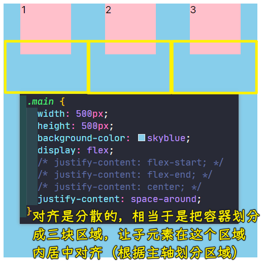
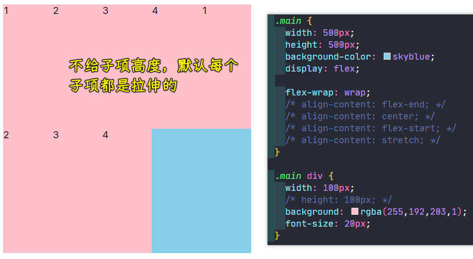
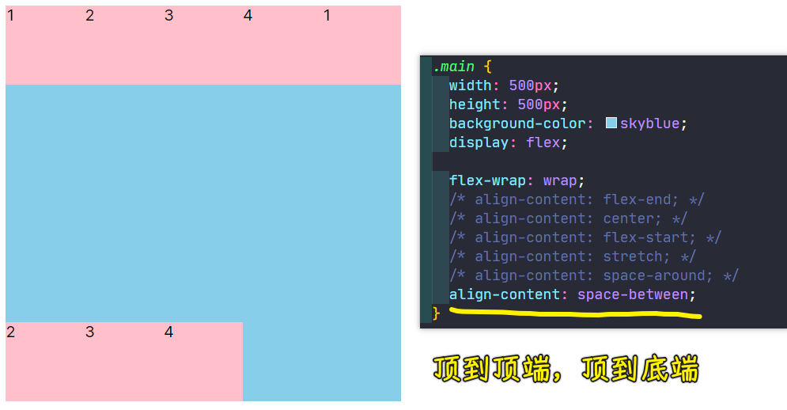
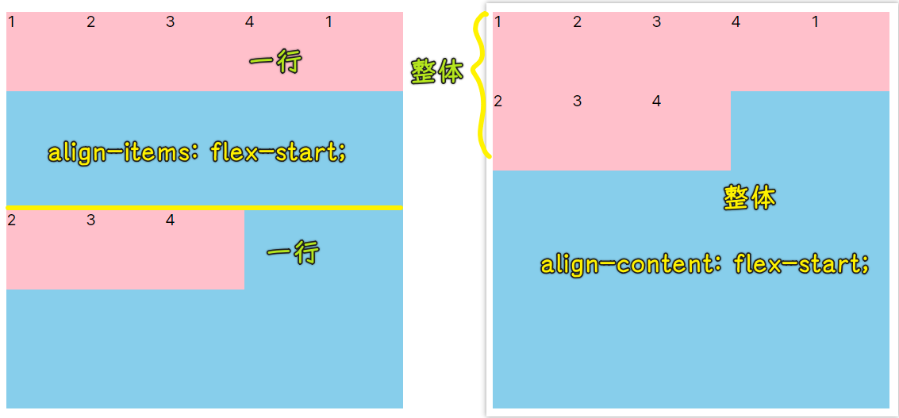
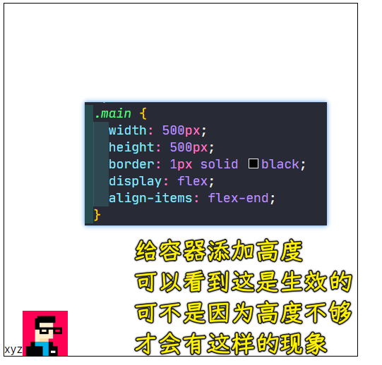
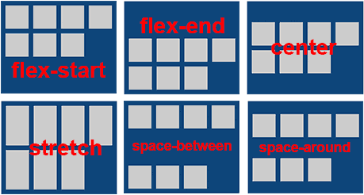

### ✍️ Tangxt ⏳ 2021-10-13 🏷️ CSS

# 19-主轴对齐详解、交叉轴对齐详解

## ★主轴对齐详解

在本小节当中，我们将学习主轴对齐详解。

我们可以看到主轴对齐是采用`justify-content`这样一个属性来实现的。

### <mark>1）主轴对齐有哪些可选的值？</mark>

接下来我们来看一下它可以选择的值有哪些。其实这个选择的值还是蛮多的，大家可以看到：

话说，这些值到底表示什么含义呢？ -> 用代码演示一下。

#### <mark>1、不加`justify-content`时的效果？</mark>

只有一个`display:flex`，容器默认是这样对齐的：

> 可以把子元素们看做三个文字，然后它们是默认的左对齐

我们可以发现它默认的就是沿着这个主轴进行水平排列，然后从左到右。

#### <mark>2、基本的三种对齐方式：`flex-start`、`flex-end`、`center`</mark>

这三个容器它是如何进行这个对齐的呢？可以有以下几种选择。

第一个，`justify-content: flex-start;` -> 默认全部挨在最左边

第二个，`justify-content: flex-end;` -> 全都靠到了最右边

从三个子元素的对齐方式，我们可以发现这个主轴对齐方式，它就是沿着主轴到底是靠左还是靠在最右还是说做一些其它的处理。

第三个，`justify-content: center;` -> 让子元素们沿着主轴居中对齐

#### <mark>3、较为复杂点的对齐姿势：`space-around`、`space-between`、`space-evenly`</mark>

接下来我们来看一下这个比较复杂一点的。

💡：`justify-content: space-around;`？

比如说我们这个`space-around`，看一下它会怎样进行显示：

我们可以发现它会这样进行分散，这种分散的效果其实是进行了平均分配左右空间，也就是说我们第一个子项，它的左边的空间跟第一个子项右边的空间是等价的。而第二个子项的左边和右边也是等价的。第三个左边和右边也是等价的，它是这样去分配这个父容器宽度的。

这样的话，你就会发现最左边以及最右边就是中间这部分空隙的`1/2`，也就是说中间这部分空隙是两侧空隙的二倍，这样的效果我们从图中可以看到，并且这个空隙是根据父用器自动进行分配的，那这样的好处是什么呢？

好处如下：

比如我们现在把父容器的`500px`宽给去了：

去了宽度之后子项就会自适应父容器，我们可以发现当子项自适应父容器的时候，它这个空隙也会随着进行变化。

💡：为什么我们要叫「弹性布局」？

也就是说为什么我们要叫弹性布局呢？就是说**这些间隙是可以根据我们的父容器进行一个变化的，这样的话父容器的宽度发生变化，导致它们的间距也会发生一些变化。**所以说这种弹性布局是比较灵活的，比我们的浮动布局要灵活很多。

如果拿浮动布局来做这样的效果的话，其实是不好做的。因为浮动我们要产生间隙，是需要设置这个`margin`的，也就是外边距，而设置外边距的时候，我们一般都是给一个固定的像素值。如果你是给百分比的话，这其实也是不容易做到这样一个效果的。所以说像浮动布局虽然能做左右，但是浮动做左右更多的是在一种固定的容器当中，而我们的弹性它也是做左右的，它不光是能够做我们固定的容器，而且也非常适合做我们这种自适应的容器。比如说**容器大小不同，它会自动的进行间距的调节，这就是弹性给我们带来的优势**。

了解之后，我们再把这个宽度固定回来，我们再来看看还有哪些可选的操作。

💡：`justify-content: space-between;`

在这里我们选择这个`space-between`，也就是说我们顶到两个端点，这样的布局也是非常的常见的。开始的元素贴到我们的容器最左边，而我们的最后一个元素贴到容器的最右边，然后接下来的中间会根据元素的个数进行空隙的一个平均分配，这里面是三个，大家可以看到就会像图中这样分配。

如果再加进去一个，当四个的时候，它的一个分配情况又会是怎样的呢？

可以看到空隙也是平均分开了。然后第一个顶到左边，最后一个顶到最右边。

我们再来看一下还有什么样可选的操作。

💡：`justify-content: space-evenly;`

还有一个比较常用的就是我们的`space-evenly`，这个`evenly`是平均值的意思。我们添加之后就可以看到就会产生这样的效果：

这个属性的特点就是我们这些子项之间的间距都是等价的。也就是说最左边和最右边以及中间这些空隙完全是相等的，大家可以看到这样的效果。它跟刚才看到的这个`space-around`其实是有区别的。我们的这个`space-around`它其实是我们对于子项的左右是相等的，那就会产生中间的要比两边的要大。但是这个平均分配，中间跟两边其实是等大小的，大家可以看到这样的效果，这种效果其实也是蛮好的一种排列方式。

#### <mark>4、折行后的子元素，又会怎样对齐呢？</mark>

大家可以看到，当折行的时候，也是可以做到这个同样效果的：

选择折行之后，大家可以看到当它（子项）排列不下的时候，当它折到下一行的时候，当还有空隙的时候，它就会做这个相应的排列方式。

上面这一行大家也可以看到，当你这个子元素已经占满了整个容器的时候，这时候其实我们的分配对齐方式`justify-content`其实并没有太大的这个影响了，因为它已经没空隙了，只有当我们有空隙的时候才能做这个布局的一个排列，这样的一个细节大家也可以看到。

#### <mark>5、只有一个子元素时，该子元素又会是怎样的一个对齐姿势呢？</mark>

同样，如果说假设你只有一个元素的时候，其实也要注意它的特点。比如说只有一个元素的时候：

它有可能选择这种均分的时候它会居中，但是你要选择这种，比如说我们端点的这种，它就会靠到最左边：

然后我们要选择这个`space-around`，我们可以看到它也会居中：

这些表现形态会稍微有些不同，一个元素其实也是可以控制的，只不过我们很少做一个元素的对齐。

### <mark>2）垂直方向上的对齐</mark>

我们再来看还有哪些可以注意的点。

大家可以发现`justify-content`，它指的是我们主轴的一个对齐方式，总之，它默认是水平的作为主轴。如果我们现在是用这个垂直方向作为主轴，咱们再来看看这样的一个特点是怎样的？

改成这个垂直方向作为主轴，大家可以看到这时候我们的主轴已经变成了垂直方向，这同样也适用于我们的这个分布，这也是进行了这个很好的排列。

所以说我们**这个主轴的排列对齐方式其实是非常强大的，可以满足我们横向的一维布局以及纵向的一维布局，这都是非常好用的。并且它这个自适应的能力是非常强大的，能帮助我们做很多好用的一个布局方式出来。**

---

在后面小节当中，我会给大家具体的去解决我们实际的例子，就是如何利用这样的特性来做出一些常见的布局方式。本讲的知识点我们就先了解到这里，希望同学们加以练习。

## ★交叉轴对齐详解

在本小节当中，我们将学习交叉轴对齐详解。

在上一个小节当中，我们学习了这个主轴的一个对齐方式。那本小节我们来了解一下它的另外一个轴，也就是交叉轴对齐又有哪些可选的操作呢？

### <mark>1）`align-content`</mark>

这里简单先来说一下，交叉轴其实要比咱们的这个主轴更加的强大，因为它有两个可以操作的属性，大家可以看到一个叫做`align-items`，另外一个叫做`align-content`。

那这两个我们先来看第一个，我们先看这个`align-content`，它跟上一个比较类似的，这个是我们交叉轴每一行之间的这样的一个整体的对齐方式：

它的可选方式跟我们的这个水平主轴的一个对齐方式是很像的。并且它其实还多了一个`stretch`，该值是默认的，它的特点是拉伸。

接下来我们来看一下这几个可选项。

#### <mark>1、默认不加`align-content`的代码的显示情况</mark>

目前的代码情况：

现在我们可以看到我们只有这么一行，咱们先想一想咱们现在的这个交叉轴是垂直方向还是水平方向？

相信同学们都已经答出来了，就是我们的垂直方向，在垂直方向上，它也有这个起点对齐，终点对齐以及居中对齐以及什么平均分配这样的空隙这样的一个功能。

那接下来我们就来试一下，我们来看一下。

#### <mark>2、`align-content: flex-end`</mark>

在这里我们选择咱们的`align-content: flex-end`，看看它能不能跑到最底端：

可以看到它并没有跑到这个最底端，这是为什么呢？这里面有一个非常隐藏的细节，这个细节就是**针对你只有一行不折行的情况下，其实这个样式它是不生效的**。也就是说我们的`align-content`它在不折行的情况下，这个属性是不生效的，这一点大家需要注意一下。

该知识点很容易被忽略：

> 在容器针对子项不折行的情况下，`align-content`是不生效的

其实`align-content`**针对的就是多行的一个排列方式，你不折行，那就产生不了多行，产生不了多行，那这个属性，它就是不成效的**，这就是它需要注意的特点。

我们打开折行，虽然说现在并不会有更多的元素能够折到下一行，但是一旦当你加上了这个折行属性之后，我们接下来的这个`align-content`它就生效了，我们一起来看一下：

你看这时候它就跑到底部去了。

#### <mark>3、`center`、`flex-start`</mark>

那跑到底部之后呢？我们再来看一下。

我们还可以选择`center`，当然，这个不管是 `flex-start`还是我们的 `center` 还是我们的 `flex-end`，其实它们都不是默认值。

接下来我们来看一下默认值。

#### <mark>4、`stretch`</mark>

默认值其实就是：子元素们现在有一个固定高度，你是看不到默认值的，我们把这个高度给它去掉，这时候你就能看到默认值了：

其实默认值就是拉伸的，也就是说我们现在这个子元素的高度它会根据容器的高度自动拉伸开，这就是默认值`stretch`属性。

现在我们不加高度之后，把这个默认改一下，比如说改成我们的顶对齐，这时候子元素会根据内容自适应的：

如果是 `flex-end` 的话，那它也会根据内容跑到最底端对齐：

#### <mark>5、为啥换行后的元素不是紧挨着第一行？</mark>

接下来我们为了给大家演示其他的那几种情况，我们需要多添加几个子元素，以此来凸显折行的效果，凸显折行效果之后，大家就明白了我们之前的看到的折行现象了，即把容器上下平均分成两半，把换行那部分元素扔到第二行去，而不是紧挨着顶部那一行：

可以看到，默认情况下，分成了两行的时候，容器会自动分成两部分。然后第二行就要从下半部分容器的起点位置进行排列，所以我们可以看到这样的效果。

看到这样的效果之后，我们现在选择是默认的，所以说它是拉伸的，而我现在选择什么呢？把子元素的这个高度加一下，元素的高固定了，但是这个位置它还是按照它正常分配的位置去排列的：

这就是我们默认的`stretch`的特点！

#### <mark>6、多行情况下，`flex-end`和`center`是怎样一个表现情况？</mark>

测试两行下`flex-end`和`center`的情况：

`flex-end`：都跑下边去

`center`：都居中

注意：

#### <mark>7、`space-around`</mark>

还有，我们可以选择这个`space`相关的，比如说`space-around`：

这时候顶端和底端都是中间的 `1/2`。

#### <mark>8、`space-between`</mark>

然后我们再选择这个`between`，也就是端点，两行的话，一个顶到顶端，一个顶到底端：

#### <mark>9、`space-evenly`</mark>

选择我们的这个`space-evenly`：

可以看到这个顶端中间底端都是平均分配的。

#### <mark>10、小结</mark>

再回到 PPT 当中，大家可以看到这些可选的值非常多：

我再来总结一下这个需要注意的特点。也就是说我们的整体这些行的一个对齐方式，首先是需要让它添加折行属性的，也就是说我们的`flex-wrap: wrap;`，你把这个折行属性加上之后，这些值才会成效，不加它是不生效的。

### <mark>2）`align-items`</mark>

我们再来看一下另外一个，就是我们的`align-items`，那这个又是什么呢？

#### <mark>1、总览</mark>

它其实也有很多可选项，它是什么呢？它是我们这个每一行当中的一个对齐方式，**它是针对每一行的，而不是整体**，`align-content`是针对整体的。这个我们通过例子来解释一下，那大家就明白了。

还是有两行的这个例子。

#### <mark>2、`align-items: flex-start;`和`align-content: flex-start;`的区别</mark>

选择`align-content: flex-start;`和`align-items: flex-start;`顶对齐情况：

话说，这个效果是怎么产生的呢？也就是说我们**第一行在上半区的这个容器当中是顶对齐的，而第二行在下半区的容器当中是顶对齐的**，这就是我们这个针对每一行的一个对齐方式。

#### <mark>2、`flex-end`</mark>

同样，我们选择`flex-end`，你会发现第一行在上半区这个容器当中底对齐，而第二行也会在它的下半区容器当中底对齐：

可以看到，**这个是完全不一样的。一个是整体控制，一个是针对每一行的一个位置**。

#### <mark>3、`center`</mark>

那还可以选什么呢？我们选择`center`：

#### <mark>4、为啥说`align-items`的可选值少？</mark>

看到这样的效果之后，所以说它的可选值会比较少。这是为什么呢？

因为像其他的这个`space-around/between/evenly`，这其实是**针对多行或者多列的**。而我们现在这个在每一行当中，其实它只有一行，它是不存在那些对齐方式的。

> 说白了一个对齐是针对整体内容多行多列的，另一个则是针对单行单列的！

#### <mark>5、`stretch`</mark>

除了这三个刚才演示的以外，它的默认情况也是`stretch`。

当你不写高度的时候，其实它会自适应拉伸的。

不写高度，不拉伸居中：

不写高度，默认拉伸：

#### <mark>6、`baseline`</mark>

还有一个可选的但并**不是很常用**，那就是我们的`baseline` ，这个`baseline`其实它是以我们的小写 `x` 作为底对齐的。

话说，我们怎么才能够看到这个变化呢？

我们也可以简单的来给大家演示下`baseline`这个东西它是以小写 `x` 的底进行对齐的。

`align-content`只有一行的时候是不会生效的，得折行才行，而`align-items`只有一行的时候，它其实也是会生效的，这个一定要注意。比如我们给容器添加高度：

可以看到一行的时候，`align-items: flex-end;`也是生效的，这相当于是一行的时候，你不去折行它也会生效，因为它本身就是针对一行的，比如说你选择居中：

所以我们**这个时候的`align-items`其实有的时候会比这个`align-content`要更常用一些。因为我们经常处理的是一行或者是一列，毕竟是一维布局哈！**

在这个一行一列的时候，其实我们要想对元素进行居中或者说是起作用，我们完全可以用这个，因为它针对一行的时候会非常方便，不需要做这个折行处理。

我们后面去做这个小例子的时候，大家可以看到这样的一个特性，到时候我还会给大家去渗透这个概念的。

这里我们先看一下这个`baseline`，它也叫基线对齐，我们选择这个基线对齐：

> 这跟默认不加`flex`一样

可以看到，第二张图就会以这个小写 `x` 作为对齐方式，这样的话就会产生一些空隙。

---

以上就是我们可选的这些值了。

下一小节，我们将了解到这些小知识点，能够做一些常见的布局需求，所以这该如何实现呢？我们下一小节见吧！

## ★总结

`justify-content`：

> 这个不需要针对多行，记错了！

`flex-start`是它的默认值！

---

`align-content`：

图少了一个`space-evenly`，我想该值是后来加的，难怪 VS Code 不支持！

---

`align-items`：

