### ✍️ Tangxt ⏳ 2021-10-14 🏷️ CSS

# 20-内联与块的上下左右居中布局、不定项居中布局

## ★内联与块的上下左右居中布局

在前面几个小节当中，我们学习了`flex` 作用在我们容器身上的一些属性语法。那为了巩固我们这些属性语法，我们接下来的几个小节当中利用 flex 容器的属性来实现一些常见的布局。

### <mark>1）常见需求</mark>

接下来我们来看第一个就是如何利用 flex 来实现内联与块的上下左右居中布局。

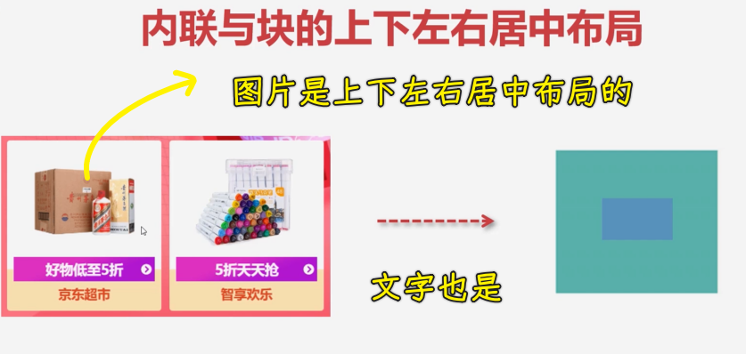

这种布局其实也是很常见的一种需求。大家可以看到左边这张图就是一个商品展示的这样一个容器，在这个里面儿，咱们的图片大小是不确定的，那它可以宽一些，也可以高一些，但不管怎样，可能都需要在容器当中，上下左右居中。不光是我们的这种图片，比如说我们的文字也经常会做这种上下居中的，并且有可能是多行居中的。那这样的话我们如何来实现呢？就是我们这种能够自适应容器进行居中的这样的效果。

那接下来我们就来用 flex 布局来简单实现一下。

### <mark>2）针对内联元素的垂直居中</mark>

#### <mark>1、用弹性的两种姿势</mark>

两种用`flex`的姿势：

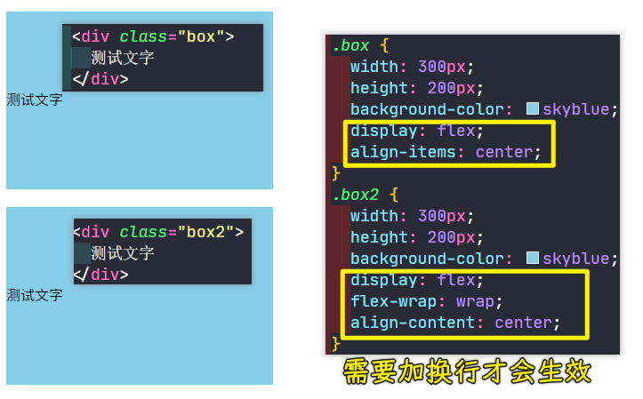

可以看到这两种做法都行，当然，`align-items: center`这种会比较简单一点儿，因为它只要写一句话就可以了，而`align-content: center`这个我们需要写两句话。

那我们接下来继续来看。

#### <mark>2、行高姿势</mark>

其实我们可以不用这种弹性布局，那我们用传统的布局方式能不能实现这个效果呢？

其实也可以做，我们利用行高，让行高跟父容器的高度相同即可：

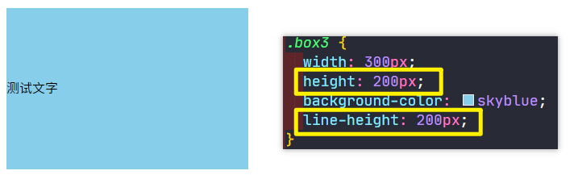

这时候也能做到居中的效果，可以看到这也是非常方便的。但是这种行高如果说针对一行文字还是不错的，但是如果针对的是多行文字的时候，这个行高就不适用了。

比如我们现在添加点文字：

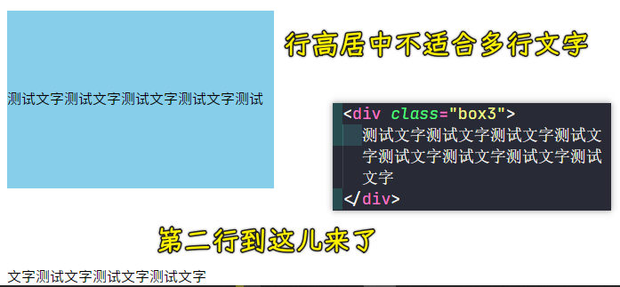

因为行高设置的跟高度一样，所以才会有这样的效果。所以说它是不适合多行居中的这样一个方式。

#### <mark>3、为啥推荐用弹性？没有对比就没有伤害</mark>

那我们的弹性布局就适合吗？

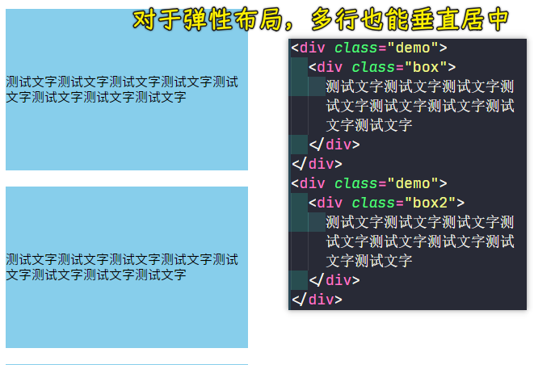

可以看到，这个弹性布局它是可以的，所以说弹性布局它还是非常灵活的，对于单行多行进行上下居中都是非常好的一种选择方式。

#### <mark>4、`table-cell` 配合 `vertical-align`</mark>

话说，我们就是不用弹性，那能不能做到这种多行文字的上下居中呢？

其实也可以做。不过方法比较有技巧性，我们来看一下如何来做。

很简单，用`table-cell`就好了，它可以让我们的这个盒子能变成一个类似于表格的单元格，而表格的单元格它是可以支持这个`vertical-align`的，也就是上下居中，我们选择`middle`上下居中，这样一来也能做到同样的效果：

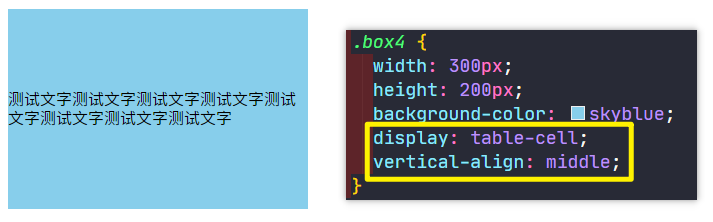

但是这就是一个需要特别记忆的方式，我们得就给父容器盒子转成为一个表格的方式。

当然，这还有一些办法，咱这里就不展开给大家讲解了。

#### <mark>5、小结</mark>

从上述方式，我们主要还是可以发现**弹性**是非常灵活的，而且这个通用性非常好，这是我们针对内联的一个操作。

接下来我们来看一下，如果里面是块级元素的话，看一下怎么来做这个居中。

### <mark>3）针对块级元素的绝对居中</mark>

对于块级元素我们一般做这种**上下左右都可能居中**的一个效果。所以接下来我们给大家演示一下。

#### <mark>1、用弹性 so easy</mark>

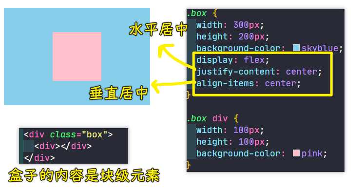

可以看到，只要`3`行就能非常容易地做到这个上下左右居中了。

这种上下左右居中，它的优点就是它可以自适应我们的父容器大小，并且也可以自适应我们这个子项的一个大小。

子项自适应父容器：

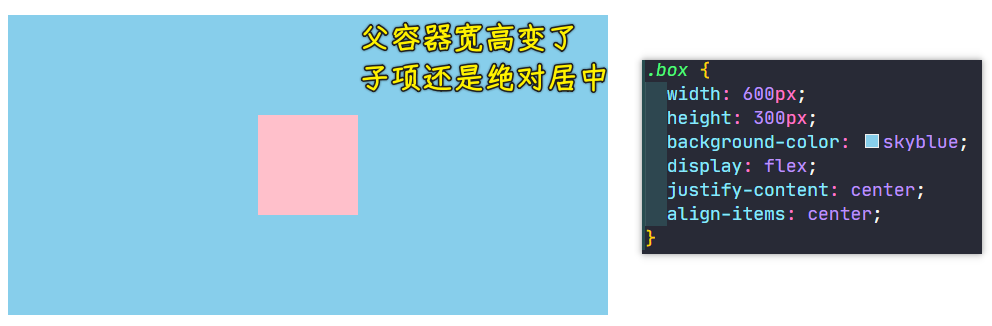

父容器自适应子项：

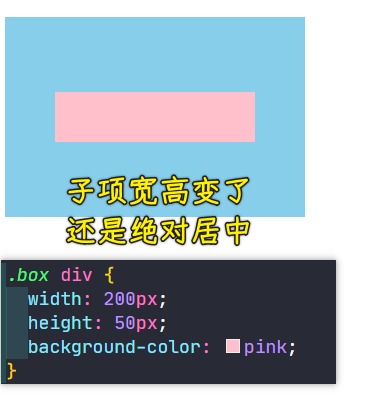

可以看到，不管父容器的大小怎么变，子项的大小怎么变，子项依然可以绝对居中。

所以这个弹性布局它的优点就是不管我们的尺寸是如何变化的，其实都非常好的能够适应这种尺寸的一个变化，这就是一种弹性的操作行为。

#### <mark>2、不用弹性怎么做？用定位+`margin/transform`</mark>

接下来我们看一下，如果不用这个弹性来做的话，我们好不好做呢？

这个也有方案，我也来给大家简单介绍几种。

💡：定位姿势+`margin`

我们不用弹性该如何来实现呢？ -> 这个时候比较适合用定位来实现。

1. 子绝父相：儿子
2. 儿子添加`left/top:50%`、`margin: -50px`

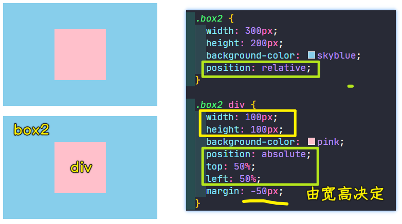

> 需要向左向右拉取 `50px`，这一点用`margin`即可

💡：定位姿势用`margin`的不足

现在的问题是，假如子元素的这个大小变化了，比如`200*50`，这时候`margin`也要进行修改：

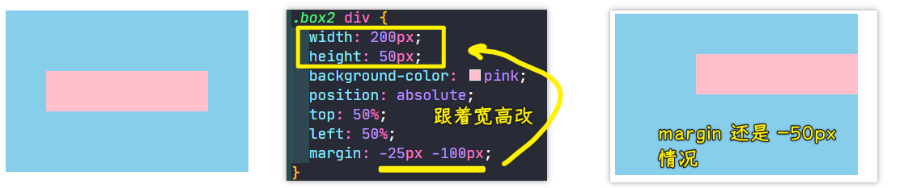

可以看到子元素宽高变了，`margin`它就需要进行调节，所以这是非常不方便的，总之，要调的数值太多了，就没办法做到我们容器能够自适应居中的这么一个方案了。

💡：不用`margin`了，用`transform`

那怎么改进呢？要想改进的话，这里面我们可以选择用我们的`transform`。

在`transform`这个变形当中，我们可以选择一个位移`translate（参数 1, 参数 2)`，位移的时候我们可以选择一个`-50%`。这个`-50%`它会相对于我们当前这个子项的宽度来进行这个计算。比如说`-50%`其实就是对于宽度的一半进行一个拉取，然后第二个参数也是对高度的一半进行拉取，这样的话就比较好一点了。

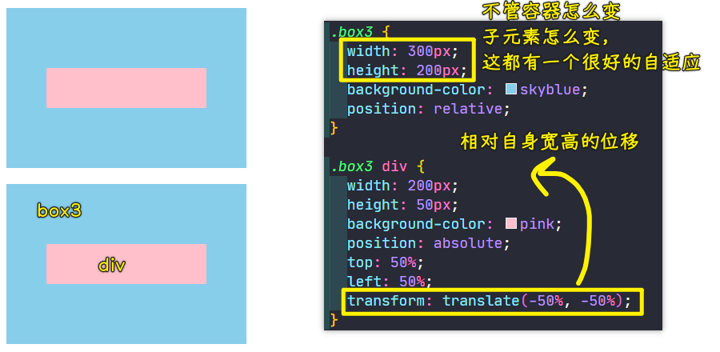

`transform`这个是相对于子元素自身进行一个拉取的。这跟`margin`拉取是不太一样的。

所以说我们可以通过这种方案来实现这样的下过，当然，这个要记的东西就比较多一些了。

#### <mark>3、用`margin:auto`+`flex`（或子绝父相，子的四方向都为`0`）</mark>

话说，我们还可以怎么做呢？

💡：为啥`margin:auto`只对左右有效？而上下则无效呢？

我再教大家一些小技巧。比如说我们其实会想一个问题，为什么我们不能直接用我们的这个`margin`来做这个事呢？

比如大家来想一下这个`margin: auto`，其实`margin: auto`就说明我们上下左右的这个间距应该是等价的，但实际上它只会左右进行平均分配，但上下是不会的，这就是因为我们`margin`在盒模型当中本身就有很多问题，其实有这样的问题没事，但如何来解决呢？

这个就得给子元素转成为一个 BFC 的块，当然，要想转成这个 BFC 块，这个也不一定能解决这个问题，因为这个就是盒子自身的一个问题。

💡：`flex`解决了`margin:auto`上下无效的问题

后来咱们的弹性就可以解决这个问题了。

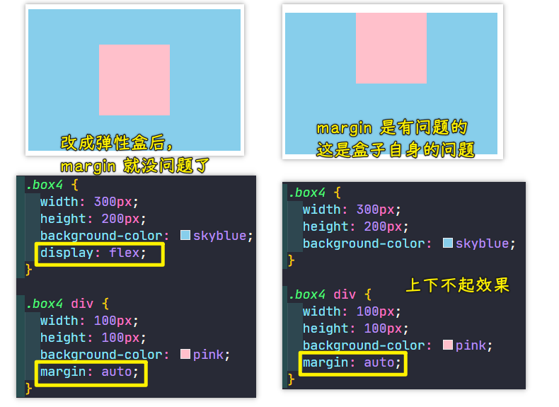

这个`display: flex;`的`flex`它就把之前遗留的这些`margin`问题其实都解决了，像什么`margin`叠加问题，`margin`的传递问题，以及像这种`auto`不能够上下自适应的这样的问题，其实弹性都给它解决了。所以说弹性布局是非常强大的，这样也能解决这个问题的。

💡：除了`flex`可以解决这个问题外，定位也能解决！

但其实方案非常多。还有一种能够让`margin: auto`生效的一种方式，除了这种弹性以外，我们可以看到，在子元素身上，我们加一个绝对定位，然后把我们的四个方向都给它设置成零的情况下，其实也是可以让`margin: auto`生效的。

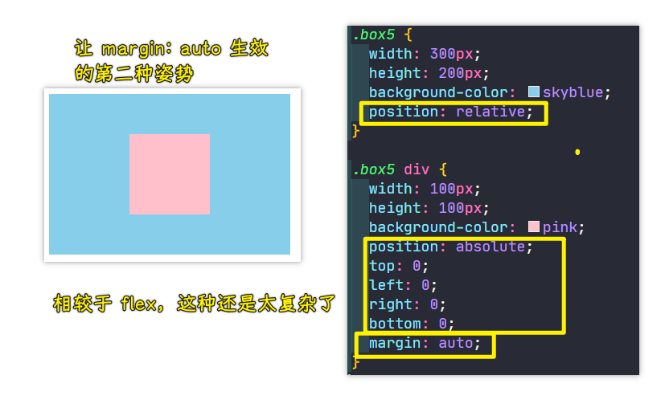

这种方案也是可以做到的。当然，我们可以这么理解这种方案，它就是一种奇技淫巧，当然，它并不是我们特别推荐的。

话说，为啥这样做能让`margin: auto`生效呢？

因为这个`margin:auto`它是没办法知道到底应该是以哪作为这个起点的，毕竟你子元素四个方向都是零，这样的话它就只能平均分配了。

### <mark>4）总结</mark>

以上就是我们几种的解决方案了。通过以上的例子，大家会发现其实还是利用这个弹性的对齐方式，是非常容易做这个居中的，无论是我们的单行文本还是多行文本，它的上下左右居中都是非常方便的。而且我们这个容器的单行或者是多行也是非常方便的。

那我们配合什么呢？这个主轴对齐方式以及我们交叉轴的一个对齐方式，是非常容易调节出我们这个居中方案的。

这就是我对于这个上下左右居中的一个简单的一些案例的演示。

## ★不定项居中布局

在本小节当中，我们来看一下不定项居中布局的一个实现方式。

### <mark>1）什么是不定项居中？</mark>

先来了解一下什么是不定项居中。

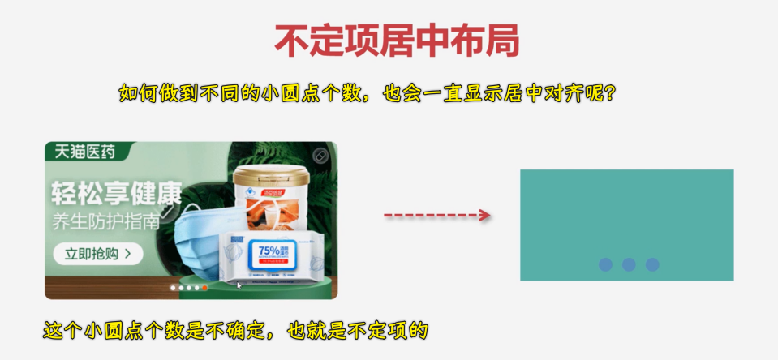

我们可以看到左边这张图其实是很常见的一种轮播图展示效果。大家可以看到轮播图底下这个切换的小按钮，它其实就是一个不定项居中的这样一个实现。

不定项居中的意思，就是说我们中间的项是不确定的，有可能是 4 个，也有可能是 5 个，也有可能是 6 个，那这时候它如何能够在不定项的时候也能够非常好的在容器当中居中展示呢？这就是我们接下来要讲的。

像这样的效果，不仅在轮播图当中非常常见，比如说还有在我们的分页当中也是非常常见的一种布局方式，就是说可以进行上一页、下一页以及带有编号的这种分页效果。那这样的话，我们就来看一下如何来实现这种能够自适应不定项的一种居中布局，用弹性来实现这种效果也是非常适合的。那接下来我们一起来写一下吧！

### <mark>2）用弹性姿势实现不定项居中</mark>

完成基本的布局：

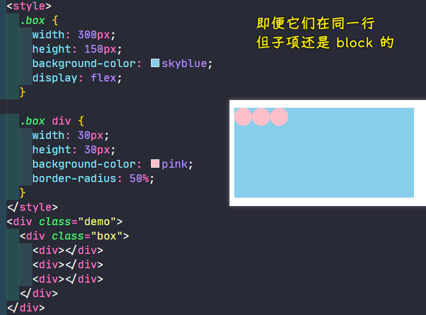

基本的布局，我们加好之后，从现在的效果上看，它现在是在我们的左上角显示的，那如何能够让它跑到中间并且自适应呢？

咱们来看一下这个做法：

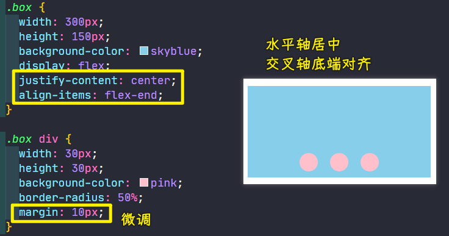

不管是三项还是四项，又或者是两项，它们都能非常好的居中展示：

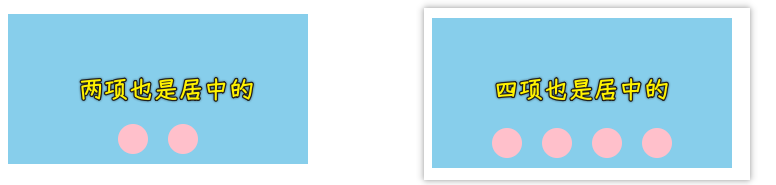

这就是不定项居中，不管中间是几项，它们都可以非常好的能够在中间进行展示。同样，你这个容器的大小并不影响到它居中的这样一个展示。而且这个中间就是自适应我们个数的，这就是不定项的一个居中。

那这样的效果用弹性是不是非常好做呢？那如果说不用弹性，用我们之前的一些布局方式能不能实现呢？

其实也能做，但就是稍微麻烦一些。那接下来我也会给大家做一个简单的演示，大家一起来看一下，也可以做一个扩展的学习感受一下弹性的强大。也就是说这样的布局我们用之前的做法其实是比较麻烦的。

### <mark>2）用浮动来做——不能自适应</mark>

首先用浮动来搞，其实也不是说不能做，但是浮动要做的话其实是非常麻烦的。你如果要居中的话，你就得对我们的这个容器一个固定的大小，浮动完之后给容器固定大小，这样的话，我们利用这个`margin: auto`的方式就可以做居中了，但是这个宽度给了固定大小之后，其实就很难做自适应了。

``` html
<div class="box2">
  <section>
    <div></div>
    <div></div> 
    <div></div>
  </section>
</div>
```

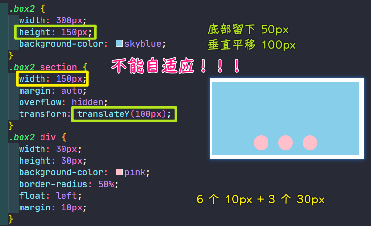

### <mark>3）用定位来搞，需要用到一些小技巧</mark>

那我们一般可以怎么去做呢？咱们可以选择这样一个方案，来看一下我的做法。

不用弹性之后如何能够做到不定项居中呢？我们的做法是这样的：

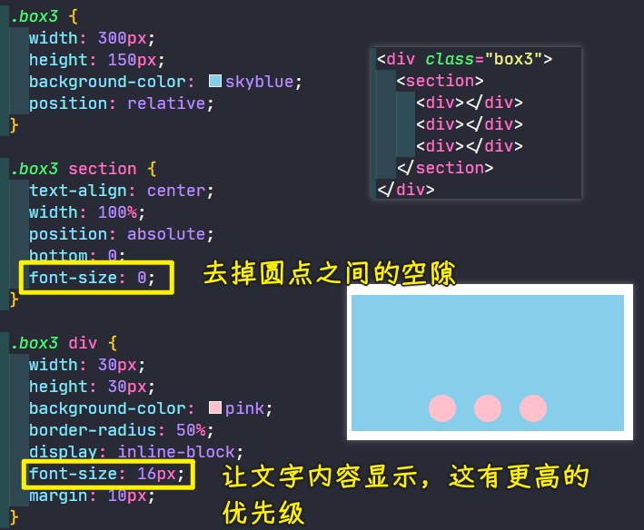

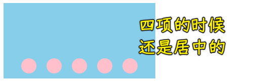

1. 给子项`inline-block` -> 让子项排成一行
2. 给盒子容器加`text-align: center` -> 利用文字对齐姿势 -> `inline-block`元素是支持文字居中特性的，而块级`block`元素则是不支持的！毕竟`inline-block`它是具备内联盒子的特性，所以该设置是可以让它居中的！
3. 用定位调节子元素位置，当然也可以用间距来搞！ -> 用定位更方便！

加 `section` 是为了更容易做底部！

加`font-size: 0`的原因：因为内联元素，它默认是带着一个的空隙，把这个默认空隙解决掉的方法之以就是给父容器加这个`font-size: 0`。

加`font-size: 0`之后，这时候又会产生一个新的问题，那就是假如`div`这里面有文字的话，其实这个文字是不会显示的，因为文字是可以继承的，所以我们是看不见这个文字的，为了让文字还能显示出来，我们需要在这个`div`当中提升这个文字的优先级，可以再把这个文字给它显示成默认的大小即可。至此，这就解决了它的间隙问题了，通过这种方式可以解决这个间隙。

### <mark>4）为啥推荐用弹性来搞？</mark>

从图中可以看到这跟用弹性弄的是一样的效果，当然，我们会发现还是我们的这个弹性做起来是非常容易的，它的位置是非常好控制的，比如居中、上下都是非常好控制的。而且**弹性的最大特点就是它是自适应的弹性**。弹性也就是说子元素个数多了还是少了，自己都能非常好的控制调节这个间距的，这就是比我们原来传统的布局要强的地方。

我们原来传统的布局太死板了，一旦当我们的这个适配的范围更广的时候，它就不太适用了，当然，可能用其它一些办法也能做到，但就是很麻烦啊！这一点大家可以看到：

要想实现的话，我需要再多加一个`section`结构，并且还要做一些技巧（去掉内联元素间隙等）才能把它做到跟刚才一样的效果。

---

演示这个也是让大家知道我们弹性用起来是非常方便的，希望大家能够好好的掌握弹性，以此来用弹性做出我们常见的这种一维布局的、大部分的、一些应用场景，总之，我们都用弹性去实现就可以了。那么这个例子就简单给大家写到这里！
