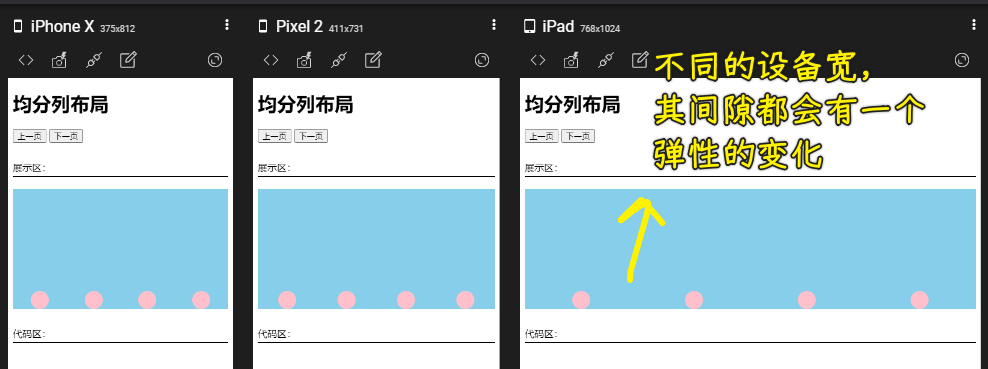
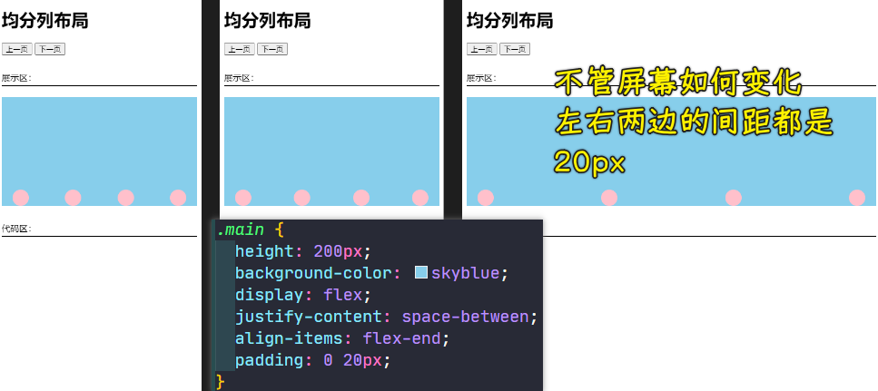
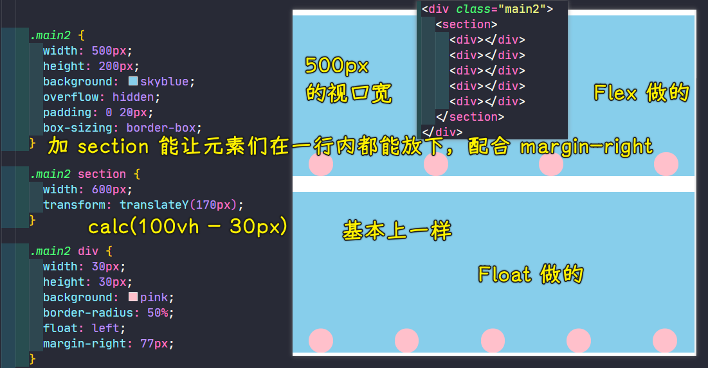
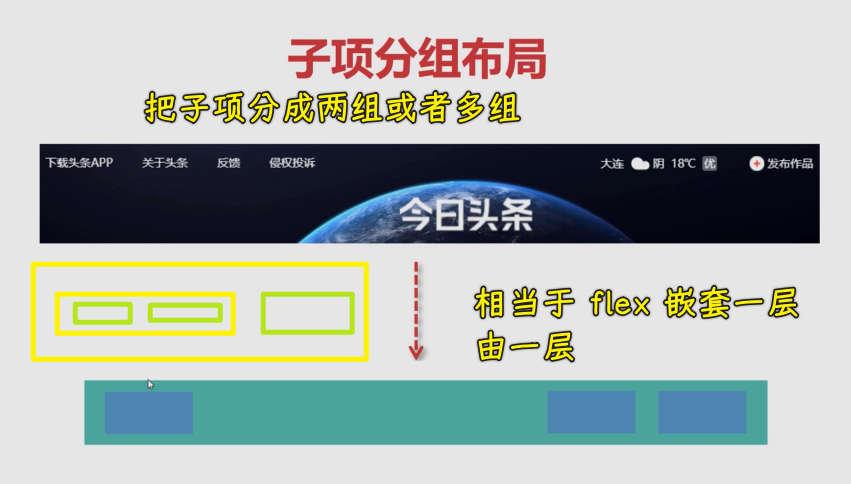
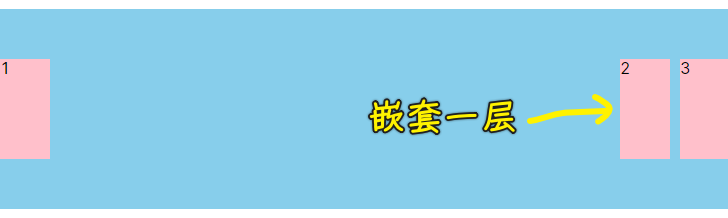
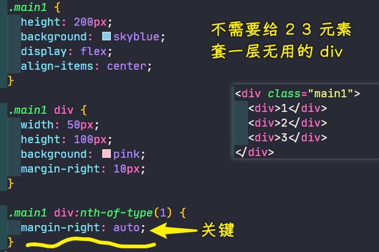
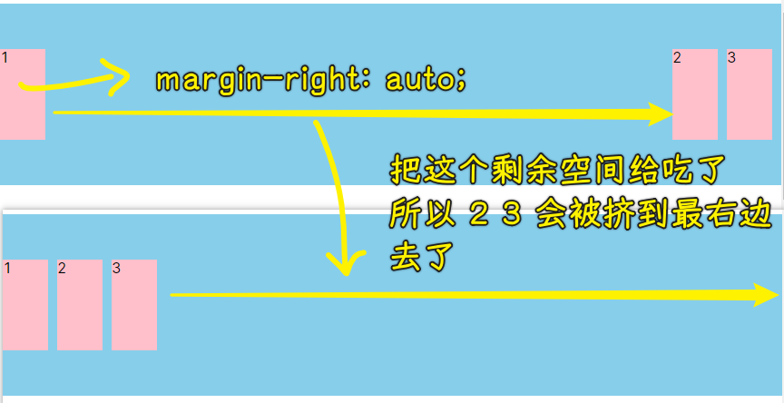
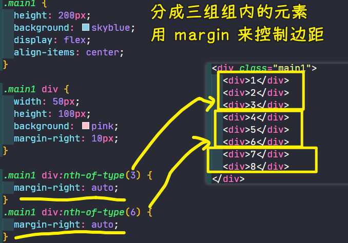
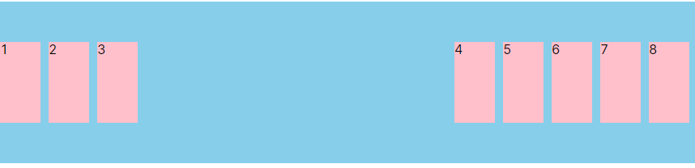
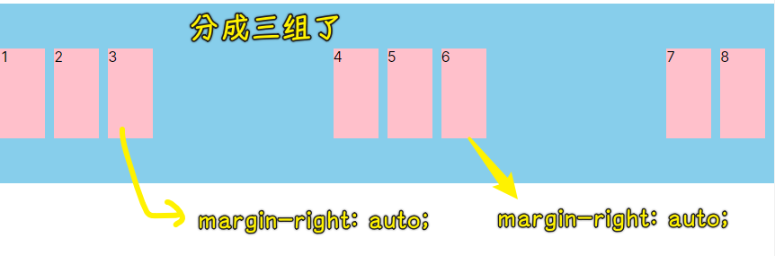

### ✍️ Tangxt ⏳ 2021-10-14 🏷️ CSS

# 21-均分列布局、子项分组布局

## ★均分列布局

本小节当中我们来介绍一下均分列布局。

### <mark>1）什么是均分列布局？</mark>


首先我们来看一下左边这张图，这是我们移动端非常常见的一个需求，也就是我们底部的菜单儿栏或者是导航，它是可以自适应我们这个容器的，可以做到一个均分列的这样一个布局。当我们的列项增加或者是减少的时候，对于均分的一个情况，也是可以自动进行适配的。那这种如何能够做到呢？这样一个需求用弹性布局也是非常容易做的！

### <mark>2）用 Flex 来做</mark>

接下来我给大家来做一个简单的演示。

1. `div.main` -> `4`个`div`
2. 给容器一个高就好，让这个容器的宽跟咱们的屏幕宽相同就行了！
3. `flex`布局



> 老师的测试例子用的是`space-between`，我用的是`space-around`，左右端的间隙老师是用`padding`来做的

不管你多一项还是少一项，它其实都是可以非常好的进行这个列的一个均分。

其实我们到后面的知识点当中，咱们可以做到让我们的容器也能够分配成五份，把整个容器给它做一个自适应，根据子项的大小，能够自动的来占容器的大小，这里我们只是把这个子项固定了一个大小。

我们这里再来看一下，如果说假设我们想让这个左边和右边能够留出来一个间距，并且这个间距是固定的话，我们就可以选择用`padidng`来实现这个需求：



我们不选择这个端点对齐，比如说你选择这个`around`或者是这个`evenly`其实它们也能做出来一些效果。当然了，这个还得看需求。只不过我们不管是选择这个 `around` 还是`evenly`，它其实是会根据分辨率的不同的做一些调节的，所以说这个效果不一定是我们希望的这左右两边是固定的或者是端点对齐的。

> 我们希望在不同分辨率下，左右端的间隙都是固定的！

我们现在做好这个效果之后，如果我们不用弹性，而是用我们传统的这个浮动，那能不能做呢？

能做，但这其实是比较麻烦的。因为首先要用浮动来做的话，它其实就是要固定宽度，也就是说做不到我们这种自适应的这样一个效果。我们需要固定一个尺寸大小之后，通过调节`margin`，也就是外边距的这个间距来调节它们（元素）之间的距离，而且还要注意最后一项，因为它有可能也有外边距`margin-right`，所以最右边的元素是有可能会被挤到下边去的，这样在做的时候就会注意很多细节了，所以说**弹性比浮动要更为的强大**，而且实现起来又非常的简单，尤其是适应这种屏幕能够自适应（视口的宽度变化）的这样的效果。

### <mark>3）用 Float 来做</mark>

这里我用浮动简单地来给大家写一下，大家来看一下。



为啥要套一个`section`容器？ -> 因为在给子元素设置`margin-right`的时候，会有浮动元素因为在这一行放不下，而到第二行去了！ -> 设置一个大于`main2`的宽度，方便我们去调节`margin-right`的值！

添加`overflow: hidden`是为了让`section`溢出的`100px`宽度隐藏掉！

给`box-sizing: border-box`是因为`main2`加了左右`padding`后会增大该盒子所占的空间！

可以看到用`float`这样做是非常麻烦的，也就是说这需要给它一个固定，而这其实时非常不方便的。

这种能够自适应屏幕并且能够自己进行均分列的布局，其实采用我们的弹性来搞要好多了，比浮动香多了好吧？

---

用`flex`可以轻而易举地做到这种均分列的布局，这非常适合移动端的那个底部的导航，尤其是当导航多一项或者是少一项的时候，它是能够均分我们这个容器的。

## ★子项分组布局

接下来我们来看一下子项分组布局。

### <mark>1）什么是子项分组布局？</mark>

首先我们来看一下什么是子项分组布局。也就是说在我们的弹性的子项当中，它不一定完全是平均分配的或者是全部在左，或者是全部在右，也就是说它会分组。



> 我测试了一下，子项是不能设置成`display:flex`的！当然，子项的儿子是可以设置成`display:flex`的

比如说在这个效果（图中的今日头条导航）当中，大家可以看到其中前四个它是在最左边的。而我们接下来的后面的这几项它是会在右边的，这样的话，它是如何做到能够分组并且能够放到我们指定的位置呢？也就是说我们要想实现这样的布局：

当我们有三个子项的时候，如何让一个在左边，另外两个在右边这样的情况或者是分成三组，其中有一些在左边，有一些在右边，并且有一些是居中的，这该如何做呢？

简单来说，我们要想分组的话，可以给它再套上一个容器。

套上容器之后，这就可以相当于是做成两组之后，一个靠左，两个靠右，这样一来就比较容易做了。

### <mark>2）套上一个容器来做分组</mark>

接下来我们先用这种分组的姿势来给大家简单的来实现一下。

``` html
<style>
  .main {
    height: 200px;
    background: skyblue;
    display: flex;
    /* 端点对齐 */
    justify-content: space-between;
    align-items: center;
  }

  .main div:nth-of-type(2) {
    display: flex;
    margin-left: 10px;
  }

  .main .box {
    width: 50px;
    height: 100px;
    background: pink;
  }
</style>
<div class="main">
  <div class="box">1</div>
  <div>
    <div class="box">2</div>
    <div class="box">3</div>
  </div>
</div>
```



我们可以看到这样做实在是有点麻烦，因为你需要多嵌套一些层级，并且控制起来也是那么不容易，那么的灵活。

### <mark>3）不用套容器，直接用`margin-right: auto`来做分组</mark>

接下来我们看一下如何能够更灵活的来做这样的需求。





1. 让同级的三个子元素默认靠左
2. 给第一个子元素`margin-right:auto` -> 该设置会把剩余空间全部都占满，所以第二个子元素和第三个子元素自然就会被挤到最右边

这样就实现了我们的分组布局了！

💡：如何分成多组？

当然，这种分组布局它特别好的一点就是它可以针对多个子元素多个分组这种情况。

比如说我们现在分三组：

1. `123`是一组
2. `456`是一组
3. `78`是一组

分为三组之后，我们该怎么办呢？



首先我们在第三个元素身上，做一个`margin-right: auto;`，这样的话就会分成两组：



同理，`456` 是一组，那我就得给第六个再来一个`margin-right: auto;`：



现在我们就可以看到，它就非常好的做到了三组，当然，这中间两块的距离是一样的。

我们可以把这一种作为这种分组组合的弹性布局的一种方案，这种布局方案大家也可以去学会它！

### <mark>4）总结</mark>

我给大家讲了两种，第一种虽然也能做，但就是比较麻烦一些，而我们的第二种就比较灵活一些了，也就是说只需要一个外边距自适应就可以做到这种分组的一个布局了。

好了，希望同学们多加练习！
