### ✍️ Tangxt ⏳ 2021-10-15 🏷️ CSS

# 22-flex-grow 扩展比例、 flex-shrink 收缩比例

从本小节开始，我们将学习 flex 子项上的属性相关设置。

### <mark>1）`flex-grow`</mark>

我们先来看一下`flex-grow`扩展比例。

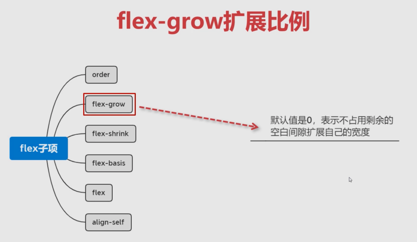

看一下这种扩展比例它指的是什么？它的默认值是 `0`，表示不占用剩余的空白间隙扩展自己的宽度，而除了 `0`以外的值，它就是可以扩展自己的宽度。它的这个属性是**不能为负数**的，也就是说它的**最小值就是 `0`**。它可以为正数，正数就表示我们是可以对这个剩余的空白区域进行扩展的。那具体的我们就通过代码来给大家进行演示这个子项的用法。

注意，该属性是加给子项的，并不是加给容器的。

### <mark>2）子项默认就有一个`flex-grow: 0`的设置</mark>

默认情况：

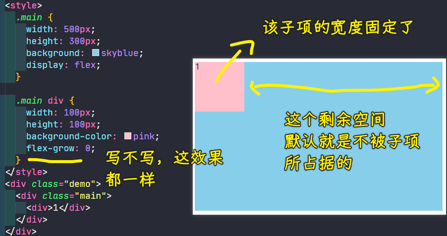

可以看到子元素默认就在这个最左边，而且它的宽度已经固定之后，所以这是没办法再去占用剩余容器的空间的，因为默认就是不占用剩余空间的，也就是说我们的`flex-grow`它就是个 `0`，它的默认值就是不占用这些剩余的空间的。

### <mark>3）`flex-grow`为`1`的情况</mark>

当我把`flex-grow`的值写成`1`：

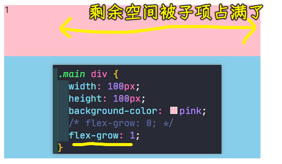

可以看到，写成`1`后，子元素就会把剩余空间的全部给占满！可以看到产生了这样的效果，通过检查控制台，能够看到它所扩展的长度，也就是宽度是可以看得到的：

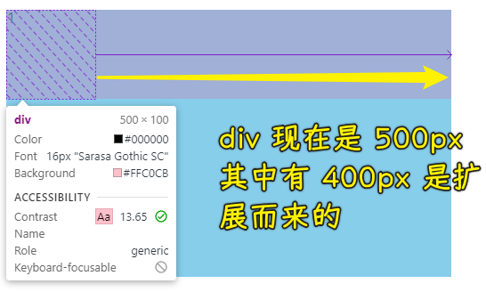

可以看到咱们的这个普通浏览器是非常智能的，如果现在这是一个弹性布局，那它这边会标上 `flex` 标识，我们点击我们的这个子项的时候可以发现在左侧这张图当中：

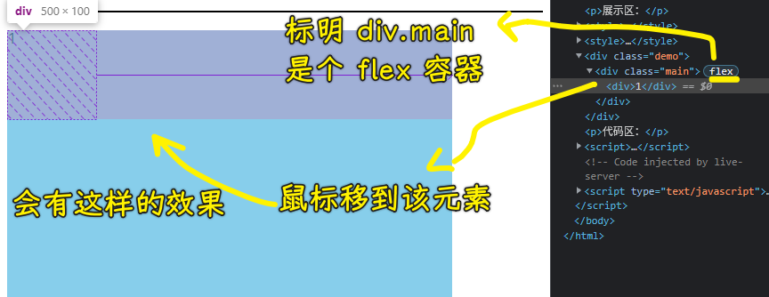

它会非常清晰的给我们做到什么呢？

非常清晰的能够看到这一块（`①`）的区域，其实就是我们的容器的一个真实的宽度：

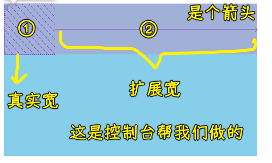

也就是自带的这个宽，也就是`width: 100px`。而这时候它会把这一块（`②`）做一个箭头出来，其实这是一个扩展的宽度，表示它是扩展的宽度。所以现在这整体目前是这样一个 `500` 的宽度，但实际上这是**分成了一个自身默认自带的宽，加上一个扩展的宽，总共才是它现在的宽度**。这就是我们的控制台能够帮我们查看到一些**非常有用的信息**。

### <mark>4）`flex-grow`为`0.5`的情况</mark>

把`flex-grow`设置为`0.5`又会怎样呢？

你会发现它就会显示成这个样子：

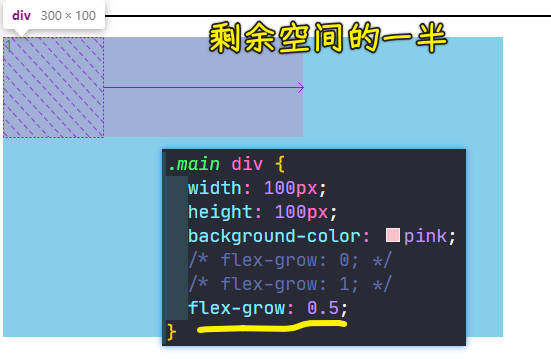

话说，这个`0.5`的比例值究竟是起到什么样的一个作用呢？

其实是这样的：

- 如果这个比例值为`1`，那就占满剩余的所有的空间
- 如果是`0.5`，那它其实就会把剩余空间给它做了一个折半的这样一个大小。

比如说我们整个容器是 `500`，咱们子元素默认宽是 `100`，这就说明它的剩余空间是`400`，而现在我们给的`0.5`，所以`400*0.5`这才是它最终所要占的一个大小，占 `200`，再加上原来的 `100`，所以它现在其实总共应该是占 `300` 来宽。

这就是为什么子元素能得到这样一个结果（`300*100`）的原因！

### <mark>5）`flex-grow`大于`1`的情况</mark>

如果`flex-grow`的值大于`1`，这时候又会怎样呢？

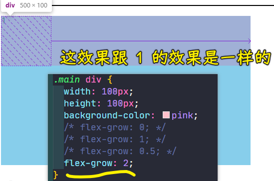

可以看到这效果其实跟 `1` 的效果是一样的。

我们可以得出这样一个结论：

> 当这个比例值大于等于 `1` 的时候，其实都会占满整个空间。

这样的话，这个写 `1` 、写 `2`、 写 `3` 其实得到的效果是相同的。

以上就是我们有一个元素的时候的一个效果了！

### <mark>6）两个元素时，剩余空间按比例分配</mark>

接下来我们来看一下，当我们有两个或者是三个等这样的多个子元素的时候，子元素这个占满剩余空间，它又是怎样分配的？

#### <mark>1、默认情况</mark>

两个元素的默认情况：

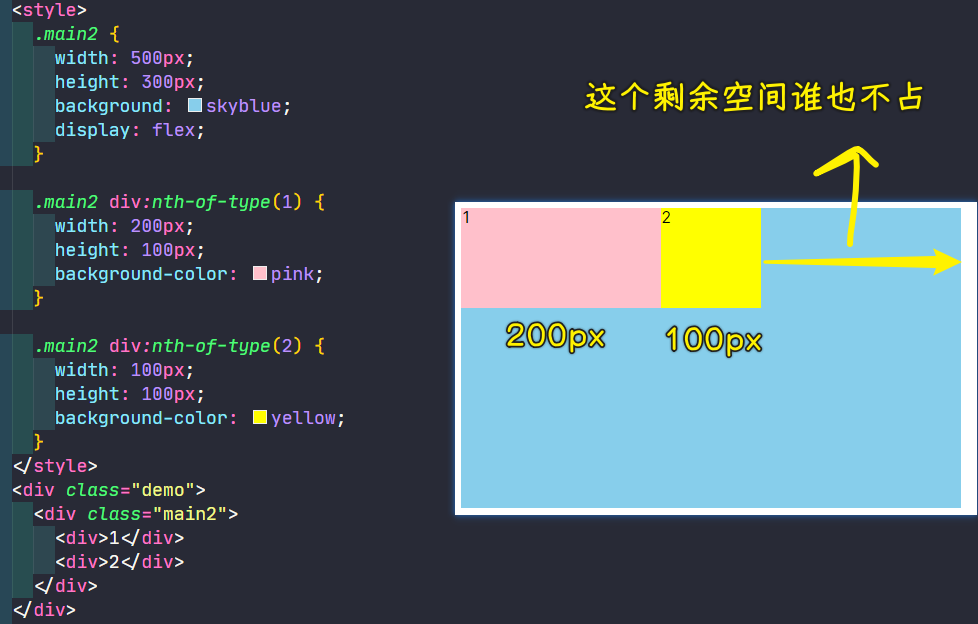

可以看到剩余空间其实还是有的。那大家想想现在的剩余空间是多少呢？

总共的容器是 `500px`，然后刨去我们的这个第一个元素所占的宽度，以及第二个元素所占的宽度之后，那剩余的空间其实只有 `200` 个像素了。

#### <mark>2、给其中一个元素`flex-grow: 1`</mark>

既然剩余空间有 `200`个像素，那直接给第二个子元素来一个`flex-grow: 1`，那该子元素是不是就会把剩余的那 `200` 全部变成自己的呢？

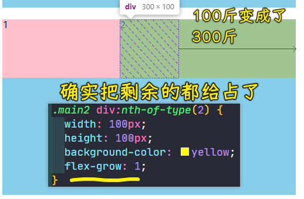

可以看到第二个`div`它现在就变成了`300`个大小了。从图中可以看到它所占据的这个扩展比例一块的距离，就是把那个 `200` 全给占上了。

同理，假如我把这个值拿给了我们的第一个，而不添加给我们的第二个：

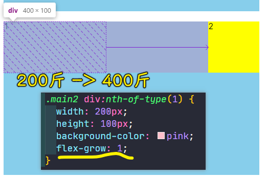

可以看到第一个`div`就把这个 `200` 占为了自己的容器的一个大小了。所以整个第一个就变成了 `400` 个像素了。从控制台提供的审查元素工具中可以看到它的实际初始值是 `200`，然后扩展的是 `200`，这样总共加起来就是 `400` 个像素。

#### <mark>3、两个元素都设置了`flex-grow`，且这俩设置的值都大于等于`1`</mark>

接下来最复杂的其实就是当它们两个都有这个扩展比例的时候会怎样？

其实都有扩展比例的时候，这时候就会对剩余空间进行这个等比分配。比如说：

- 剩余`200`，这俩元素的`flex-grow`都为`1`，那剩余空间就各自占一半呗！ -> 这是成比例分配的！


如果现在第一个是 `2`，第一个是 `1` 的话，这又会怎样呢？

这就会把剩余空间分成`3`份，第一个就会占`2/3`，而第二个则是占`1/3`

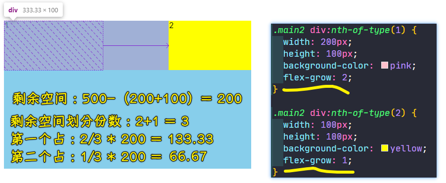

我们可以明显发现那个箭头一块的间距是一个 2 比 1 的关系：

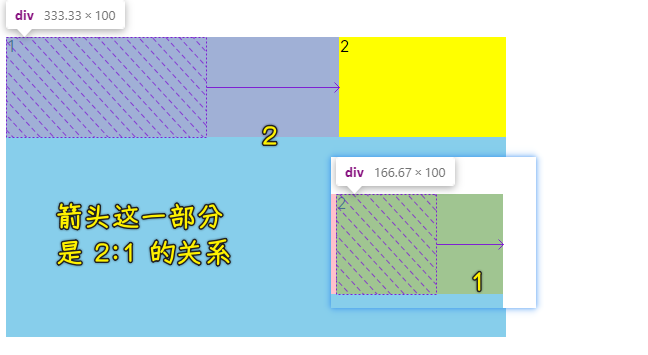

所以说这是把`200`分成 3 份，然后再分别去设置一下。

这个也是很简单的，也就是说我们这种扩展比例就是这样来设计的。

#### <mark>4、两个元素都设置了`flex-grow`，且这俩设置的值都小于`1`</mark>

同理，如果它俩累加的时候不满足大于等于 `1` 的时候，这会怎样呢？

比如第一个`div`是`0.2`，第二个`div`是`0.1`：


可以看到，这时候容器它还会有剩余空间。也就是说目前我们把剩余空间分成 `10` 份的话，那第一块它会占`2`份，而第二块则会占`1`份，那剩余的 `7` 份其实还是会在这个剩余的空间这一块儿来表示。

> 200 -> 分 10 份 -> 平均一份 20 -> 第一个`div`要两份，第二个`div`要一份！

所以说这个空的空间其实占了之前剩余空间的 `7` 份，而「一」这个元素它其实占了两份儿，而我们「二」这个元素它其实占了一份儿。

### <mark>7）总结</mark>

好好瞧瞧这里面的这个关系，也就是说`flex-grow`这个 `1` 作为临界点是非常重要的，大于等于 `1` 的时候是**占满整个空间**，如果说是小于 `1` 的时候，它其实并**不会占满整个空间**。而当**多个元素**的时候，它是会把这个比例值进行一个重新分配的，它会根据咱们这两个元素之间的**比值关系**来自动的分配剩余空间应该占比多少。

希望同学们能够自行的去尝试一下，来感受一下这种扩展比例给我们带来的这个分配的情况。

## ★flex-shrink 收缩比例

在本小节当中，我们来了解`flex-shrink`属性，它是收缩比例，可以发现它跟我们上一个小节当中讲的`flex-grow`其实是很像的，就是一对相反的操作行为。

之前的`grow`它是扩展比例，而我们的`shrink`是这个收缩比例。也就是说当我们的子项大于我们的这个父容器的时候，我们又该如何处理呢？

### <mark>1）默认值是`1`的情况</mark>

接下来我们来看一下它的一个表示方式：

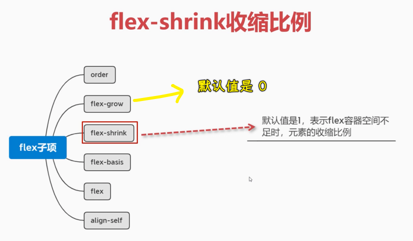

它的默认值正好跟刚才的这个`grow`是反过来的，它的默认值是 `1`，表示 flex 容器空间不足时，元素的收缩比例。

接下来我们一起来看一下效果，看一下我们这个收缩比例到底指的是什么意思。

先来看只有一个元素的情况

1. 子元素`600*100` -> 显然会溢出
2. 父容器`500*200` -> `flex`

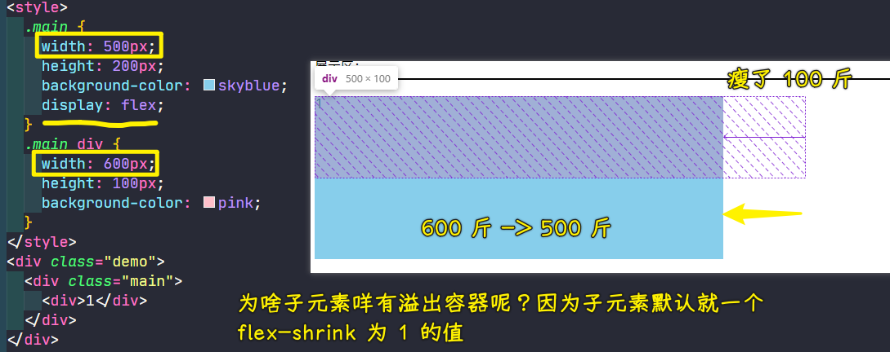

可以发现子元素它并没有溢出，而是跟我们的这个容器大小相同，这就说明子元素进行了默认的收缩了！

600 像素收缩成了 500 个像素，这就是默认的特点：

> `flex-shrink: 1` -> 表示自动收缩到跟容器的宽相同

所以说你写的这个尺寸其实最终显示在弹性当中，它不一定是跟你所写的是一样的，它有可能已经收缩掉了。从图中可以看到，这个现象是要在它溢出我们这个容器的时候才能看到的，否则比如说**你小于这个容器的时候，你加这个`flex-shrink`属性是没有意义的**。

### <mark>2）`flex-shrink`为`0`的情况</mark>

接下来我们就来尝试一下设置别的值。

比如说选择`0`，`shrink`为`0`就是说不让子元素进行自动收缩：

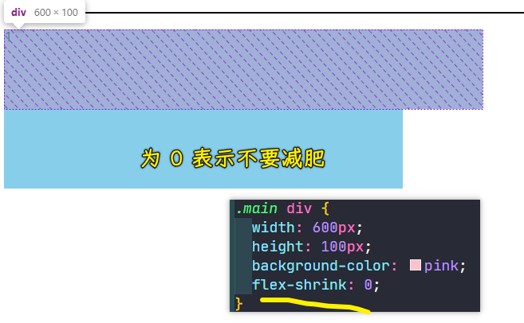

可以看到，为`0`这时候子元素就能够以它正常设置的这个宽度来进行渲染了，而溢出的部分也能看得到了。

### <mark>3）`flex-shrink`为`0.5`的情况</mark>

接下来我们再来看，假设我们选择`0.5`，这又会怎样呢？我们来看一下：

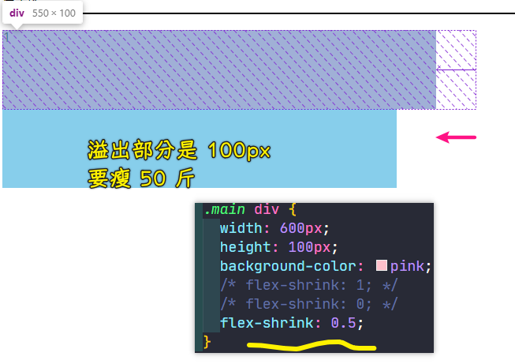

对于收缩这一块（溢出那部分），`1`是完全收缩，这子元素的宽度正好跟父容器一样，而`0.5`其实也是把溢出的部分按比例进行收缩，而不是完全收缩。所以你可以明显发现它收缩的这个比例就是收缩了整个溢出空间的 `1/2`，也就是 `0.5`。

其实这一个元素的计算是比较简单的，它其实难在我们多个元素的时候，而且多个元素的宽度不相同的时候又会怎样呢？这个就稍微麻烦一点了，接下来我来给大家进行演示一下。

### <mark>4）`flex-shrink`在多个元素下的表现</mark>

#### <mark>1、`flex-shrink`的默认情况</mark>

1. 一个父元素 -> `500*200` -> `flex`
2. 两个子元素 -> 宽度不一样，第一个是`300*100`，第二个是`400*100` -> 溢出了`200px`的宽

默认情况，会自动收缩：

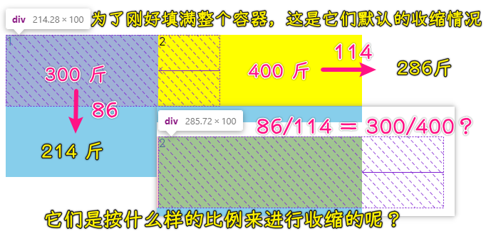

它们俩默认会缩放到跟容器有一个相同的大小。目前这两个元素的宽都出现了小数，而且它们俩收缩的大小是不相同的，第一块收缩的明显要小一点，而第二块明显收缩的要大一点！

这就说明了它们其实不会对我们这溢出的整个空间进行一个等比分配。简单来说，现在溢出了`200px`，难道它们俩个各收缩 `100` 吗？显然，这并不是，如果各自都收缩`100`，那第一个就是`200px`宽，第二个就是`300px`宽了，但实际上我们所看到的并不是我们所想象的，从这图中可以看到它出现了小数的！

所以，它是究竟如何来进行收缩的呢？

接下来我给大家说一说它是如何进行收缩的。

其实它是这样的：

它会根据当前这个子元素的宽度来进行这个占比的。

不是很懂？那我举个例子（这里面的计算会稍微繁琐一些）：

1. 元素`1` -> `300`宽 -> 占比`3/7`，总共 7 份，元素`1`占 3 份
2. 元素`2` -> `400`宽 -> 占比`4/7`，总共 7 份，元素`1`占 4 份
3. 剩余空间是`200`，所以元素`1` 需要收缩了`3/7 * 200`，元素`2`则需要收缩了`4/7 * 200`

所以说这并不是完全等比分配的，而是要根据它自身宽度来决定这个剩余空间的份数。

所以这时候我们再用原来的`300 or 400`减去它这个分配的`3/7 * 200 or 4/7 * 200`就可以得到我们这个当前的元素的宽度`241 or 286`了。


针对两个元素，这就是`flex-shrink`为默认值`1`时的特点了！

#### <mark>2、一个`flex-shrink`是`2`，一个`flex-shrink`是`1`的情况</mark>

问题来了，假如元素`1`收缩`2`，元素`2`收缩`1`，这时又该如何进行计算呢？也就是说第一块儿它收缩的这个比例`2`是第二块儿收缩比例`1`的这个二倍。

``` css
.main2 div:nth-of-type(1) {
  width: 300px;
  height: 100px;
  background-color: pink;
  flex-shrink: 2;
}

.main2 div:nth-of-type(2) {
  width: 400px;
  height: 100px;
  background-color: yellow;
  flex-shrink: 1;
}
```

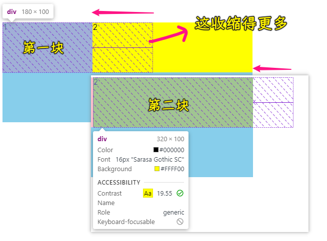

很明显第一块儿收缩的更多了。第一块收缩完后是`180`，第二块则是`320`，所以这相应的这个宽度值是如何来得来的呢？

接下来就来给大家说说这该如何计算。

1. 现在的份数：`2 * 300+1 * 400 = 1000` -> 10 份
2. 第一块：占了 6 份，所以它需要收缩的大小是`6/10 * 200` -> `120`
3. 第二块：占了 4 份 -> `4/10 * 200` -> `80`

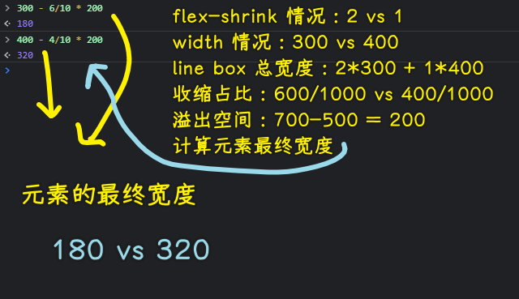

这就是它的计算原理了，也就是说**剩余空间是跟宽度有关联的**，这个细节一定要注意。当然，我们平时在做这个开发的时候并不会去做这么细，其实我们更多的就是要么就适配容器，要么就主让它收缩或者是扩展等等，其实，对于这些你自动调节一下就 ok 了，不用纠结这到底应该是多少个像素，只是说我们学习的时候要知道这个底层的原理。

#### <mark>3、两个元素的`flex-shrink`相加起来小于`1`的情况</mark>

知道这些之后，我们再来看一下：如果它们俩的`flex-shrink`相加不满足`1`，那么它们俩之间肯定会溢出一部分内容的，比如`0.2`和`0.1`：

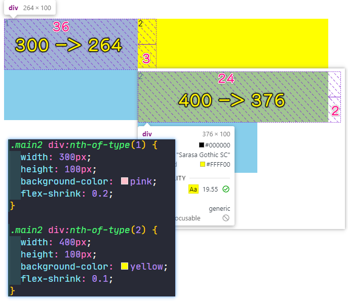

计算公式如下：

- 总权重：`0.2*300 + 0.1*400 = 100` -> 每个元素的`shrink * width`相加
- 溢出空间：`300+400 - 500 = 200` -> 子元素宽之和，减去父容器宽
- 要收缩的空间：只会收缩溢出空间`200px`的`(0.2 + 0.1) / 1`即`30%`的空间：`60px` -> 事先说明有多少空间要被收缩
- 每个元素要收缩的空间： -> 根据子元素的宽度以及收缩比例来决定这个元素要收缩（减少）多少宽度
  - 元素 1：`60 * 0.2(flex-shrink) * 300(width) / 100 = 36px`
  - 元素 2：`60 * 0.1(flex-shrink) * 400(width) / 100 = 24px`
- 每个元素的最终宽度：
  - 元素 1：`300 - 36 = 264px`
  - 元素 1：`400 - 24 = 376px`

可以看到这有很大一部分溢出容器的，这个跟我们那个扩展是类似的，也就是说它们必须得相加的和是大于等于 `1` 的时候，这其实才会完全收缩到我们这个 Flex 容器当中。

---

以上就是我们这个收缩的效果，大家可以去消化一下，了解一下，你会发现这个有扩展有收缩这样的两个属性原来是非常重要的，以前根本就没有意识到。后期我会给大家做一些关于子项的一些相关的布局案例，让大家了解一下平时我们是怎么来用它们的。

## ★总结

`flex-grow`默认值是`0`：

数字越大扩张得越多！

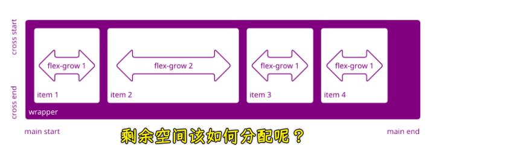

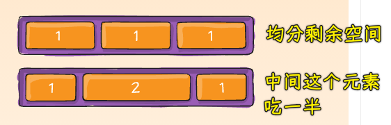

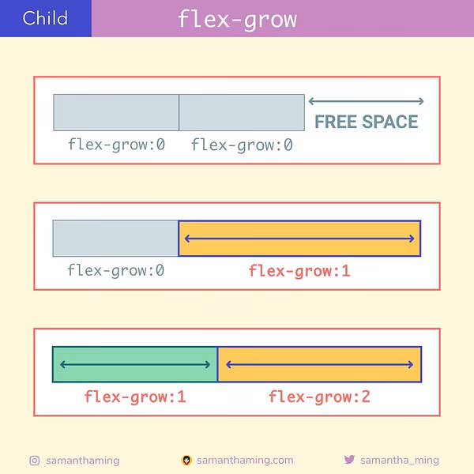

计算规则：

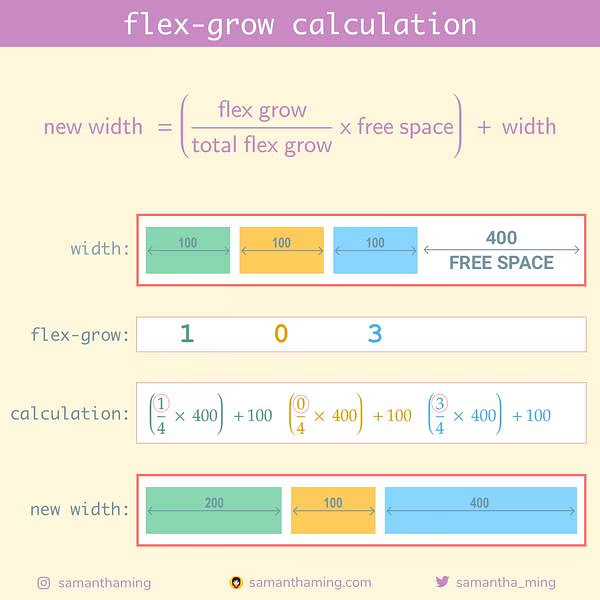

> 父元素是`700px`

---

`flex-shrink`默认值是`1`：

数字越大收缩得越多！

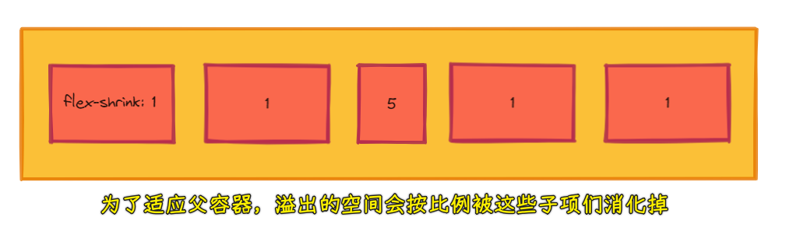

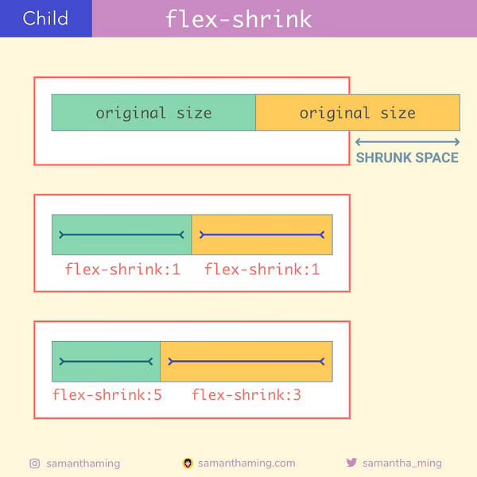

计算规则：

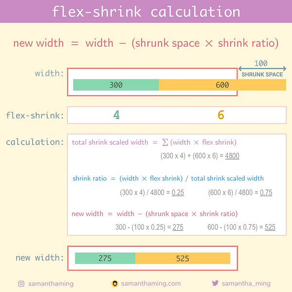

> 父元素是`800px`

---

- 如果所有元素的 `flex-grow/shrink` 之和大于等于 `1`，则所有子元素的尺寸一定会被调整到适应父元素的尺寸（在不考虑 `max/min-width/height` 的前提下）
- 如果 `flex-grow/shrink` 之和小于 `1`，则只会 grow 或 shrink 所有元素 `flex-grow/shrink` 之和相对于 `1` 的比例
- grow 时的每个元素的权重即为元素的 `flex-grow` 的值；shrink 时每个元素的权重则为元素 `flex-shrink` 乘以 `width` 后的值。

## ★了解更多

➹：[详解 flex-grow 与 flex-shrink · Issue #9 · xieranmaya/blog](https://github.com/xieranmaya/blog/issues/9)

➹：[写给自己看的 display: flex 布局教程 «  张鑫旭-鑫空间-鑫生活](https://www.zhangxinxu.com/wordpress/2018/10/display-flex-css3-css/)

➹：[Day 22: flex-grow calculation - SamanthaMing.com](https://www.samanthaming.com/flexbox30/22-flex-grow-calculation/)

➹：[Day 24: flex-shrink calculation - SamanthaMing.com](https://www.samanthaming.com/flexbox30/24-flex-shrink-calculation/)