### ✍️ Tangxt ⏳ 2021-10-15 🏷️ CSS

# 23-flex-basis、flex 缩写、order 排序、align-self 自个儿对齐

本小节当中我们将学习`flex-basis` 以及 `flex` 缩写，还有两个不常用的子项属性

## ★flex-basis

### <mark>1）是什么？</mark>

首先我们来看一下`flex-basis`它的含义。

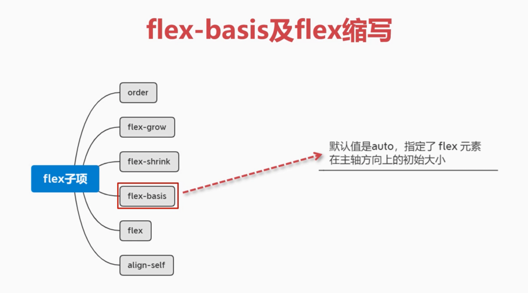

它的默认值是`auto`，指定了`flex`元素在主轴方向上的初始大小。

### <mark>2）`flex-basis`为`auto`以及`200px`的情况</mark>

接下来我通过代码来给大家演示一下。

1. 结构：`div.main > div`
2. 父元素`.main` -> `500*500` -> `flex`
3. 子元素`div` -> `100*100` -> `flex-basis`值是有单位`px`的，它的优先级大于`width`

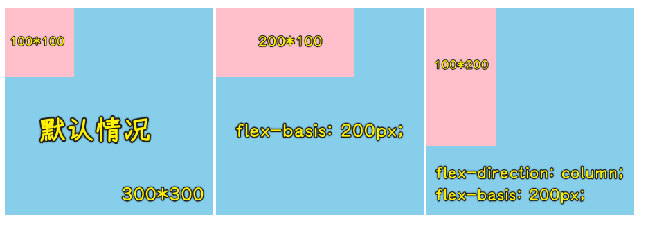

> 为了方便对比，我用了`300*300`的父容器

---

💡：不相关的话题，我在测试的时发现盒子里边的内容居然沿基线对齐

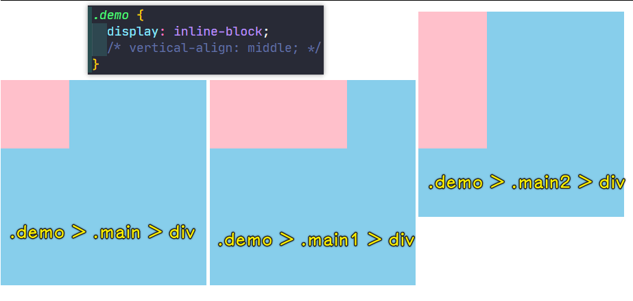

> 同处一行，不管其结构是怎样的，它们都是在一个行盒内的！而`demo`就是内联盒

---

`flex-basis`指定该子元素在主轴上的一个尺寸大小，也就是说在主轴上的它所占据的这个宽度，当然，它默认是以主轴来作为宽度的，如果说你是垂直方向的话，那它其实就变成高度了。

- 主轴是水平方向的情况下，你会发现这个`flex-basis: 200px;`就会覆盖子元素设置的这个宽度。也就是说在水平是这个主轴的情况下， `flex-basis`它的优先级是大于宽度的。注意：它其实并不是完全替代宽这么简单。
- 如果现在我们把这个方向改成垂直方向，即当主轴变成垂直方向时，那现在的这个`flex-basis`的优先级其实就大于高度了，也就是说会对高度进行一个替换。这个时候`flex-basis`就代表着垂直方向的这个高了。

可以看到，`flex-basis`不是单纯的指宽，也不是单纯的指高度，而是在我们主轴上的一个尺寸大小。

### <mark>3）为啥要使用`flex-basis`？</mark>

那问题来了，我们用这个`flex-basis`能干啥呢？

它可以更加方便灵活的设置元素的方向。

怎么说？

比如我们现在的需求是这样的：

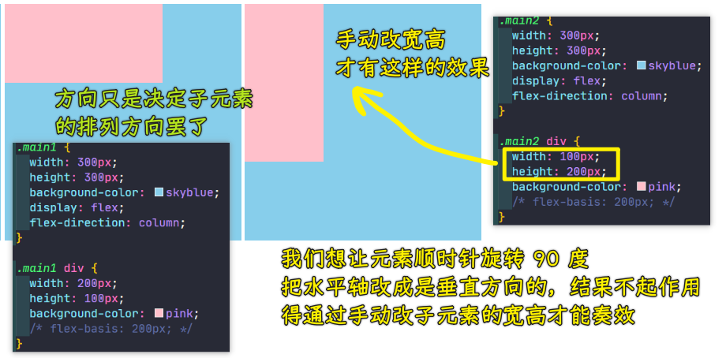

而现在有了`flex-basis`：

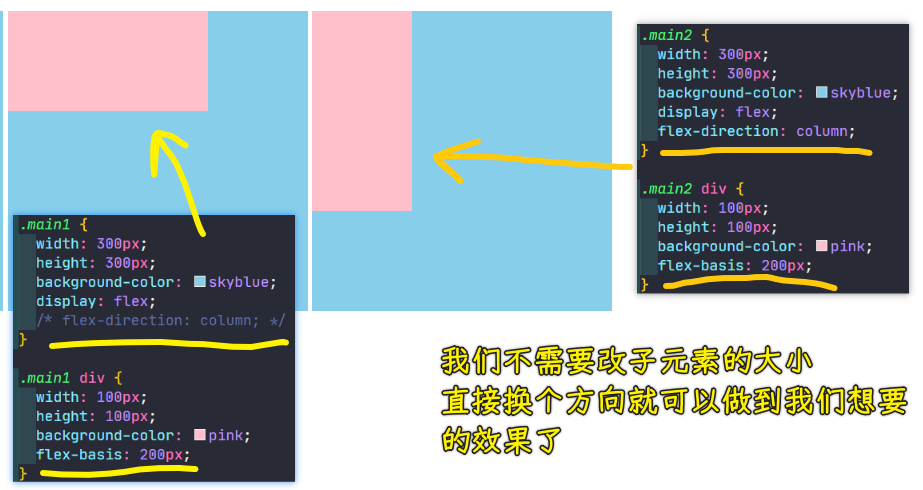

可以看到，这个方向只要一改变，那它的一个排列就会发生变化，这是它的功能！

### <mark>4）`flex-basis`有哪些可选的值？</mark>

接下来我们看看`flex-basis`有哪些可选的值。

刚才我们说到`flex-basis`的默认值是`auto`，那`flex-basis`写像素和写`auto`到底有什么样的区别呢？

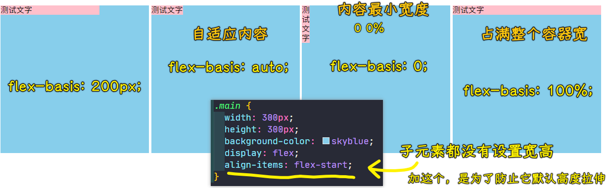

> `0px = 0% = 0em = 0pt = 0`（都`0`了，写不写单位无所谓了） -> 例外`0 0s 0ms`

所以，`flex-basis`的可选值有：`0% auto 200px 100% `

## ★flex

介绍完我们主轴方向上的尺寸之后，再来看一下我们的`flex`属性，它其实是缩写，那它是谁的缩写呢？我们一起来看一下。

### <mark>1）概述</mark>

`flex`属性是`flex-grow`、`flex-shrink`以及`flex-basis`这样三个属性的一个缩写。

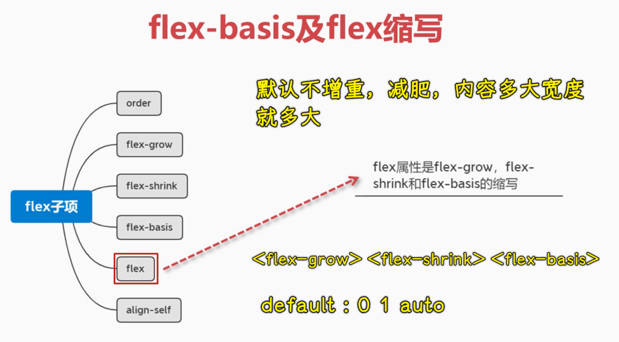

### <mark>2）`flex`为`1`或`0`的情况</mark>

接下来我们来看一下 `flex` 这种复合样式，它究竟对应的是哪些值？

先来个`flex`为`1`的情况：


接下来看看`flex`选择为`0`的情况：

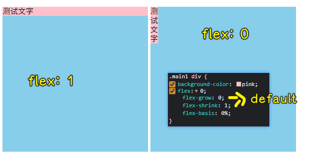

`flex`为`1`和`flex`为`0`的区别：控制了`flex-grow`的值

### <mark>3）`flex`为`auto`的情况</mark>

接下来我们再来看，还有我们一般会选择的就是`auto`，我们看看`auto`这种又会怎样：

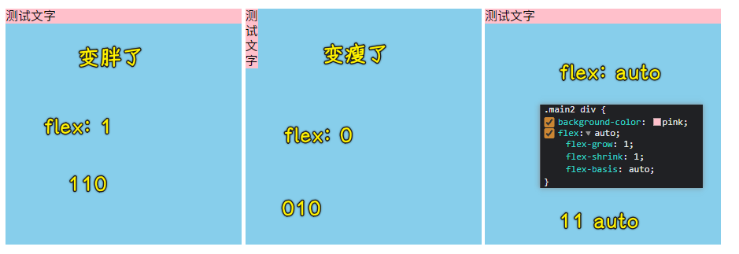

你光写`auto`那它就不是比例值了，而是认为这是尺寸了（也就是`flex-basis`为`auto`值），所以它会给我们返回这样一个结果：

``` css
.main2 div {
  flex-grow: 1;
  flex-shrink: 1;
  flex-basis: auto;
}
```

当然，这些`1、0、auto`所代表的具体的值，我们不用特意去记，我**建议大家分开去设置**。如果是复合样式用的比较多的组合，那就可以选择到底是`1`、`0`还是`auto`了

除了这样的选择以外，那我们还有什么样的选择呢？

### <mark>4）不写一个值，而是写三个值</mark>

其实我们可以直接一起性写三个值，比如：

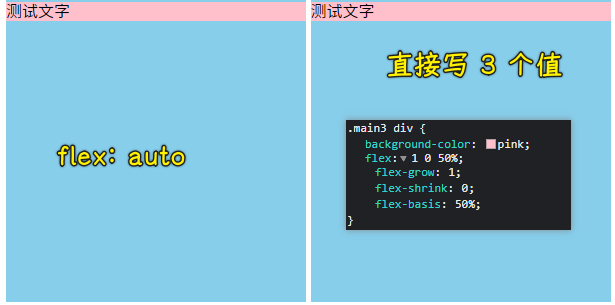

这是正常情况下三个都写的情况 -> 每个坑位的值会一一对应相应的属性

好了，`flex`简写大概就是这样一个情况了，大家可以根据这个它的一个结果来选择对应的这个操作。

👇：接下来我们再来看一下在子项上其实还有**两个不太常用的属性**，我们也来了解一下，这样一来，我就把所有的子项的属性都给大家介绍完毕了，然后我们再去做一些案例，以此来看一下这些属性如何在实际应用当中来做。

## ★order

### <mark>1）概述</mark>

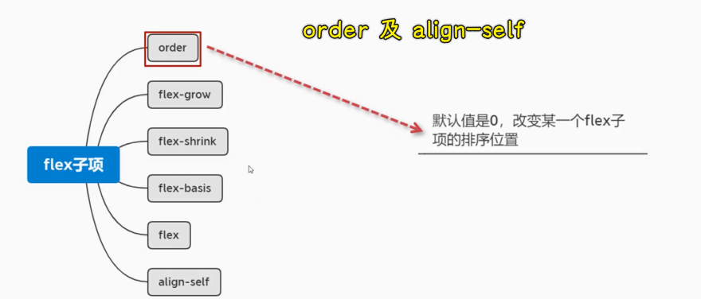

首先我们看一下这个`order`，`order`就是排序的意思，它的默认值是`0`，用来改变某一个 flex 子项的排序顺序，也就是排序的位置。

### <mark>2）默认情况下，子项的排序按在 HTML 中写的顺序来排</mark>

接下来我们来看一下这个怎么用。

1. 容器：`500*500`，`flex`
2. 子元素：有 4 个，`100*100`

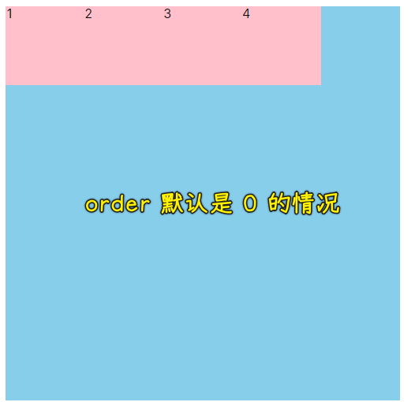

可以看到，正常来说，它是按照你写的这个顺序来进行排序的，而它们的这个顺序的默认值都是 `0`。

### <mark>3）`order`为`1`的情况，也就是在所有子项当中最大的情况</mark>

那我现在就可以作出调整了。

比如说选择第一个元素，让它的`order`为`1`，这样的话这第一个它肯定会排到最后一位：

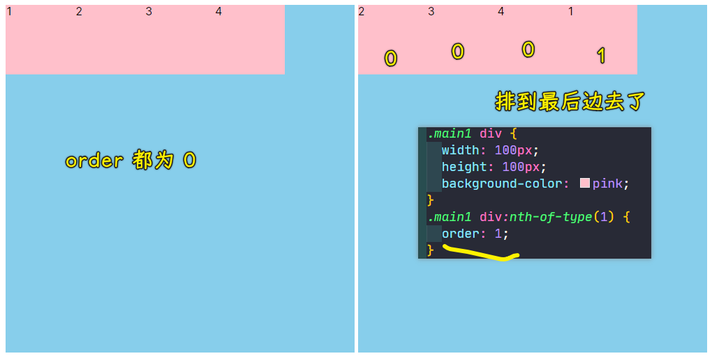

为啥会这样呢？因为其它子项的`order`默认是 `0`，而第一个子项的`order`选择为`1`之后，那该子项的优先级肯定是最高的，而优先级最高则会排到整个子项当中的**最后一个坑位**。

### <mark>4）`order`可以为负数，如`-1`这种情况，也就是在所有子项当中最小的情况</mark>

同样，如果我们现在也可以给子项负数，负数的优先级会比这个`0`默认的要小，所以该子项会排到**最前面**：

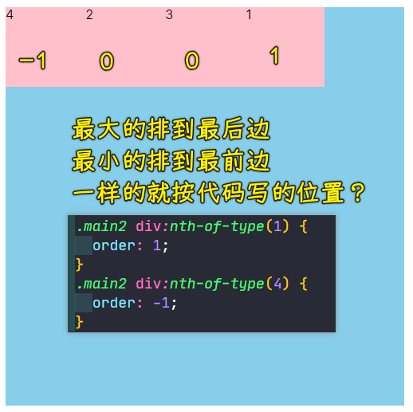

### <mark>5）小结</mark>

以上就是排序`order`对子项做的一个简单的排序了，这个`order`有时候也会用得上，但是大部分情况下我们经常还是用不到这个东西的，总之，了解一下就可以了。

👇：接着我们来看一下最后一个。

## ★align-self

最后一个其实是针对**单独的子元素**进行这个对齐的。

### <mark>1）概述</mark>

我们来看一下它的解释：

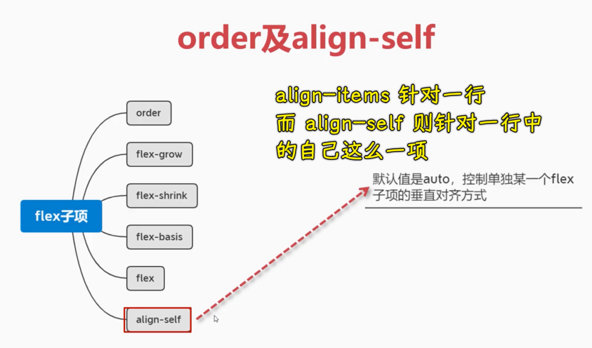

`align-self`它的默认值就是`auto`，用来控制单独某一个 flex 子项的垂直对齐方向，也就是说它是`align-items`里边的针对单独子项的一个同样的操作。

这是什么意思呢？我们一起来看一下。

### <mark>2）`align-selft`为默认值`auto`的情况</mark>

1. 父容器：`500*500` -> `flex` -> `align-items: center`
2. 子元素：有 4 个，`100*100` -> 其中第四个单独设置高为`50`

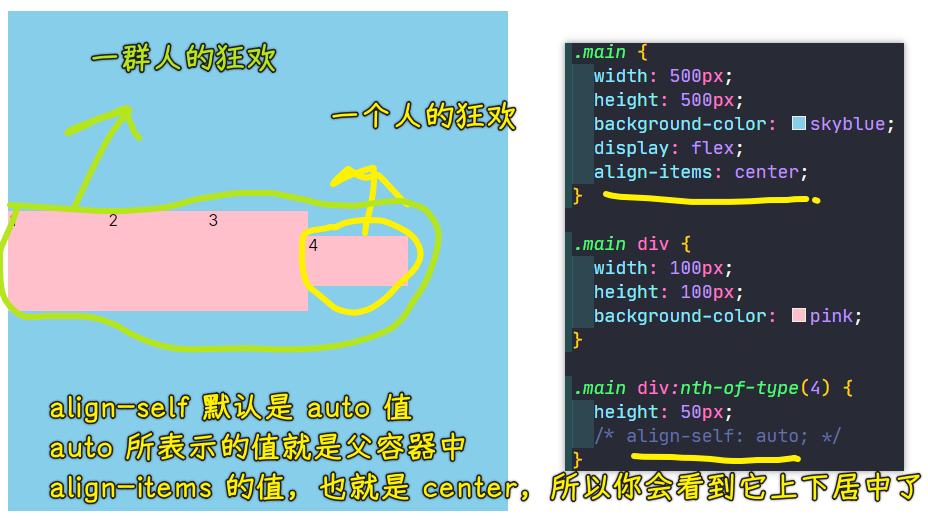

`align-self`它的默认值就是`auto`，这个`auto`的含义就是说它跟这个父容器当中的`align-items`的值是相同的。

- 子项`align-self`为`auto`值：
  - 父容器的`align-items`为`center`，那`auto`就是`center`值
  - 父容器的`align-items`为`flex-start`，那`auto`就是`flex-start`值
  - ……

知道这个现象之后，我们来改一下这个值。

### <mark>3）`align-self`为`flex-start`的情况</mark>

比如`flex-start`：

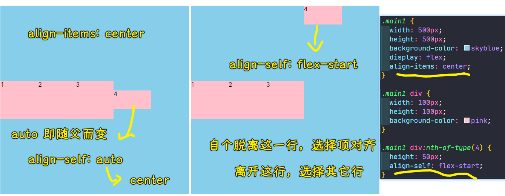

我们还可以选择`flex-end`、`baseline`等，总之**它的用法跟`align-items`的这个用法是一样的，只不过`align-items`它是针对整体的，而我们的这个`align-self`只是针对某一个元素的，每一个小元素的** -> 所以这就比较有针对性了。

---

至此，所有的关于 flex 子项的属性，就介绍到这儿了，从下一小节开始，我们将陆续地来做几个小的布局案例，来看一下我们刚才这几节学的语法，在子项当中是如何进行实际的布局的。

## ★总结

`flex-basis`默认值是`auto`（or `<width>`）：

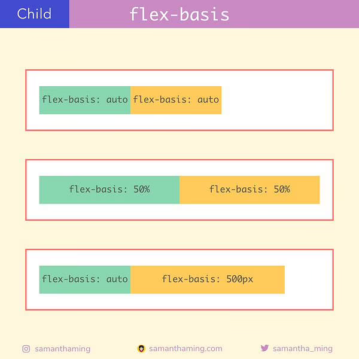

`flex-basis` vs widths：

当子项设置了`width`，那浏览器会始终使用`flex-basis`的值，但要注意的是，如果子项也设置了最小宽度`min-width`和最大宽度`max-width`，那在这些情况下，`flex-basis`就会失效，它不会被浏览器当作是子项的宽度。

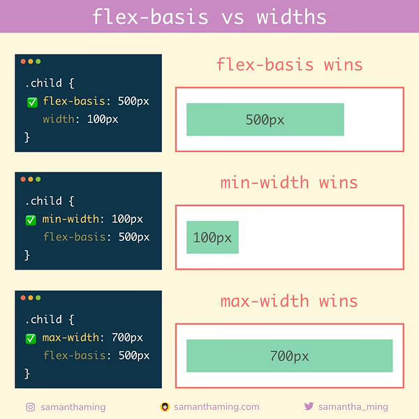

---

`flex`：

``` css
.child {
  flex: 0 1 auto /* default */
    /* 
    or <flex-grow> <flex-shrink> <flex-basis>
    or <flex-grow>
    or <flex-basis>
    or <flex-grow> <flex-basis>
    or <flex-grow> <flex-shrink> 
    */
}
```

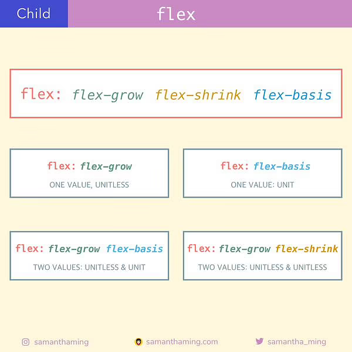

---

`order`默认值是`0`（`number`）：

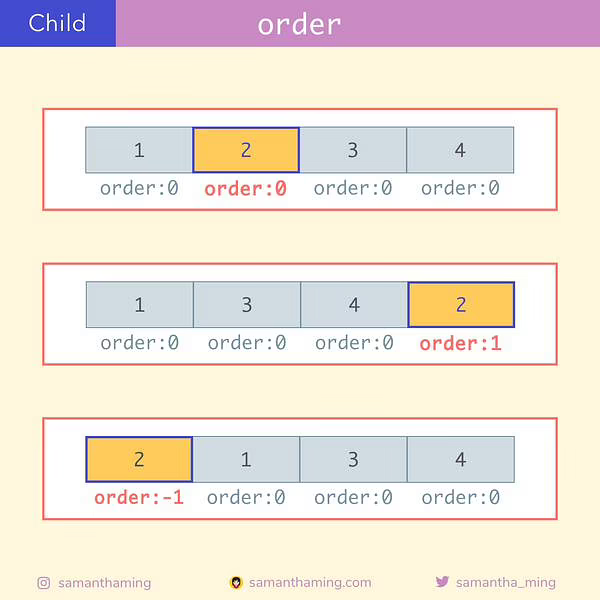

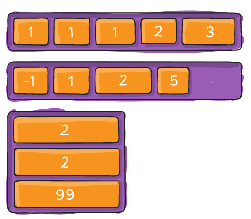

---

`align-self`：

`align-items`下的子项是结盟的，遵循联盟的规则，而设置了`align-self`相当于是自个儿打破规则，特立独行

``` css
.child-1 {
  align-self: stretch /* default */
    /* 
    or flex-start
    or flex-end
    or center
    or baseline 
    */
}
```

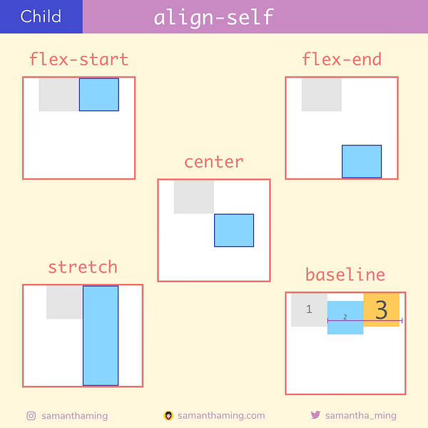

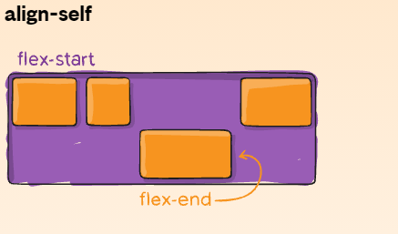

## ★了解更多

➹：[Day 28: align-self - SamanthaMing.com](https://www.samanthaming.com/flexbox30/28-align-self/)

➹：[properties - 'property: 0' or 'property: 0px' in CSS? - Stack Overflow](https://stackoverflow.com/questions/4318471/property-0-or-property-0px-in-css)
