### ✍️ Tangxt ⏳ 2021-10-16 🏷️ CSS

# 24-等高布局、两列与三列布局

## ★等高布局

前面我们已经介绍了 flex 子项的相关语法。那接下来我们利用 flex 的子项来做一些常见的布局方案。首先先来看一下等高布局。

### <mark>1）是什么？</mark>

什么是等高布局呢？大家可以看到这张图：

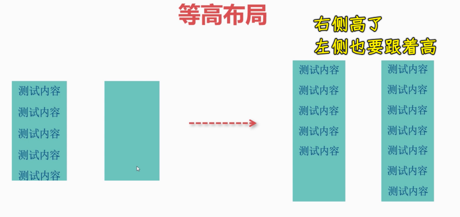

也就是说当我们有**多列**这样排列的时候，如果其中一列的内容比另外一列的内容要高的时候，它俩的高度是相同的。这时候不管是左边的一列还是右边的一列，其实都是可以等高的。

比如说图中右边这张图，当右侧的这个内容高于左侧的内容时候，它其实也会把左侧的高度带到跟右侧一样的高度，这就叫等高布局。

那这种等高布局，如果说用传统的比如说浮动，包括一些盒子模型来做的话其实是非常麻烦的，当然，这也不是说不能做，只是比较麻烦罢了！而我们用弹性布局来做这种方案是非常容易的，因为弹性布局当中它默认的这个子项就是拉伸的，也就是说我们这个`stretch`的一种默认姿势。

### <mark>2）用弹性来做</mark>

那接下来我们就一起来看一下如何来做。

1. 父元素：`div.main` -> `flex` -> 端点对齐 
2. 子元素：有两个`div1`、`div2`
3. 孙子元素：`div1`旗下有四个子元素

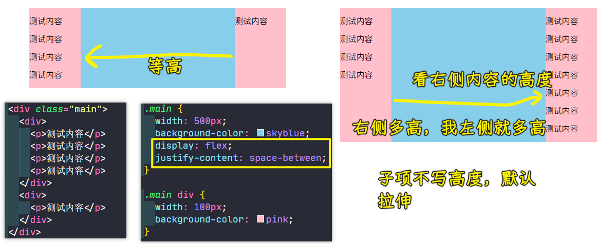

当这个左侧这一列它的内容多的时候，其右侧这一列也会自己撑开，因为这个子项默认就是一个拉伸的`align-content: stretch`，所以用 Flex 是非常容易做到等高布局。

同理，我们让右侧的内容更高，即多加几个`p`元素，从图中可以发现当右侧这个内容比较多时，左侧也能够自动拉伸。

实现这样的效果其实是非常简单的，为啥这样说呢？因为弹性默认就是这样一个特点，做这样的等高布局，可以说是 so easy！

除了这种弹性以外，我们用传统的这个浮动能不能同样做到呢？

其实也能做，但是比较麻烦。

### <mark>3）用浮动来做</mark>

这里我给大家稍微演示一下，大家知道一下这个怎么做就行了 -> 其实它比较繁琐。

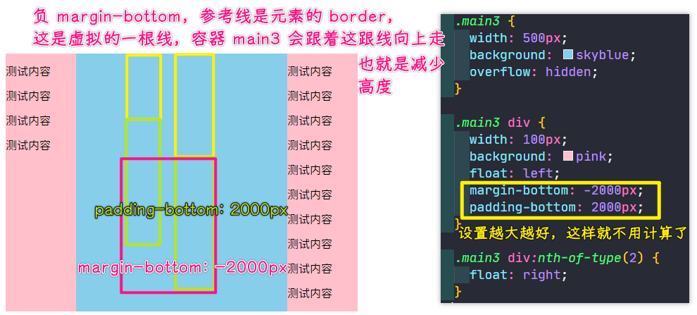

> 为啥设置`margin-bottom`会抵消呢？ -> 个人猜测，触发 BFC 清除浮动，会多出一个无内容`div`，它一直在容器的最底下，当我们对设置第二个元素设置`margin-bottom: -2000px`时，那该无内容`div`就会上移了！ -> 一个浮动底下会有一个`div`，必须都设置`margin-bottom: -2000px`才会起作用！

💡：题外话，关于负`margin`？

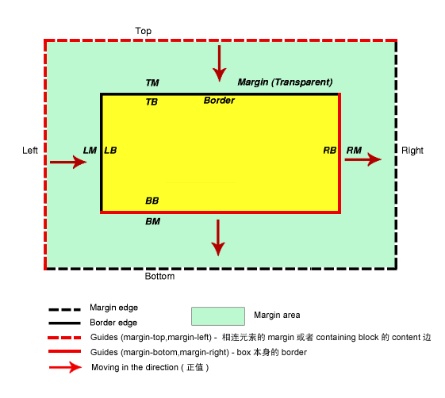

当`margin-top、left`为负值的时候与参考线的距离减少，当`margin-right、bottom`为负值的时候参考线就向左、上面移动 -> 简单来说，就是元素的`margin-top、left`为负值时自己会移动，元素的`margin-right、bottom`为负值时，相邻的右边元素或下边元素会移动！

这跟参考线是虚拟的……参考线在谁身上，那这跟线所代表的元素是不会移动的！但参考线实际是虚拟的，它是会移动的！如相邻上下两个元素，下边这个元素有`margin-top: -50px`，此时参考线是在上边这个元素，所以在显示的时候不管下边这个元素的`margin-top: -50px`如何上下移动，这个上边元素它是不会移动的！所以下边元素会向上移动的！当你对上边元素设置`margin-bottom`为负值时，那参考线就是在自己身上了，那自身就不会有上下移动的变化了，它会影响到它的下边元素，即下边元素会往上移，如果没有下边元素，那么父容器，也就是包含块的高度就会减少了！

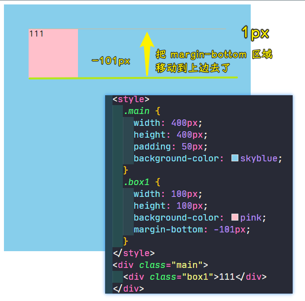

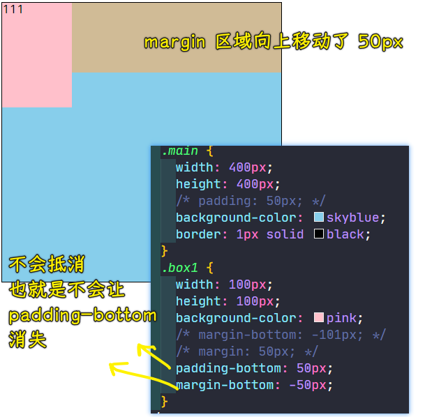

---

- 给两个子元素左右浮动
- 给两个子元素添加`margin-bottom`，该值是负的，多大都行，最好越大越好！ -> 负值可以把容器缩小，如果是正值就会容器撑开，但是一个负值就会让容器永远撑不开。

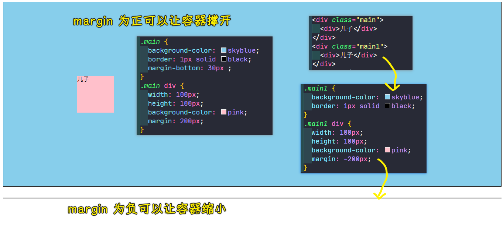

如何让子元素跟父容器的高度相同？也就是相互低效

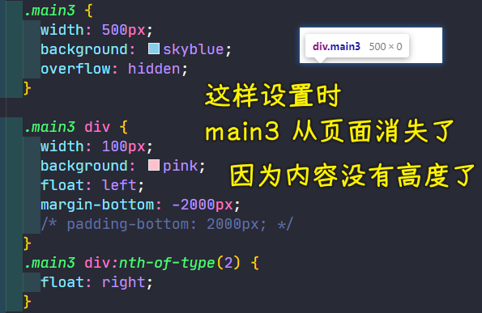

添加`padding-bottom: 2000px;`就好了：

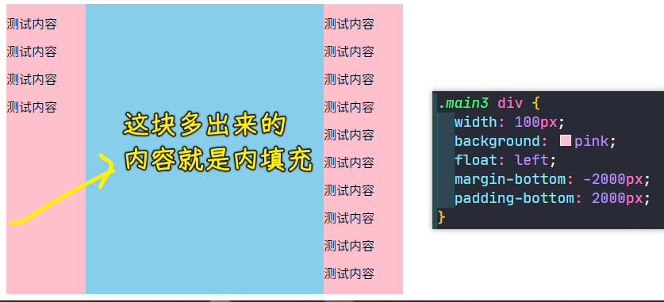

这是一个相互抵消的过程，子元素`padding-bottom`正值可以让父容器高度增大，但它的`margin-bottom`负值可以让父容器高度收回去！

这个方案其实非常的繁琐，知道一下就好了，现在已经不太推荐这么去用了。大家可以发现我们这个现代布局当中，用弹性来实现这种等高，其实是更合理的一种方式。这个浮动姿势了解一下就好了，它就是一种技巧罢了，得利用这个负`margin`值来相互抵消，然后用`padding`来充当这个障眼法。

这就是我们的这个等高布局，希望同学们多加练习。

## ★两列与三列布局

在本小节当中，我们来了解一下两列或三列布局，这种在我们的管理后台当中是非常常见的一种布局方案。

### <mark>1）是什么？</mark>

比如左侧一列是我们的菜单，右侧是我们的一个内容展示区域，或者是有那种三列的：左侧菜单以及右侧的这个辅助栏以及中间的这个主体内容，这就是我们的三列布局。

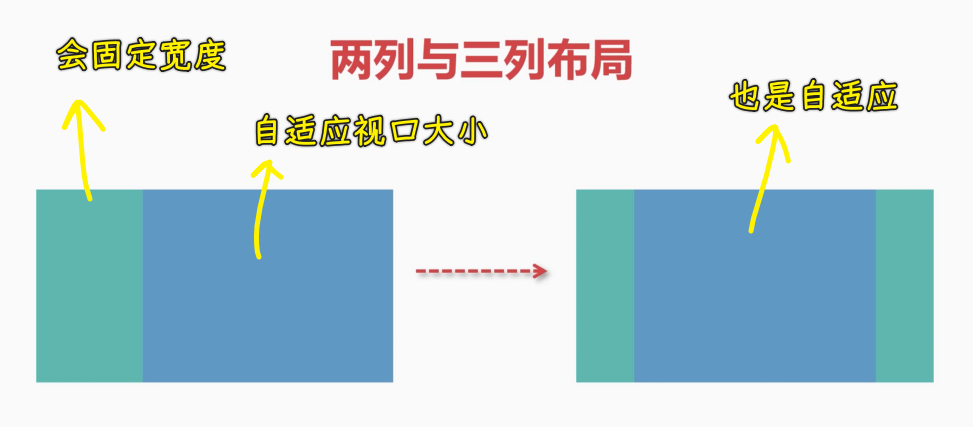

不管是两列布局还是三列布局，我们可以看到，它的基本特点就是这个两列的或者是三列的，其中有一些是固定宽度的，而我们这个蓝色区域一般都是一个自适应的宽度，也就是说蓝色区域可能会根据这个分辨率的不同做一个自适应的调整，这样的布局用弹性来做是非常容易的。

### <mark>2）用弹性来做</mark>

下面我来给大家做一个演示，演示一下是如何来做到的。

#### <mark>1、实现两列布局</mark>

先来两列的：

``` html
<style>
  body {
    margin: 0;
  }

  .main {
    /* 让容器的高度撑满整个高度视口 */
    height: 100vh;
    /* 不写宽度，默认宽度就是占满的，这是一个 block 特性 */
    background-color: skyblue;
    display: flex;
  }

  .col1 {
    width: 200px;
    background-color: pink;
  }

  .col2 {
    /* 自己是 0，吃掉剩余空间 */
    flex-grow: 1;
    background-color: springgreen;
  }
</style>
<div class="demo">
  <div class="main">
    <div class="col1"></div>
    <div class="col2"></div>
  </div>
</div>
```

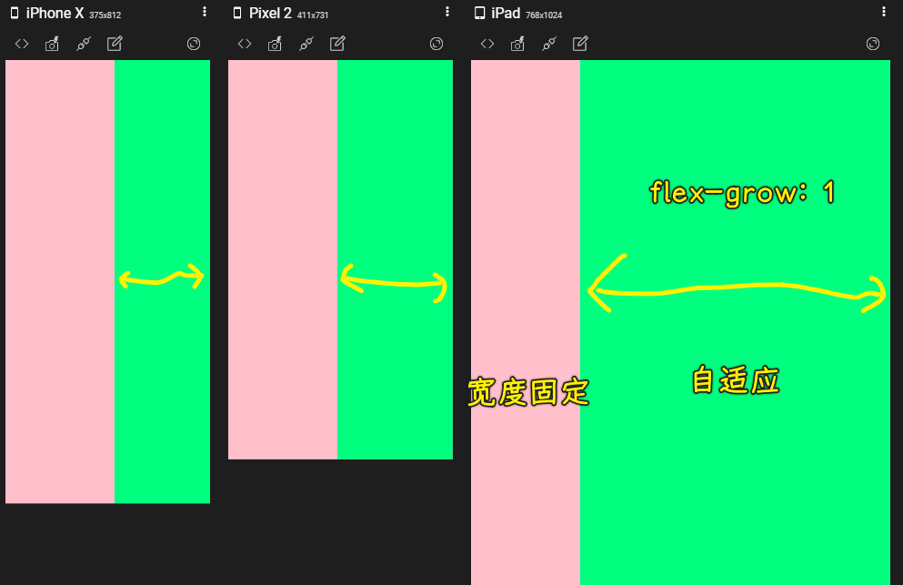

我们的左侧一列是固定的，而我们的第二列就是一个自适应的。不管我们的这个分辨率是怎么变化的，左侧这一列都是固定的，都是这么宽，而右侧这一列的宽度是自适应的，是可以变化的，这就是用我们的弹性来做的，这是非常容易的。

那如果说是三列布局呢？这是也是非常容易的。接下就来一起看一下吧！

#### <mark>2、实现三列布局</mark>

对于三列布局，在两列布局的基础上，我们不需要对这个结构以及样式做任何的修改，我们只需要加一个第三列然后给一个固定大小就好了：

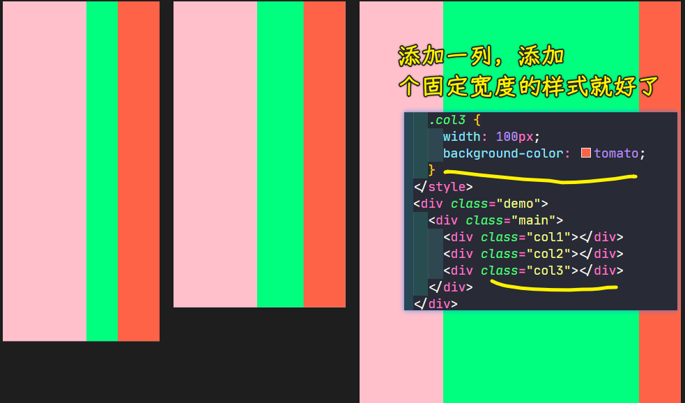

我们可以看到左右两列都是固定大小的，只有中间这一列是一个自适应的，这就达到了我们的三列布局，这也是非常常见的一种需求，而我们的弹性是非常容易实现的，而且扩展性非常强，即无论你怎么样去固定这两列，比如说你固定的两列是左边，那其余两列也是非常好调整的，我们不需要改任何结构，只需要稍微地把样式做一些微调就可以了。

这种多列布局其实在咱们这个普通的布局当中也可以做到。比如常用的手段，像我们的浮动、定位都可以去做。这里我们就简单的演示其中一种方案，就是用浮动来做，看看我是如何做到的。

### <mark>3）用浮动来做</mark>

#### <mark>1、实现两列布局</mark>

演示这个两列的：

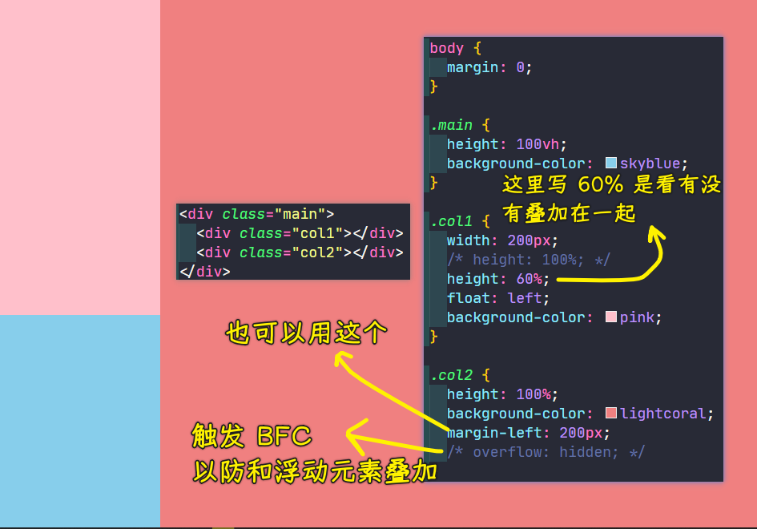

> 元素触发 BFC，让自个儿成为独立的区域，不会出现什么和其它元素叠加的现象！

#### <mark>2、实现三列布局</mark>

演示这个三列的：

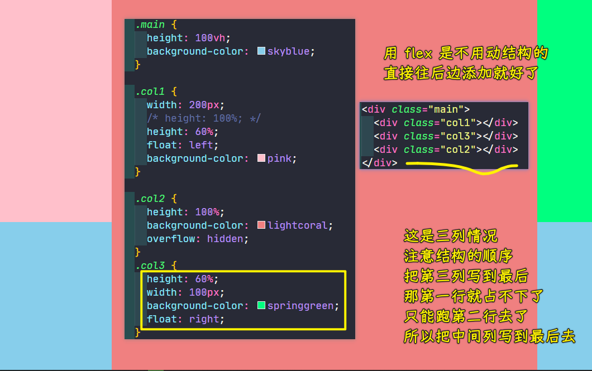

这些方案都可以做到。当然，不管怎么做还是没有弹性这样方便，因为弹性做这种多列布局还是非常容易的，只需要对指定的自适应的那一列，加入我们的`flex-grow`等于`1`就可以做到了。这个大家回去也可以去练习一下。

## ★了解更多

➹：[浅谈 margin 负值 - 知乎](https://zhuanlan.zhihu.com/p/25892372)

➹：[CSS 之圣杯布局与双飞翼布局 - 掘金](https://juejin.cn/post/6973562604581027853)