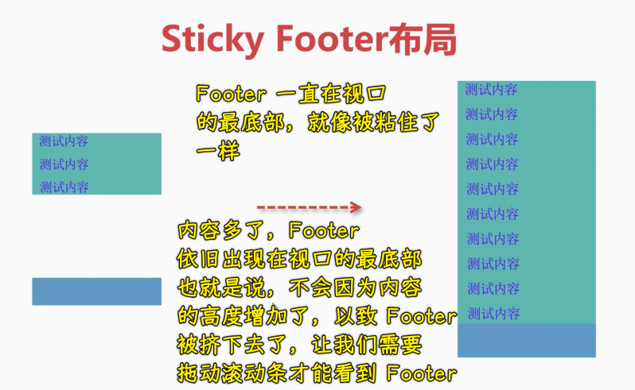

### ✍️ Tangxt ⏳ 2021-10-17 🏷️ CSS

# 25-Sticky Footer 布局、溢出项布局

## ★Sticky Footer 布局

本小节当中我们将了解一下 Sticky Footer 布局。

### <mark>1）是什么？</mark>

Sticky Footer 其实是粘性页脚这样一种方式。

那下面我们就来看一下什么是粘性页脚。



比如说我在左侧这张图当中，大家可以看到，假如我们页面的可视区是很高的，那有可能我们的内容是布满一屏的，这时候我们的页脚还是会在整个页面的最底端，但是一旦当我们的这个内容高于可视区的时候，这页脚其实就会往下自动的进行适配的。

这种方案其实就是我们的粘性页脚，而这种粘性页脚也非常适合用弹性来做。

### <mark>2）用弹性来做</mark>

接下来我给大家进行演示。

这种布局在移动端用的是比较多的，比如说管理系统用的都比较多。

1. `div.main > div.header + div.content + div.footer`
2. `.main` -> `min-height: 100vh`表示该容器的最小高度跟可视区域相同！内容多了，那就会延伸出可视区域！ -> 布局上中下 -> `flex` -> 方向`column`
3. `.content`是`flex-grow: 1`，占满整个剩余空间

> 最终的测试效果跟我想的不一，我还以为页脚一直在可视区的底部呢！

内容不多的情况：

``` html
<div class="main">
  <div class="header"></div>
  <div class="content">
    <p>测试内容</p>
    <p>测试内容</p> 
    <p>测试内容</p>
    <p>测试内容</p> 
    <p>测试内容</p>  
    <p>测试内容</p>
    <p>测试内容</p> 
  </div>
  <div class="footer"></div>
</div>
```


内容很多的情况：


可以看到，当内容多的时候，它会根据内容自动地把页脚给它推到最底端，以此来适配整个容器，用弹性实现这种黏性页脚的布局是非常容易的。

在后面我们的实战案例当中，也会用到咱们讲过的这些布局方案，然后我们做一些综合性的效果或者是一个案例，这其中就会用到这些布局。

在这里我们了解到这种粘性页脚的布局，用弹性来做是非常容易做到的。大家再消化一下。

> 这是粘性页脚布局，可不是用`position:sticky`的粘性布局。这里说的粘性页脚指的是，内容区内容不多时，Footer 就粘到视口的底部，一旦内容区内容多了，出现滚动条，Footer 就会失去粘性，适配到整个容器的最底部，紧挨着内容区！

## ★溢出项布局

在本小节当中，我们来了解一下什么叫做溢出项布局。

### <mark>1）是什么？</mark>

其实溢出项布局在移动端用的也比较多。


大家可以看到上面这张图是爱奇艺上的一个截图。在移动端，大家可以发现它的菜单非常长，比如说可视区域当中，它只会显示其中的一部分，但当鼠标或者是手指向左进行滑动的时候，它才会划出右侧隐藏的这个菜单。像这样的布局，我们就会把多余的内容给它溢出，然后给它滑动的时候再让它进入到可视区。

这种布局的原理，基本上就是下面这种方案，也就是说在这个绿色区域是我们的容器，容器内会显示一部分菜单项，多余的内容会排在它的这个右侧，整体看就这样排成一横行，当我们这个滑动的时候，就可以把溢出的部分给它显现出来了。

这样的布局，用传统的浮动布局其实也可以做，但是会稍微麻烦一些。比如说用传统的布局，我们首先需要三层嵌套，也就是说要有一个最外层的容器，还要有一个包裹所有列的这样一个容器，在这个包裹所有列的容器当中才是我们这个子项，布局的时候，需要对子项进行浮动，而我们包裹的这个容器需要宽一些，要比这个最外层的容器要宽，这样的话才能形成这样的一个布局，这个一会儿我也给大家稍微演示一下，但是用弹性来做这样的布局就比较简单了，它只需要两层结构就行了，就是容器和子项就可以做到。

那接下来我们就来演示一下「如何做溢出项布局」

### <mark>2）用弹性来做</mark>


可以看到，我们非常容易地就能做到这种溢出项的布局的，当然，这是因为我们用了弹性！

接下来给大家演示一下用浮动来做。

### <mark>3）用浮动来做</mark>

首先要把这个结构改造一下，不改造的话这个好像是不太好做的：

1. 让子元素们多一层嵌套`section`
2. 需要计算子项们加起来有多宽（很麻烦），以此来决定`section`有多宽 -> 这一点用弹性是不用计算的


> 浮动元素溢出不会隐藏的？ -> 我给了`section`的宽度`880px`刚好能容纳 8 个子元素，如果一行容纳不下，浮动元素会自动跑去第二行，溢出是指这样的：


所以像做这种溢出项，用浮动来做着实是不方便。

所以我们还是用弹性比较好，像这种弹性做溢出项布局是非常强大的，我们只需要让这个`flex-shrink`为`0`就可以做到了。

---

这个溢出项布局不知道同学们有没有掌握呢？

咱们在下一小节的这个比较综合的案例当中还会用到，希望大家多去巩固，然后多加练习，就可以掌握这些布局的技巧。

好了，我们这几个关于子项 的布局方案，就给大家介绍到这里。

## ★了解更多

➹：[CSS 基础篇--使用 position:sticky 实现粘性布局 - SegmentFault 思否](https://segmentfault.com/a/1190000013061082)

➹：[好用不难的粘性布局 position:sticky_问白的博客-CSDN 博客](https://blog.csdn.net/weixin_38080573/article/details/102955476)