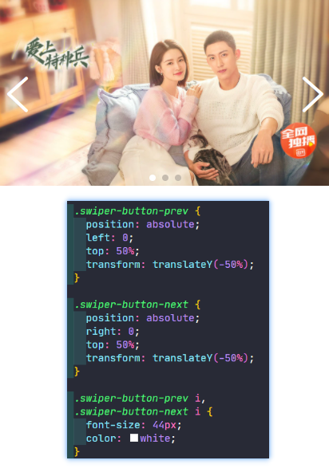

### ✍️ Tangxt ⏳ 2021-10-18 🏷️ CSS

# 26-综合案例一 (Swiper 轮播图）

在前面，我们已经把这个 flex 弹性布局的相关知识点都已经给大家讲解完毕，那我们接下来就来做两个综合的案例。

首先来看第一个综合案例—— Swiper 轮播图。

### <mark>1）Swiper 轮播图的效果</mark>

下面我们就来看一下。这种轮播图在我们的移动端非常常见，我们可以看到这种轮播图它可以左右切换或者是上下切换，侧边这边会有两个箭头可以点击来进行切换，还有底下的这个小点也是可以点击切换的。

这个 Swiper 它其实是带有交互的，这里，我先给大家看一下我们真正的 Swiper 这个库实现的效果是怎样的，使用这个库需要引入 Swiper 相关的 CSS 和 JS 代码：


### <mark>2）分析这个轮播图的布局</mark>

我们主要完成这个效果的布局，至于交互咱们是不去实现的，来看一下这个布局该怎么去做。

这个布局首先来观察它是分为三大部分的。首先这个图它是一个**左右排列**的，然后其次是这个小点儿，这个小点儿是在**底部居中**的，接下来还有两个箭，这两个箭头儿分居我们可视的这个**容器的左右两边**。好，这就是我们的一个简单的分层，我们把这个结构分层之后就开始实现我们的样式了。

### <mark>3）实现这个轮播图的布局</mark>

#### <mark>1、准备工作</mark>

做法：

1. 引入`reset.css`，用来重置默认样式 -> 去掉一些不同浏览器关于标签的默认行为，让不同浏览器的行为保持一致
2. 完成布局工作 -> 直接在`style`标签里添加样式

正常来说，我们的项目编写 CSS 的时候也会单独的来创建一个 CSS 文件来编写。当然，咱们这个是一个小的综合案例，咱们就不给它单独提出来了。到我们最后一个章节，也就是说我们有一个实战的这样的一个章节，在这个章节里边会专门给大家讲如何来组织我们的 CSS，这包括如何把 CSS 进行划分。

这里我们就直接把我们的 CSS 写到这 HTML 页面当中，大家知道一下就好。

接下来就来完成我们的布局，这个布局其实就跟我们 Swiper 的布局是类似的就行，咱们就照着它这个布局来做就行。

#### <mark>2、确定基本结构</mark>

把这个 Swiper 的结构考过来：

``` html
  <div class="swiper-container">
    <div class="swiper-wrapper">
      <div class="swiper-slide"></div>
      <div class="swiper-slide"></div>
      <div class="swiper-slide"></div>
    </div>

    <!-- 如果需要分页器 -->
    <div class="swiper-pagination"></div>

    <!-- 如果需要导航按钮 -->
    <div class="swiper-button-prev"></div>
    <div class="swiper-button-next"></div>
  </div>
```

大家可以看到这里面：

1. 首先像我说的第一块儿其实就是图片的区域。
2. 第二块儿也就是它的分页器，就是我们底部的那个小点儿的区域。
3. 第三块儿就是我们左右箭头儿的区域。

我们分成三部分，这三部分我们放到一个容器当中`swiper-container` -> 我们接下来先完成我们图片这块儿，这图片我选用的是一个本地的图片（视频里的图片是在线的：`https://pic3.iqiyipic.com/common/lego/20210609/e66f0e28608f4aa7b08b5d93088c73c6.jpg?caplist=jpg,webp`，但在用 HTTP 测试的时候`403`了），大家可以看到这是来自于我们爱奇艺的图片。

#### <mark>3、外层容器：`swiper-container`</mark>

这个准备结构做好之后，接下来我们就先来完成我们的这个外层容器。

拆成容器其实它并没有什么特别的，因为它的宽默认就跟这个可视区域宽是一样的，高度其实根据这个内容也是自适应的，也就是说图片多高，那这个容器也应该多高，所以，我们也不用给它加高度了。

我们会发现左右箭头图标和底部小圆点会和容器叠加在一起，这说明这个叠加在一起的箭头和圆点肯定是定位上去的 -> 使用定位可以做到这种叠加效果。

所以我们需要给这个容器加一个相对定位，这样的话就可以相对于它来进行一个定位了，也就是说我们里面的子项来做绝对定位，而父容器来做这个相对定位，相对于父容器进行偏移就可以了。

#### <mark>4、图片的爷爷容器：`swiper-wrapper`</mark>

接下来我们先做图片这一块`swiper-wrapper`。

这里我们选择的就是`display: flex`弹性布局，选择好弹性布局之后，我们接下来在它的这个每一项`swipe-slide`当中给它选择左右能撑出我们的容器，也就是说这是一个溢出项布局。那这样的话我们选择这个`flex-shrink: 0`，让子项不进行自动的收缩，而是溢出！

接下来我们再来看一下`swiper-wrapper`子项里边的图片，在这里面我们就选择这个宽度百分百，然后高度会根据宽度做一个自适应的调配。

我们现在简单运行一下，看看我们现在这个效果怎么样：


> `swiper-slide`子项的高度是`702`

大家可以看到这个图它是非常大的，也就是说我们需要控制一下我们这个容器大小。

为啥会这么大？审查元素得知`swiper-slide`是没有写宽的，所以我们需要限制一下它的宽度，不然，就会给图片给撑大了！


让`swiper-slide`的宽跟`swiper-wrapper`父容器一样，父容器没写宽度，那就是块儿特性，独占一行，占满视口的宽……

目前，第二张图以及第三张图现在第一张图的右侧排列的，所以这三个图就左右排列了，这个排列好之后往下做就非常简单了。

#### <mark>5、分页器容器：`swiper-pagination`</mark>

我们选择这个分页器，让它跑到底部：

1. 选择绝对定位，让它定位到底部
2. 解决定位之后给它一个高度。高度我们是可以进行测量的，具体高可以测量一下。这里我们可以简单的去测量一下，虽然我们没有提供这个 PSD 的源文件，但是我们也可以用 PS 去测量一些数值的，这不受什么影响的。

我们这个图已经准备好了：


> PxCook 似乎没有辅助线

我们是用弹性来做这个小圆点的，所以它会有个容器`swiper-pagination`（方便居中），测量得知这个容器高度是 28 个像素。接下来的宽度我们选择这个百分百，跟父容器一样。我们再选择定位父母模式，选择这个底部对齐好。底部对齐之后我们选择这个 `display` ，选择`flex`弹性，左右水平方向就选择居中，那上下垂直方向也是选择居中：


测量小圆点的大小：


还有背景色、间距之类的

最终实现：


以上就是我们使用弹性来完成的底部布局。

#### <mark>6、左右箭头图标容器：`swiper-button-prev`、`swiper-button-next`</mark>

接下来我们再来看最后一个部分——左右箭头儿。

这个左右箭头的完成，我们可以选择一个字体图标来做向左的图标以及向右的图标。在这里给大家推荐的是阿里的这个 [iconfont](https://www.iconfont.cn/)，iconfont 里边它是有很多图标的，我们可以搜索一下，比如说搜索这个 swiper：


下载你选中的图标，下载的是一个压缩包，解压后有 3 个文件：


如何使用？

引入`confont.css`：

``` html
<link rel="stylesheet" href="./iconfont.css">
```


该文件给我们提供了两个相关的这个 `class` 来作为我们引入的这两个箭头

使用：

``` html
<div class="swiper-button-prev">
  <i class="iconfont icon-swiperhoutui"></i>
</div>
<div class="swiper-button-next">
  <i class="iconfont icon-swiperqianjin"></i>
</div>
```

我们分别在容器中添加`i`标签，首先它需要一个基类，也就是我们的`iconfont`，然后再是我们的这两个箭头。

目前效果：


我们要把箭头放到`swiper`里边的两侧，所以我们也要给箭头添加相关的样式。

第一种做法：



第二种做法：


---

左右图标有了，小圆点也有了，那咋们的这个效果就简单完成了。

### <mark>4）小结</mark>

这个轮播图的实现，这里边用到了三处这个弹性`flex`，分别是：

1. 放图片的`swiper-wrapper`，并且子项`swiper-slide`是不可收缩的`flex-shrink: 0` -> 实现溢出项布局
2. 放圆点的`swiper-pagination` -> 实现了圆点的上下左右居中布局
3. 放箭头图标的这两个容器：`swiper-button-prev`、`swiper-button-next`也采用了弹性 -> 实现了图标在一个高度中上下居中

整个效果完成之后，我们也可以通过咱们的这个控台来对它进行一个切换，以此来看一下现在的效果。

给`swiper-wrapper`加`transition: .5s`，以及`transform: translateX(-414px)`（注意这是负值）：

切换到第二张：


切换到第三张：


这个切换我们是手动在控制台调样式改的，当然这个切换最终还是得需要配合我们的 JS 来完成，我们这里主要是以布局为主，咱们就不去考虑这个 JS 的实现了，我们只是来完成布局。后续配上 JS 就可以做到这个跟  Swiper 一样的效果了，当然我们的布局这一块我们已经完成了。

顺便一提：


Swiper 的小圆点和左右图标是用 JS 动态生成的！


➹：[Getting Started With Swiper](https://swiperjs.com/get-started)