### ✍️ Tangxt ⏳ 2021-10-18 🏷️ CSS

# 27-综合案例二（知乎导航）

这小节我们来完成第二个综合案例：知乎导航。

### <mark>1）是什么？</mark>

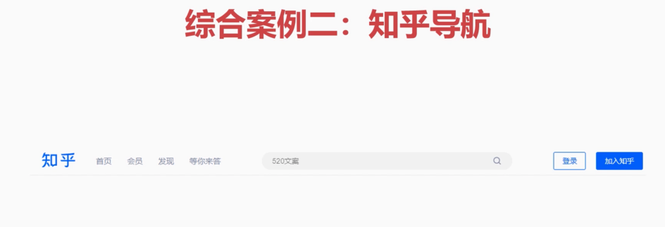

首先我们来看一下我们要做的一个效果。大家可以看到在这个知乎导航当中，它在一维横行当中的布局是非常复杂的，所包含的元素也是非常多，我们如何利用弹性来非常好的适配我们这个知乎导航呢？

目前做好的知乎导航：

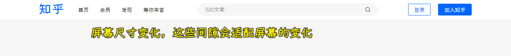

它跟官网是类似的，它其实是有一个适配的这样一个特点。也就是说当我们在对屏幕进行缩小的时候，你会发现这时候它这整个盒子会跟着缩小：

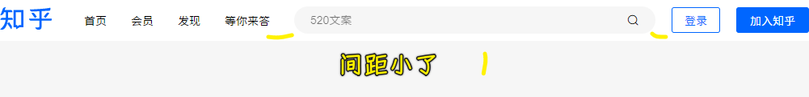

而且这个输入框也会跟着缩小，缩小到一定程度就不会再缩小了，也就是说它有一个最短的宽度，而且还有一个最大的宽度，这里面有最大值、最小值以及各种相关的一个变化，可以看到这个输入框之间的间距也会跟着变小，继续缩小屏幕这输入框也会跟着变小。可以发现，这个知乎导航其实还是很复杂的。那接下来我们看一下如何来做到这个效果。

### <mark>2）写代码</mark>

第一步：重置默认样式后，再来写功能！

第二步：完成基本的容器结构搭建

- 最大宽度：这个设计稿当中给我们的应该就是一个最大的宽度 -> `1156px`
- 最小宽度：屏幕缩小的时候不能小于一个宽度，如果再小的话就会出现这个文字错位了，我们要让这些元素非常好的在这个最小容器当中全部能够给它占满。这时候我们经过测量之后，我们选择 `1000px` 作为它一个最小的宽度。所以说我们这些元素在缩小的时候，它都能够放得非常好，而这个缩短的空隙会被压缩到没有。

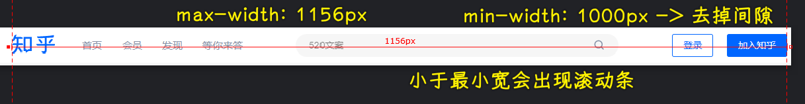

完成第一部分：

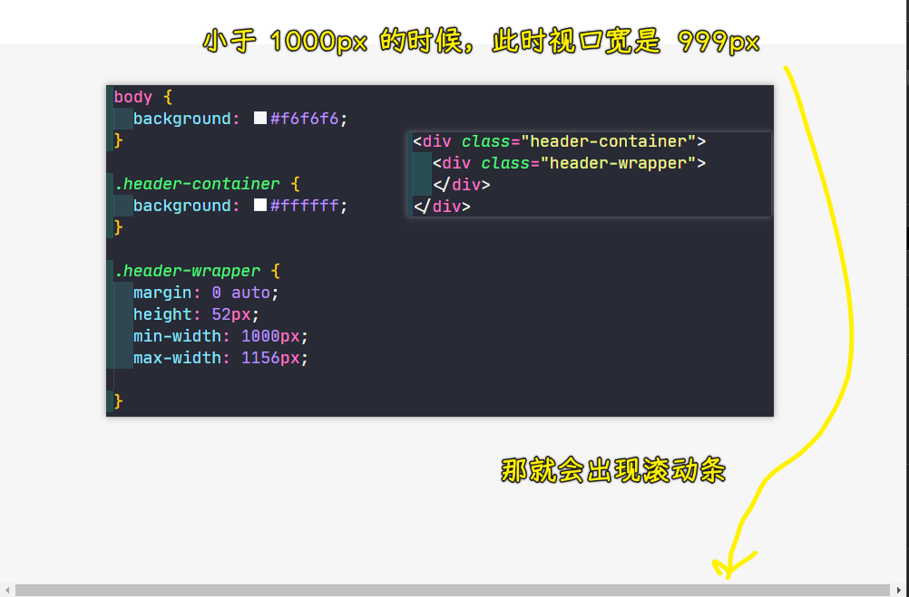

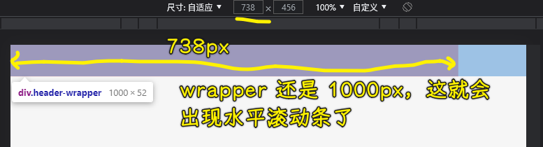

第三步：做容器里边的结构

里边的结构分为四块：

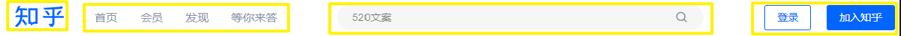

我们先来第一块，给它起名叫`header-logo`，有了名字之后，就添加 logo，这个 logo 用的是图片，直接把图片切下来即可。

然后第二块儿就是我们的导航，导航我们用`ul`列表就可以了，然后我们用`li`，一共有四项，这些列表里面也可以加个`a`链接，这样的话，就可以点击跳转了，但这里我就不去加了，咱们就稍微写一下就行了。

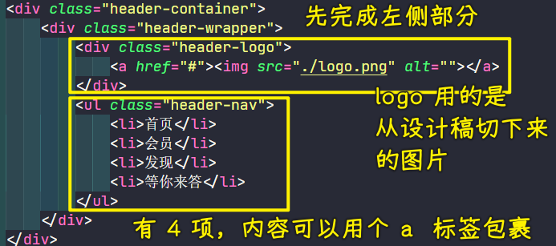

至于后面这两块，先不着急，咱先把左侧这一块做了，然后慢慢去完成这个右侧的功能。

我们把图片切下来，因为这是个图片：

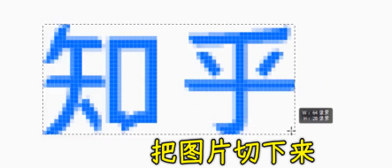

> 怎么切？ -> 这是个图片，不是 PSD，所以我们用选框工具选中图片后，就复制，然后创建文件，再粘贴上去，最后导出

布局这一块咱们已经做好了，接下来就来完成相关的样式，怎么做？从设计图中可以看到，这个四部分都是水平排列的，这必然要让我们的容器`header-wrapper`采用这个弹性布局：

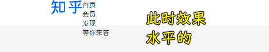

我要求这个 logo 和导航是上下居中的，由于这四部分在整个容器`header-wrapper`当中都是上下居中的，所以我们选择`align-items: center`：

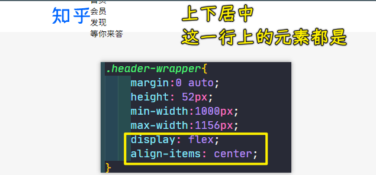

紧接着我们得给它们加这个间隙，这个间隙量取得知正好是 40 个像素：

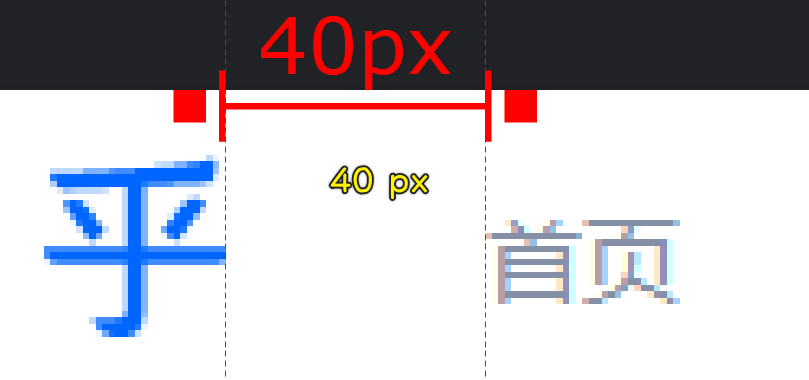

给`logo`一个`margin-right: 40px`，这就会空出来一个间距。然后里面这个菜单它其实也是要左右排列的，所以说这也比较适合用弹性来做：

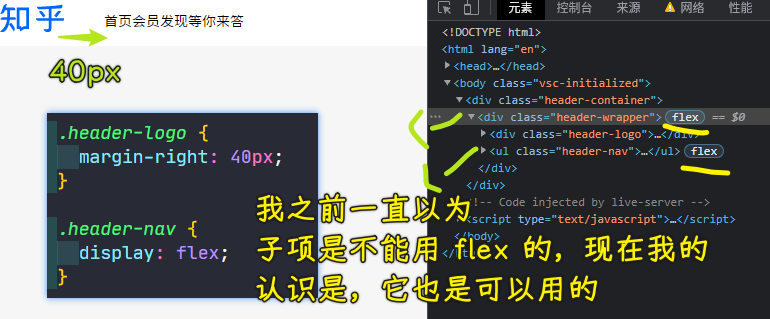

可以看到这些`li`都变成水平排列了。然后我们去把这些列表的间距给它去量取出来：

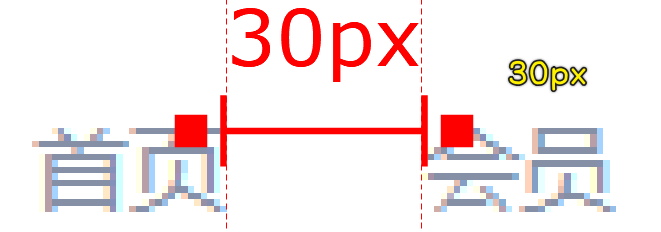

针对`li`列表来加这个间距：

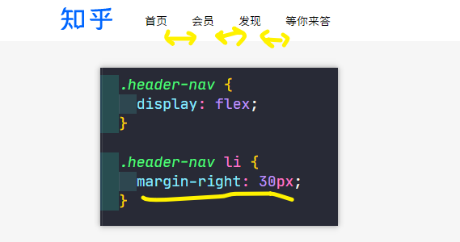

可以看到，这时候我们的间距就做好了，间距做好之后我们再来做右侧的布局。

分析搜索框：

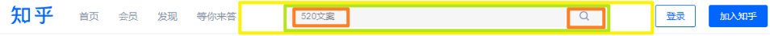

发现并不好做，简单搭个结构就好了：

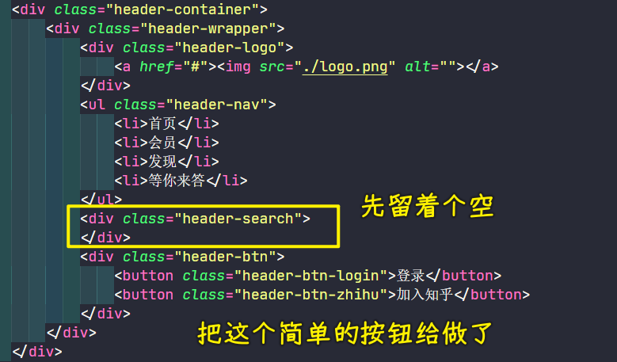

先来做右侧的两个按钮，因为它们比较好做！

量取按钮的宽高：

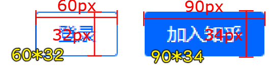

最终实现：

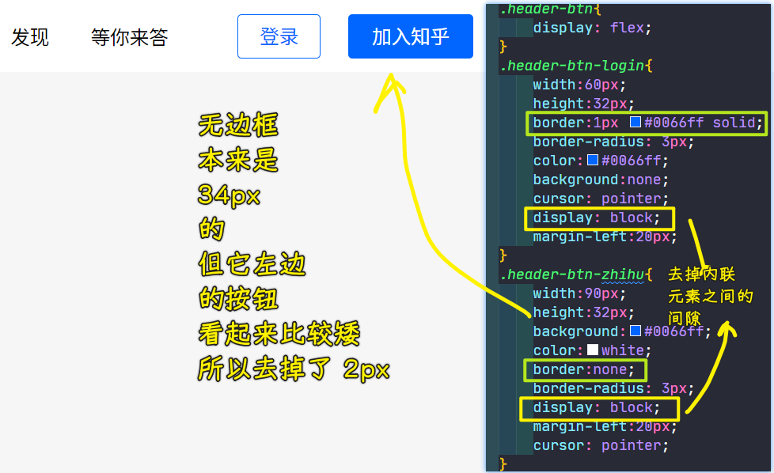

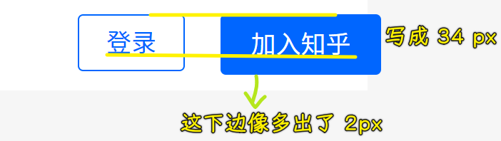

接下来完成搜索这一块。

搜索这一块它是有一个拉伸的，可以随着整体的容器的宽度变小了，它也会进行了收缩：

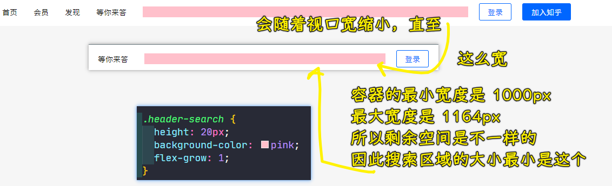

> 粉色搜索区域也会有个所谓的宽度最大值和最小值！这一点看视口宽度！

接下来完成中间这一块，它的结构我们先来写一下，它首先是有一个弧形的这样一个长条，其内部有个`input`以及一个图标（图标到 [iconfont-阿里巴巴矢量图标库](https://www.iconfont.cn/) 这下载）：

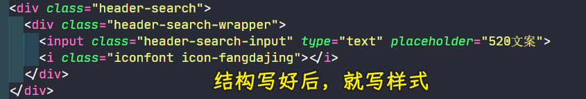

接下来写搜索框的样式

量取搜索框的最大宽度：

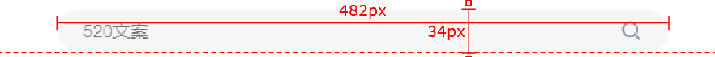

写样式：

- 关于圆角，给一个比较大的值，这样上边就是直线了，然后有个弧度了

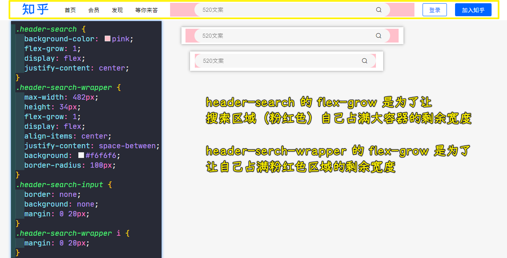

至此，中间这一块也做好了，通过这个视口宽度的调节，你会看到它会有一个弹性，而且在`header-wrapper`最小宽度`1000px`之后，这个搜索框也不会变形，也就说是它在最小宽度下也能够放得很好。而在比较大的情况下，它就会做一个拉伸，这样的话我们就可以做到这样的一个弹性了。

从这个案例中，我们可以发现这里面用到了很多弹性来完成我们的最终效果 -> 这个需要大家多加练习，才能把弹性的这个精髓了解到位。

---

只有搜索框区域是弹性的，导航栏的间隙是固定的：

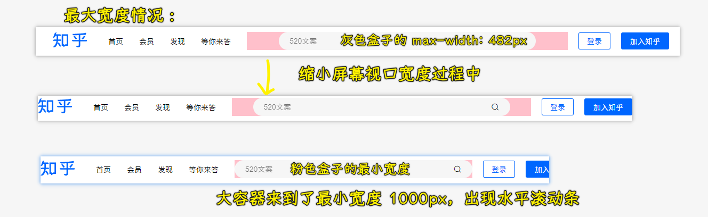
