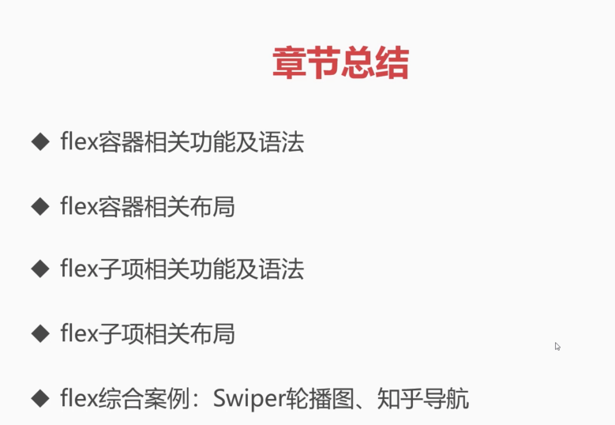

### ✍️ Tangxt ⏳ 2021-10-18 🏷️ CSS

# 28-章节总结

本小节当中，我们来看一下章节总结。

在本章当中，咱们主要学习了 flex 容器的相关功能以及语法，了解了 flex 容器和子项的到底是怎样一个关系，知道了在我们容器当中可设置的相关的属性是非常多的，比如说像什么改变主轴和交叉轴的方向，以及如何让我们的一列或者一行进行换行。还有就是我们如何能够对容器里边的子项进行这个对齐，比如说我们的这个水平对齐，这个垂直对齐，也就是说主轴以及交叉轴的对齐方式。

学习完这个 flex 容器相关的功能之后，我们又趁热打铁地来给大家讲了关于这个容器相关的布局到底可以做到哪些事情。比如说我们可以做到那种上下左右居中的布局以及我们的均分列布局等，这些都是非常常见的一种有关 flex 容器实现方案的布局。

接着我们又讲解了这个 flex 子项的相关功能及语法，了解了我们的扩展比例、收缩比例以及我们这个简写还有一些辅助型的功能。

学习完这些子项的语法之后，我们也可以利用它来做一些相关的布局，比如说我们的粘性的页脚布局或者是我们的等高布局等，这些布局在传统的这个 CSS 实现方案（如浮动之类的）当中是非常麻烦的，是非常不容易做到的。但是在弹性当中，之所以能够用得很好，实现得很好，就在于这个「弹」字，这个弹就可以把我们不同的这个可视的一个适配的尺寸给它做好，比如说间距的适配，比如说容器的适配，还有在不同分辨率下的一个适配，这个弹性都做得非常的棒。

学完这些之后，最后我给大家演示了两个比较综合的案例，一个是我们的 Swiper 轮播图，利用了我们的弹性到底是如何做到的？还有这个知乎导航，这里面运用了大量的弹性的这样一个布局方式，让它进行相应的左对齐或者是这个右对齐以及居中对齐，还有我们的这个相关的上下对齐，包括这个均分间距以及这个如何来做到让它能够伸缩拉伸这个容器的大小，这些都是需要弹性来做到的。

那咱们这个主要的文章的内容就是这么多，希望同学们加油，我们一会儿就可以进行下一章的学习了。
