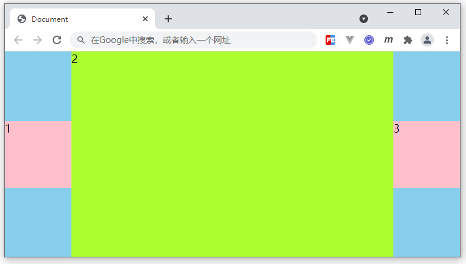

### ✍️ Tangxt ⏳ 2021-10-18 🏷️ CSS

# 29-测试题、练习题

## ★测试题

以下哪些不是作用在 flex 容器上的样式？

- A：flex-grow
- B：flex-wrap
- C：flex-direction
- D：flex-basis

AD -> `flex-grow`、`flex-basis`是作用在 flex 子项上的 

## ★练习题

根据下面 HTML 结构，完成图示布局效果，编写对应 CSS 代码：

```html
<style>
/* 代码编写区域 */

</style>
<div class="main">
    <div>1</div>
    <div>2</div>
    <div>3</div>
</div>
```



要求如下：

1. main 盒子，宽高均自适应可视区，带有浅蓝色背景
2. 1、3 子项，宽高 100px，上下居中，分居两侧
3. 2 子项，宽度自适应剩余容器，高度自适应父容器
4. 浏览器改变大小时，相关盒子尺寸及位置发生相应变化

参考答案：

``` css
body {
  margin: 0;
}

.main {
  width: 100vw;
  height: 100vh;
  background: skyblue;
  display: flex;
  align-items: center;
}

.main div:nth-of-type(1) {
  width: 100px;
  height: 100px;
  background: pink;
}

.main div:nth-of-type(2) {
  flex-grow: 1;
  background: greenyellow;
  align-self: stretch;
}

.main div:nth-of-type(3) {
  width: 100px;
  height: 100px;
  background: pink;
}
```

自个儿的答案：

``` css
body {
  margin: 0;
}

.main {
  height: 100vh;
  background-color: #87ceec;
  display: flex;
}

.main div:nth-of-type(1),
.main div:nth-of-type(3) {
  width: 100px;
  height: 100px;
  align-self: center;
  background-color: pink;
}

.main div:nth-of-type(2) {
  flex-grow: 1;
  background-color: #adff30;
}
```


