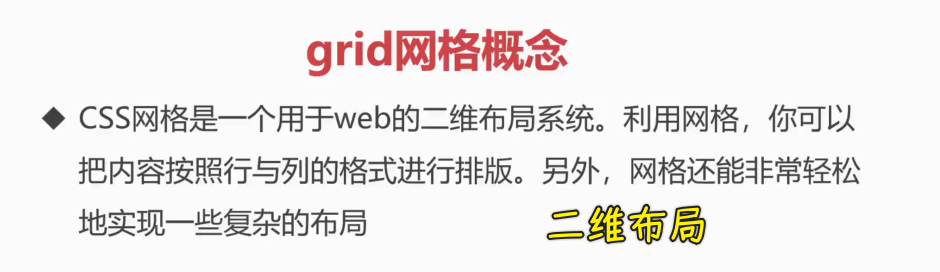
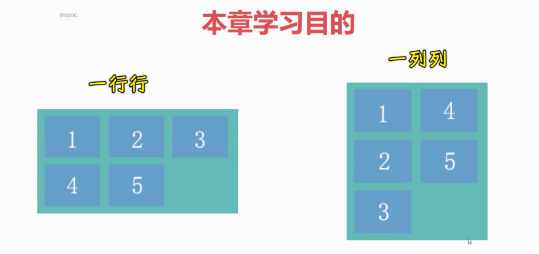
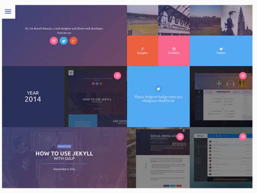
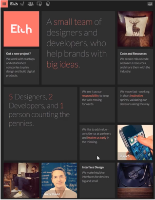
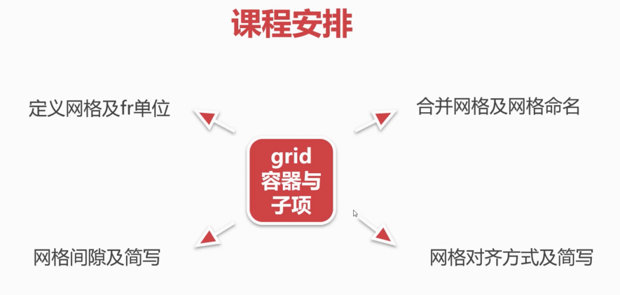
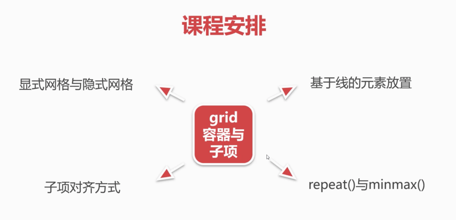
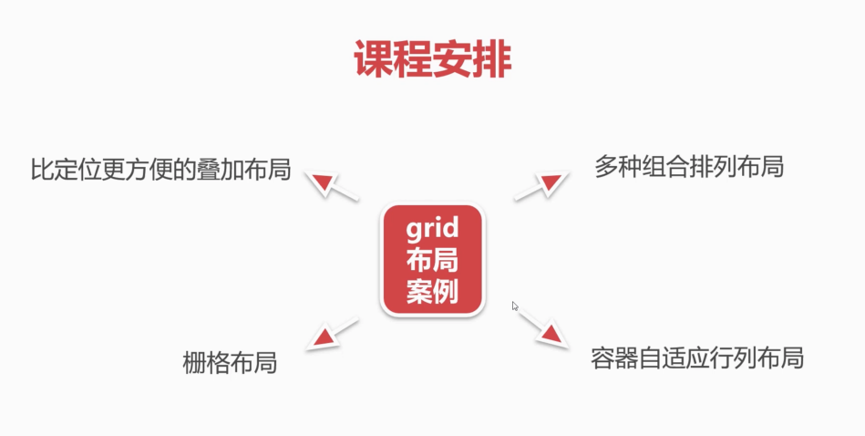
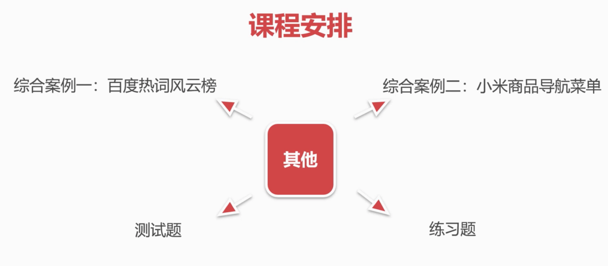

### ✍️ Tangxt ⏳ 2021-10-19 🏷️ CSS

# 30-章节介绍

嗨，各位小伙伴们，大家好，在本章当中我们将学习 grid 网格布局。

### <mark>1）grid 是什么？</mark>

首先来看一下我们的网格的概念。 

CSS 网格是一个用于 web 的二维布局系统。利用网格，你可以把那种按照行和列的格式进行排版。另外网格还能非常轻松地实现一些复杂的布局。

### <mark>2）为什么要用 gird 做布局？</mark>

在前面的章节当中，咱们介绍了弹性布局，弹性布局它是实现这种一维布局的，也就是说非常适合我们做一行或者是一列的布局。grid 网格它是非常适合做这种行列组合的，也就是二维布局方式。

学习这种二维布局是非常重要的，因为在我们的网页当中经常会充斥着各种行列组合的这样一个布局格式。比如说我们有这种一行一行的排列的方式，当然也有一列一列的排列方式，这些都是比较常见的排列组合。

而我们网格还可以做一些更加复杂的应用，比如说合并网格这样的功能。

我们来看接下来的这两张图。

大家可以看到这两张图其实都是可以利用咱们本章学习的网格布局来实现的。从图中我们发现了这里面的这个单元格儿并不是等大小的，它其实是做了一些**单元格的合并**，这个在我们的网格当中是非常容易实现的，包括我们**格子与格子之间的间隙**也非常容易生成。

知道了我们本章要学习的一个目的之后，我们来看一下我们的课程安排。

### <mark>3）课程安排</mark>

这里我们主要还是要了解一下网格的容器与子项跟我们学习弹性是类似的。

#### <mark>1、gird 容器与子项</mark>

我们要学习的有：

- 定义网格及`fr`这个单位
- 合并网格及网格命名
- 网格之间的间隙及简写是如何做的？
- 还有我们的这个网格对齐方式及简写

除了这些内容以外，我们还要讲解：

- 显式网格与隐式网格
- 基于线的元素放置
- 子项对齐方式
- 两个比较好用的方法：`repeat()`和`minmax()`

还有一些其他的课程安排。

比如说我们会讲到这个 grid 网格布局的案例。

#### <mark>2、grid 布局案例</mark>

看一下利用网格能实现哪些常见布局？

比如说我们可以利用网格来替换我们传统的这种定位布局，来实现一种比定位更方便的叠加布局方式。这个位置控制的会更加灵活，到时候我们可以去了解一下。

课程当中我们还会讲到多种组合排列布局，这种多组合排列布局是自动完成的，比我们传统的要想进行一些多组排列的话，要方便灵活很多。

还有我们的栅格布局。栅格布局是我们响应式当中的一个非常重要的概念。而我们栅格这个系统我们是可以通过这个传统的百分比来实现的，但是百分比它是需要算的，那我们这个网格在实现栅格布局的时候是不需要计算的，自动就可以给它生成出来。

还有我们这个容器自适应行列的布局，比如说咱们刚才看到的那种一横行，然后再一横行的这样一个自适应的布局，这个比较容易实现，但是比较难的就是列的自适应。比如说我们一列排满之后再产生新的一列，这个用网格来做是非常容易的。

除了这些我们的这个常见布局方案以外，还有一些综合案例。

#### <mark>3、其他——综合案例、测试题、练习题</mark>

比如说我们会讲：

- 一个综合案例 -> 百度热词风云榜
- 另一个综合案例 -> 小米商城导航菜单

除了这些以外，还给大家安排了测试题以及练习题。

---

希望通过这些东西，让大家巩固本章的所学的内容，这就是我们的一个简单的课程介绍，随着我的脚步一起去学习本章的内容吧！
