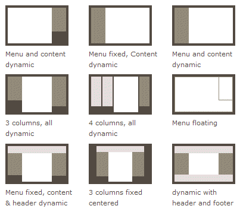
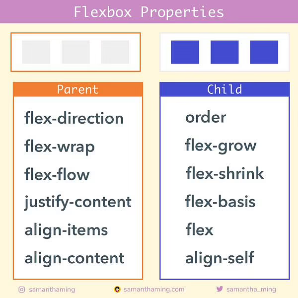
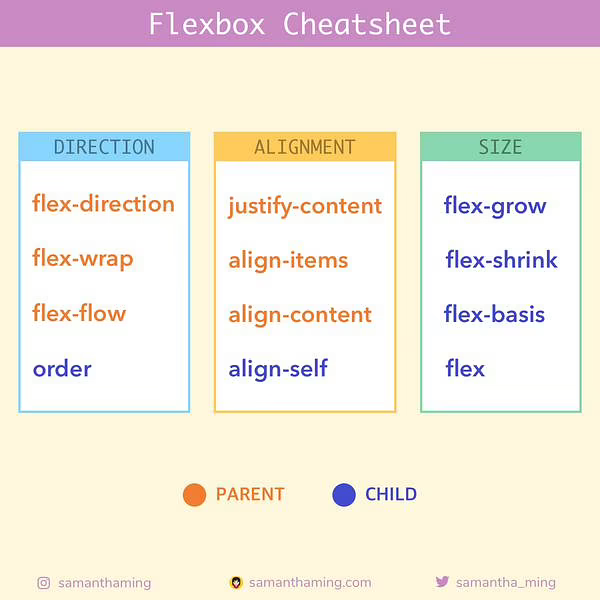

### ✍️ Tangxt ⏳ 2021-09-16 🏷️ Readme

# 02-前端主流布局系统进阶与实战

> 课程地址：[前端主流布局系统进阶与实战](https://coding.imooc.com/class/chapter/527.html#Anchor)

## ★课程介绍

> 实现精美页面是前端工程师的核心能力之一，CSS 布局技术是实现精美页面的核心技术，但 CSS 布局好入门，难精通。本课将围绕前端 4 大主流布局，通过大量的实际案例，带你边学习，边实操，让你系统掌握 CSS 布局进阶技术，轻松解决各种精美页面布局难题。

## ★章节目录

### <mark>1）课程介绍（了解本课程必看）</mark>

> 了解本门课程，介绍课程大概内容：课程安排、目标、学习人群等。

- [01-课程导学 & 常见布局展示及技术分析](./01.md)
- [02-软件安装 & CSS 发展史与 CSS 模块划分](./02.md)

### <mark>2）第 2 章 CSS 还原 UI 设计</mark>

> 介绍 CSS 如何跟 UI 设计配合，并还原设计稿的，内容紧跟技术前沿，对工作流程有非常大的帮助，是公司中的实操内容

- [03-章节简介](./03.md)
- [04-长度单位与颜色分类 & UI 设计图的源文件种类](./04.md)
- [05-Photoshop 还原 UI 设计、蓝湖 App 快速标注信息、PxCook 自动标注工具、 imgcook 设计稿智能平台](./05.md)
- [06-章节总结](./06.md)

### <mark>3）第 3 章 布局中的尺寸与位置</mark>

> 布局核心概念学习，位置和尺寸重点讲解，并且讲解浮动和定位两个重要布局元素，配合案例讲解，对布局基础非常重要，是新手必会技能。

- [07-章节介绍](./07.md)
- [08-CSS 盒模型的组成、块级盒子与内联盒子](./08.md)
- [09-自适应盒模型的特性、标准盒模型与怪异盒模](./09.md)
- [10-浮动样式详解、浮动特性注意点](./10.md)
- [11-定位样式详解、定位特性注意点](./11.md)
- [12-详解 display 属性](./12.md)
- [13-书写模式与逻辑属性](./13.md)
- [14-BFC 块级格式化上下文](./14.md)
- [15-标签默认样式及清除](./15.md)
- [16-章节总结](./16.md)

### <mark>4）第 4 章 flex 弹性布局</mark>

> 目前最流行的布局方式，特别是移动端，小程序中，对弹性布局深入讲解，并配合大量案例巩固，公司必会技能。

文档：[Flexbox30 - SamanthaMing.com](https://www.samanthaming.com/flexbox30/)

Flexbox Properties：

Flexbox Cheatsheet（记忆所有可用的属性并不容易。成为一名优秀的程序员不在于你记住了多少东西，而在于你能解决多少问题。这就是为什么对于一个程序员来说，继续保持谦虚和学习是很重要的。这一切都是为了扩展我们的工具包，这样当我们确实面临一个问题时，我们就可以选择各种各样的工具来解决它了）：

- [17-章节介绍](./17.md)
- [18-主轴与交叉轴、换行与缩写](./18.md)
- [19-主轴对齐详解、交叉轴对齐详解](./19.md)
- [20-内联与块的上下左右居中布局、不定项居中布局](./20.md)
- [21-均分列布局、子项分组布局](./21.md)
- [22-flex-grow 扩展比例、 flex-shrink 收缩比例](./22.md)
- [23-flex-basis、flex 缩写、order 排序、align-self 自个儿对齐](./23.md)
- [24-等高布局、两列与三列布局](./24.md)
- [25-Sticky Footer 布局、溢出项布局](./25.md)
- [26-综合案例一 (Swiper 轮播图）](./26.md)
- [27-综合案例二（知乎导航）](./27.md)
- [28-章节总结](./28.md)
- [29-测试题、练习题](./29.md)

### <mark>5）第 5 章 grid 网格布局</mark>

> 目前网格布局趋势明显，能完成很多之前繁琐的布局形式，可以说是未来布局的重中之重，想进阶 CSS 布局，必须掌握网格布局，本章会配合大量案例进行消化。

- [30-章节介绍](./30.md)

### <mark>6）第 6 章 移动端适配布局</mark>

> 移动端布局趋势明显，各种现代 web 开发中都离不开移动端布局，相关语法和细节非常重要，是公司必会技能之一。

- [移动端适配布局](./06-note.md) `简记`

### <mark>7）第 7 章 响应式布局</mark>

> 大型项目布局的必选方案，理解响应式布局的实现，有利于理解其他相关的框架或技术的运用，是一些 UI 组件中的标配内容，布局进阶的必会内容。

- [响应式布局](./07-note.md) `简记`

### <mark>8）第 8 章 综合实战 Ant Design Pro 管理系统</mark>

> 综合应用，真实项目都是混合布局方案，会采用多种方式实现。本章会从专业的准备阶段、划分、规范、命名等多角度进行分析。实战部分对响应式、布局方案、网页皮肤、模块划分、元件划分等进行详细讲解，掌握 CSS 布局的大局观。...

- [综合实战 Ant Design Pro 管理系统](./08-note.md) `简记`