### ✍️ Tangxt ⏳ 2021-10-05 🏷️ CSS

# 01-HTML 元素分类和盒模型

> 资料：[CSS 入门到放弃（1）-HTML 元素分类和盒模型_哔哩哔哩_bilibili](https://www.bilibili.com/video/BV11t41127dZ)

### <mark>1）块级元素和内联元素分类</mark>

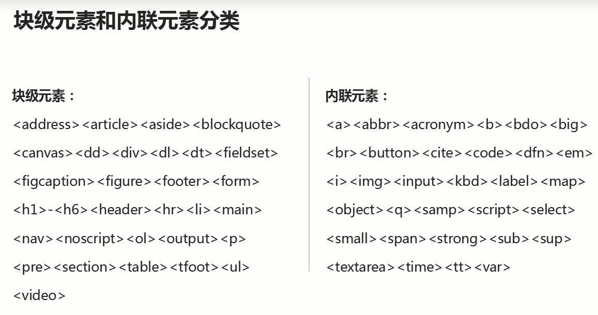

### <mark>2）为什么要设置不同的标签？</mark>

1. 为了使用方便 -> 你看我们直接就拿`h1`这样的标签用就行了，不用写相应的样式，其实就类似于组件标签这样
2. 为了更具有语义化 -> 利于搜素引擎抓取

### <mark>3）盒模型</mark>

你写一段文字、写一个标签、放一张图片，浏览器都会为了创建一个盒模型

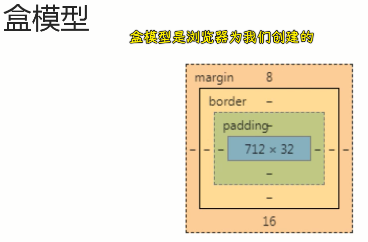

盒模型有很多层，从内向外，默认我们定义的宽高是相对于内容区的 -> 这有点违反我们的习惯 -> 不利于布局

当然，有了`border-box`就好了

### <mark>4）块级元素和内联元素在文档流或者叫普通流或者叫常规流中的一些表现</mark>

💡：块级元素的表现

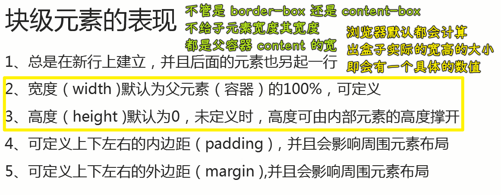

💡：内联元素的表现

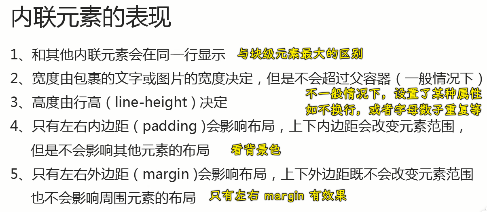

测试内联盒子内容，超过父容器的宽：

在给定父容器宽度的情况下，连续的重复数字和字母会超过父容器的宽，而汉字则不会：

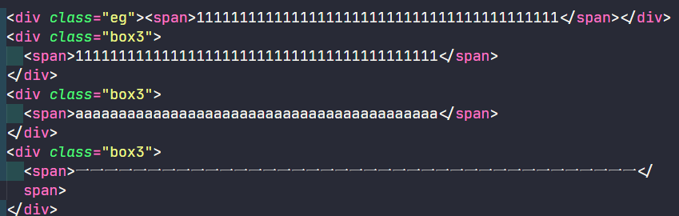

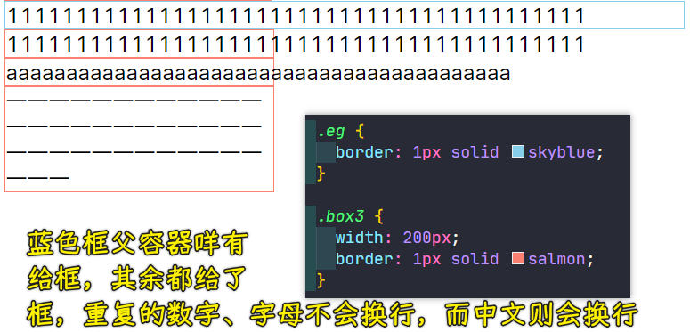

要想中文也不换行，可以用`white-space: nowrap;`

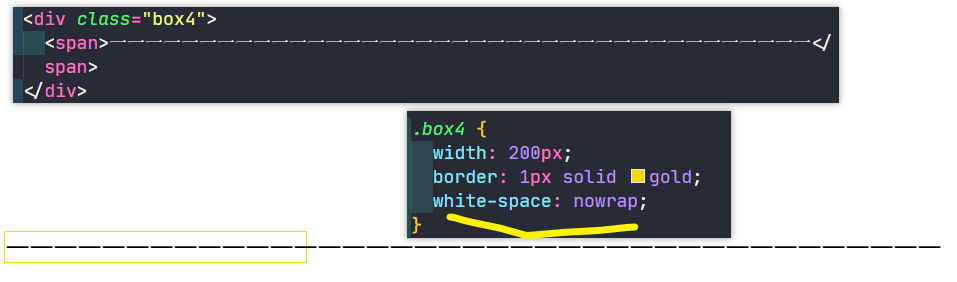

### <mark>5）代码</mark>

> 理解上边的表现

💡：理解块级元素独占一行？

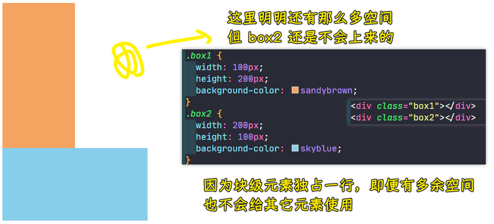

💡：你元素高度设为`0`，那你在页面上就看不见它了，你不设置高度，那元素的高度由内容决定

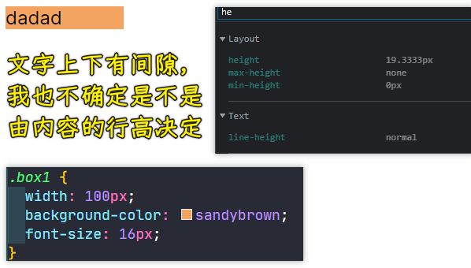

内容的高度是浏览器计算的……这与字体相关

我只给元素背景色，没有给`padding、border`，这背景色区域的高度就等同于内容区域高度，内容到底要多高？这得看文字的大小以及文字的字体设计了，反正浏览器计算出来是`19.3333px`

添加一个块级子元素`p`：

``` html
<div class="box1">dadad <p>我是 p 元素</p></div>
```

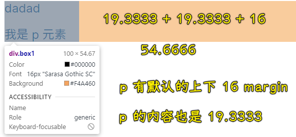

总之，容器的内容区高度是由内容决定的！

💡：给块级盒子加`padding/border`，会让盒子在物理视觉上变大，影响周边布局，而`margin`是看不见的，但它也会影响周边布局

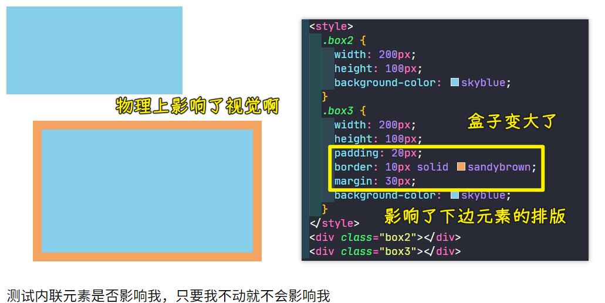

💡：如何测试内联元素的宽是由内容决定的？

加上边框，一个字的时候左边框到右边框的距离是这样，两个字时候左边框到右边框的距离是这样……

给内联元素设置`width、height`是不起效果的，因为它不支持啊！

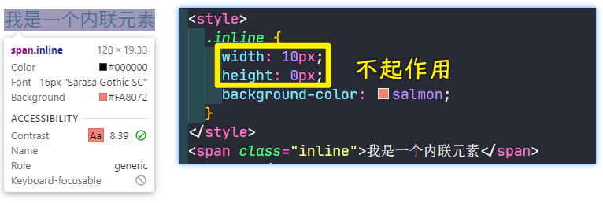

💡：给内联元素加`padding`是否影响周围元素？

`padding`是加上了（看背景色），而上下是不会影响周边元素的，因为这周围的元素并没有动啊！

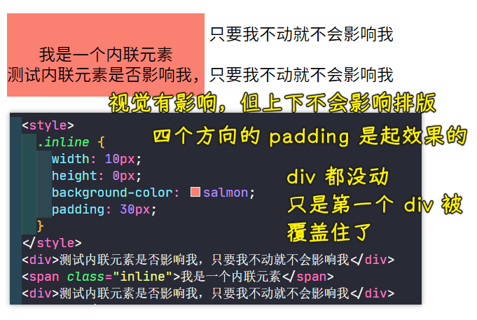

💡：给内联元素加`margin`是影响周围元素？

上下不起效果，等于没加，左右起作用！

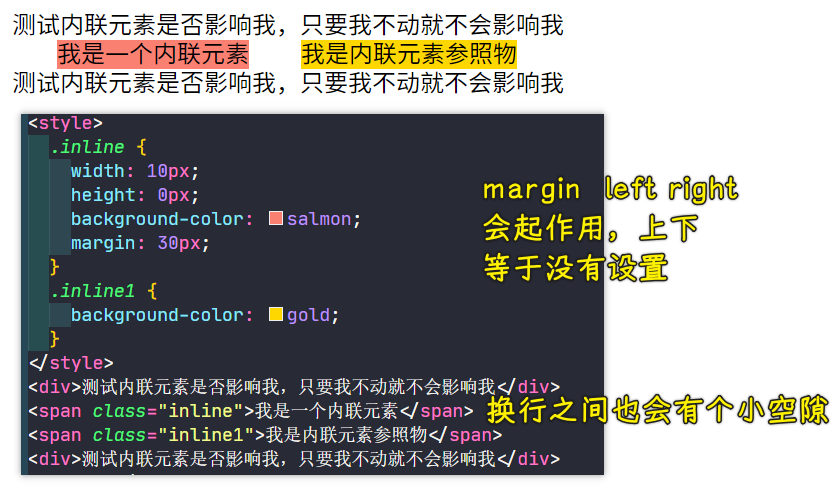

### <mark>6）inline-block</mark>

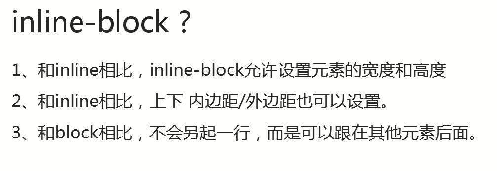

对外，对其它元素是`inline`这样的，对内，是可以设置宽高，像`block`这样的

说白了，就是把独占一行特性给弄没了

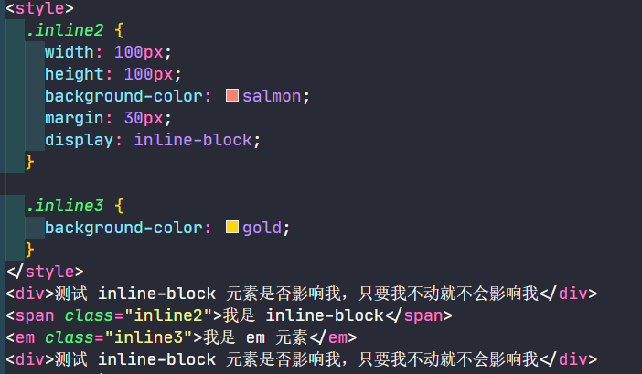

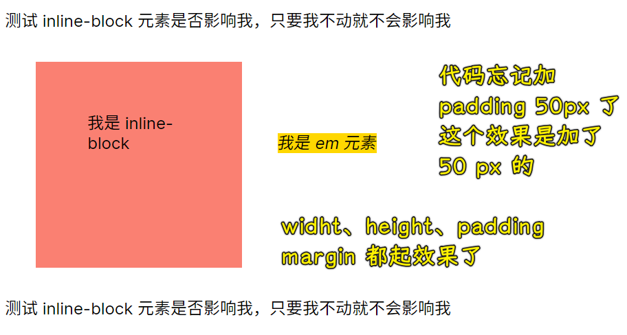

每个元素是不是都有两层结构来决定自己的表现呢？如默认的`block`就是`block-block`，默认的`inline`都是`inline-inline`？ -> 这是我一种猜测

一层是针对元素与元素之间的关系，另外一层则是针对自身会出现什么样式是支持的，什么样式是不支持的！

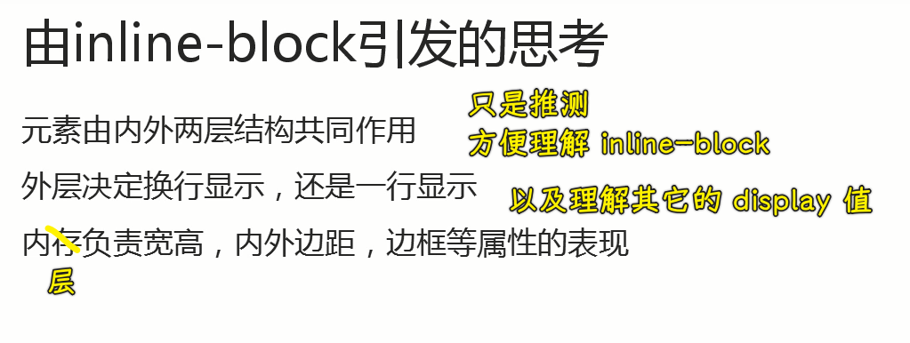

当然，对元素的分类还是块级水平分类和内联水平分类
