### ✍️ Tangxt ⏳ 2021-10-05 🏷️ CSS

# 02-深入理解 width

> 资料：[CSS 从入门到放弃 (2)-width 深入理解_哔哩哔哩_bilibili](https://www.bilibili.com/video/BV1ut41127TK)

### <mark>1）width 的定义</mark>


💡：除了可以分为块级和内联以外，元素还可以根据内容可否置换来分类

- 置换元素
- 非置换元素

### <mark>2）什么是置换元素？</mark>

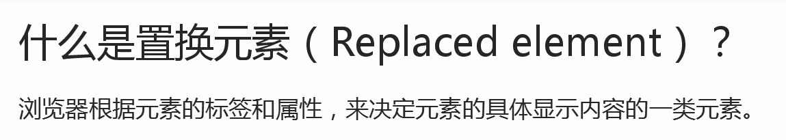

如`img`元素，根据`src`属性来决定显示的图片该是什么样的！

非置换内联元素元素，也就是非置换元素和内联元素结合呗！

总之，这只是关于对元素的分类站在不同角度罢了！

💡：常见的置换元素

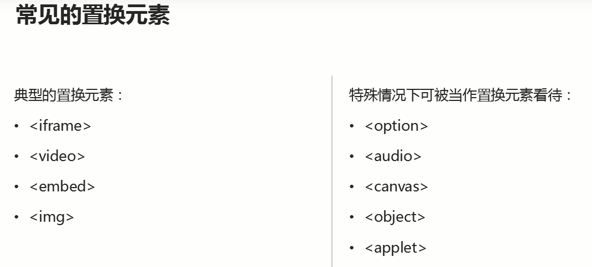

💡：`input`是置换元素吗？

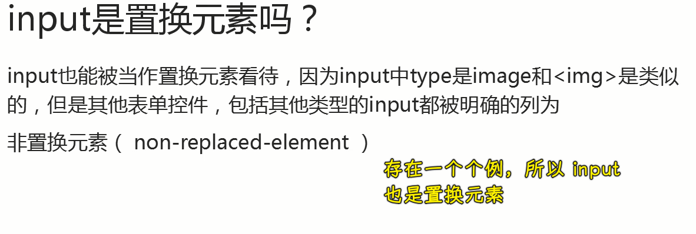

💡：置换元素的变迁

来自 Stack Overflow 的回答：

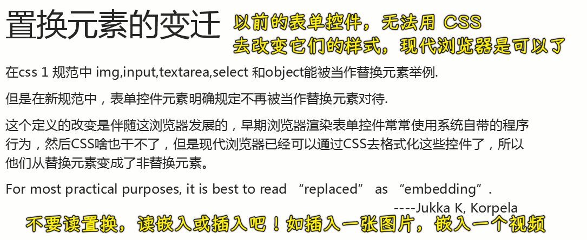

### <mark>3）`width:auto`在不同情况下的渲染行为</mark>

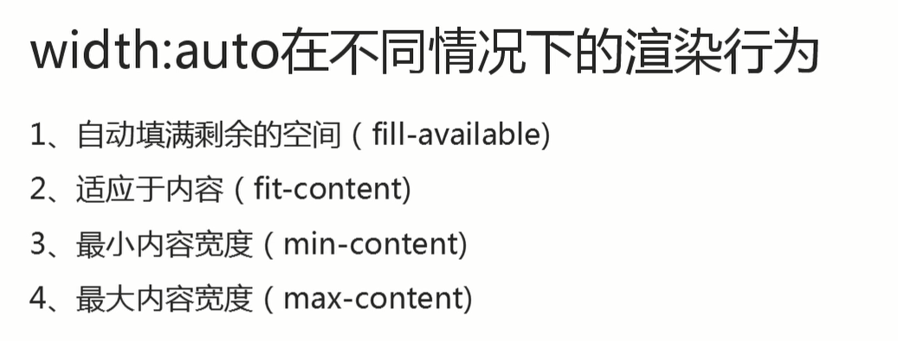

💡：`width:auto`作用于`div`等块级元素以及和`width:100%`的区别

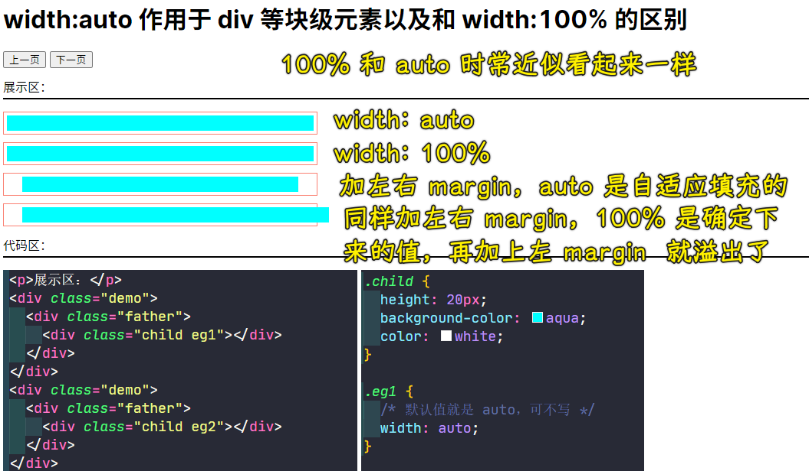

例子 3 更具有弹性，不会溢出容器，这叫做自动填满剩余空间，而例子 4，则是很没有弹性的，`width`是固定死的，会把自己的`padding、border、margin`给算上以此来溢出容器

💡：`width:auto` 作用于 `inline-block` 水平元素

> 这会表现为`fit-content`

``` html
<div class="demo">
  <div class="father">
    <div class="child eg1"></div>
  </div>
</div>
<div class="demo">
  <div class="father">
    <div class="child eg2">
      <span>字数不超父容器</span>
    </div>
  </div>
</div>
<div class="demo">
  <div class="father">
    <div class="child eg3">
      <span>字数超过父容器一个字一个字一个字一个字一个字一个字一个字一个字一个字一个字一个字一个字</span>
    </div>
  </div>
</div>
<div class="demo">
  <div class="father minwidth">
    <div class="child eg4">太小了</div>
  </div>
</div>
<div class="demo">
  <div class="father minwidth">
    <div class="child eg4 out">太小了，但我设置了 white-space:nowrap</div>
  </div>
</div>
<div class="demo">
  <div class="father minwidth">
    <div class="child eg4">it is too small</div>
  </div>
</div>
<div class="demo">
  <div class="father minwidth">
    <div class="child eg4 out">it is too small,but I have set white-space:nowrap</div>
  </div>
</div>
<div class="demo">
  <div class="father minwidth">
    <div class="child eg4 out">
      
    </div>
  </div>
</div>
```

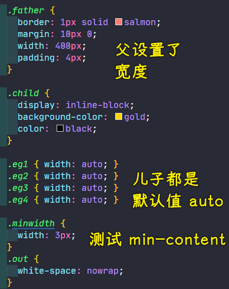

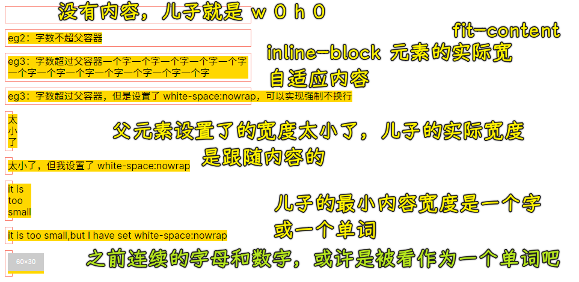

设置父容器的`width`为`200px`，默认儿子`width`为`auto`的情况，儿子为`inline-block`元素，儿子的内容的多寡，会起到什么作用？

1. 没有内容，儿子宽高都为`0`
2. 有内容，有多少个字，儿子就有多宽，自适应内容
3. 默认情况下，即便内容超过一行，也不会冲破这个父元素 -> 最大宽度就是父元素的宽度
4. 设置某些属性，可以强制突破父元素的宽度 -> `max-content`，内容最大宽度决定儿子的宽度

设置父容器的`width`为`3px`，这是一个非常小的宽度，儿子还是`width:auto`：

儿子的内容是有一个最小内容宽度的，即`min-content`，说白了，给儿子的宽度再小，也会有一个边界……也就是说，父容器再小，内容也要冲破父元素

对于中文而言，最小内容宽度就是一个字的宽度，对于英文就是连续字母作为一个最小内容宽度，碰到空格和短横线才会自动换行

> 关于强制换行，可以不用设置`white-space: nowrap;`，可以用连续英文字母或数字。注意，当儿子的内容有中文和英文混合在一起的时候，决定这个儿子的最小内容宽度是不换行的英文单词

总之，父设置了宽度，但它儿子的宽度，不会跟着父走，而是跟着内容走……

对于图片，儿子的最小宽度就是图片本身的宽度，而它的高度要比图片要高，因为图片默认的对齐方式是基于基线的，可理解为旁边有一个小的空白字符

💡：`width:auto`作用于`table`水平元素

基本一样，唯一区别就是儿子没有内容时，父元素没有内容高了

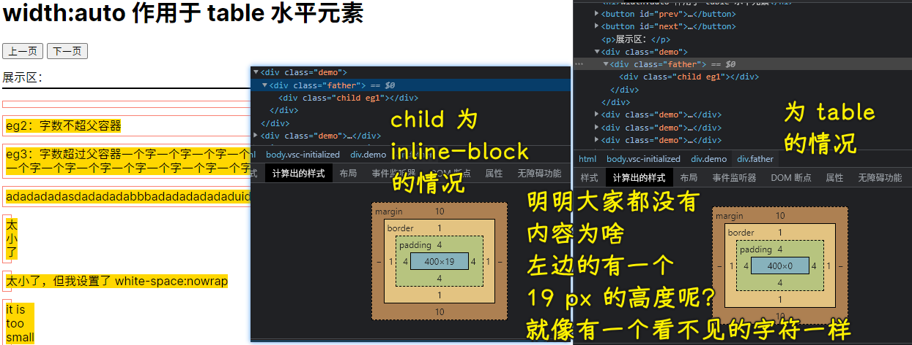

💡：`width:auto`作用于`float`水平元素

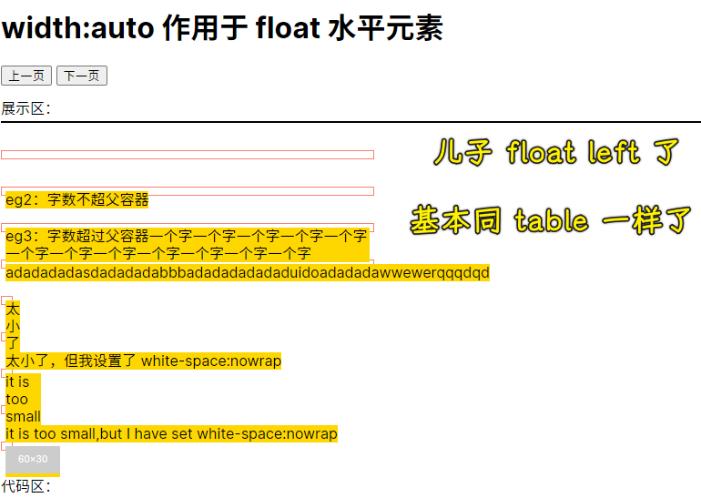

💡：`width:auto` 作用于 `position:absolute` 水平元素

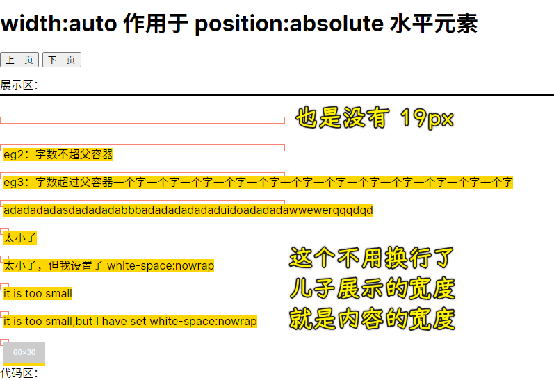

给父元素添加`position:relative`的效果：

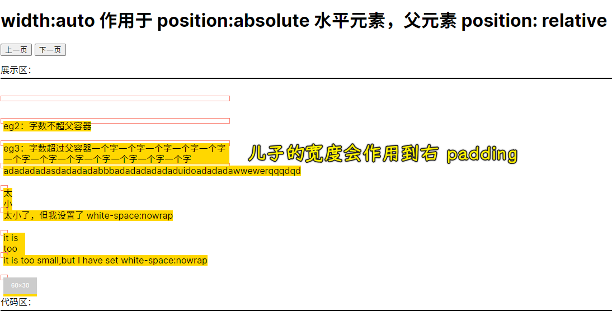

💡：`width:auto` 作用于 `position:fixed` 水平元素

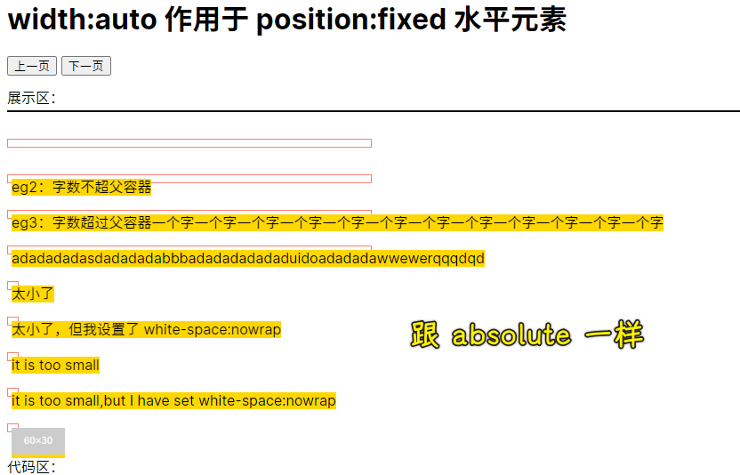

💡：`width:auto` 作用于 `div` 元素

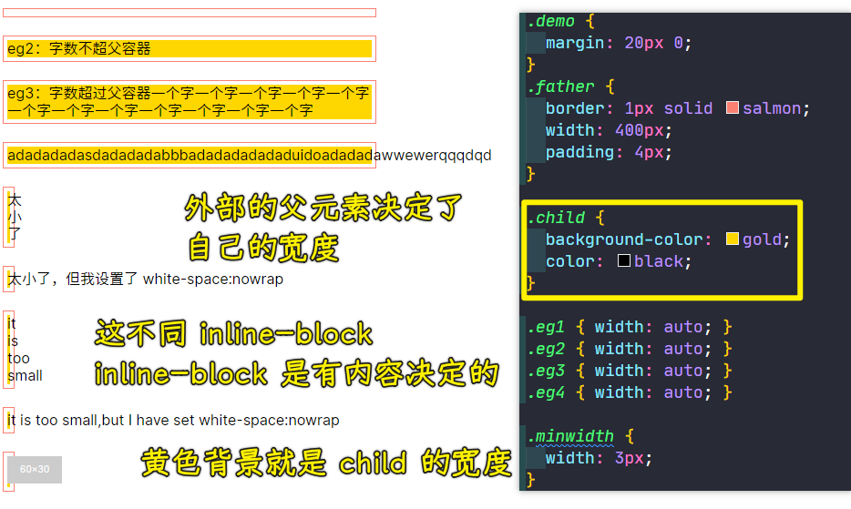

> 也就是`display`为`block`的元素

💡：`width:auto` 作用于 `div` 元素，还有它是 `position` 为 `relative` 的

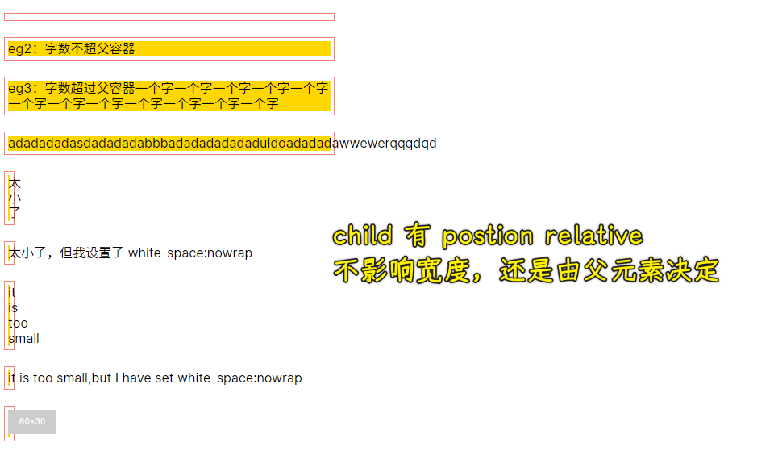

同样，也不会影响`display`为`inline-block`的元素

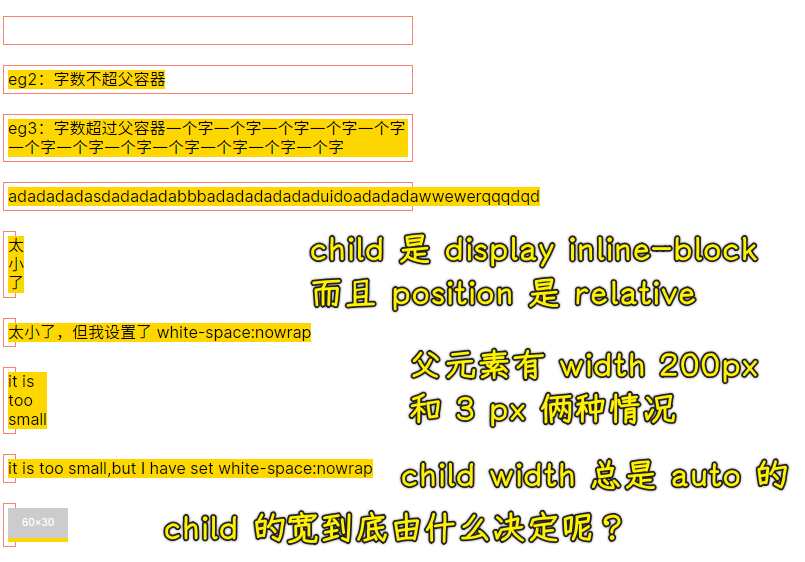

### <mark>4）小结</mark>

#### <mark>1、fill-available</mark>

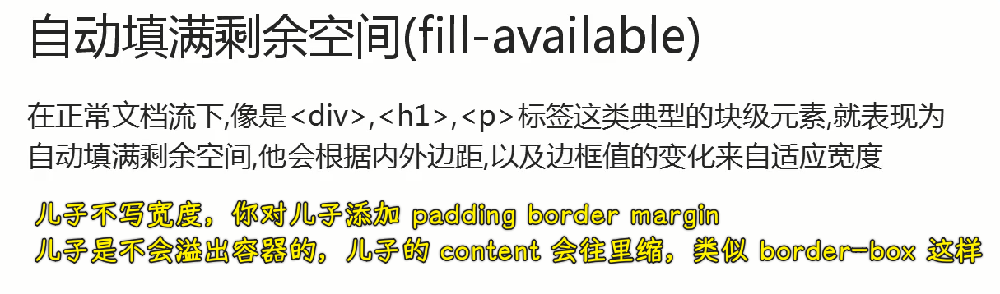

#### <mark>2、fit-content</mark>

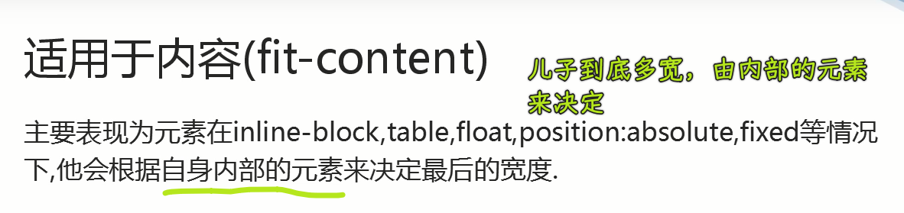

#### <mark>3、min-content</mark>

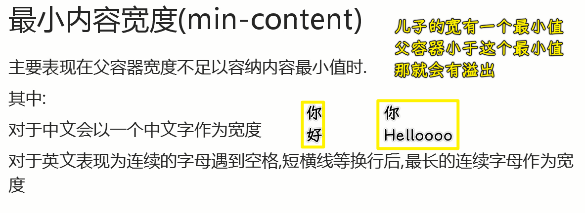

#### <mark>4、max-content</mark>

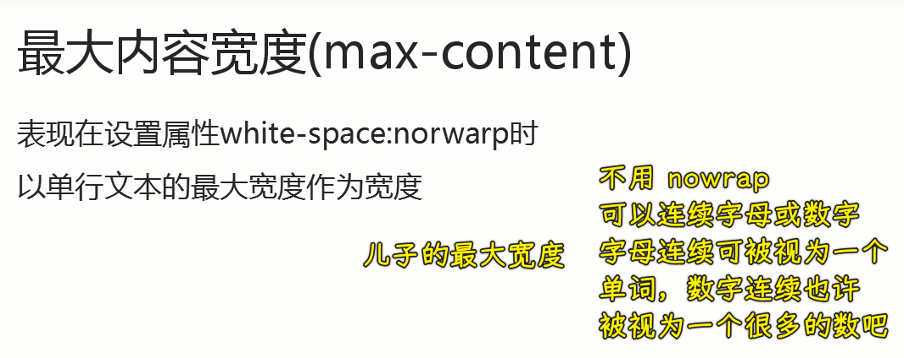

> 很多的数 -> 很大的数

### <mark>5）width：百分比</mark>

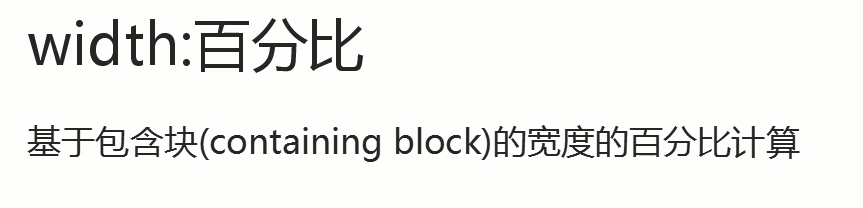

这句话提到了一个新概念——包含块，那什么是包含块呢？


💡：代码

``` html
<style>
  .demo {
    margin-bottom: 40px;
  }

  .abs {
    position: relative;
    width: 500px;
    padding: 0 100px;
    border: 1px solid salmon;
  }

  .father {
    box-sizing: border-box;
    border: 1px solid salmon;
    width: 400px;
    padding: 4px;
  }

  .child {
    background-color: gold;
    color: black;
    width: 50%;
  }

  .eg2 {
    float: left;
  }

  .eg3 {
    position: absolute;
  }

  .eg4 {
    position: fixed;
  }
</style>
<div class="demo">
  <div class="father">
    <div class="child eg1">
      <span>正常 div</span>
    </div>
  </div>
</div>
<div class="demo">
  <div class="father">
    <div class="child eg2">
      <span>float:left 元素</span>
    </div>
  </div>
</div>
<div class="demo">
  <div class="abs">
    <div class="father">
      <div class="child eg3">
        <span>position:absolute 元素</span>
      </div>
    </div>
  </div>
</div>
<div class="demo">
  <div class="father">
    <div class="child eg4">
      <span>position:fixed 元素</span>
    </div>
  </div>
</div>
```

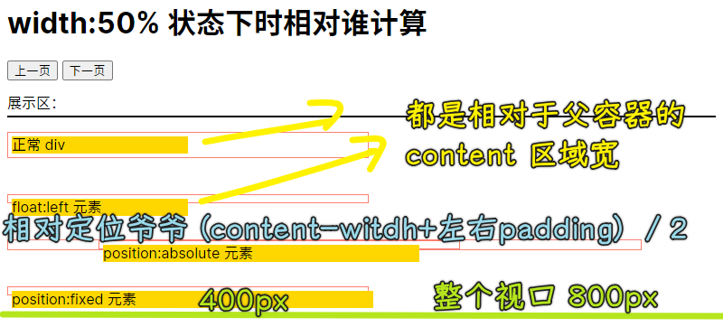

1. 儿子宽度`195px`，父元素内容区宽度`390px` -> 可以看到大部分元素的宽度百分比是基于父元素的内容区来计算的，而不是根据父元素整个`border-box`的宽度（`400px`）来计算的
2. `float:left div` 其表现跟正常流`div`是一样的，其宽度计算是一样的
3. 儿子是绝对定位，宽度是`50%`，其爷爷是相对定位，而且`width`是`500px`，`padding: 0 100px`，`border: 1px`，儿子最终计算得出的宽度是`350px`，这是相对于爷爷的`width+左右 padding`计算得来的，这内容区还得加上`padding`才行，注意，这不包括`border`
4. 儿子是固定定位，宽度是`50%`，其最终计算得出宽度由视口的宽度决定的，视口是`800px`，那它的宽就是`400px`

### <mark>6）总结</mark>

至此，我们已经把宽度默认值，以及百分比分析过一遍了，至于长度（高度），长度的表现是比较一致的！

> 这个讲解应该是参考张鑫旭大佬的「CSS 世界」一书！