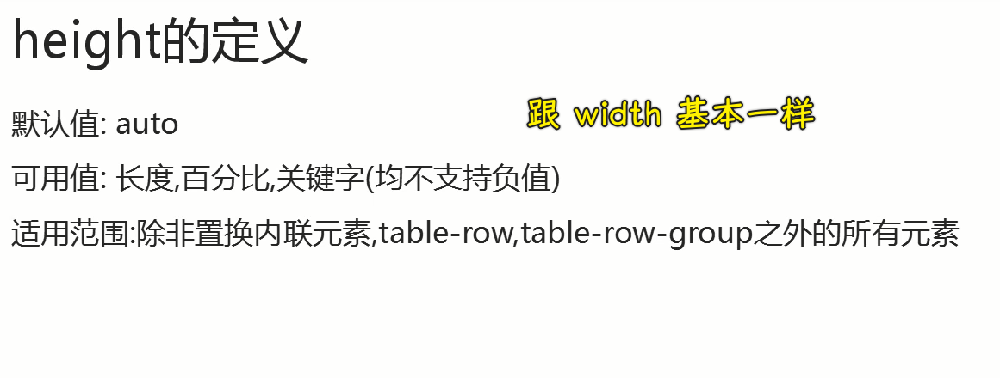
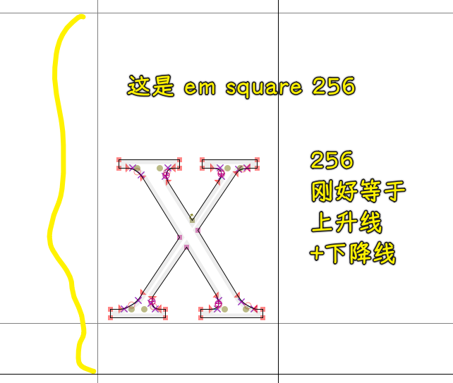
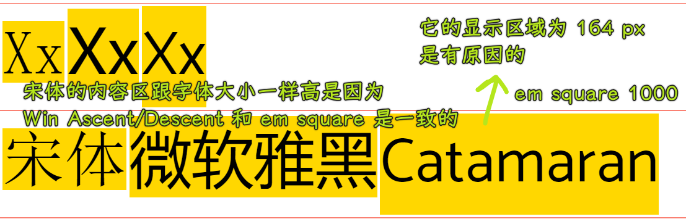

### ✍️ Tangxt ⏳ 2021-10-07 🏷️ CSS

# 03-height 深入理解之 IFC

> 资料：[css 从入门到放弃 (3)-height 深入理解之 IFC_哔哩哔哩_bilibili](https://www.bilibili.com/video/BV1Ct41197Cu)

## ★排版概念


💡：Cap height：指字体的大写字母（如 `M` 或 `I`) 从基线开始的高度。每种字体都有一个独特的 cap height


💡：X-height：字体的小写`x`的高度决定了它的`x-height`


💡：Ascenders and descenders


💡：Weight：指字体笔画的相对粗细。 字体可以有多种粗细； `4~6 weights`是字体可用的典型数号


常用 weights：

1. Light
2. Regular
3. Medium
4. Bold

💡：字体类型分类？

Serif（衬线） 和 Sans Serif（无衬线，sans 是法语，其英文含义是 without）

Serif：


Sans Serif：


Monospace：


Handwriting：


Display：


💡：易读性

易读性是由字体中的字符决定的，而易读性是指阅读单词或文本块的难易程度，这受到字体风格的影响。

1. Letter-spacing：字母间距。
   1. 字体大，间距较小，如标题，使用更紧的字母间距，以提高可读性和减少字母之间的间距。
   2. 对于较小的字体，较松的字母间距可以提高可读性，因为更多的字母间距增加了每个字母形状之间的对比度。全大写的文本，即使是小字体，也因为增加了字母间距而提高了可读性。


Tabular figures：


2. Line length

正文文本的行长度通常在 40 到 60 个字符之间。在行长度较宽的区域，如桌面，包含 120 个字符的较长的行需要将行高从 20sp 增加到 24sp。


对于英文文本的短行，理想的行长是每行 20-40 个字符。


3. Line height

行高，也称为行距，控制文本块中基线之间的间距。文本的行高与字体大小成正比。


4. Paragraph spacing

段落间距应保持在字体大小的`0.75x`到`1.25x`之间


5. Type alignment

Type alignment 控制文本在显示空间中的对齐方式。有三种类型对齐：

* Left-aligned: when text is aligned to the left margin -> 英文的书写方式，从左到右，默认左对齐
* Right-aligned: when text is aligned to the right margin -> 阿拉伯语的书写方式，从右到左，默认右对齐
* Centered: when text is aligned to the center of the area it is set in -> 不推荐用于长文本，文字在中间显示

💡：Using system fonts

如：

- Chrome 浏览器最小字体为 `12px`
- 安卓手机最小字体是 8px,
- 苹果没有限制，想多小就多小

## ★正文

### <mark>1）`height` 的定义</mark>



### <mark>2）`height:auto`的表现</mark>


#### <mark>1、block 元素在正常流下的表现</mark>

💡：`height:auto` 作用于单个 block 级别的元素

父的高度是`auto`的，其儿子是个块级元素，我们研究的问题是谁会影响父的高度？是它的直接子元素吗？还是它的孙子元素？

``` html
<style>
  a {
    text-decoration: none;
    color: black;
  }
  p {
    border-bottom: 2px solid black;
    padding-bottom: 4px;
    margin-top: 30px;
  }

  .father {
    border: 1px solid salmon;
    margin: 10px 0;
    width: 400px;
    padding: 4px;
  }

  .child {
    background-color: gold;
    color: black;
  }

  .eg1 {
    height: 30px;
    margin: 2px;
    padding: 2px;
    border: 1px solid black;
    background-color: skyblue;
  }

  .eg2 {
    height: 5px;
    margin: 2px;
    padding: 2px;
    border: 1px solid black;
    background-color: skyblue;
  }

  .eg3 {
    height: 40px;
    background-color: lightcyan;
  }
</style>
<div class="demo">
  <div class="father">
    <div class="child eg1">
      我是高度足够的 div
    </div>
  </div>
</div>
<div class="demo">
  <div class="father">
    <div class="child eg2">
      我是高度不足的 div
    </div>
  </div>
</div>
<div class="demo">
  <div class="father">
    <div class="child eg2">
      <div class="eg3"></div>
    </div>
  </div>
</div>
```


- eg1：child 是`30+2+2+2+2+1+1 = 40px`，这是父元素的 content-area 的高度
- eg2：child 是 `5+5*2 = 15px`，这是父元素的 content-area 的高度，子元素的文本内容高度大于`5px`，那么文本就会溢出子元素容器了
- eg3：child 是 `15px`，这是父元素的 content-area 的高度，child 的子元素有高度`40px`，但这并不会影响`father`元素，因为`father`元素只看它的儿子！

结论：父的高度只受直接子元素的元素，不受孙子元素的元素影响

💡：`height:auto` 作用于多个 block 级别的元素


#### <mark>2、不同字体内容区高度的差异</mark>

除了字体类型不一样，其余都一样，但它们所表现出来的高度完全不一样

``` html
<style>
  .father {
    border: 1px solid salmon;
    padding: 4px;
  }

  .child {
    background-color: gold;
    color: black;
    font-size: 100px;
  }

  .eg1 {
    font-family: '宋体';
  }

  .eg2 {
    font-family: '微软雅黑';
  }

  .eg3 {
    font-family: 'Catamaran';
  }
</style>
<div class="demo">
  <div class="father">
    <span class="child eg1">Xx</span>
    <span class="child eg2">Xx</span>
    <span class="child eg3">Xx</span>
  </div>
</div>
<div class="demo">
  <div class="father">
    <span class="child eg1">宋体</span>
    <span class="child eg2">微软雅黑</span>
    <span class="child eg3">Catamaran</span>
  </div>
</div>
```


为啥会这样呢？ -> 这得从字体设计的角度来讲了！


一般在设计字体的时候，容器都会比字符容纳的实际容器要大得多，实际容器都是通过 em square 缩放得来的，比如你指定字体大小`100px`，那实际容器就是`em square`的是`1/10`了，也就是缩小 10 倍！

为啥`em square`要比实际容器大？不然，就会丢失一些细节了！ -> 大点才会缩放，如果你比字符还小，那字符溢出了！这样信息就会丢失了！

不同的字体，选取的`em square`是不一样的，总之，肯定的是`em square`始终会比实际字符要大得多！

话说，不同的容器是否会影响字体大小？ -> 不会，因为最终的字体大小是由`font-size`来决定的！


关于 em square：

- 宋体是 256 
- 微软雅黑是 2048
- Catamaran 是 1000

如果字体的大小都是`16px`，那么宋体就会把这个容器缩小到原来的`16/256`，而微软雅黑则是`16/2048`，尽管微软雅黑的`em square`要更大，但缩放起来也是最狠的！ -> 这样大家最终看起来都是一样大的！

注意，`em square`只是字体容器的大小，而一个字真正的内容区大小不是严格等于这个`em square`容器大小的！

不同的设计师因为设计理念不同，很有可能会超过这个`em square`容器的！比如部分文字，如花体，它会有很长的尾巴


真正的字体内容区是由两条线决定的，一个是上升线，一个是下降线（Win Ascent/Descent）

💡：baseline

确定好`em square`后，在该容器内要确定的第一条线是基线，因为字体设计师总是会沿着这条线去对齐字符的……

有了 baseline 这跟线就能确定上升线和下降线了！

上升线就是 baseline 距离上边多少`px`，而下降线则是 baseline 距离下边多少`px`

如果字体大小是 1000px，那字体的显示区域就有 1640px 了：


同理，把字体大小设置为 100px，那其显示内容区域就是 164px，**这就是字体大小一致，但字体类型不同，这些字体的内容区域区别有那么大的原因**！

毕竟，字体的上升线+下降线会严格定于字体内容区的高度！而字体内容区的的高度，又是根据字体大小来换算的！

💡：x height

我们有一个叫`ex`单位，它就是相对于 x height 这个高度来计算的！

💡：capital height

大写字母的高度

### <mark>3）使用字体设计软件 FontForge</mark>

找字体：C 盘 -> Windows -> Fonts

💡：测试宋体 simsun.ttc


测试`x`字符：


> 是 em square，只是 em square 等于 上升线 + 下降线



常规信息：


💡：测试`Catamaran.ttf`

选择字体：


查看它的 em square：


字体度量：


可以看到，字体大小在`100px`情况下，实际的内容区域是`164px`

题外话：


### <mark>4）字体大小一致，但字体类型不同，字体所显示的内容区高度也不同，为啥会这样呢？</mark>



### <mark>5）为什么是 164px（内容区高度）</mark>


### <mark>6）内联盒子（inline box）</mark>


一个内联级元素生成多个？ -> 换行的时候

一个`div`里边写的文字 -> 匿名内联盒子


### <mark>7）行盒子（line box）</mark>


直观感受一下，什么是行盒和内联盒？

``` html
<style>
  .father {
    width: 400px;
    font-family: 'Simsun';
    line-height: 40px;
    background-color: lightpink;
  }

  .box1 {
    font-size: 30px;
    background-color: gold;
    border-left: 1px solid black;
    border-right: 1px solid black;
  }

  .box2 {
    background-color: lightcyan;
    border-left: 1px solid black;
    border-right: 1px solid black;
  }
</style>
<div class="demo">
  <div class="father">
    匿名内联盒子
    <span class="box1">我是内联盒子 1</span>
    <em class="box2">我是内联盒子 2，不过我可能要到下一行去了</em>
  </div>
</div>
```


> 盒子的边框是自己在图片上加的，给左右边框是为了方便自己在图片上加边框！
> 
> 行高是可继承的！
> 
> 图 11

- 行盒总是占一行，会铺满父容器的宽度 -> 作用是用来包裹里边的小盒子
- 这些盒子就是内联盒子，由内联元素创建或者是由浏览器创建的匿名内联盒子
- 换行会产生两个内联盒子

什么换行，水平排列啥的等这样的性质都是由 IFC 来决定的！

了解了它们俩的概念后，我们要解决的问题？

- `inline box`的高度
- `line box`的高度

这两个值决定了，水平排列的某一行内联元素的最终高度

#### <mark>1、inline box 的高度</mark>


行高和内容区高度、边距之间的关系：


leading 对于不同的内联元素其表现是不一样的，因为该值是通过计算得来的，即行高减去内容区高度再一分为二，以此来得到一个半边距

我们设置了行高`150px`，内容区高度也可知（我们知道它是宋体，所以字体大小就是它的高度），所以边距也可知

对于典型的内联元素，它 inline box 生成的高度恰好是等于行高的

图 11 第二行的那个内联元素的 inline box 就是 40px

> 字体重叠现象就是因为边距为负所造成的！

#### <mark>2、line box 的高度</mark>


strut 是什么？有些看上去很匪夷所思的现象都是 strut 造成的！


为什么要有这个 strut？


为 `vertical-align` 而生……

图 11 解释：


💡：了解 `vertical-align`


> middle：Aligns the middle of the element with the baseline plus half the x-height of the parent.

不是`strut`啊，是父元素，也就是包裹`span`元素的父元素


有时候，你让一个图标在 line-box 内上下垂直居中，其实并不是真正的居中啊！


### <mark>8）结合上述了解到的知识，解释一些现象</mark>


研究：对齐是怎样的？line box 的最终高度是怎样计算的？strut 在这个过程中起了什么作用？


#### <mark>1、line box 高度的计算</mark>


网页下的表现：

``` html
<style>
  .father {
    border: 1px solid salmon;
    font-size: 16px;
    line-height: 150px;
    font-family: '宋体';
  }

  .child {
    background-color: gold;
    color: black;
    font-size: 100px;
  }

  .eg1 {
    font-family: '宋体';
  }

  .eg2 {
    font-family: '微软雅黑';
  }
</style>
<div class="demo">
  <div class="father">
    <span class="child eg1">Xx</span>
    <span class="child eg2">Xx</span>
    
  </div>
</div>
```


#### <mark>2、什么情况下会出现 strut？</mark>


是不是看不懂？


从中我们可以解释一些现象：

- line box 比图片高？ -> 因为有 图片这个 in-flow 内容啊！
- line box 比 inline-block 要高？ -> 因为 inline-block 元素也是属于 in-flow 的内容
- 创建一个空的 inline-block，其 line box 竟然有高度？ -> 虽然没有内容，但它是 inline-block 元素，属于 in-flow 内容，所以 line box 也是有高度的！


总之，除了出现高度为`0`这种情况，其余都会有 strut 的影子……

有很多奇怪的现象，很有可能都是 strut 在捣乱！

### <mark>9）什么是 IFC（inline formatting context）？</mark>

从它的名字可知，它不是一个具体的元素，它指的是一种上下文，上下文这个概念在计算机里边是非常常见的！

简单理解一下就是在某个上下文中，说的就是在某种环境下，而`formatting`就是指特定一些规则，所以连起来就是：**在某个环境下，你必须准守它一些预先设置好的一些规则**

形象点来说，如玄幻小说里边有个领域的概念，在这个领域里边，你就必须听从我的安排了！

所以，IFC 到底是怎样一种领域呢？我们要遵守哪些规则呢？

#### <mark>1、IFC 的作用规则 1</mark>


解释第五点：`float` 元素下 line box 的宽度表现

``` html
<style>
  .father {
    width: 400px;
    font-size: 16px;
    border: 1px solid salmon;
    font-family: '悠哉字体';
  }

  img {
    float: left;
  }
</style>
<div class="demo">
  <div class="father">
    
    "Lorem ipsum dolor sit amet, consectetur adipiscing elit, sed do eiusmod tempor incididunt ut labore et dolore
    magna aliqua. Ut enim ad minim veniam, quis nostrud exercitation ullamco laboris nisi ut aliquip ex ea commodo
    consequat. Duis aute irure dolor in reprehenderit in voluptate velit esse cillum dolore eu fugiat nulla pariatur.
    Excepteur sint occaecat cupidatat non proident, sunt in culpa qui officia deserunt mollit anim id est laborum."
  </div>
</div>
```


#### <mark>2、IFC 的作用规则 2</mark>


第十点之前讲了！

还有其它作用规则，这一点可以自行去看文档！

---

为啥之前的测试代码里边有那么多奇怪的现象或者我们习以为常的现象？ -> 那是因为它们都处于 IFC 下！所以它们都得遵守一些规则！

### <mark>10）总结</mark>

经过以上学习，我想你应该知道在正常文档流下，`height:auto`具体的计算值到底是如何计算的有了一定了解……


老师为了做这期视频参考了很多资料，也亲手做了很多实践。 -> 推荐张鑫旭的「CSS 世界」，里边的内容有一定的深度，而且也给出了一些非常实用的技巧，如果想深入了解 CSS 知识，可以看看这本书！

下一期了解一下块级元素在其他情况下的一些表现，比如高度无效化、清除浮动等

## ★了解更多

➹：[Understanding typography - Material Design](https://material.io/design/typography/understanding-typography.html#type-properties)

➹：[深入理解 CSS：font metrics（字体度量）、line-height 和 vertical-align](https://ppambler.github.io/frontend/english/01/01.html)

➹：[Capsize](https://seek-oss.github.io/capsize/)

➹：[Inline formatting model](https://meyerweb.com/eric/css/inline-format.html)

➹：[CSS 深入理解 vertical-align 和 line-height 的基友关系](https://www.zhangxinxu.com/wordpress/2015/08/css-deep-understand-vertical-align-and-line-height/)

➹：[内联盒子，幽灵空白节点的问题 - SegmentFault 思否](https://segmentfault.com/q/1010000014296346)